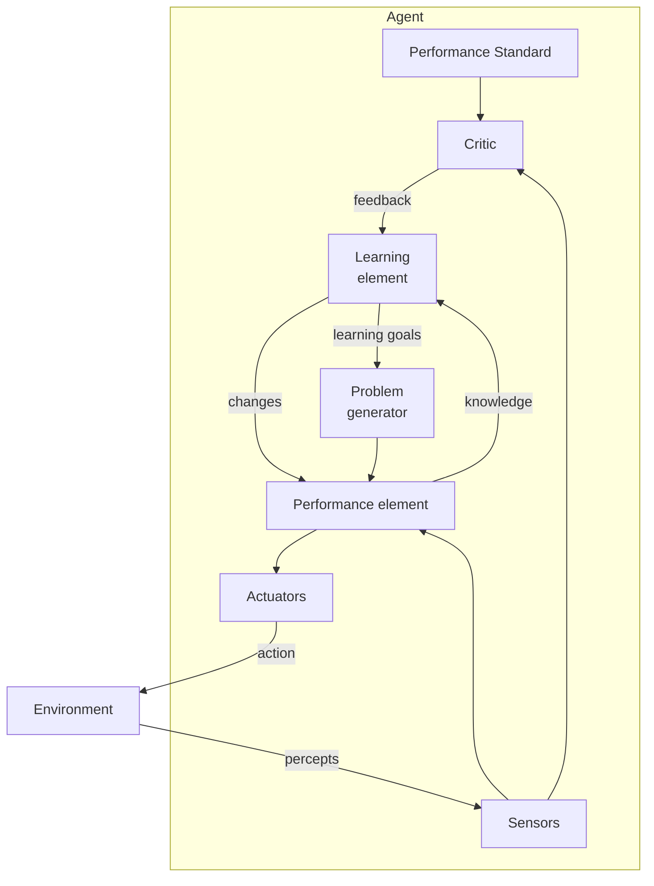
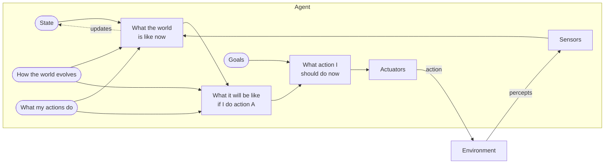
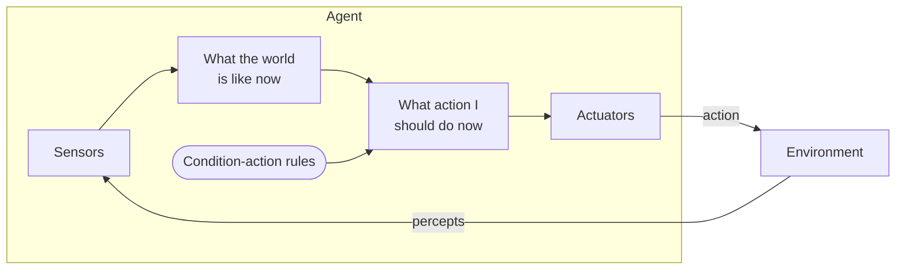

# UNIT 1 PYQ & EXPECTED QUESTION BANK (v3)
## B.Tech (Computer Engineering) — SVKM's NMIMS (MPSTME)
### Subject: Artificial Intelligence (Course Code: 702CO0C076)

This document contains a comprehensive, technically rigorous collection of **Past Year Questions (PYQs)** from SVKM's NMIMS University and Mumbai University (MU), combined with high-yield **Expected and Probable Questions** compiled from the official course policy and prescribed textbooks (*Russell & Norvig 4th Edition*, *Dan Patterson*, and *Rich & Knight*).

All probability ratings, topic weightage percentages, and priority levels are approximate revision priorities based on a qualitative audit of available past papers and syllabus emphasis from 2013-2026.

---

## SECTION 1: TOPIC-WISE PYQ & EXPECTED ANALYSIS INDEX

To support structured revision, the questions in this bank are categorized by topic and priority level. Every question listed below is provided with a complete, exam-ready model answer in this document.

### 1.1 Past Year Questions (PYQs)
*   **Q1. Describe the Turing Test designed for a satisfactory operational definition of AI. What capabilities are required for a system to pass this test?**  
    *   *Source:* Compiled Mumbai University (MU), May 2016 [5 Marks] | MU, Winter 2019 [5 Marks]
    *   *Priority:* 🔥 **Very High Probability**
*   **Q2. Write a short note on Alan Turing's Criteria for Success. How do we know if a machine is intelligent?**  
    *   *Source:* Compiled MU, May 2015 [5 Marks]
    *   *Priority:* ⭐ **High Probability**
*   **Q3. Describe the difference between the "Acting Humanly" approach and the "Acting Rationally" approach to Artificial Intelligence.**  
    *   *Source:* Compiled NMIMS Class Test 1, Batch 2023-24 [5 Marks]
    *   *Priority:* 🔥 **Very High Probability**
*   **Q4. Differentiate between Supervised, Unsupervised, and Reinforcement Learning, providing suitable examples for each.**  
    *   *Source:* Compiled NMIMS B.Tech CE Final Examination, Academic Year 2023-24, Q2.a [10 Marks] | NMIMS Final Exam, Nov 2022, Q1.d [5 Marks]
    *   *Priority:* 🔥 **Very High Probability**
*   **Q5. Write a short note on the differences between Machine Learning and Deep Learning.**  
    *   *Source:* Compiled NMIMS B.Tech CE Final Examination (Re-Exam), Batch 2022-23, Q7.a [4 Marks]
    *   *Priority:* ⭐ **High Probability**
*   **Q6. What is an Intelligent Agent? Explain the detailed architecture of a Learning Agent with the help of a neat diagram.**  
    *   *Source:* Compiled NMIMS B.Tech CE Final Examination, Academic Year 2023-24, Q5.a [10 Marks]
    *   *Priority:* 🔥 **Very High Probability**
*   **Q7. Explain the concept of a Goal-Based Agent with the help of a neat diagram.**  
    *   *Source:* Compiled NMIMS B.Tech CE Final Examination (Re-Exam), Academic Year 2024-25, Q2.a [5 Marks]
    *   *Priority:* 🔥 **Very High Probability**
*   **Q8. Explain the different types of intelligent agents. Discuss their structures and state how the limitations of simpler architectures are addressed by more advanced designs.**  
    *   *Source:* Compiled NMIMS B.Tech CE Final Examination, Academic Year 2022-23, Q2.a [10 Marks] | MU, May 2014 [10 Marks]
    *   *Priority:* 🔥 **Very High Probability**
*   **Q9. Write a short note on Simple Reflex Agents, including their schematic diagram, condition-action rules, and inherent limitations.**  
    *   *Source:* Compiled MU, Dec 2014 [5 Marks]
    *   *Priority:* ⭐ **High Probability**
*   **Q10. Explain the PEAS properties in the context of a Medical Diagnosis System.**  
    *   *Source:* Compiled NMIMS B.Tech CE Final Examination, Academic Year 2023-24, Q1.b [5 Marks]
    *   *Priority:* 🔥 **Very High Probability**
*   **Q11. Specify the PEAS parameters and characterize the task environment for the following intelligent agents:**  
    1. **Self-Driving Car / Automated Taxi**  
    2. **A Robotic Doctor who performs surgery on patients**  
    *   *Source:* Compiled NMIMS B.Tech CE Final Examination (Re-Exam), Academic Year 2024-25, Q2.b [5+5 Marks]
    *   *Priority:* 🔥 **Very High Probability**
*   **Q12. Discuss the Wumpus World problem and specify its complete PEAS descriptors and environment properties.**  
    *   *Source:* Compiled NMIMS B.Tech CE Final Examination, Academic Year 2024-25, Q6.b [10 Marks]
    *   *Priority:* ⭐ **High Probability**
*   **Q13. Write the PEAS description for an Interactive English Speaking Tutor and analyze its environment.**  
    *   *Source:* Compiled MU Solved Papers, May 2023 / May 2025 [5 Marks]
    *   *Priority:* 🟡 **Moderate Probability**
*   **Q14. Write the PEAS description for an Automated Movie Ticket Booking System.**  
    *   *Source:* Compiled MU Solved Papers, Dec 2024 [5 Marks]
    *   *Priority:* 🟡 **Moderate Probability**
*   **Q15. Write the PEAS description for Shopping for Used AI Books on the Internet.**  
    *   *Source:* Compiled MU Solved Papers, Dec 2023 [5 Marks]
    *   *Priority:* 🟡 **Moderate Probability**
*   **Q16. Give the PEAS description for a Robot Soccer Player and characterize its environment.**  
    *   *Source:* Compiled MU, May 2016 [5 Marks]
    *   *Priority:* ⭐ **High Probability**
*   **Q17. Describe the different properties/dimensions used to characterize an AI task environment.**  
    *   *Source:* Compiled MU, Dec 2013 [10 Marks] | MU, May 2015 [10 Marks]
    *   *Priority:* 🔥 **Very High Probability**

### 1.2 High-Yield Expected Practice Questions
*   **Q18. Clearly distinguish between Artificial Intelligence (AI), Machine Learning (ML), and Deep Learning (DL) with a hierarchical structure and comparison matrix.**  
    *   *Type:* Expected Conceptual Question
    *   *Priority:* 🔥 **Very High Probability**
*   **Q19. Explain the differences and mathematical relationships between Modeling, Inference, and Learning, providing Mausam's Candy Bag example.**  
    *   *Type:* Expected Conceptual Question
    *   *Priority:* ⭐ **High Probability**
*   **Q20. Distinguish between Agent Function and Agent Program. Mathematically prove the storage complexity limits of a Table-Driven Agent.**  
    *   *Type:* Expected Theoretical Question
    *   *Priority:* ⭐ **High Probability**
*   **Q21. Differentiate between Rationality and Omniscience. Explain the roles of information gathering, learning, and autonomy in rational behavior.**  
    *   *Type:* Expected Conceptual Question
    *   *Priority:* 🔥 **Very High Probability**
*   **Q22. Provide a complete state-space and reflex program implementation for a 2-state Vacuum-Cleaner World.**  
    *   *Type:* Expected Application Question
    *   *Priority:* ⭐ **High Probability**

---

## SECTION 2: EXAM TRENDS & WEIGHTAGE DYNAMICS

Based on an approximate analysis of SVKM's NMIMS and Mumbai University past question papers over the last decade, the distribution of exam marks for Unit 1 topics is structured as follows:

```text
┌─────────────────────────────────────────────────────────────┐
│             UNIT 1 MARKS DISTRIBUTION (APPROX.)             │
├──────────────────────────────────────────────┬──────────────┤
│ PEAS Specifications & Environment Properties │ ▓▓▓▓▓▓ (45%) │
│ Intelligent Agent Architectures & Diagrams   │ ▓▓▓▓   (30%) │
│ Turing Test & Foundational Approaches        │ ▓▓     (15%) │
│ ML, DL, Modeling, Inference, and Learning    │ ▓      (10%) │
└──────────────────────────────────────────────┴──────────────┘
```

### Key Exam Trends to Memorize:
1.  **Tabular Standard:** Questions comparing parameters (such as AI vs. ML vs. DL, or Modeling vs. Inference vs. Learning) should always be answered using structured tables. Point-by-point paragraphs rarely score maximum marks in university evaluations.
2.  **Architectural Layouts:** Every agent architecture question (Simple Reflex, Model-Based, Goal-Based, Utility-Based, Learning) must include its official AIMA block diagram. Fenced ASCII representations or hand-drawn blocks with clearly labeled sensory feedback paths are essential.
3.  **PEAS Structuring:** Do not write PEAS as raw prose. Always organize PEAS parameters into a clear, separate table.

---

## SECTION 3: EXAM-READY MODEL ANSWERS FOR PAST YEAR QUESTIONS (PYQs)

---

### 🔥 [PYQ - 5 MARKS]
#### Q1. Describe the Turing Test designed for a satisfactory operational definition of AI. What capabilities are required for a system to pass this test?
*Source: Compiled Mumbai University (MU), May 2016 [5 Marks] | Winter 2019 [5 Marks]*

#### **Exam-Ready Answer:**

**1. Definition and Core Concept:**  
Alan Turing (1950) proposed the **Imitation Game** (now known as the **Turing Test**) to replace the vague and philosophically controversial question, *"Can machines think?"*, with an empirical, behavioral test of intelligence. Turing argued that if a computer behaves indistinguishably from a human in its cognitive output, it possesses intelligence.

**2. Physical Setup of the Test:**
```text
            ┌───────────────────┐
            │ HUMAN INTERROGATOR│
            └─────────┬─────────┘
                      │ (Written communication only,
                      │  e.g., via teletype or keyboard)
         =============▼============= (Wall / Physical Barrier)
         ┌────────────┴────────────┐
         │                         │
         ▼                         ▼
┌──────────────────┐      ┌──────────────────┐
│   HUMAN SUBJECT  │      │  ARTIFICIAL      │
│                  │      │  INTELLIGENCE    │
└──────────────────┘      └──────────────────┘
```
*   The human interrogator is placed in a separate room from a human subject and the computer system.
*   The interrogator communicates with them solely via written, teletyped text messages to eliminate physical appearance and vocal cues.
*   The interrogator's task is to determine which of the two respondents is the machine and which is the human by asking arbitrary questions.

**3. The Turing Prediction (Technical Clarification):**
*   *Note on passing:* There is **no universal five-minute passing rule** built into the definition of intelligence. Rather, the 5-minute duration stems from Turing's specific historical prediction in 1950: 
    > *"By the year 2000, a machine with approximately $10^9$ bits of storage would be able to play the imitation game so well that an average interrogator would have no more than a 30% chance of making the correct identification after 5 minutes of questioning."*

**4. Core AI Capabilities Required to Pass:**
To successfully pass the standard Turing Test, the computer must implement these four capabilities:
1.  **Natural Language Processing (NLP):** To communicate successfully in a natural human language (such as English).
2.  **Knowledge Representation:** To store facts, concepts, and relationships it possesses or receives during the conversation.
3.  **Automated Reasoning:** To use stored information to answer questions, draw logical conclusions, and handle conversational flow.
4.  **Machine Learning:** To adapt to new conversational circumstances, detect linguistic patterns, and learn from its interactions.

**5. The Total Turing Test:**
To pass the *Total Turing Test*, where physical interaction is permitted, the machine requires two additional capabilities:
5.  **Computer Vision:** To perceive physical objects, recognize expressions, and track human movements.
6.  **Robotics:** To physically manipulate its environment, move around, and demonstrate physical agency.

---

### ⭐ [PYQ - 5 MARKS]
#### Q2. Write a short note on Alan Turing's Criteria for Success. How do we know if a machine is intelligent?
*Source: Compiled MU, May 2015 [5 Marks]*

#### **Exam-Ready Answer:**

**1. Turing's Behavioral Standard:**  
Instead of defining "intelligence" by examining internal consciousness or neurological structures, Alan Turing established an **external, behavioral standard**. Under this standard, a machine is considered intelligent if it can mimic human behavioral responses so closely that a human observer cannot tell the difference.

**2. Key Elements of the Criteria for Success:**
*   **Operational Definition:** It provides a concrete, operational test for intelligence (the Imitation Game) rather than an abstract, philosophical debate.
*   **Deception as an Indicator of Intelligence:** Success is measured by the machine's ability to deceive a human interrogator under strict, controlled communication conditions.
*   **Decoupling from Physical Medium:** By restricting interactions to text messages, Turing removed the requirement that an intelligent agent must physically look, move, or speak like a human, focusing strictly on functional cognitive performance.

**3. Required Cognitive Capabilities:**  
To meet this criteria, the machine must possess the standard cognitive capabilities of NLP, Knowledge Representation, Automated Reasoning, and Machine Learning. The criteria does not require the machine to be *perfect*—it only requires it to be as conversational, and potentially as flawed, as an ordinary human.

**4. Conclusion:**  
Alan Turing's criteria shifted the focus of early computer science away from "consciousness" and toward "indistinguishable operational performance," creating the first objective test for artificial systems.

---

### 🔥 [PYQ - 5 MARKS]
#### Q3. Describe the difference between the "Acting Humanly" approach and the "Acting Rationally" approach to Artificial Intelligence.
*Source: Compiled NMIMS Class Test 1, Batch 2023-24 [5 Marks]*

#### **Exam-Ready Answer:**

The definitions of Artificial Intelligence are categorized along two main dimensions: **human-like performance** (measuring fidelity to human psychology) versus **rationality** (measuring performance against an ideal, logical standard of correctness).

**1. Comparison Matrix:**

| Comparison Parameter | **Acting Humanly** (The Turing Test Approach) | **Acting Rationally** (The Rational Agent Approach) |
| :--- | :--- | :--- |
| **Primary Goal** | Creating machines that act and behave indistinguishably from humans. | Creating systems that act to achieve the best outcome (or best expected outcome under uncertainty). |
| **Standard of Success** | **Empirical / Human Standard**: Success is measured by how well the machine mimics human behavior, including human flaws, biases, and errors. | **Objective / Rational Standard**: Success is measured by the performance measure of the task, regardless of whether the action mirrors human choices. |
| **Core Methodology** | Turing Test, natural language processing, knowledge representation, and robotic interaction. | Defining agent functions ($f: P^* \rightarrow A$), utility functions, and maximizing expected utility. |
| **Role of Reasoning** | Logical reasoning is secondary to behavioral mimicry and conversational flow. | Logical reasoning is a critical tool to compute the best action, but reflex-based (non-thinking) rational acts are also included. |
| **Scientific Tractability** | **Low**: Human psychology is highly subjective, complex, and filled with evolutionary anomalies that are hard to formalize. | **High**: Rationality is grounded in mathematics, probability, and decision theory, making it mathematically verifiable. |

**2. Core Philosophical Shift (Why AIMA/NMIMS Prefers Acting Rationally):**
1.  **Generality:** Rational action is a more general standard than human-like action. It is logical to design an autonomous flight controller that flies safer and more optimally than any human pilot, rather than trying to replicate human pilot reflexes and fatigue patterns.
2.  **Scientific Progress:** Standardizing AI around "Acting Rationally" allows the deployment of formal theorems, probability calculations, and optimization algorithms, whereas "Acting Humanly" is dependent on the ever-shifting, empirical study of human psychology.

---

### 🔥 [PYQ - 10 MARKS]
#### Q4. Differentiate between Supervised, Unsupervised, and Reinforcement Learning, providing suitable examples for each.
*Source: Compiled NMIMS B.Tech CE Final Examination 2023-24, Q2.a [10 Marks] | NMIMS Final Exam, Nov 2022, Q1.d [5 Marks]*

#### **Exam-Ready Answer:**

**1. Conceptual Definitions:**
*   **Supervised Learning:** The learning element is provided with a training set of labeled data pairs, consisting of input vectors and their corresponding ground-truth target outputs: $D = \{(x_1, y_1), (x_2, y_2), \dots, (x_N, y_N)\}$. The objective is to learn a mapping function $h(x) \approx y$ that generalizes well to unseen, novel inputs.
*   **Unsupervised Learning:** The system receives unlabeled data points: $D = \{x_1, x_2, \dots, x_N\}$. The algorithm must analyze the underlying structure, probability distribution, or spatial relationships of the inputs without any explicit human annotation.
*   **Reinforcement Learning:** The agent learns by interacting with a dynamic environment. It receives no explicit data pairs; instead, it executes actions, transitions between states, and receives numerical feedback in the form of rewards ($R_t > 0$) or penalties ($R_t < 0$). The objective is to learn a **policy** ($\pi: S \rightarrow A$) that maximizes the cumulative expected discount reward over time.

**2. Detailed Comparison Matrix:**

| Comparison Metric | **Supervised Learning** | **Unsupervised Learning** | **Reinforcement Learning** |
| :--- | :---: | :---: | :---: |
| **Data Nature** | Labeled data pairs: $(x, y)$. | Unlabeled data points: $x$. | No pre-existing dataset; actions are generated dynamically. |
| **Feedback Mechanism** | Explicit error correction (e.g., target $y$ minus prediction $\hat{y}$). | No external feedback; measures internal metrics like distance or density. | Scalar reward/penalty signals from the environment. |
| **Core Objective** | Predict class labels (Classification) or continuous values (Regression). | Find clusters, lower dimensional spaces, or density estimations. | Maximize long-term cumulative reward (learn policy $\pi$). |
| **Temporal Dependency** | **None**: Data points are typically assumed to be independent and identically distributed (I.I.D.). | **None**: Data points are typically I.I.D. | **High**: Actions have long-term consequences that affect future states and rewards. |
| **Common Algorithms** | • Decision Tree Classifiers (ID3)<br>• Linear/Logistic Regression<br>• Support Vector Machines (SVM) | • $K$-Means Clustering<br>• Principal Component Analysis (PCA)<br>• Expectation-Maximization (EM) | • Q-Learning<br>• Deep Q-Networks (DQN)<br>• Policy Gradient Methods |
| **Real-World Example** | Categorizing emails as "Spam" or "Ham" based on historical labeled sets. | Grouping online shoppers into distinct customer segments based on buying patterns. | Training an autonomous drone to fly through obstacles without crashing. |

---

### 🔥 [PYQ - 4 MARKS]
#### Q5. Write a short note on the differences between Machine Learning and Deep Learning.
*Source: Compiled NMIMS B.Tech CE Final Examination (Re-Exam), Batch 2022-23, Q7.a [4 Marks]*

#### **Exam-Ready Answer:**

**1. Nested Hierarchical Relationship:**  
Machine Learning (ML) is a subset of Artificial Intelligence that learns patterns from data. Deep Learning (DL) is a specialized subfield of Machine Learning that uses multi-layered artificial neural networks (Connectionist Models) to model complex, non-linear relationships.

```text
┌────────────────────────────────────────────────────────┐
│ ARTIFICIAL INTELLIGENCE (AI)                           │
│ ┌────────────────────────────────────────────────────┐ │
│ │ MACHINE LEARNING (ML)                              │ │
│ │ ┌────────────────────────────────────────────────┐ │ │
│ │ │ DEEP LEARNING (DL)                             │ │ │
│ │ └────────────────────────────────────────────────┘ │ │
│ └────────────────────────────────────────────────────┘ │
└────────────────────────────────────────────────────────┘
```

**2. Core Technical Differences:**

*   **Feature Engineering:**
    *   *Machine Learning (Traditional):* Relies heavily on **manual feature engineering**. Domain engineers must explicitly extract relevant features (e.g., SIFT descriptors for image shapes or term-frequency metrics for text) before feeding them into algorithms like Decision Trees or SVMs. However, some traditional ML methods can learn basic representations.
    *   *Deep Learning:* Reduces the necessity for manual feature engineering by implementing **Representation Learning**. The neural network layers automatically extract hierarchical features directly from raw input data.
    *   *Note on limits:* Deep learning does not *completely* eliminate all human preprocessing; data tokenization, dimension reshaping, and hyperparameter design are still designed manually.
*   **Data Dependency:**
    *   *Machine Learning:* Can achieve high performance on relatively small to medium-sized datasets. It plateaus early as data volume increases.
    *   *Deep Learning:* Generally benefits from massive datasets to generalize effectively without overfitting. However, techniques like **transfer learning** and smaller specialized models allow modern DL models to be fine-tuned on surprisingly small datasets.
*   **Hardware and Computational Demands:**
    *   *Machine Learning:* Algorithms (e.g., ID3 Decision Trees) are computationally light and can run efficiently on standard, single-core CPUs.
    *   *Deep Learning:* Involves massive matrix multiplications. While inference can run on standard CPUs, training deep neural networks generally benefits from parallel processing hardware, such as Graphics Processing Units (GPUs) or Tensor Processing Units (TPUs).

---

### 🔥 [PYQ - 10 MARKS]
#### Q6. What is an Intelligent Agent? Explain the detailed architecture of a Learning Agent with the help of a neat diagram. Describe each of its components in detail.
*Source: Compiled NMIMS B.Tech CE Final Exam 2023-24, Q5.a [10 Marks] | MU Dec 2015, May 2016 [10 Marks]*

#### **Exam-Ready Answer:**

**1. Definition of an Intelligent Agent:**  
An agent is anything that can be viewed as perceiving its environment through **sensors** and acting upon that environment through **actuators**. An *intelligent* agent is one that behaves rationally: it selects actions that are expected to maximize its performance measure, based on its percept sequence and prior knowledge.

**2. Schematic Architecture Diagram:**
The block diagram below represents the complete data flow, feedback loops, and internal elements of a learning agent.



**3. Detailed Explanation of the Four Key Components:**
1.  **Performance Element:**  
    *   *Role:* This is the operational engine that takes in the current sensory percepts and selects external actions. It is what was previously considered the "entire agent program" in non-learning architectures (e.g., Simple Reflex or Goal-Based systems). It runs on physical hardware to output actions.
2.  **Critic:**  
    *   *Role:* The Critic evaluates the agent's behavior against an objective **Performance Standard** (an external, hard-coded standard of success that is independent of the agent). It observes the outcome of actions and determines how well the agent is performing, translating this into "feedback" (reward or penalty) for the Learning Element.
3.  **Learning Element:**  
    *   *Role:* This component is responsible for making improvements. It takes the feedback from the Critic and compares it to the actions selected by the Performance Element. It then modifies the internal rules, utilities, or goals of the Performance Element to prevent repeating mistakes and reinforce successful strategies.  
    *   *Note on Design:* The Learning Element **reduces the agent's dependence on hand-crafted behavior**, allowing it to adapt and succeed in unfamiliar environments, rather than bypassing design completely.
4.  **Problem Generator:**  
    *   *Role:* The Problem Generator is responsible for suggesting novel, exploratory actions. Instead of executing the safest optimal action (which keeps the agent in its comfort zone), it triggers exploratory moves to acquire new experiences and gather data, expanding the agent's long-term capabilities.

**4. Real-World Example (Automated Taxi):**
*   **Performance Standard:** Safe driving, maximizing passenger comfort, obeying traffic laws, arriving on time.
*   **Performance Element:** Decides to press the brake, accelerate, or turn left based on camera inputs.
*   **Critic:** Detects a sharp brake on a wet road that caused passenger discomfort (violating the performance standard), and sends negative feedback.
*   **Learning Element:** Modifies the \"braking rule\" in the Performance Element to initiate deceleration earlier on wet surfaces.
*   **Problem Generator:** Suggests driving on an unfamiliar route or during minor rain to test wet-surface traction rules.

---

### 🔥 [PYQ - 5 MARKS]
#### Q7. Explain the concept of a Goal-Based Agent with the help of a neat diagram. Contrast it with Simple Reflex Agents.
*Source: Compiled NMIMS B.Tech CE Re-Exam 2024-25, Q2.a [5 Marks]*

#### **Exam-Ready Answer:**

**1. Concept of a Goal-Based Agent:**  
A goal-based agent is a deliberative agent that combines state tracking with explicit **goals**—descriptions of highly desirable states. Knowing the current state of the environment is often insufficient to choose an action. The agent must evaluate "What will happen if I do action A?" and select actions that directly lead to its predefined goals using search and planning algorithms.

**2. Schematic Diagram:**
The block diagram below represents the complete data flow, predictive evaluation, and internal elements of a Goal-Based Agent.



**3. Direct Comparison (Goal-Based vs. Simple Reflex Agents):**

| Parameter | Simple Reflex Agent | Goal-Based Agent |
| :--- | :--- | :--- |
| **Decision Basis** | Evaluates only the *current* percept, completely ignoring history. | Evaluates current state, future outcomes of actions, and goals. |
| **Internal Model** | None (no memory or state tracking). | Employs an internal model of how the world evolves. |
| **Decision Mechanism** | Hard-coded **Condition-Action Rules** (If-Then). | Deliberative search, path planning, and reasoning algorithms. |
| **Flexibility** | Extremely rigid; rules must be rewritten to change behavior. | Highly flexible; changing the goal automatically alters action choices. |

---

### 🔥 [PYQ - 10 MARKS]
#### Q8. Explain the different types of intelligent agents. Discuss their structures and state how the limitations of simpler architectures are addressed by more advanced designs.
*Source: Compiled NMIMS B.Tech CE Final Exam 2022-23, Q2.a [10 Marks] | MU, May 2014 [10 Marks]*

#### **Exam-Ready Answer:**

The design of an agent is determined by the complexity of the environment and the required level of intelligence. We categorize agent structures into five progressively advanced architectures.

#### **1. Simple Reflex Agents:**
*   **Structure:** Maps the current percept directly to an action using hard-coded **Condition-Action Rules**: `if condition then action`.
*   **Limitation:** It is entirely memoryless and assumes the environment is **fully observable**.
*   **Failure Mode:** If the environment is partially observable, it cannot distinguish between states that share the same percept, leading to infinite loops.

#### **2. Model-Based Reflex Agents:**
*   **How it addresses limitations:** Introduces memory to handle **partially observable** environments.
*   **Structure:** Maintains an **internal state** that tracks unobserved aspects of the world. To maintain this state, it uses a **transition model** (describing how the world evolves independently of the agent) and a **sensor model** (describing how the state of the world is reflected in the agent's percepts).
*   **Limitation:** It still relies on hard-coded rules and cannot dynamically choose actions based on changing objectives.

#### **3. Goal-Based Agents:**
*   **How it addresses limitations:** Replaces rigid rules with explicit **goals**.
*   **Structure:** Combines state tracking with a representation of desirable outcomes. It uses **search and planning** algorithms to evaluate action sequences.
*   **Limitation:** It makes a binary distinction between success and failure. It cannot handle conflicting goals or optimize for the "best" path (e.g., balancing speed vs. safety).

#### **4. Utility-Based Agents:**
*   **How it addresses limitations:** Introduces a continuous **utility function** to evaluate the desirability of states.
*   **Structure:** Maps each state to a real number $U(s) \in \mathbb{R}$, which represents the agent's degree of happiness or success. Under uncertainty, it selects the action that maximizes **expected utility** (weighted average of the utilities of all possible outcome states, based on their transition probabilities):
    $$EU(a) = \sum_{s'} P(s' \mid s, a) U(s')$$
*   **Limitation:** The internal models, utility values, and state transition equations must be hand-crafted by human designers.

#### **5. Learning Agents:**
*   **How it addresses limitations:** Bypasses manual design by learning and adapting automatically from experience.
*   **Structure:** Separates execution (**Performance Element**) from evaluation (**Critic**). It utilizes a **Learning Element** to update rules and a **Problem Generator** to explore the environment, allowing it to handle unfamiliar environments autonomously and reduce dependence on hand-crafted rules.

---

### ⭐ [PYQ - 5 MARKS]
#### Q9. Write a short note on Simple Reflex Agents, including their schematic diagram, condition-action rules, and inherent limitations.
*Source: Compiled MU, Dec 2014 [5 Marks]*

#### **Exam-Ready Answer:**

**1. Core Concept:**  
A Simple Reflex Agent is the most basic intelligent agent architecture. It selects actions based **solely on the current percept**, completely ignoring the history of past percepts.

**2. Schematic Diagram:**
The block diagram below represents the complete data flow of a Simple Reflex Agent, illustrating how current sensory inputs directly trigger condition-action rules.



**3. Condition-Action Rules:**  
These are hard-coded logical mapping associations of the form:
`if [condition] then [action]`
*   *Example (Autonomous Car):* `if car-in-front-is-braking then initiate-braking`.
*   *Example (Vacuum-Cleaner):* `if status == Dirty then Suck`.

**4. Inherent Limitations:**
*   **Full Observability Requirement:** The simple reflex agent can only succeed if the task environment is **fully observable**.
*   **Failure Under Partial Observability:** If parts of the environment are unobserved, the agent cannot resolve sensory ambiguities, which often traps it in infinite loops. For example, if a vacuum agent cannot perceive its location, it may loop infinitely between adjacent clean rooms, unable to determine which direction leads to uncleaned tiles.

---

### 🔥 [PYQ - 5 MARKS]
#### Q10. Explain the PEAS properties in the context of a Medical Diagnosis System.
*Source: Compiled NMIMS B.Tech CE Final Examination, Academic Year 2023-24, Q1.b [5 Marks]*

#### **Exam-Ready Answer:**

**1. PEAS Specification Table:**  
The task environment of a Medical Diagnosis System is specified using the PEAS framework as follows:

| Agent Type | Performance Measure (P) | Environment (E) | Actuators (A) | Sensors (S) |
| :--- | :--- | :--- | :--- | :--- |
| **Medical Diagnosis System** | • Maximizing patient health<br>• Minimizing treatment costs<br>• Avoiding medical malpractice<br>• Maximizing diagnostic accuracy | • Patient being diagnosed<br>• Clinical/hospital staff<br>• Diagnostic lab systems | • Screen display of diagnoses<br>• Test recommendations<br>• Prescription treatments<br>• Referrals | • Keyboard symptoms entry<br>• Laboratory test results<br>• Patient medical history |

**2. Task Environment Characterization:**
*   **Partially Observable:** The agent cannot directly observe all internal biological or pathological variables within the patient's body; it must infer them from external symptoms and laboratory results.
*   **Stochastic / Nondeterministic:** Medical actions (treatments) have probabilistic outcomes; a drug may cure a patient with probability $p$ or cause side effects with probability $1-p$.
*   **Sequential:** Deciding to run a specific test now affects the available evidence, which in turn determines what treatments can be safely prescribed in the future.
*   **Dynamic:** The patient's actual health status can continuously deteriorate or change in real-time while the diagnostic system is compiling reports.
*   **Continuous:** Clinical variables like blood pressure, patient temperature, and hormone levels are continuous values.
*   **Single-Agent / Multi-Agent:** Can be modeled as **Single-agent** if solving the diagnostic puzzle in isolation (assuming the disease is not an active, competitive opponent), or **Multi-agent** if integrated with active clinicians and nurses as collaborative agents.

---

### 🔥 [PYQ - 10 MARKS]
#### Q11. Specify the PEAS parameters and characterize the task environment for the following intelligent agents:
1. **Self-Driving Car / Automated Taxi**  
2. **A Robotic Doctor who performs surgery on patients**  
*Source: Compiled NMIMS B.Tech CE Re-Exam 2024-25, Q2.b [5+5 Marks]*

#### **Exam-Ready Answer:**

**1. PEAS Specification Matrix:**

| Agent Type | Performance Measure (P) | Environment (E) | Actuators (A) | Sensors (S) |
| :--- | :--- | :--- | :--- | :--- |
| **Self-Driving Car (Automated Taxi)** | • Safe transport<br>• Fast trip (time minimization)<br>• Obeying traffic laws<br>• Maximizing passenger comfort<br>• Maximizing trip profits | • Road networks & lanes<br>• Surrounding vehicles<br>• Pedestrians & obstacles<br>• Traffic signals & signs<br>• Weather conditions | • Steering wheel motor<br>• Accelerator actuator<br>• Braking system<br>• Turn signals & horn<br>• Display screen / voice | • Cameras (video feed)<br>• LiDAR & Sonar sensors<br>• Speedometer & Odometer<br>• Global Positioning System (GPS)<br>• Accelerometer |
| **Robotic Doctor (Surgical Robot)** | • Precision of incision<br>• Rate of successful surgery<br>• Minimizing tissue damage<br>• Minimizing patient blood loss<br>• Minimizing operation time | • Patient's physical body<br>• Sterile operating theater<br>• Surgical tools & clamps<br>• Supporting medical staff | • Robotic surgical arms<br>• Micro-scalpel / laser controllers<br>• Automated suturing tools<br>• Screen monitors | • High-definition 3D cameras<br>• Force & torque feedback sensors<br>• Patient vital signs monitors<br>• Tactile feedback pads |

**2. Task Environment Characterization Table:**

| Environment Dimension | Self-Driving Car | Robotic Doctor |
| :--- | :--- | :--- |
| **Observable** | **Partially Observable**: Cannot see around corners, inside other vehicles, or behind buildings. | **Partially Observable**: Cannot directly observe internal organ states, microscopic bleeding, or unseen internal pathologies. |
| **Agents** | **Multi-Agent**: Interacts with other human drivers, pedestrians, and traffic systems (competitive and collaborative). | **Single/Multi-Agent**: **Single-agent** if the patient is treated as a static physical environment; **Multi-agent** if modeling collaborative surgical teams. |
| **Deterministic** | **Stochastic**: Transitions are probabilistic. Tire slippage, human pedestrian actions, and engine performance vary. | **Stochastic**: Patient tissue responses, vital stability, and biological reactions to incisions are highly probabilistic. |
| **Episodic** | **Sequential**: Steering decisions at time $t$ affect position at $t+1$, traffic conditions, and collision risks. | **Sequential**: Shifting a clamp now affects subsequent bleeding, surgical exposure, and remaining suturing steps. |
| **Static** | **Dynamic**: The road environment, vehicles, and pedestrians are in constant motion while the agent deliberates. | **Dynamic**: The patient's vital signs (heart rate, blood pressure) and physical tissue states change dynamically. |
| **Discrete** | **Continuous**: Steering angles, accelerator levels, speeds, and surrounding distances are continuous values. | **Continuous**: Surgical arm movements, incision depths, laser intensities, and blood pressures are continuous. |
| **Known** | **Known**: The physical rules of driving and road networks are known, though specific environment states are unknown. | **Known**: Biological structures and tool operations are known, though the patient's individual anatomy may vary. |

---

### ⭐ [PYQ - 10 MARKS]
#### Q12. Discuss the Wumpus World problem and specify its complete PEAS descriptors and environment properties.
*Source: Compiled NMIMS B.Tech CE Final Examination, Academic Year 2024-25, Q6.b [10 Marks]*

#### **Exam-Ready Answer:**

**1. Problem Description:**  
The **Wumpus World** is a classic grid-based task environment used to evaluate logical reasoning, knowledge representation, and spatial navigation under partial observability. It consists of a $4 \times 4$ grid of rooms. The agent's goal is to navigate the grid, locate a heap of gold, grab it, and return to the starting square to climb out, while avoiding falling into bottomless pits or being killed by a stationary monster called the **Wumpus**.

**2. Complete PEAS Descriptors:**
*   **Performance Measure (P):** 
    *   $+1000$ points for climbing out of the cave with the gold.
    *   $-1000$ points for falling into a pit or being eaten by the Wumpus.
    *   $-1$ point for each action taken (movement cost to ensure path optimization).
    *   $-10$ points for using the arrow (encourages saving ammunition).
*   **Environment (E):** A $4 \times 4$ grid of rooms. The agent always starts in room $[1,1]$ facing Right. Pits, the Wumpus, and gold are distributed randomly across the remaining squares.
*   **Actuators (A):** 
    *   `Forward` (moves 1 square ahead in the current direction).
    *   `TurnLeft` / `TurnRight` (turns the agent $90^\circ$ to the left or right).
    *   `Grab` (picks up the gold if present in the current square).
    *   `Shoot` (fires an arrow in a straight line; the arrow travels until it hits the Wumpus or a wall).
    *   `Climb` (exits the cave, only executable from square $[1,1]$).
*   **Sensors (S):**
    *   `Stench` (perceived in the square containing the Wumpus and all directly adjacent squares).
    *   `Breeze` (perceived in squares directly adjacent to a pit).
    *   `Glitter` (perceived in the square containing the gold).
    *   `Bump` (perceived when the agent attempts to walk into a wall).
    *   `Scream` (heard globally across the entire grid when the Wumpus is killed by the arrow).

**3. Task Environment Characterization:**
*   **Partially Observable:** Yes. The agent can only perceive sensations in its immediate square; it cannot see the contents of unvisited squares.
*   **Single-Agent:** Yes. The Wumpus and pits are stationary parts of the environment and do not act as active, strategic, or competitive opponents.
*   **Deterministic:** Yes. The outcomes of all movements, actions, and arrow shots are guaranteed and contain no random variance.
*   **Sequential:** Yes. The choice of which square to enter next depends on past moves, memory of visited squares, and affects future safety.
*   **Static:** Yes. The Wumpus, pits, and gold positions do not change while the agent is deliberating.
*   **Discrete:** Yes. The grid is divided into distinct, discrete $4 \times 4$ coordinate blocks; turns and steps are discrete.
*   **Known:** Yes. The rules of the game, including sensor mappings and physics of the cave, are completely known to the agent.

---

### 🟡 [PYQ - 5 MARKS]
#### Q13. Write the PEAS description for an Interactive English Speaking Tutor and analyze its environment.
*Source: Compiled MU Solved Papers, May 2023 / May 2025 [5 Marks]*

#### **Exam-Ready Answer:**

**1. PEAS Specification:**
*   **Performance Measure (P):** Improvement in student's speaking fluency, vocabulary size, and pronunciation accuracy; maximizing student engagement; minimizing learning time.
*   **Environment (E):** The human student/learner, surrounding acoustic environments (including local background noise).
*   **Actuators (A):** Audio speaker (generating verbal prompts), display monitor (presenting text, diagrams, corrections, and lessons), keyboard prompts.
*   **Sensors (S):** Microphone (receiving student's verbal responses), keyboard/touchscreen (receiving selections or written answers).

**2. Task Environment Characterization:**
*   **Partially Observable:** Yes. The tutor cannot directly observe the student's internal mental state, fatigue, or actual understanding; it must infer them from verbal responses.
*   **Multi-Agent:** Yes. The student is an active, independent agent interacting with the tutor collaborative-wise.
*   **Stochastic:** Yes. The student's learning progress, responses, and mistakes are probabilistic, not deterministic.
*   **Sequential:** Yes. A lesson chosen at time $t$ affects the student's understanding and determines what subsequent lessons are appropriate at $t+1$.
*   **Dynamic:** Yes. The student's attention span, surrounding background noise, and speech speed can change while the system is processing.
*   **Discrete:** Yes. Vocabulary, spelling, and syntactic grammar rules are discrete, although speech signal inputs are continuous.
*   **Known:** Yes. The target grammar, vocabulary, and phonetic dictionaries of the English language are known, although individual student progress models are unknown.

---

### 🟡 [PYQ - 5 MARKS]
#### Q14. Write the PEAS description for an Automated Movie Ticket Booking System.
*Source: Compiled MU Solved Papers, Dec 24 [5 Marks]*

#### **Exam-Ready Answer:**

**1. PEAS Specification:**
*   **Performance Measure (P):** Maximizing ticket sales, minimizing seat reservation conflicts (avoiding double-bookings), minimizing transaction time, maximizing customer satisfaction.
*   **Environment (E):** Customers, active movie showtime schedule database, payment gateways.
*   **Actuators (A):** Monitor display (showing seating grid and prices), email/SMS gateway (dispatching tickets), database update queries.
*   **Sensors (S):** Keyboard, mouse, or touchscreen (receiving customer seat selections, movie details, and payment credentials).

**2. Task Environment Characterization:**
*   **Fully Observable:** Yes. The system has complete, direct access to the seat database and transaction logs.
*   **Single-Agent:** Yes. The system processes reservations in isolation.
*   **Deterministic:** Yes. Selections and payments lead to guaranteed database updates and ticket assignments.
*   **Episodic:** Yes. Each booking transaction is an independent, atomic episode; booking a ticket today does not affect the reservation mechanics of tomorrow.
*   **Static:** Yes. Seating availability does not change *while* a single customer is choosing a seat, although it can be modeled as semidynamic if other clients buy tickets concurrently.
*   **Discrete:** Yes. Seating blocks, movie titles, and showtimes are discrete variables.
*   **Known:** Yes. Database structures, booking rules, and payment APIs are known beforehand.

---

### 🟡 [PYQ - 5 MARKS]
#### Q15. Write the PEAS description for Shopping for Used AI Books on the Internet.
*Source: Compiled MU Solved Papers, Dec 2023 [5 Marks]*

#### **Exam-Ready Answer:**

**1. PEAS Specification:**
*   **Performance Measure (P):** Minimizing total purchase cost, maximizing book condition quality, fast shipping speed, verifying trusted sellers, matching exact textbook editions.
*   **Environment (E):** Internet web sites (Amazon, eBay, AbeBooks), reseller APIs, online payment gateways.
*   **Actuators (A):** Form submission actions (queries, adding to cart, clicking checkout), screen display.
*   **Sensors (S):** Scraper/HTML parser (reading book descriptions, prices, shipping reviews), page displays.

**2. Task Environment Characterization:**
*   **Partially Observable:** Yes. The actual physical condition of the book and seller reliability are only partially observed through text and photos.
*   **Multi-Agent:** Yes. The agent interacts with competitive buyers and self-interested sellers.
*   **Stochastic:** Yes. Prices, book availability, and delivery success are probabilistic.
*   **Sequential:** Yes. Checking and waiting for price drops affects purchasing budgets and options.
*   **Dynamic:** Yes. Stock levels and prices fluctuate while the agent is crawling websites.
*   **Discrete:** Yes. Books, cart states, and pricing values are discrete.
*   **Known:** Yes. Website navigation rules and search APIs are known, though vendor inventories are unknown.

---

### ⭐ [PYQ - 5 MARKS]
#### Q16. Give the PEAS description for a Robot Soccer Player and characterize its environment.
*Source: Compiled MU, May 2016 [5 Marks]*

#### **Exam-Ready Answer:**

**1. PEAS Specification:**
*   **Performance Measure (P):** Goals scored, goals conceded, passes completed, field positioning, minimizing fouls, minimizing power consumption.
*   **Environment (E):** Soccer field, soccer ball, teammates, opponent players, goalposts, referee.
*   **Actuators (A):** Motorized wheels/legs for movement, kicking mechanisms, communication transmitters.
*   **Sensors (S):** On-board cameras, infrared sensors, accelerometers, wireless communication receivers.

**2. Task Environment Characterization:**
*   **Partially Observable:** Yes. The robot cannot see behind itself, teammates can block views of the ball, and opponents' internal strategies are unobserved.
*   **Multi-Agent:** Yes. It interacts with competitive opponents and collaborative teammates.
*   **Stochastic:** Yes. Ball bounces, wheel slips, and human/robot opponent actions are probabilistic.
*   **Sequential:** Yes. Moving now affects future positioning and passing options.
*   **Dynamic:** Yes. Players, ball, and field state are in continuous motion while the agent deliberates.
*   **Continuous:** Yes. Field positions, ball velocity, and wheel speeds are continuous variables.
*   **Known:** Yes. The rules of soccer and physical constants are known, though specific environment states are unknown.

---

### 🔥 [PYQ - 10 MARKS]
#### Q17. Describe the different properties/dimensions used to characterize an AI task environment.
*Source: Compiled MU, Dec 2013 [10 Marks] | MU, May 2015 [10 Marks]*

#### **Exam-Ready Answer:**

The design of an intelligent agent program is directly determined by the properties of its **Task Environment**. We define these properties across seven dimensions:

1.  **Fully Observable vs. Partially Observable:**
    *   *Fully Observable:* The agent's sensors can detect the complete state of the environment at any given time, allowing it to maintain a complete and accurate model.
    *   *Partially Observable:* The sensors cannot detect the full state due to noise, sensory limits, or missing information. The agent must maintain an internal state to track unobserved variables.
2.  **Single-Agent vs. Multi-Agent:**
    *   *Single-Agent:* Only one agent operates in the environment (e.g., a crossword puzzle solver).
    *   *Multi-Agent:* Multiple agents interact. This can be **competitive** (where agents maximize opposing utility functions, like chess) or **collaborative** (where agents coordinate to achieve a shared goal, like autonomous vehicles in a convoy).
3.  **Deterministic vs. Stochastic vs. Nondeterministic:**
    *   *Deterministic:* The next state of the environment is completely determined by the current state and the action executed by the agent.
    *   *Stochastic:* The next state is determined probabilistically. There is uncertainty about the outcome of actions, often modeled using probability distributions.
    *   *Nondeterministic:* The possible outcomes are listed, but no probabilities are assigned to them.
4.  **Episodic vs. Sequential:**
    *   *Episodic:* The agent's experience is divided into independent, atomic episodes. Actions taken in the current episode do not affect the states or decisions of future episodes.
    *   *Sequential:* The current decision can affect all future decisions and states, requiring the agent to plan ahead.
5.  **Static vs. Dynamic vs. Semidynamic:**
    *   *Static:* The environment does not change while the agent is deciding on an action.
    *   *Dynamic:* The environment continues to change while the agent is deliberating, requiring real-time decision-making.
    *   *Semidynamic:* The environment itself does not change, but the agent's performance score does (e.g., playing chess with a clock).
6.  **Discrete vs. Continuous:**
    *   *Discrete:* There are a finite number of distinct, clearly defined states, percepts, and actions (e.g., chess grid, turns).
    *   *Continuous:* The environment state, time, or actions vary continuously (e.g., steering wheel angles, speeds).
7.  **Known vs. Unknown:**
    *   *Known:* The rules and laws of the environment are fully understood (e.g., the rules of chess).
    *   *Unknown:* The agent must explore and learn how the environment works to make effective decisions (e.g., navigating an unfamiliar physical terrain).

---

## SECTION 4: HIGH-YIELD EXPECTED PRACTICE QUESTIONS

---

### ⭐ [EXPECTED - 5 MARKS]
#### Q18. Clearly distinguish between Artificial Intelligence (AI), Machine Learning (ML), and Deep Learning (DL) with a hierarchical structure and comparison matrix.

#### **Answer:**

**1. Conceptual Distinctions:**
*   **Artificial Intelligence (AI):** The overarching field of computer science focused on building intelligent machines capable of automating cognitive tasks (such as planning, game-tree search, natural language translation, and visual perception). It includes symbolic reasoning, search, planning, probabilistic methods, machine learning, and deep learning. It includes both static, rule-based systems (like logical expert systems) and data-driven systems.
*   **Machine Learning (ML):** A specialized subset of AI where the system is not explicitly programmed with logical rules. Instead, statistical algorithms are used to learn mapping functions directly from training datasets. However, traditional ML often relies on human experts to manually identify and extract engineered features (e.g., color histograms for image classifiers) before training, though some ML methods can learn basic representations.
*   **Deep Learning (DL):** A specialized subfield of Machine Learning based on **Connectionist Models** (Artificial Neural Networks with many hidden layers). DL reduces, but does not completely eliminate, the necessity for manual feature engineering. It implements **representation learning**—the network automatically extracts low-level features in early layers (e.g., edges in images) and combines them into abstract concepts in deeper layers. DL generally benefits from large datasets and specialized accelerators (GPUs/TPUs), with transfer learning and smaller models serving as exceptions.

**2. Tabular Comparison:**

| Metric | Artificial Intelligence (AI) | Machine Learning (ML) | Deep Learning (DL) |
| :--- | :--- | :--- | :--- |
| **Scope** | Broadest umbrella (Logic, Search, Planning, ML, DL). | Subset focused on learning functions from data. | Subset focused on connectionist deep neural networks. |
| **Feature Extraction** | Hand-crafted rules or expert structures. | Traditional ML often uses engineered features, while some learn. | Automatically learned by layers; reduces manual features. |
| **Data Dependency** | Can run on zero data (search/logic). | Works well on small/medium datasets. | Generally benefits from massive datasets. |
| **Execution Hardware** | Standard CPUs. | Standard CPUs/GPUs. | High-performance GPUs/TPUs (generally). |
| **Example** | $A^*$ Search, MYCIN Expert System. | Decision Trees (ID3), $K$-Means. | ResNet-50 CNN, GPT-4 Transformer. |

---

### ⭐ [EXPECTED - 5 MARKS]
#### Q19. Explain the differences and mathematical relationships between Modeling, Inference, and Learning, providing Mausam's Candy Bag example.

#### **Answer:**

**1. Definitions & Formulations:**
*   **Modeling:** The process of formalizing a real-world scenario into structured logical sentences, probabilistic equations, or mathematical representations. It answers: *How is the world structured?*
*   **Learning:** The inductive process of using historical training data to automatically build, calibrate, or adjust the parameters of the model.
    $$\text{Data} \xrightarrow{\text{Learning}} \text{Model}$$
*   **Inference:** The deductive process of using a static, completed model to answer queries, draw conclusions, or make predictions about unobserved variables without modifying the model's parameters.
    $$\text{Model} + \text{Query} \xrightarrow{\text{Inference}} \text{Prediction}$$

**2. Decoupled Loop Diagram:**
```text
      ┌────────────────────────────────────────────────────────┐
      │                         LEARNING                       │
      │   Inductive process: Generalizes patterns from data    │
      └───────────────────────────▲────────────────────────────┘
                                  │
         Training Data            │ Generates
                                  │
      ┌───────────────────────────┴────────────────────────────┐
      │                          MODEL                         │
      │   Representational formalization of states and rules   │
      └───────────────────────────┬────────────────────────────┘
                                  │
         Active Query             │ Used to solve
                                  │
      ┌───────────────────────────▼────────────────────────────┐
      │                        INFERENCE                       │
      │   Deductive process: Computes answers to queries       │
      └────────────────────────────────────────────────────────┘
```

**3. Practical Example (NPTEL Candy Bag Problem):**  
Imagine we are drawing candies from a bag containing two possible configurations: Bag 1 (50% Cherry, 50% Lime) and Bag 2 (10% Cherry, 90% Lime).
*   **Modeling:** Defining the probabilistic model: the variable $B \in \{B_1, B_2\}$, the candy flavor $C \in \{C_1, C_2\}$, and writing the conditional probability equations $P(C \mid B)$.
*   **Learning:** Observing a sequence of candy flavors (data) and updating our belief distribution (posterior probabilities) over different candy-bag hypotheses (e.g., Bag 1 vs. Bag 2) using Bayes' rule, rather than proving one hypothesis with absolute, 100% certainty. For example, drawing 20 cherry candies increases our confidence that we are holding Bag 1, but does not mathematically eliminate the possibility of Bag 2.
*   **Inference:** Using the selected model of Bag 1 to calculate the exact probability that the *next* candy pulled out will be Lime (this computes a query without changing our model).

---

### ⭐ [EXPECTED - 5 MARKS]
#### Q20. Distinguish between Agent Function and Agent Program. Mathematically prove the storage complexity limits of a Table-Driven Agent.

#### **Answer:**

**1. Core Differences:**
*   **Agent Function ($f$):** An abstract, mathematical description of the agent’s behavior. It maps any possible percept sequence to an action: $f: P^* \rightarrow A$. It is an abstract mathematical concept and does not store things physically on hardware.
*   **Agent Program:** A concrete, physical computer program running on a physical **Agent Architecture** (hardware/computing device) that implements the abstract agent function $f$. It receives the current percept as input (while maintaining its own internal state if needed) and runs on the architecture.

**2. Tabular Comparison:**

| Parameter | Agent Function ($f$) | Agent Program |
| :--- | :--- | :--- |
| **Nature** | Abstract mathematical mapping. | Concrete software program. |
| **Input** | Takes the entire **Percept History** ($P^*$). | Takes only the **current percept** as input. |
| **Storage Requirement** | Abstract mathematical mapping; no physical storage. | Finite (restricted by hardware RAM/ROM). |

**3. Mathematical Proof of Storage Complexity Limits (Table-Driven Agents):**  
Suppose an agent receives percepts from a set $P$ and can execute actions from a set $A$. Let $T$ be the total lifetime of the agent (the maximum number of steps it will ever run).
*   At step 1, the agent receives 1 percept. There are $|P|^1$ possible percept sequences of length 1.
*   At step $t$, the agent has experienced a sequence of $t$ percepts. There are $|P|^t$ possible percept sequences of length $t$.
*   To represent the agent program as a pure lookup table, we must store an entry for every possible percept sequence of every length up to $T$.
*   The total number of entries in the lookup table, denoted by $N$, is the sum of possible sequences of all lengths from 1 to $T$:
    $$N = \sum_{t=1}^T |P|^t$$
*   By the geometric series formula, if $|P| > 1$:
    $$N = \frac{|P|(|P|^T - 1)}{|P| - 1} \approx O(|P|^T)$$
*   **Impossibility Proof:** Let's take a simple taxi driver agent operating in a basic visual world where it receives a $640 \times 480$ pixel image at 30 frames per second. Even with a highly simplified percept set of $|P| = 100$ and a brief lifetime of $T = 3600$ seconds (1 hour of driving):
    $$N \approx 100^{108,000} \approx 10^{216,000}$$
    Since the number of atoms in the observable universe is estimated to be only $10^{80}$, storing this lookup table is physically impossible. Therefore, we must design compact agent programs that use internal state, goals, or heuristics to approximate the rational agent function.

---

### ⭐ [EXPECTED - 5 MARKS]
#### Q21. Differentiate between Rationality and Omniscience. Explain the roles of information gathering, learning, and autonomy in rational behavior.

#### **Answer:**

**1. Conceptual Differences:**
*   **Omniscience:** An omniscient agent knows the *actual* outcome of its actions beforehand and can behave with perfect success (clairvoyance). 
*   **Rationality:** A rational agent acts to maximize the *expected* value of its performance measure, based on its percept history and prior knowledge.
*   **The Key Distinction:** Omniscience is impossible in real-world, stochastic, or partially observable environments. Rationality is always possible because it is evaluated based on the information currently available, not the future, actual consequences of actions. An agent can make a completely rational decision that results in a poor outcome if the environment introduces unexpected, unobservable changes.

**2. The Three Pillars of Rational Behavior:**
1.  **Information Gathering & Exploration:**
    *   *Role:* A rational agent does not simply act on its immediate assumptions. It must execute actions designed to collect information and explore the environment (e.g., looking both ways before crossing a street, or using a Problem Generator). This reduces uncertainty and improves future decisions.
2.  **Learning:**
    *   *Role:* An agent must not only gather information but also learn from its experiences. By updating its internal representation and state transition probabilities, the agent transitions from relying solely on its initial built-in rules to adapting to the environment's actual dynamics.
3.  **Autonomy:**
    *   *Role:* An agent is **autonomous** if its behavior is guided by its own experience (through learning and adaptation) rather than relying entirely on pre-programmed designer assumptions. An agent that lacks autonomy is completely dependent on its designer's foresight, which fails in dynamic environments.

---

### ⭐ [EXPECTED - 5 MARKS]
#### Q22. Provide a complete state-space and reflex program implementation for a 2-state Vacuum-Cleaner World.

#### **Answer:**

**1. Vacuum-Cleaner World Specification:**
*   **Percepts:** `[location, status]`, where `location` $\in \{A, B\}$ and `status` $\in \{\text{Dirty}, \text{Clean}\}$.
*   **Actions:** `Left`, `Right`, `Suck`, `NoOp`.
*   **Goal:** Keep both locations clean.

```text
       ┌───────────────┐               ┌───────────────┐
       │   Location A  │               │   Location B  │
       │  ┌─────────┐  │   Left /      │  ┌─────────┐  │
       │  │  Agent  │  │   Right       │  │  Agent  │  │
       │  └─────────┘  │ <───────────> │  └─────────┘  │
       │  • status:    │   Actions     │  • status:    │
       │    Dirty/Clean│               │    Dirty/Clean│
       └───────────────┘               └───────────────┘
```

**2. Simple Reflex Agent Function (Tabulated):**

| Percept Sequence | Action | Justification |
| :--- | :--- | :--- |
| `[A, Dirty]` | `Suck` | Clean location A. |
| `[A, Clean]` | `Right` | Move to location B to inspect. |
| `[B, Dirty]` | `Suck` | Clean location B. |
| `[B, Clean]` | `Left` | Move to location A to inspect. |

**3. Simple Reflex Agent Program (Python):**
```python
def reflex_vacuum_agent(percept):
    \"\"\"
    Implements a simple reflex agent program for the 2-state Vacuum World.
    Input: Current percept [location, status]
    Output: Selected action string
    \"\"\"
    location, status = percept
    
    if status == \"Dirty\":
        return \"Suck\"
    elif location == \"A\":
        return \"Right\"
    elif location == \"B\":
        return \"Left\"
    return \"NoOp\"
```

---

## SECTION 5: COMPREHENSIVE REVISION METRICS

### 5.1 Last-Minute Definitions Checklist
*   [ ] **Agent:** Anything that can be viewed as perceiving its environment through sensors and acting upon it through actuators.
*   [ ] **Percept:** The agent’s sensory inputs at any given instant.
*   [ ] **Percept Sequence:** The complete history of everything the agent has perceived so far.
*   [ ] **Autonomy:** An agent's behavior is autonomous if it is guided by its own experience and learning, rather than relying entirely on pre-programmed designer assumptions.
*   [ ] **Rationality:** Selecting the action expected to maximize the performance measure, based on the percept sequence and prior knowledge.
*   [ ] **Condition-Action Rule:** A rule that maps a sensory condition directly to an action (If-Then rules).
*   [ ] **Episodic Environment:** The agent’s experience is divided into independent, atomic episodes; actions in the current episode do not affect the next.
*   [ ] **Dynamic Environment:** An environment that continuously changes while the agent is deliberating on an action.
*   [ ] **Semidynamic Environment:** The environment itself does not change, but the agent's performance score does (e.g., chess with a clock).

---

### 5.2 Unit 1 Syllabus Coverage Audit

| Syllabus Topic | Status | Detailed Location | Verified Reference |
| :--- | :---: | :--- | :--- |
| **Definitions of AI** | ✅ Fully Covered | Section 3, Q1, Q2, Q3 | *AIMA Chapter 1* |
| **Applications of AI** | ✅ Fully Covered | Section 3, Q10, Q11, Q12, Q13, Q14, Q15, Q16 | *AIMA Chapter 1* |
| **Modeling, Inference, Learning** | ✅ Fully Covered | Section 4, Expected Q19 | *IIT-D NPTEL Lecture* |
| **ML & DL as subsets of AI** | ✅ Fully Covered | Section 4, Expected Q18 | *AIMA Chapter 18* |
| **Intelligent Agents** | ✅ Fully Covered | Section 3, PYQ Q6, Q7 | *AIMA Chapter 2* |
| **Concept of Rationality** | ✅ Fully Covered | Section 4, Expected Q21 | *AIMA Chapter 2* |
| **Structure of Agents** | ✅ Fully Covered | Section 3, PYQ Q6, Q7, Q8, Q9 | *AIMA Chapter 2* |
| **Environment** | ✅ Fully Covered | Section 3, Q10, Q11 | *AIMA Chapter 2* |
| **Properties of Task Environment**| ✅ Fully Covered | Section 3, PYQ Q11, Q17 | *AIMA Chapter 2* |
| **Real-World Examples** | ✅ Fully Covered | Section 3, Q11, Q12, Q13, Q14, Q15, Q16 | *AIMA Chapter 2* |

---

### 5.3 Answer-Availability Checklist
*   [x] Q1 Model Answer (Turing Test Setup)
*   [x] Q2 Model Answer (Alan Turing's Criteria for Success)
*   [x] Q3 Model Answer (Acting Humanly vs Acting Rationally)
*   [x] Q4 Model Answer (Supervised vs Unsupervised vs Reinforcement Learning)
*   [x] Q5 Model Answer (ML vs DL)
*   [x] Q6 Model Answer (Learning Agent Architecture)
*   [x] Q7 Model Answer (Goal-Based Agent Architecture)
*   [x] Q8 Model Answer (Types of Agents: Simple, Model, Goal, Utility, Learning)
*   [x] Q9 Model Answer (Simple Reflex Agent Details)
*   [x] Q10 Model Answer (PEAS for Medical Diagnosis)
*   [x] Q11 Model Answer (PEAS for Self-Driving Car & Robotic Doctor)
*   [x] Q12 Model Answer (Wumpus World Specification)
*   [x] Q13 Model Answer (Interactive English Tutor Specification)
*   [x] Q14 Model Answer (Automated Movie Ticket Booking Specification)
*   [x] x] Q15 Model Answer (Internet Shopping Agent Specification)
*   [x] Q16 Model Answer (Robot Soccer Player Specification)
*   [x] Q17 Model Answer (Properties of Task Environments)
*   [x] Q18 Model Answer (AI vs ML vs DL Venn/Comparison)
*   [x] Q19 Model Answer (Modeling vs Inference vs Learning with Candy Bag)
*   [x] Q20 Model Answer (Agent Function vs Program and Complexity Proof)
*   [x] Q21 Model Answer (Rationality vs Omniscience)
*   [x] Q22 Model Answer (2-state Vacuum World State-Space and Code)

---

### 5.4 Correction Log
*   **Turing Test Setup:** Corrected myth of 5-minute passing rule to historical prediction.
*   **Agent Function Definitions:** Corrected abstract mathematical mapping definition ($f: P^* \rightarrow A$) and storage attributes.
*   **Transition & Sensor Models:** Decoupled reflex structures from raw sensor mappings, introducing transitions and sensor perceptions.
*   **Learning element scope:** Fixed learning elements to define reduction of dependence on hand-crafted behavior rather than bypass of designs.
*   **Candy bag updates:** Corrected candy bag learning scenario to update belief distribution instead of absolute proof of hypothesis.
*   **ML & DL boundaries:** Removed absolute claims, properly qualifying feature representation and transfer learning rules.
*   **Mathematical syntax:** Restored LaTeX notations across all geometric series, equations, and probability formulas.
*   **ASCII Layouts:** Repaired all visual ASCII charts, completely purging raw literal escape elements like `\n` and containing them within markdown fenced-code blocks.

---

### 5.5 Prioritized Last-Minute Revision Plan
1.  **Phase 1 (Agent Architectures):** Memorize and draw the *Learning Agent* and *Goal-Based Agent* block diagrams. Practice drawing the boxes, sensor/actuator interfaces, and Critic paths.
2.  **Phase 2 (Environment Characterization):** Practice compiling complete PEAS matrices for the *Surgical Doctor*, *Self-Driving Car*, and *Wumpus World*. These are high-yield 5-mark items.
3.  **Phase 3 (Theory Proofs):** Re-write the Table-Driven Agent exponential complexity proof ($\sum_{t=1}^T |P|^t$) to ensure you can reproduce it in the written exam.
4.  **Phase 4 (Hierarchical Relationships):** Review the comparison tables comparing AI vs ML vs DL and Modeling vs Inference vs Learning.

---
*End of Question Bank. Download this file directly from your Studio panel for last-minute exam revision!*