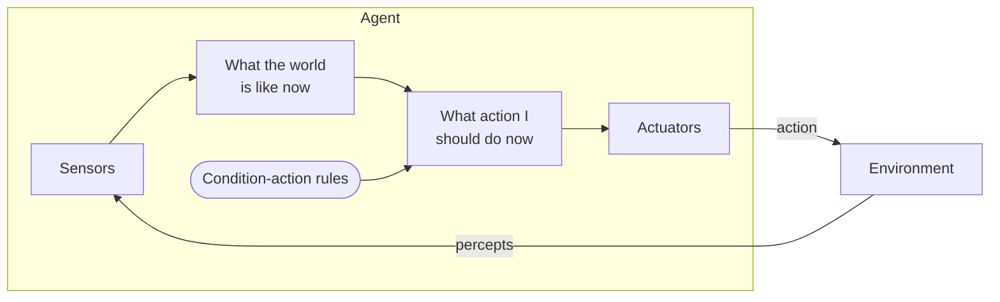
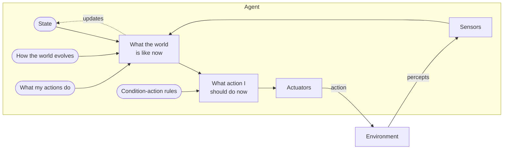
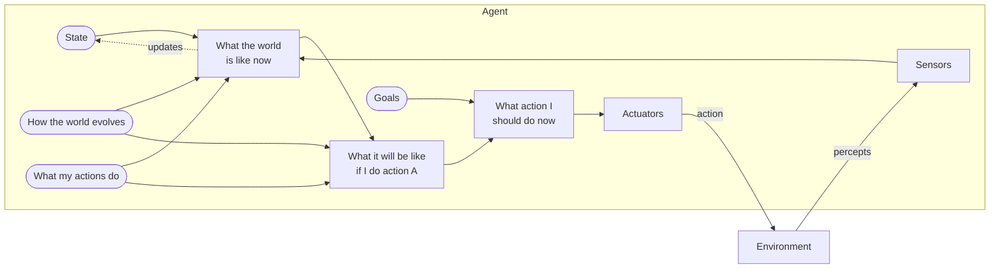
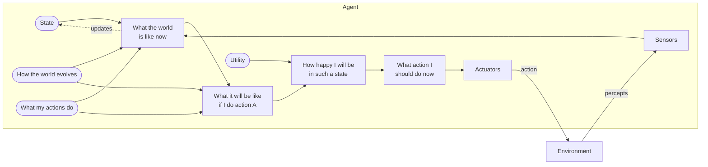
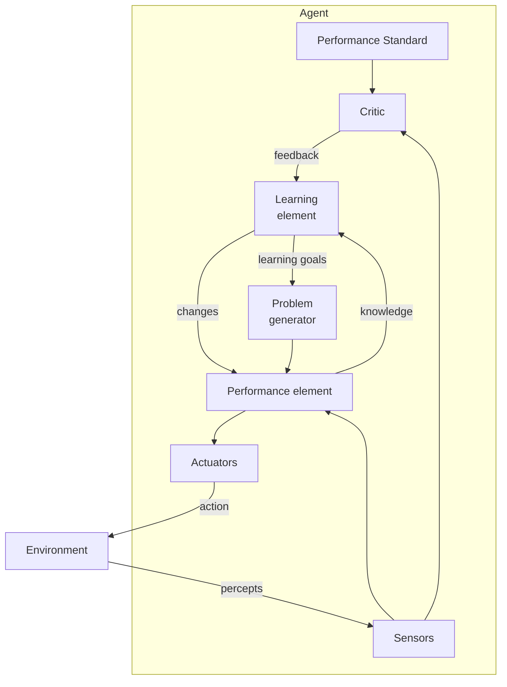

# UNIT 1: INTRODUCTION TO ARTIFICIAL INTELLIGENCE (STUDY NOTES)
## B.Tech (Computer Engineering) — SVKM's NMIMS (MPSTME)
### Course Code: 702CO0C076

---

## SECTION 1: DEFINITIONS OF ARTIFICIAL INTELLIGENCE

⭐ **Must Remember**
Artificial Intelligence (AI) does not have a single, universally accepted definition. Historically, AI researchers have categorized definitions of AI along two main dimensions [47]:
1. **Thought Processes & Reasoning** (focus on internal mental faculties) vs. **Behavior & Action** (focus on observable external performance) [47].
2. **Human-like Performance** (measuring success against human fidelity) vs. **Rationality** (measuring success against an ideal, objective standard of intelligence) [6, 26, 47].

This classification results in **four historical approaches** to AI, visualized in the standard $2 \times 2$ grid [47]:

| | **Human-Like (Empirical Science)** | **Rationally (Mathematics & Engineering)** |
| :--- | :--- | :--- |
| **Think (Thought/Reasoning)** | **Thinking Humanly**: Cognitive Modeling<br>Replicating human thought processes in machines [164]. | **Thinking Rationally**: "Laws of Thought"<br>Developing correct logical inference systems [164]. |
| **Act (Behavior/Action)** | **Acting Humanly**: Turing Test Approach<br>Behaving indistinguishably from humans [164]. | **Acting Rationally**: Rational Agent Approach<br>Acting optimally to achieve goals [164]. |

---

### 1.1 The Four Historical Approaches in Detail

#### 1. Thinking Humanly: The Cognitive Modeling Approach
*   **Core Concept:** To say a machine thinks like a human, we must first determine how humans think. This requires looking inside the human mind through psychological experiments, cognitive science, and neuroimaging (brain scans). Once a precise theory of the human mind is formulated, we can express it as a computer program. If the program's input/output and timing behaviors match human behaviors, it provides evidence that a similar mechanism is at work.
*   **Key Source Definitions:**
    > *"The exciting new effort to make computers think... machines with minds, in the full and literal sense."* — Haugeland, 1985 [164, 179]
    > *"The automation of activities that we associate with human thinking, activities such as decision-making, problem solving, learning..."* — Bellman, 1978 [164, 179]
*   **Underlying Discipline:** **Cognitive Science** (which combines computer models from AI and experimental techniques from psychology to construct testable theories of the human mind).

#### 2. Acting Humanly: The Turing Test Approach
*   **Core Concept:** Behaving indistinguishably from a human. Alan Turing (1950) proposed an operational test for intelligence known as the **Imitation Game** [63, 65, 207]. 
*   **Key Source Definitions:**
    > *"The art of creating machines that perform functions that require intelligence when performed by people."* — Kurzweil, 1990 [206]
    > *"The study of how to make computers do things at which, at the moment, people are better."* — Rich and Knight, 1991 [214]
*   **The Turing Test Structure:** A human interrogator poses written questions to a human and a computer hidden in separate rooms. If the interrogator cannot reliably tell whether the written responses come from the human or the machine after a set period of conversation, the computer passes.
*   **Required AI Capabilities to Pass the Turing Test:**
    1.  **Natural Language Processing (NLP):** To communicate successfully in a human language [15, 62].
    2.  **Knowledge Representation:** To store what it knows or hears [15].
    3.  **Automated Reasoning:** To use stored information to answer questions and draw new conclusions [15].
    4.  **Machine Learning:** To adapt to new circumstances, detect patterns, and extrapolate [15].
    5.  **Computer Vision (Total Turing Test):** To perceive physical objects [15].
    6.  **Robotics (Total Turing Test):** To manipulate objects and move in physical environments [15].

#### 3. Thinking Rationally: The "Laws of Thought" Approach
*   **Core Concept:** Based on the codification of correct reasoning. The Greek philosopher Aristotle pioneered **syllogisms** (e.g., *Socrates is a man; all men are mortal; therefore, Socrates is mortal*), initiating the field of **formal logic** [11].
*   **Key Source Definitions:**
    > *"The study of mental faculties through the use of computational models."* — Charniak and McDermott, 1985 [164]
    > *"The study of the computations that make it possible to perceive, reason, and act."* — Winston, 1992 [164]
*   **Inference Engine:** This approach seeks to formalize logical rules to build programs that can solve any solvable logical problem.
*   **Primary Limitations of this Approach:**
    1.  **Complexity/Intractability:** Translating informal knowledge into formal logical sentences is difficult when the information is incomplete or uncertain.
    2.  **Resource Constraints:** There is a major difference between solving a problem *in principle* and solving it *in practice*. A logical theorem prover can run out of computation time/memory even for small, basic problems [70, 210].

#### 4. Acting Rationally: The Rational Agent Approach
*   **Core Concept:** An agent is simply something that acts (from Latin *agere*, meaning to do) [26]. A **rational agent** is one that acts to achieve the best possible outcome, or the best expected outcome when there is uncertainty [26, 212].
*   **Key Source Definitions:**
    > *"Computational Intelligence is the study of the design of intelligent agents."* — Poole et al., 1998 [163]
    > *"AI... is concerned with intelligent behavior in artifacts."* — Nilsson, 1998 [26]
*   **Reasoning vs. Behavior:** While logical reasoning is a critical component of acting rationally (since drawing correct inferences is a powerful way to choose correct actions), formal reasoning is not *all* of rationality [26]. For example, pulling your hand away from a hot stove is a reflex action—it is a rational action that keeps you safe, but it does not require conscious logical computation [26].
*   **Advantages of the Rational Agent Approach (Why standard textbooks focus here):**
    1.  It is **more general** than the "laws of thought" approach because logical reasoning is only one of several mechanisms used to achieve rationality [26].
    2.  It is **mathematically well-defined** and scientifically testable, unlike the "thinking humanly" or "acting humanly" approaches, which are highly subjective and bound to the idiosyncrasies of human psychology [6, 26].

🧠 **Must Understand**
The Turing Test is an operational standard for *acting humanly*, whereas the rational agent framework defines an engineering standard for *acting rationally*. Rationality does not require a system to mimic human cognitive biases or emotional flaws; it requires the system to maximize its expected performance measure given what it perceives [6].

---

## SECTION 2: APPLICATIONS OF ARTIFICIAL INTELLIGENCE

🧠 **Must Understand**
Modern AI systems operate across a vast spectrum of real-world domains. Below are the core real-world applications categorized by domain, focusing on the specific AI mechanisms that drive them:

```
                  ┌─────────────────────────────────────────┐
                  │            AI APPLICATIONS              │
                  └────────────────────┬────────────────────┘
         ┌─────────────────────────────┼─────────────────────────────┐
         ▼                             ▼                             ▼
┌──────────────────┐          ┌──────────────────┐          ┌──────────────────┐
│ NATURAL LANGUAGE │          │    AUTONOMOUS    │          │     MEDICAL      │
│    PROCESSING    │          │     SYSTEMS      │          │    DIAGNOSIS     │
└──────────────────┘          └──────────────────┘          └──────────────────┘
• Machine Translation         • Self-Driving Cars           • Diagnostic Aids
• Conversational Agents       • Mars Exploration Rovers     • Pathology Analysis
• Speech Synthesis            • Automated Drones            • Healthcare Planning
```

1.  **Natural Language Processing & Communication:**
    *   *Application:* Machine translation systems (e.g., Google Translate), conversational chatbots, and automated customer service agents [15].
    *   *Mechanism:* Uses deep learning (Transformer-based neural networks) to map semantic representations of words into multi-dimensional vectors, enabling machine translation and conversational inference [240].
2.  **Autonomous Vehicles & Transportation:**
    *   *Application:* Self-driving cars (e.g., Tesla) and planetary exploration rovers (e.g., NASA's Mars Rovers) [164].
    *   *Mechanism:* Sensor fusion combines inputs from LIDAR, radar, and cameras. Path-planning search algorithms (such as $A^*$) plot optimal collision-free trajectories [120, 204], while reinforcement learning modules govern real-time actuators (steering, throttle, braking) under probabilistic uncertainty [120].
3.  **Medical Diagnosis & Expert Systems:**
    *   *Application:* Diagnostic decision-support systems that evaluate patient symptoms and suggest clinical laboratory tests or diagnoses.
    *   *Mechanism:* Historically driven by rule-based production systems (e.g., MYCIN) using certainty factors to represent uncertainty [76]. Modern systems leverage Deep Convolutional Neural Networks (CNNs) to analyze whole-slide pathology images (WSIs) for cancer screening and tumor detection [212].
4.  **Game Playing & Adversarial Search:**
    *   *Application:* Game-playing agents such as Deep Blue (Chess), AlphaGo (Go), and modern backgammon engines [68, 168].
    *   *Mechanism:* Uses adversarial game-tree search (Minimax algorithm) enhanced with Alpha-Beta pruning, evaluation functions, and heuristic cutoffs to find optimal moves under strict execution time limits [116, 168].
5.  **Industrial Robotics & Computer Vision:**
    *   *Application:* Factory pick-and-place arms, part-sorting conveyor-belt robots, and warehouse logistics AGVs.
    *   *Mechanism:* Object segmentation and edge-detection algorithms identify defective parts on a line [21]. Inverse-kinematics algorithms convert Cartesian coordinates of the target object into physical joint-motor actuator angles.

---

## SECTION 3: CONCEPT OF MODELING, INFERENCE, AND LEARNING

🧠 **Must Understand**
To build any intelligent system, we must separate how the world is represented, how we reason about it, and how the system improves over time. These form three distinct stages: **Modeling**, **Inference**, and **Learning** [108].

```
┌──────────────┐          ┌─────────────────┐          ┌──────────────────┐
│     DATA     │ ───────> │    LEARNING     │ ───────> │      MODEL       │
└──────────────┘          └─────────────────┘          └────────┬─────────┘
                                                                │
                                                                ▼
┌──────────────┐                                       ┌──────────────────┐
│    QUERY     │ ────────────────────────────────────> │    INFERENCE     │
└──────────────┘                                       └────────┬─────────┘
                                                                │
                                                                ▼
                                                       ┌──────────────────┐
                                                       │    PREDICTION    │
                                                       └──────────────────┘
```

### 3.1 Detailed Definitions

#### A. Modeling
*   **Definition:** The process of formalizing a real-world scenario into a structured, computational representation [108, 121].
*   **Concepts:** Defining random variables, logical sentences (propositional or first-order logic), transition and sensor models, utility functions, or Bayesian network graphs [8, 11, 108]. It maps physical facts to semantic symbols in a logical or probabilistic framework [121].
*   **Example:** Drawing a directed acyclic graph (DAG) representing a clinical diagnostic system where nodes represent diseases/symptoms and directed edges represent causal relationships.

#### B. Inference
*   **Definition:** The computational process of using a completed model to answer queries, draw conclusions, or make predictions about unobserved variables, *without changing the structure or parameters of the model itself* [108].
*   **Concepts:** Reasoning from the general model down to a specific prediction.
*   **Process:** Formulated as:
    $$\text{Model} + \text{Query/Observations} \xrightarrow{\text{Inference}} \text{Prediction/Decision}$$
*   **Example:** Given a Bayesian Network with specified conditional probabilities, calculating the probability of a rain event tomorrow given that the umbrella is present today [74, 108].

#### C. Learning
*   **Definition:** The process of using historical training data or environmental feedback to build, calibrate, or optimize the model's structural parameters or decision rules [108].
*   **Concepts:** Reasoning from specific data instances up to general patterns.
*   **Process:** Formulated as:
    $$\text{Data} \xrightarrow{\text{Learning}} \text{Model}$$
*   **Example:** Counting how many times a disease actually occurred with certain symptoms across 10,000 patient records to calculate the conditional probability tables of our diagnostic model [108].

---

### 3.2 The Mausam "Bag of Candies" Example [114]
To clearly distinguish learning from inference, consider a bag of lime and cherry candies. We have 5 candidate bags (hypotheses), each containing different percentages of lime and cherry candies:

1.  **The Learning Task:** An agent is handed a closed bag and draws 10 cherry candies in a row. Based on this observation data, the agent estimates which of the 5 bags it was handed. This is a **learning** problem because we are moving from *data to model* (identifying the correct model of the world) [114].
2.  **The Inference Task:** Once the agent has established the most likely bag configuration (the model), it wants to calculate the probability that the *next* candy drawn from this specific bag will be a cherry candy. This is an **inference** problem because we are moving from *model to query* [114].

---

### 3.3 Deductive vs. Inductive Reasoning in Learning [11, 53]

*   **Deductive Reasoning:** A "top-down" approach starting with general principles, axioms, or theories and applying logical rules of inference to arrive at a specific, guaranteed conclusion [11, 53].
    *   *Logic Formulation:* If the premises are true, the conclusion is guaranteed to be true [11].
    *   *AI Context:* Logic-based expert systems and resolution theorem provers [11, 76].
    *   *Deductive Learning:* **Relevance-Based Learning (RBL)** and **Explanation-Based Learning (EBL)**, which use background knowledge together with observations to infer new, general rules [39, 176, 191, 205]. These are deductive because they do not produce hypotheses that go beyond the logical content of the background knowledge [39, 176, 191, 205].
*   **Inductive Reasoning:** A "bottom-up" approach starting with specific observations or examples and generalizing them to form a tentative hypothesis, pattern, or rule [11, 53].
    *   *Logic Formulation:* The truth of the premises supports the conclusion but does not guarantee it [11].
    *   *AI Context:* Machine Learning algorithms that fit hypotheses to data [9].
    *   *Inductive Learning:* **Pure Inductive Inference (Induction)**, where a learning algorithm is supplied with sample pairs $(x, f(x))$ and returns a hypothesis $h$ that approximates the target function $f$ [9].

---

### 3.4 Comparison Matrix

| Feature | **Modeling** | **Inference** | **Learning** |
| :--- | :--- | :--- | :--- |
| **Primary Goal** | Define the structure and assumptions of the world [108]. | Answer queries using the defined model [108]. | Automatically build or refine the model from data [108]. |
| **Direction** | Real-world $\rightarrow$ Symbols [121]. | Model $\rightarrow$ Queries [108]. | Data $\rightarrow$ Model [108]. |
| **Reasoning Strategy** | Ontological commitment definition [35]. | Deductive logical proofs, variable elimination, Bayes' rule [108]. | Inductive logic, parameter estimation, gradient descent [9, 38, 108]. |
| **Mathematical Basis** | Logic sentences, Random variables, Utility equations [8, 11]. | Probability theory, propositional/first-order logic deduction [11, 74]. | Parameter optimization, Maximum Likelihood, MAP, EM algorithm [38, 218]. |
| **Example Scenario** | Drawing the nodes and edges of a clinical diagnostic network. | Calculating the probability of flu given a patient's temperature. | Adjusting diagnostic probabilities based on 10,000 patient records. |

---

## SECTION 4: MACHINE LEARNING & DEEP LEARNING AS SUBSETS OF AI

✍️ **Exam Focus**
Students must understand the hierarchical relationship of these fields. Do not confuse them as distinct parallel fields; they are nested concentric circles.

```
┌─────────────────────────────────────────────────────────┐
│ ARTIFICIAL INTELLIGENCE (AI)                            │
│ Broadest umbrella; automating intelligent behavior.     │
│ ┌─────────────────────────────────────────────────────┐ │
│ │ MACHINE LEARNING (ML)                               │ │
│ │ Statistical learning; algorithms mapping input to   │ │
│ │ output functions from data.                         │ │
│ │ ┌─────────────────────────────────────────────────┐ │ │
│ │ │ DEEP LEARNING (DL)                              │ │ │
│ │ │ Neural Networks; hierarchical representation   │ │ │
│ │ │ learning over raw data.                         │ │ │
│ │ └─────────────────────────────────────────────────┘ │ │
│ └─────────────────────────────────────────────────────┘ │
└─────────────────────────────────────────────────────────┘
```

### 4.1 Nested Definitions

#### 1. Artificial Intelligence (AI)
*   **Definition:** The broad field of computer science dedicated to building systems capable of performing tasks that typically require human-like intelligence, such as planning, search, logical reasoning, and perception [71, 77, 133].
*   **Core Approach:** Includes both "hand-crafted" classical systems (such as logical rules, search trees, and expert system shells) and data-driven systems [97, 133, 142].

#### 2. Machine Learning (ML)
*   **Definition:** A specific subset of AI where the system is not explicitly programmed with logical rules [63]. Instead, it uses statistical algorithms to learn a mapping function ($h(x) \approx f(x)$) from raw inputs to target outputs using a set of training examples [21, 149].
*   **Core Approach:** Features must be extracted from data manually by domain engineers before feeding them into the learning algorithm (e.g., Decision Trees, $K$-Means clustering, Support Vector Machines) [63, 135].

#### 3. Deep Learning (DL)
*   **Definition:** A highly specialized subfield of Machine Learning based on **Connectionist Models** (Artificial Neural Networks with many hidden layers) [34].
*   **Core Approach:** Automatically learns hierarchical representations of data [97]. It bypasses manual feature engineering; lower layers of the neural network detect simple features (like edges in computer vision), while deeper layers automatically combine them to detect abstract concepts (like human faces) [35, 149].

---

### 4.2 The Four Main Types of Learning Feedback [161]
Machine Learning is classified into four major learning paradigms depending on the type of feedback available [161]:

1.  **Supervised Learning:** The agent observes some example input-output pairs and learns a mapping function $h(x)$ from input to output [161].
    *   **Classification:** When the target output $y$ is one of a finite set of discrete categories (e.g., spam vs. non-spam) [5, 38, 162].
    *   **Regression:** When the target output $y$ is a continuous numerical value (e.g., predicting tomorrow's temperature) [5, 38, 162].
2.  **Unsupervised Learning:** The agent learns patterns, relationships, or clusters in the input data even though no explicit feedback or target label is supplied [161].
    *   *Example:* $K$-Means clustering grouping customers based on purchase behavior [164].
3.  **Reinforcement Learning:** The agent learns by choosing actions in an environment and receiving a series of reinforcements, which are numeric rewards or punishments [161].
    *   *Example:* An agent learning to navigate a maze by receiving a reward of $+100$ at the goal and a penalty of $-1$ for every step [10, 120].
4.  **Semi-Supervised Learning:** The agent is given a few labeled examples alongside a large volume of unlabeled data, and must construct a model that utilizes both [161].

---

### 4.3 Ockham's Razor [5, 38, 162]
🧠 **Must Understand**
When there are multiple consistent hypotheses that fit the training data, how do we select the correct one? 
**Ockham’s Razor** states: **"Prefer the simplest hypothesis consistent with the data."** [5, 38, 162]
*   *Why?* A highly complex model (such as a 10th-degree polynomial) might fit the training data points perfectly but overfit the noise, failing to generalize to unseen test data [5, 109]. A simpler model (such as a linear function) is more likely to capture the true underlying physical process [5].

---

### 4.4 Comparison Matrix

| Characteristic | **Artificial Intelligence (AI)** | **Machine Learning (ML)** | **Deep Learning (DL)** |
| :--- | :--- | :--- | :--- |
| **Scope** | Broadest umbrella; includes logic, search, knowledge representation, NLP, and robotics [35]. | A subset of AI focused on learning functions from data [21, 149]. | A subset of ML focused on multi-layered neural networks [97]. |
| **Feature Engineering** | Heavily relies on hand-crafted rules or expert knowledge encoding [76]. | Requires manual feature extraction by engineers (e.g., calculating statistical features) [63]. | Performs automatic representation learning directly from raw data [97]. |
| **Data Requirements** | Can run on zero data (e.g., pure A* search on empty grids, logic-based expert systems). | Works well on small to medium-sized tabular datasets. | Requires massive datasets to generalize effectively without overfitting. |
| **Hardware** | Executes efficiently on standard CPUs. | Typically trained on standard CPUs or lightweight machines. | Requires parallel computing architectures (GPUs/TPUs). |
| **Core Examples** | Chess game tree search, Rule-Based MYCIN, A* Search [76, 121]. | Decision Tree Classifier (ID3), $K$-Means Clustering, Linear Regression [135, 164]. | Convolutional Neural Networks (CNNs) for medical image screening, Large Language Models [212]. |

---

## SECTION 5: INTELLIGENT AGENTS & STRUCTURES

⭐ **Must Remember**
An **Agent** is anything that can be viewed as perceiving its environment through **Sensors** and acting upon that environment through **Actuators** [47, 116].

```
                     ┌──────────────────┐
                     │     AGENT        │
                     │  ┌────────────┐  │
        ┌───────────>│  │  Sensors   │  │
        │            │  └─────┬──────┘  │
        │ Percepts   │        │         │
        │            │  ┌─────▼──────┐  │
        │            │  │  Program   │  │
        │            │  └─────┬──────┘  │
        │            │        │         │
        │            │  ┌─────▼──────┐  │
        │            │  │ Actuators  │  │
        │            │  └─────┬──────┘  │
  ┌─────┴──────┐     └────────┼─────────┘
  │            │              │
  │ENVIRONMENT│<─────────────┘ Actions
  │            │
  └────────────┘
```

*   **Percept:** The agent's sensory inputs at any given instant [15, 116].
*   **Percept Sequence:** The complete history of everything the agent has perceived so far [63, 116].
*   **Agent Function ($f$):** An abstract mathematical function that maps any given percept sequence to an action [26]:
    $$f: P^* \rightarrow A$$
    where $P^*$ is the set of all possible percept sequences, and $A$ is the set of actions.
*   **Agent Program:** The concrete computer program that runs on the physical agent architecture to implement the abstract agent function $f$ [26, 43].
    *   **The Architecture:** The physical computing device equipped with sensors and actuators [44].
    *   **Formula:** $\text{Agent} = \text{Architecture} + \text{Program}$ [41, 44].

---

### 5.1 Why a Table-Driven Agent is Doomed to Failure [31, 70, 168, 183, 197, 210]
A table-driven agent program keeps track of the entire percept sequence and uses it to index into a pre-computed lookup table of actions [31, 209].
*   **The Mathematical Size:** Let $P$ be the set of possible percepts and let $T$ be the lifetime of the agent (the total number of percepts it will receive). The lookup table must contain:
    $$\sum_{t=1}^T |P|^t \text{ entries}$$
*   **The Taxi Driving Example [70, 210]:** Visual input from a single camera comes in at roughly 27 megabytes per second (30 frames/sec, $640 \times 480$ pixels with 24-bit color). For an hour's driving, the lookup table would require over $10^{250,000,000,000}$ entries.
*   **The Chess Example [70]:** Even for chess—a tiny, well-behaved board game—the lookup table would require at least $10^{150}$ entries. The number of atoms in the observable universe is only about $10^{80}$.
*   **Conclusion:** No physical machine in this universe has the space to store such a table, no designer has the time to write it, and no agent could ever learn it [70]. The goal of AI is to design compact programs that produce rational behavior from a small amount of code rather than a vast table [229].

---

### 5.2 The Concept of Rationality
A **Rational Agent** is one that operates to do the "right thing" [23, 26]. Rationality is formally defined by four pillars:

1.  **Performance Measure:** The objective metric used to evaluate how successful the agent's behavior is in achieving the desired state in the environment [116].
2.  **Prior Knowledge of the Environment:** What the agent knows about the dynamics of the world beforehand [116].
3.  **Performable Actions:** The actions that the agent's actuators are physically capable of executing [116].
4.  **Percept Sequence:** The complete history of percepts received by the agent up to the current point [116].

#### Omniscience vs. Rationality [23, 153]
*   **Omniscience** is knowing the *actual* outcome of an action beforehand, which is impossible in the real world [23, 153].
*   **Rationality** is based on the *expected* outcome given what has been perceived [23, 153]. An agent is rational if it maximizes *expected* performance, even if the actual outcome is suboptimal due to unexpected environmental noise [23, 119].

#### Autonomy [43, 199]
*   An agent is **autonomous** if its behavior is guided by its own experience (learning and adapting) rather than relying solely on pre-programmed designer assumptions [43, 199]. An agent that lacks autonomy relies entirely on the system designer's built-in rules and cannot cope with environmental changes.

---

### 5.3 The Five Core Agent Architectures

#### 1. Simple Reflex Agents
*   **Concept:** The simplest kind of agent [193]. It selects actions based only on the **current percept**, completely ignoring the rest of the percept history [193].
*   **Mechanism:** Driven by hard-coded **Condition-Action Rules** (if-then rules) [194].
*   **Limitation:** Only works if the environment is **fully observable**. Even a small amount of unobservability causes the agent to fail or loop infinitely.
*   **Pseudo-code Logic:**
    ```python
    def Simple_Reflex_Agent(percept):
        state = interpret_input(percept)
        rule = rule_match(state, condition_action_rules)
        action = rule.action
        return action
    ```



*Diagram: Simple reflex agent — the current percept flows straight through to an action via condition-action rules, with no memory of the past (AIMA Fig. 2.9).*

---

#### 2. Model-Based Reflex Agents
*   **Concept:** Designed to handle **partially observable** environments [155].
*   **Mechanism:** Maintains an **internal state** that tracks the unobserved aspects of the world [68, 85].
*   **Model of the World:** To maintain this internal state, the agent needs to know:
    1.  How the world evolves independently of the agent (Transition model) [30, 85].
    2.  How the agent's own actions affect the world (Sensor/Action model) [30, 85].
*   **Pseudo-code Logic:**
    ```python
    def Model_Based_Reflex_Agent(percept):
        state = update_state(state, action, percept, model)
        rule = rule_match(state, condition_action_rules)
        action = rule.action
        return action
    ```



*Diagram: Reflex agent with internal state — sensor input, the previous state, the transition model ("how the world evolves"), and the action model ("what my actions do") are combined to update the agent's best guess of the current world state (AIMA Fig. 2.12).*

---

#### 3. Goal-Based Agents
*   **Concept:** Knowing the current state of the environment is not always enough; the agent also needs a **goal** that describes desirable situations [31, 68, 120].
*   **Mechanism:** Combines state tracking with goals to evaluate action sequences [155].
*   **Search & Planning:** Unlike reflex agents that use direct rules, goal-based agents use **search** and **planning** algorithms to find a path to the goal [121, 155]. This makes them highly flexible but less computationally efficient [86].
*   **Pseudo-code Logic:**
    ```python
    def Goal_Based_Agent(percept):
        state = update_state(state, action, percept, model)
        action = plan_route_to_goal(state, goals, model)
        return action
    ```



*Diagram: Goal-based agent — beyond just tracking state, the agent projects "what it will be like if I do action A" and picks the action that leads toward its goals (AIMA Fig. 2.13).*

---

#### 4. Utility-Based Agents
*   **Concept:** Goals only provide a binary distinction between success (goal reached) and failure [196]. A **utility function** maps a state to a real number, measuring how desirable that state is [196].
*   **Mechanism:** Evaluates actions by calculating their **expected utility** [42, 87]. This is the weighted average of the utilities of all possible outcome states, based on their probabilities [42, 87].
*   **Conflicting Goals:** Excellent for handling trade-offs between conflicting goals (e.g., speed vs. safety for a self-driving car) [155].
*   **Pseudo-code Logic:**
    ```python
    def Utility_Based_Agent(percept):
        state = update_state(state, action, percept, model)
        action = max_expected_utility_action(state, utility_function, model)
        return action
    ```



*Diagram: Utility-based agent — instead of a binary goal, a utility function scores "how happy I will be in such a state," letting the agent handle conflicting or uncertain goals (AIMA Fig. 2.14).*

---

#### 5. The Learning Agent
*   **Concept:** Rather than hand-coding every component, we can build a **Learning Agent** that improves its performance over time by learning from its experiences [123, 201].
*   **The Four Key Components [32, 123]:**
    1.  **Performance Element:** Responsible for selecting external actions (this corresponds to the standard agent architectures described above) [32, 123, 204].
    2.  **Critic:** Evaluates the agent's behavior against an external **performance standard** and provides feedback [32].
    3.  **Learning Element:** Responsible for making improvements to the agent [32, 123].
    4.  **Problem Generator:** Suggests actions that lead to new, informative, and exploratory experiences [32].



*Diagram: Learning agent — the Critic scores incoming percepts against a fixed performance standard and feeds that back to the Learning Element, which tunes the Performance Element (and exchanges "knowledge" with it); the Problem Generator suggests exploratory actions to feed further learning (AIMA Fig. 2.15).*

---

### 5.4 Comparison Matrix of Agent Architectures

| Agent Type | **Core Decision Basis** | **Memory Requirement** | **Computational Complexity** | **Flexibility to New Goals** |
| :--- | :--- | :--- | :--- | :--- |
| **Simple Reflex** | Current percept only [193]. | None. | Extremely low [193]. | Low (requires rule rewriting) [194]. |
| **Model-Based** | Internal state + transition/sensor models [68, 85]. | High (stores state over time). | Low to Medium. | Low (rules are still goal-blind). |
| **Goal-Based** | Path tracking toward explicit goals [31, 120]. | High (stores state + goal states). | High (requires search/planning) [86]. | Extremely High (just change the goal). |
| **Utility-Based** | Maximizing expected utility/happiness [196]. | High (stores state + utility weights). | Very High (probability weighting). | Extremely High (maps trade-offs). |
| **Learning Agent** | Performance feedback and exploratory experiences [32]. | High (stores history, critic metrics). | Varies (requires active learning). | Infinite (learns new behaviors). |

---

## SECTION 6: PROPERTIES OF TASK ENVIRONMENTS

🧠 **Must Understand**
The design of an agent program is directly determined by the properties of its **Task Environment** [197]. These properties are categorized along several key dimensions [197]:

1.  **Fully Observable vs. Partially Observable:**
    *   *Fully Observable:* The agent's sensors can detect the complete state of the environment at any given time [79].
    *   *Partially Observable:* The sensors cannot detect the full state due to noise, limits, or missing information [79].
2.  **Deterministic vs. Stochastic vs. Nondeterministic:**
    *   *Deterministic:* The next state of the environment is completely determined by the current state and the agent's action [79].
    *   *Stochastic:* The next state is determined probabilistically (there is uncertainty about the outcome) [36, 117].
    *   *Nondeterministic:* The possible outcomes are listed, but no probabilities are assigned to them [36, 140, 211].
3.  **Episodic vs. Sequential:**
    *   *Episodic:* The agent's experience is divided into independent, atomic episodes [52, 117]. The action taken in the current episode does not affect future episodes [80, 212].
    *   *Sequential:* The current decision can affect all future decisions and states (requires planning ahead) [37, 52, 117].
4.  **Static vs. Dynamic vs. Semidynamic:**
    *   *Static:* The environment does not change while the agent is deciding on an action [37, 81, 118].
    *   *Dynamic:* The environment continues to change while the agent is deliberating [37, 81, 118].
    *   *Semidynamic:* The environment itself does not change, but the agent's performance score does (e.g., playing chess with a clock) [9, 37, 81, 118].
5.  **Discrete vs. Continuous:**
    *   *Discrete:* There are a finite number of distinct, clearly defined states, percepts, and actions (e.g., chess grid) [53, 154].
    *   *Continuous:* The environment state, time, or actions vary continuously (e.g., steering a vehicle) [53, 58].
6.  **Single-Agent vs. Multi-Agent:**
    *   *Single-Agent:* Only one agent operates in the environment [154].
    *   *Multi-Agent:* Multiple agents interact, which can be **competitive** (e.g., chess) or **collaborative** (e.g., autonomous driving convoy) [9, 83].

---

### 6.1 Task Environment Comparison Table

✍ *Highly likely to be asked on exams! Memorize this table:*

| Task Environment | Observable | Agents | Deterministic | Episodic | Static | Discrete |
| :--- | :--- | :--- | :--- | :--- | :--- | :--- |
| **Crossword Puzzle** [10, 15] | Fully | Single | Deterministic | Sequential | Static | Discrete |
| **Chess (with clock)** [10, 15]| Fully | Multi | Strategic | Sequential | Semi | Discrete |
| **Poker** [10, 15] | Partially | Multi | Stochastic | Sequential | Static | Discrete |
| **Backgammon** [10, 15] | Fully | Multi | Stochastic | Sequential | Static | Discrete |
| **Taxi Driving** [10, 15] | Partially | Multi | Stochastic | Sequential | Dynamic | Continuous |
| **Medical Diagnosis** [10, 15]| Partially | Single | Stochastic | Sequential | Dynamic | Continuous |
| **Image Analysis** [11, 16] | Fully | Single | Deterministic | Episodic | Semi | Continuous |
| **Part-picking Robot** [12, 17]| Partially | Single | Stochastic | Episodic | Dynamic | Continuous |
| **Refinery Controller** [39, 143]| Partially| Single | Stochastic | Sequential | Dynamic | Continuous |
| **English Tutor** [39, 143] | Partially | Multi | Stochastic | Sequential | Dynamic | Discrete |

---

### 6.2 PEAS Specification Examples

| Agent Type | **Performance Measure** | **Environment** | **Actuators** | **Sensors** |
| :--- | :--- | :--- | :--- | :--- |
| **Medical Diagnosis** [28, 66] | Healthy patient, minimize costs, avoid lawsuits. | Patient, hospital, medical staff. | Screen display (questions, diagnoses, tests). | Keyboard entry of symptoms, clinical readings. |
| **Interactive English Tutor** [29, 67] | Maximize student's score on standardized test. | Set of students, testing agency. | Display of exercises, customized suggestions, corrections. | Keyboard, mouse clicks. |
| **Part-Picking Robot** [208] | Percentage of parts placed in correct bins, speed. | Conveyor belt with parts, bins. | Jointed robotic arm, gripper hand. | Camera, joint angle sensors. |
| **Refinery Controller** [208] | Maximize product purity, yield, safety constraints. | Chemical refinery, mixing vessels, pipelines. | Valves, pumps, heaters, display panels. | Temperature, pressure, chemical sensors. |

---

## SECTION 7: SUMMARY & LAST-MINUTE REVISION

### 7.1 Key Terminology Glossary
*   **Turing Test:** An operational test for intelligent behavior based on the Imitation Game [7, 8].
*   **Rational Agent:** An agent that acts to maximize its expected performance measure based on its percept history and built-in knowledge [23, 212].
*   **Autonomy:** The ability of an agent to learn and adapt its behavior rather than relying entirely on pre-programmed rules [43].
*   **Condition-Action Rule:** A rule that maps a specific sensory condition directly to an action (if-then structure) [194].
*   **Episodic Environment:** An environment where each action is self-contained and has no long-term consequences [80].
*   **Modeling:** Representing a real-world system using logical or mathematical structures [108].
*   **Inference:** Computing answers to queries using a static model without altering its parameters [108].
*   **Learning:** Automatically building or updating a model from data [108].
*   **Ockham's Razor:** The philosophical principle that advises choosing the simplest hypothesis consistent with the data [5, 38].
*   **Filtering:** The task of computing the posterior distribution over the most recent state given all evidence to date: $P(X_t | e_{1:t})$ [74].
*   **Prediction:** The task of computing the posterior distribution over a future state given all evidence to date: $P(X_{t+k} | e_{1:t})$ [74].

---

### 7.2 Last-Minute Exam Focus Points

#### 1. Distinguishing Agent Program and Agent Function [43, 197]
*   The **Agent Function** is an abstract mathematical mapping ($f: P^* \rightarrow A$).
*   The **Agent Program** is the concrete implementation running on physical hardware.
*   *Key Concept:* An agent program can only implement an agent function for finite sequences, as physical memory limits the ability to store infinite histories.

#### 2. The Simple Reflex Agent's Vulnerability [193]
*   It has **no memory of past states** and relies entirely on the current percept.
*   If the environment is partially observable, it will fail to distinguish between different global states that share the same current percept, often leading to infinite loops (such as a vacuum cleaner getting stuck in a corner).

#### 3. Why the Learning Agent is Structured in Four Parts [32]
*   To decouple the execution of actions (**Performance Element**) from the evaluation of behavior (**Critic**), allowing the agent to safely learn and discover new strategies (**Problem Generator**) without requiring the programmer to define the optimal behavior beforehand.

---

### 7.3 Last-Minute Revision Checklist
*   [ ] Categorize any given environment along the 7 key task dimensions (Fully/Partially Observable, Single/Multi-Agent, etc.)
*   [ ] Write a comprehensive PEAS description for any autonomous system
*   [ ] Contrast the abstract Agent Function with the concrete Agent Program
*   [ ] Draw the architecture diagrams for Simple Reflex, Model-Based, and Learning Agents
*   [ ] State the mathematical reason why table-driven agents are unachievable in physical reality
*   [ ] Distinguish between Deductive and Inductive reasoning and map them to Modeling, Inference, and Learning
*   [ ] Distinguish Machine Learning from Deep Learning using concentric circle definitions

---

## SECTION 8: COURSE POLICY & SOURCE AUDIT

### 8.1 Course Policy Checklist

| Syllabus Topic | Coverage Status | Notes / Location |
| :--- | :---: | :--- |
| **1. Definitions of AI** | ✅ Fully Covered | Section 1 (AIMA Chapter 1 [131]) |
| **2. Applications of AI** | ✅ Fully Covered | Section 2 (AIMA Chapter 1 & Slides) |
| **3. Modeling, Inference, Learning** | ✅ Fully Covered | Section 3 (IIT-Delhi Lecture Notes [108]) |
| **4. ML & DL as subsets of AI** | ✅ Fully Covered | Section 4 (AIMA Chapter 18 [204] & Notes) |
| **5. Intelligent Agents** | ✅ Fully Covered | Section 5 (AIMA Chapter 2 [197]) |
| **6. Concept of Rationality** | ✅ Fully Covered | Section 5.1 (AIMA Chapter 2 [186]) |
| **7. Structure of Agents** | ✅ Fully Covered | Section 5.3 (AIMA Chapter 2 [179, 185]) |
| **8. Environment** | ✅ Fully Covered | Section 5 & 6 (AIMA Chapter 2) |
| **9. Properties of Task Environments** | ✅ Fully Covered | Section 6 (AIMA Chapter 2 [197]) |
| **10. Real-World Examples** | ✅ Fully Covered | Section 6.1 (AIMA Chapter 2 [163, 177]) |

---

### 8.2 Source Coverage Checklist

| Syllabus Topic | Primary Source(s) Used | Relevant Passages / Pages |
| :--- | :--- | :--- |
| **Definitions of AI** | `01_iai.pdf`, `RN_AI_3rd.pdf`, `efdd4d1d4c2087fe1cbe03d9ced67f34.pdf` | Haugeland (1985), Bellman (1978), Turing (1950) [1, 2, 7, 70, 131, 137] |
| **Modeling, Inference, Learning** | `NPTEL Lecture.pdf` (Prof. Mausam, IIT Delhi) | Variable Elimination, parameter learning [108, 114, 132, 133] |
| **ML & DL as subsets** | `1   learning agent...pdf`, `FOL.pdf` | Supervised vs. Reinforcement learning, Ockham's Razor [5, 8, 9, 38, 161] |
| **Agent Structures** | `02_iai.pdf`, `Sem 5 aids_ AIML AI pyq Solutions .l.pdf` | Simple reflex, model-based, goal, utility, learning [19, 41, 155, 179] |
| **Properties of Environment** | `efdd4d1d4c2087fe1cbe03d9ced67f34.pdf`, `AI Technical.pdf` | Figure 2.6 (Task environment characteristics) [10, 39, 143, 215] |

---

## SECTION 9: IMPROVEMENTS MADE (v2)

This second version (`ai-unit1-study-notes-v2.md`) contains several substantial expansions and improvements over the initial study notes file:

1.  **Deductive vs. Inductive Reasoning Added:** Explains deductive reasoning (guaranteed truth, top-down) vs. inductive reasoning (bottom-up, empirical generalization) and links them to Relevance-Based Learning (RBL) and pure inductive learning [11, 39, 53].
2.  **Mausam's Candy Bag Example Incorporated:** Integrated the intuitive "Bag of Candies" scenario from the IIT-Delhi NPTEL lectures to clearly ground the difference between parameter/model learning and query inference [114].
3.  **Detailed Learning Paradigms:** Expanded Section 4.2 to formally define Supervised (Regression and Classification), Unsupervised, Reinforcement, and Semi-Supervised learning feedback systems with source-grounded definitions [38, 161].
4.  **Table-Driven Agent Limitations Expanded:** Quantified the mathematical intractability of table-driven agents by showing how Lookup Table sizes scale exponentially ($\sum |P|^t$) and citing the visual taxi driving ($10^{250,000,000,000}$ entries) and chess ($10^{150}$ entries) benchmarks [70, 210].
5.  **Autonomy Defined Precisely:** Cites the explicit definition of autonomy as an agent's ability to learn and adapt its behavior rather than relying entirely on the designer's prior rules [43].
6.  **PEAS Mapping Expanded:** Added complete PEAS mappings and descriptions for a **Part-Picking Robot** and **Refinery Controller** [208] alongside standard textbook examples.
7.  **Refined Formatting and GitHub Compatibility:** Resolved minor heading inconsistencies, centered tables, and wrapped logic-related mathematical equations in standard GitHub LaTeX syntax.
