# Software Engineering Unit 3 PYQ Bank: UML Modeling

**Course:** Software Engineering | **Unit:** Unit 3: UML Modeling (08 Hours)  
**Course Outcome:** CO-3 — Apply UML concepts to model software functionality for a given scenario  
**Primary Reference:** *software-engineering-unit3-study-notes-v4.md*; examination-paper attributions below are reported and not independently verified

---

## 1. Overview, Scope & Master Exam Question Mapping

This document provides a comprehensive, exam-oriented **Previous Year Questions (PYQ) Bank** for **Unit 3: UML Modeling**. All reported question wordings, marks, sources, and Bloom levels are retained from v2. The original examination papers were not available for independent comparison: treat these as **reported, unverified attributions**, not verified transcriptions. The exam-guide exercise is not an original-paper PYQ.

Questions are arranged by topic. Differently worded questions share one answer only when that answer fully addresses every wording; distinct scenarios and required diagrams receive separate answers. All reported question wordings and metadata remain below.

### Master Question-to-Group Mapping Matrix

| Topic Group | Core Concepts & Diagram Types | Number of Sourced PYQs | Primary Sourced Scenarios |
| :--- | :--- | :---: | :--- |
| **Group 1** | UML Classification, OOA to OOD Transition | 2 | Library Management System, General Domain Models |
| **Group 2** | Use Cases, Specifications, & Activity Synergy | 5 | Online Course Registration, ATM Banking, Assignment Management |
| **Group 3** | Class Diagrams, Visibility, & Relationships | 6 | Pothole Reporting, Library Management, Online Placement Quiz, Bill & Course Relationships |
| **Group 4** | Events & Statechart Diagrams | 5 | Library BookCopy Life Cycle, Bank ATM System, Online Inventory |
| **Group 5** | Activity Diagrams & Swimlanes | 3 | Library Management, Order Management, Movie Ticket Booking |
| **Group 6** | Sequence Diagrams & Interaction Logic | 5 | Online Examination System, Advanced ATM Session, Food Ordering, E-Commerce / Bookshop |
| **Group 7** | Collaboration / Communication Diagrams | 5 | Sequence vs Communication Comparison, Railway Ticket Reservation, Real-Time Optimization |
| **Group 8** | Object Diagrams *(Supplementary Topic)* | 0 sourced questions; 1 supplementary example | Instance Snapshots & Runtime Link Notation |

---

## 2. Group 1: UML Fundamentals & OOA-to-OOD Transition

### Sourced Exam Questions in Group 1

#### Question 1.1
> **"Describe Structural diagrams and Behavior diagrams in UML."**  
> — **Source:** SVKM's NMIMS Final Examination (AY 2023–24 / Nov 2023) | **Course Code:** 702IT0C016 | **Question:** Q1(a) | **Marks:** 5 Marks | **Bloom's Level:** BL-2 (Understand) | **Verification:** Reported; original paper not independently checked

#### Question 1.2
> **"Critically evaluate the importance of UML in bridging the gap between Object-Oriented Analysis (OOA) and Object-Oriented Design (OOD). Provide an example showing how a conceptual model transition into specific UML diagrams."**  
> — **Source:** SVKM's NMIMS Final Examination (AY 2025–26 / Dec 2025) | **Course Code:** 702IT0C016 | **Question:** Q3(b) | **Marks:** 10 Marks | **Bloom's Level:** BL-5 (Evaluate / Apply) | **Verification:** Reported; original paper not independently checked

---

### Separate Answers for Group 1 Questions (Related Topic, Different Required Answers)

#### Part 1: Structural vs. Behavioral Diagrams in UML (5 Marks Answer for Q1.1)

The Unified Modeling Language (UML) standard defines **13 official diagram types**, categorized into two major structural and behavioral views:

```text
                                  +---------------------------------+
                                  |           UML DIAGRAMS          |
                                  +---------------------------------+
                                           /               \
                                          /                 \
            +----------------------------------+       +----------------------------------+
            |        STRUCTURAL DIAGRAMS       |       |        BEHAVIORAL DIAGRAMS       |
            +----------------------------------+       +----------------------------------+
            |  • Class Diagram                 |       |  • Use Case Diagram              |
            |  • Object Diagram                |       |  • State Diagram (Statechart)    |
            |  • Component Diagram             |       |  • Activity Diagram              |
            |  • Deployment Diagram            |       |  • Sequence Diagram              |
            |  • Package Diagram               |       |  • Communication Diagram         |
            |  • Composite Structure Diagram   |       |  • Timing Diagram                |
            +----------------------------------+       |  • Interaction Overview Diagram  |
                                                       +----------------------------------+
```

##### 1. Structural Diagrams (Static View)
Structural diagrams model the **static architecture** of a software system. They depict the classes, objects, components, interfaces, and physical nodes that constitute the system, independent of time and execution events.
*   **Class Diagram:** Shows static class structures, attributes, operations, and relationships (association, composition, inheritance).
*   **Object Diagram:** Captures a concrete runtime snapshot of class instances and their attribute values at a specific moment in time.
*   **Component Diagram:** Illustrates physical software modules, libraries, executable files, and their inter-dependencies.
*   **Deployment Diagram:** Maps software artifacts onto physical hardware processing nodes (servers, devices, cloud containers).
*   **Package Diagram:** Organizes model elements into logical namespaces and subsystems.

##### 2. Behavioral Diagrams (Dynamic View)
Behavioral diagrams model the **dynamic execution**, state changes, workflows, and interaction sequences of a system over time in response to internal or external stimuli.
*   **Use Case Diagram:** Captures functional requirements and actor-system interaction boundaries.
*   **State Diagram (Statechart):** Models the lifecycle of a single reactive object as it transitions between discrete states upon receiving events.
*   **Activity Diagram:** Visualizes procedural workflows, business processes, parallel branching (forks/joins), and swimlane responsibilities.
*   **Interaction Diagrams (Sequence & Communication):** Model step-by-step message exchanges between collaborating objects over time.

---

#### Part 2: Bridging OOA to OOD via UML (10 Marks Answer for Q1.2)

##### 1. The Role of UML in Bridging OOA and OOD
Object-Oriented Analysis (OOA) focuses on understanding the **problem domain** ("WHAT the system must do"), extracting real-world domain entities, user requirements, and business rules. Object-Oriented Design (OOD) focuses on building the **solution domain** ("HOW the software will be constructed"), defining software architectures, visibility, database schemas, and precise algorithmic interfaces.

UML acts as the single unified visual language that seamlessly bridges OOA and OOD through three core mechanisms:
1.  **Unified Graphical Notation:** Syntactically connects requirements to code architecture, eliminating translation ambiguity between business analysts and software developers.
2.  **Model Traceability:** High-level OOA entities (e.g., domain nouns) map directly into OOD design classes and database entities, maintaining clear traceability from Use Cases to Class and Interaction diagrams.
3.  **Validation and Verification:** Allows architects to evaluate architectural trade-offs, verify message call flows, and review state transitions before writing source code.

##### 2. Comparison: Problem Domain (OOA) vs. Solution Domain (OOD)

| Dimension | Object-Oriented Analysis (OOA) | Object-Oriented Design (OOD) |
| :--- | :--- | :--- |
| **Primary Goal** | Understand problem domain concepts ("WHAT") | Construct robust software architecture ("HOW") |
| **Class Focus** | Conceptual domain entities (e.g., `Book`, `Member`) | Implementation design classes (e.g., `ReservationController`, `DBConnector`) |
| **Attributes** | High-level business data (`title`, `author`) | Explicit data types & visibility (`- title: String`, `- fineAmount: double`) |
| **Operations** | Abstract business actions (`borrow`, `reserve`) | Precise signatures (`+ reserveBook(memberId: String, isbn: String): bool`) |
| **Primary UML Tools** | Use Case Diagrams, Conceptual Class Diagrams | Detailed Class Diagrams, Sequence Diagrams, Statecharts |

##### 3. Step-by-Step Worked Example: OOA-to-OOD Transition in a Library Management System

```text
  +-------------------------------------+             +-------------------------------------+
  |      OBJECT-ORIENTED ANALYSIS       |             |       OBJECT-ORIENTED DESIGN        |
  |             (OOA)                   |             |                (OOD)                |
  |  • Problem Domain Concepts          |  TRANSITION  |  • Solution Domain Architecture   |
  |  • Real-World Entities (Nouns)      | ----------> |  • Specific Attributes & Data Types|
  |  • Abstract Business Capabilities   |             |  • Visibilities, Controllers, Methods|
  +-------------------------------------+             +-------------------------------------+
```

*   **Step 1: OOA Requirements & Conceptual Domain Model**  
    *Requirements:* "A library member can reserve a book title if no physical copies are currently available."  
    *Conceptual Classes Identified:* `Member`, `Book`, `Reservation`.
*   **Step 2: OOD Detailed Class Diagram Realization**  
    The conceptual entity `Member` transitions into an explicit software class `LibraryMember` with visibility modifiers, private attributes, and typed methods:
    *   `- memberId: String`, `- unpaidFines: double`
    *   `+ canReserve(): bool`
    An architectural controller class `ReservationController` is introduced to manage transaction workflows.
*   **Step 3: OOD Dynamic Interaction Model Realization**  
    The abstract action "reserve book" is realized as a concrete **Sequence Diagram**, showing synchronous message calls:  
    `m:LibraryMember` $\rightarrow$ `ui:LMS_Interface` $\rightarrow$ `ctrl:ReservationController` $\rightarrow$ `b:Book` $\rightarrow$ `r:Reservation`.

---

## 3. Group 2: Use Cases & Use-Case Specifications

### Sourced Exam Questions in Group 2

#### Question 2.1
> **"Evaluate the effectiveness of using Use-Case and Activity Diagrams together in scenario-based modeling. What are the strengths and potential limitations of this approach?"**  
> — **Source:** SVKM's NMIMS Final Examination (AY 2024–25 / Dec 2024) | **Course Code:** 702IT0C016 | **Question:** Q3(b) | **Marks:** 10 Marks | **Bloom's Level:** BL-4 (Analyze / Evaluate) | **Verification:** Reported; original paper not independently checked

#### Question 2.2a
> **"Design Use Case Diagram for Online Course Registration system to automate the registration process."**  
> — **Source:** SVKM's NMIMS Final Examination (AY 2022–23 / Nov 2022) | **Course Code:** 702IT0C016 | **Question:** Q1(b) | **Marks:** 5 Marks | **Bloom's Level:** BL-6 (Create / Design) | **Verification:** Reported; original paper not independently checked

#### Question 2.2b
> **"Draw the use case diagram and activity diagram for course registration system explained below: Students may login to the system to register courses or retrieve all the courses they have already registered. Instructors may login to the system to add courses or retrieve all the courses they have already added. A student cannot register a course if: i) he/she doesn't meet the prerequisites, ii) the students registered in the course exceed the capacity of the classroom, iii) the course has a time conflict with other courses in the same term."**  
> — **Source:** Mumbai University TE-IT Sem VI Examination (May 2015) | **Paper Code:** 5169 | **Question:** Q2(b) | **Marks:** 10 Marks | **Bloom's Level:** BL-6 (Create / Design) | **Verification:** Reported; original paper not independently checked

#### Question 2.3
> **"Draw use case, sequence diagram (withdrawal) for ATM banking system."**  
> — **Source:** Mumbai University TE-IT Sem VI Examination (Dec 2015) | **Paper Code:** 6284 | **Question:** Q5(b) | **Marks:** 10 Marks | **Bloom's Level:** BL-6 (Create / Design) | **Verification:** Reported; original paper not independently checked

#### Question 2.4
> **"For 'Assignment Management System' formulate problem statement. For the formulated problem statement draw Use Case Diagram and Activity diagram for each use case."**  
> — **Source:** Mumbai University TE-IT Sem VI Examination (Dec 2017) | **Paper Code:** 25301 | **Question:** Q4(b) | **Marks:** 10 Marks | **Bloom's Level:** BL-6 (Create / Design) | **Verification:** Reported; original paper not independently checked

---

### Solutions for Group 2 Questions

#### Answer 2.1: Synergy & Evaluation of Use-Case + Activity Diagram Modeling (10 Marks)

##### 1. Complementary Roles in Scenario-Based Modeling
Use-Case Diagrams and Activity Diagrams represent two complementary layers of scenario-based requirements modeling:
*   **Use-Case Diagrams** capture the **contextual boundary** and functional capabilities ("WHAT features exist and WHO interacts with them").
*   **Activity Diagrams** capture the **internal procedural execution** and operational control flow ("HOW the scenario unfolds step-by-step across swimlane participants").

##### 2. Key Strengths of Combining Both Diagrams
1.  **Complete Functional & Procedural Visibility:** Use Cases define external actor interfaces, while Activity Diagrams model complex internal logic, decision branches, and loops within those use cases.
2.  **Clear Organizational Responsibility:** Activity Diagrams with **Swimlanes** partition tasks across specific actors and system boundaries, bridging user goals with database actions.
3.  **Parallel Execution Modeling:** Activity diagrams explicitly represent concurrent parallel tasks using **Fork and Join bars**, which Use Case diagrams cannot display.
4.  **Test Case Generation:** Combining use case specifications with activity decision paths allows test engineers to derive 100% path-coverage test cases (covering basic, alternate, and exception flows).

##### 3. Potential Limitations & Risks
1.  **Model Redundancy Overhead:** Creating activity diagrams for simple, linear use cases (e.g., `View Profile`) adds unnecessary documentation overhead without adding insight.
2.  **Maintenance Sync Risk:** If functional requirements change mid-project, updating both Use Case ovals and Activity workflows requires careful synchronization to prevent model inconsistencies.
3.  **Risk of Procedural Degradation:** Analysts coming from traditional structured analysis may incorrectly treat Activity Diagrams as functional flowcharts, attempting to model low-level code algorithms prematurely.

---

#### Answer 2.2: Online Course Registration System (5M / 10M Worked Models)

##### Scenario Assumptions
1.  **Actors:** `Student`, `Instructor`, `Registrar`, `Prerequisite Engine` (External Service).
2.  **Validation Logic:** Course registration enforces three strict business constraints:
    *   *Constraint 1:* Prerequisite compliance (`checkPrerequisites()`).
    *   *Constraint 2:* Classroom capacity check (`checkClassroomCapacity()`).
    *   *Constraint 3:* Time conflict verification (`checkTimeConflict()`).
3.  **Inclusions & Extensions:** All registration attempts require student authentication (`<<include>>`). Handling registration rejection due to capacity or conflict extends the base registration use case (`<<extend>>`).

##### Worked Use Case Diagram (GitHub Mermaid Visual Approximation)
*Note: The diagram below uses a Mermaid flowchart as a visual approximation. On an exam sheet, draw stick figures for actors, a rectangular boundary box, and smooth ovals for use cases.*

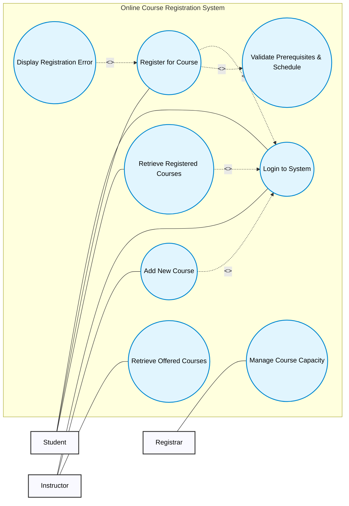
```mermaid
graph LR
    classDef actor fill:#f9f9ff,stroke:#333333,stroke-width:2px,color:#000000;
    classDef usecase fill:#e1f5fe,stroke:#0288d1,stroke-width:2px,color:#000000;

    subgraph CRS["Online Course Registration System"]
        UC1(("Login to System")):::usecase
        UC2(("Register for Course")):::usecase
        UC3(("Retrieve Registered Courses")):::usecase
        UC4(("Add New Course")):::usecase
        UC5(("Retrieve Offered Courses")):::usecase
        UC6(("Manage Course Capacity")):::usecase
        UC7(("Validate Prerequisites & Schedule")):::usecase
        UC8(("Display Registration Error")):::usecase
    end

    S["Student"]:::actor
    I["Instructor"]:::actor
    R["Registrar"]:::actor

    S --- UC1
    S --- UC2
    S --- UC3

    I --- UC1
    I --- UC4
    I --- UC5

    R --- UC6

    UC2 -.->|"<<include>>"| UC1
    UC2 -.->|"<<include>>"| UC7
    UC3 -.->|"<<include>>"| UC1
    UC4 -.->|"<<include>>"| UC1
    UC8 -.->|"<<extend>>"| UC2
```

###### Official UML Exam Drawing Checklist for Use Case Diagram
*  [ ] Are actors drawn as stick figures **outside** the system boundary box?
*  [ ] Are use cases drawn as smooth horizontal ovals containing **Verb-Noun** phrases?
*  [ ] Is `<<include>>` drawn as a dashed arrow pointing **FROM Base TO Included Use Case** (`Register for Course` $\longrightarrow$ `Validate Prerequisites`)?
*  [ ] Is `<<extend>>` drawn as a dashed arrow pointing **FROM Extending TO Base Use Case** (`Display Registration Error` $\longrightarrow$ `Register for Course`)?

##### Complete Textual Use Case Specification Table (UC-02: Register for Course)

| Specification Element | Details |
| :--- | :--- |
| **Use Case ID & Name** | **UC-02: Register for Course** |
| **Primary Actor** | Student |
| **Secondary Actors** | Registrar System, Prerequisite Engine |
| **Description** | Allows an authenticated student to select and register for an academic course for the upcoming term. |
| **Trigger** | Student selects a course from the course catalog and clicks "Register". |
| **Preconditions** | 1. Student is authenticated (`status == ACTIVE`).<br>2. Course registration window is OPEN. |
| **Main Success Flow (Basic)** | 1. Student logs in and navigates to Course Registration.<br>2. System displays available courses.<br>3. Student selects desired course and clicks "Submit Registration".<br>4. System verifies prerequisite completion (`checkPrerequisites() == true`).<br>5. System verifies classroom capacity (`registeredStudents < capacity`).<br>6. System verifies schedule time conflict (`hasTimeConflict() == false`).<br>7. System records student enrollment and updates class roster.<br>8. System displays confirmation message and updates student schedule. |
| **Alternate Flows** | **A1: Course Capacity Full -> Waitlist Option:** At step 5, if class is full, system prompts: *"Course full. Join Waitlist?"* If student accepts, system adds student to waitlist queue and terminates. |
| **Exception Flows** | **E1: Prerequisite Unfulfilled:** At step 4, if prerequisites missing, system halts registration and displays *"Error: Prerequisites not met."*<br>**E2: Time Conflict Detected:** At step 6, if conflict exists, system halts registration and displays *"Error: Time conflict with registered course [CRS-201]."* |
| **Postconditions** | 1. Student is officially enrolled in the course database.<br>2. Class seat count is incremented by 1. |

##### Worked Activity Diagram with Swimlanes (Course Registration Workflow)
*Visual Approximation Note: On hand-drawn exam papers, draw three vertical swimlane columns, solid black circles for start/end nodes, decision diamonds with guard conditions, and thick horizontal black bars for parallel forks/joins.*

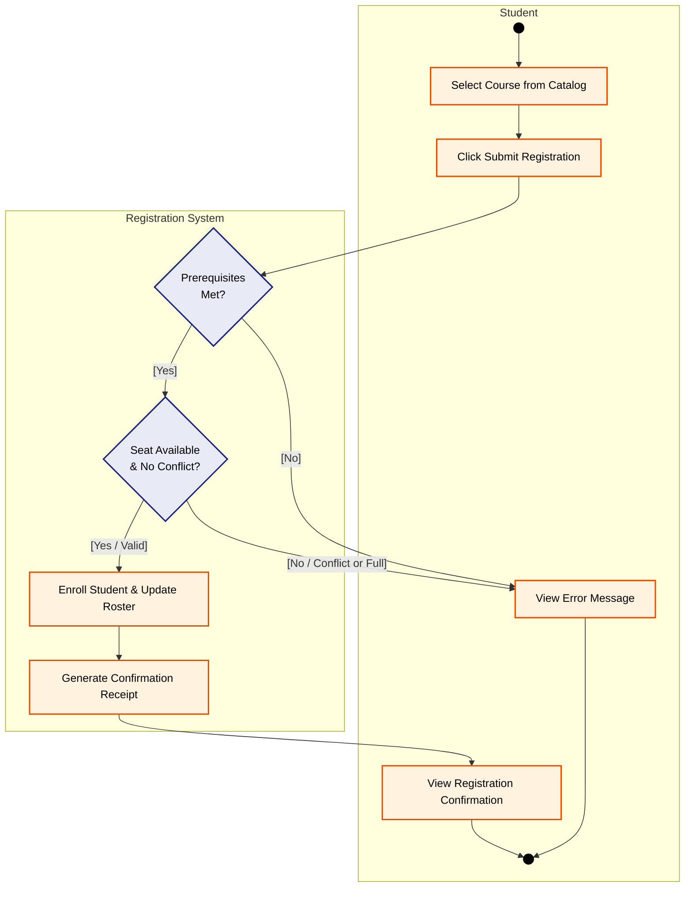
```mermaid
graph TD
    classDef startEnd fill:#000000,stroke:#000000,color:#ffffff;
    classDef action fill:#fff3e0,stroke:#e65100,stroke-width:2px,color:#000000;
    classDef decision fill:#e8eaf6,stroke:#1a237e,stroke-width:2px,color:#000000;

    subgraph StudentLane["Student"]
        NodeStart(( )):::startEnd
        A1["Select Course from Catalog"]:::action
        A2["Click Submit Registration"]:::action
        A3["View Registration Confirmation"]:::action
        A4["View Error Message"]:::action
        NodeEnd(( )):::startEnd
    end

    subgraph SystemLane["Registration System"]
        D1{"Prerequisites<br/>Met?"}:::decision
        D2{"Seat Available<br/>& No Conflict?"}:::decision
        A5["Enroll Student & Update Roster"]:::action
        A6["Generate Confirmation Receipt"]:::action
    end

    NodeStart --> A1
    A1 --> A2
    A2 --> D1
    D1 -- "[No]" --> A4
    D1 -- "[Yes]" --> D2
    D2 -- "[No / Conflict or Full]" --> A4
    D2 -- "[Yes / Valid]" --> A5
    A5 --> A6
    A6 --> A3
    A3 --> NodeEnd
    A4 --> NodeEnd
```

---

#### Answer 2.3: ATM Banking System — Use Case & Withdrawal Sequence Diagrams (10 Marks)

*This question asks for two diagrams (use case AND withdrawal sequence). Both are worked below.*

##### Part 1: Use Case Diagram

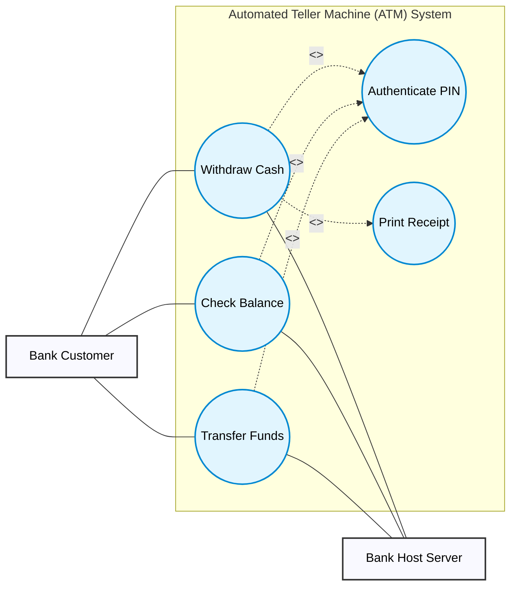
```mermaid
graph LR
    classDef actor fill:#f9f9ff,stroke:#333333,stroke-width:2px,color:#000000;
    classDef usecase fill:#e1f5fe,stroke:#0288d1,stroke-width:2px,color:#000000;

    subgraph ATM["Automated Teller Machine (ATM) System"]
        UC1(("Withdraw Cash")):::usecase
        UC2(("Check Balance")):::usecase
        UC3(("Transfer Funds")):::usecase
        UC4(("Authenticate PIN")):::usecase
        UC5(("Print Receipt")):::usecase
    end

    C["Bank Customer"]:::actor
    H["Bank Host Server"]:::actor

    C --- UC1
    C --- UC2
    C --- UC3

    UC1 --- H
    UC2 --- H
    UC3 --- H

    UC1 -.->|"<<include>>"| UC4
    UC2 -.->|"<<include>>"| UC4
    UC3 -.->|"<<include>>"| UC4
    UC1 -.->|"<<include>>"| UC5
```

*(Receipt printing is modeled as a mandatory `<<include>>` of `Withdraw Cash` rather than an `<<extend>>`, consistent with this bank's ATM scenario elsewhere in the study notes, where cash dispensing and receipt printing are both unconditional steps on a successful withdrawal.)*

##### Part 2: Withdrawal Sequence Diagram

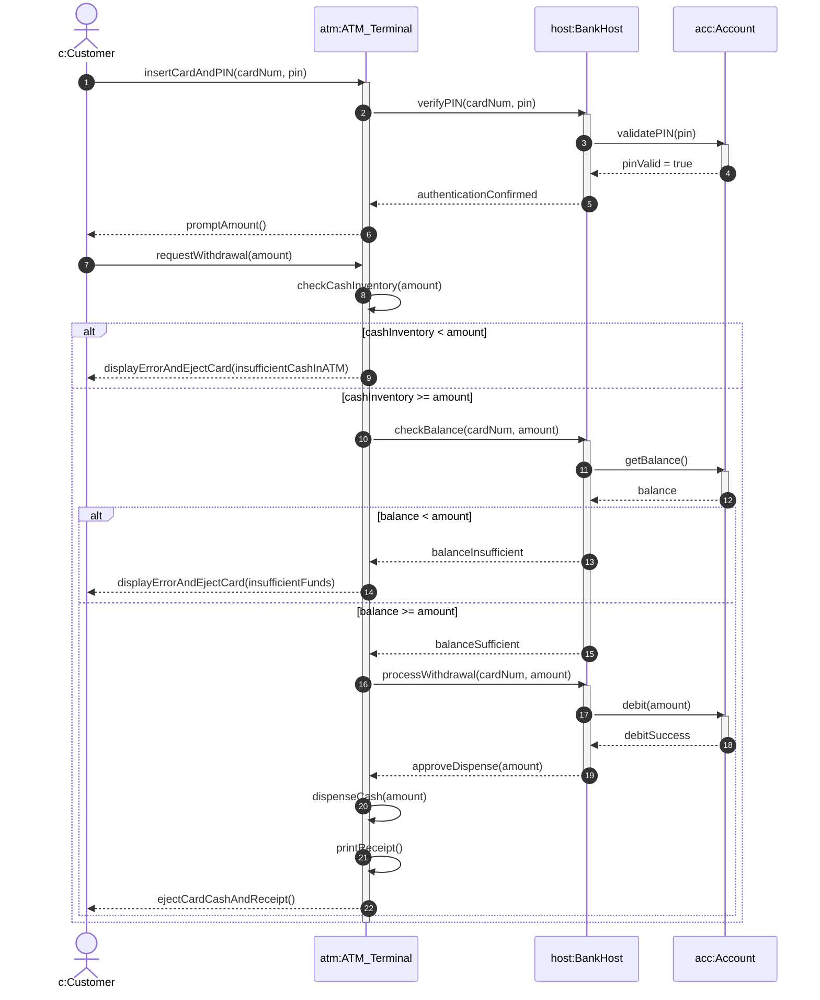
```mermaid
sequenceDiagram
    autonumber
    actor C as c:Customer
    participant ATM as atm:ATM_Terminal
    participant Host as host:BankHost
    participant Acc as acc:Account

    C->>ATM: insertCardAndPIN(cardNum, pin)
    activate ATM
    ATM->>Host: verifyPIN(cardNum, pin)
    activate Host
    Host->>Acc: validatePIN(pin)
    activate Acc
    Acc-->>Host: pinValid = true
    deactivate Acc
    Host-->>ATM: authenticationConfirmed
    deactivate Host

    ATM-->>C: promptAmount()
    C->>ATM: requestWithdrawal(amount)

    ATM->>ATM: checkCashInventory(amount)

    alt cashInventory < amount
        ATM-->>C: displayErrorAndEjectCard(insufficientCashInATM)
    else cashInventory >= amount
        ATM->>Host: checkBalance(cardNum, amount)
        activate Host
        Host->>Acc: getBalance()
        activate Acc
        Acc-->>Host: balance
        deactivate Acc

        alt balance < amount
            Host-->>ATM: balanceInsufficient
            ATM-->>C: displayErrorAndEjectCard(insufficientFunds)
        else balance >= amount
            Host-->>ATM: balanceSufficient
            deactivate Host

            ATM->>Host: processWithdrawal(cardNum, amount)
            activate Host
            Host->>Acc: debit(amount)
            activate Acc
            Acc-->>Host: debitSuccess
            deactivate Acc
            Host-->>ATM: approveDispense(amount)
            deactivate Host

            ATM->>ATM: dispenseCash(amount)
            ATM->>ATM: printReceipt()
            ATM-->>C: ejectCardCashAndReceipt()
        end
    end
    deactivate ATM
```

> ⚠️ **Exam Drawing Guide:** Validation happens strictly before any debit — cash inventory is checked first (a device-local check), then account balance, and only then is `debit(amount)` called. This ordering avoids debiting an account when the ATM cannot physically dispense the cash.

---

#### Answer 2.4: Assignment Management System Problem Statement & Models (10 Marks)

##### Formulated Problem Statement
> *"An academic institute requires an automated Assignment Management System (AMS) to manage course assignments digitally. Instructors can post new assignments, set submission deadlines, and grade submitted work. Students can view active assignments, upload submission files before the deadline, and view awarded grades. If a student submits work past the deadline, the system automatically flags the submission as Late. All file uploads require student authentication."*

##### Worked Use Case Diagram
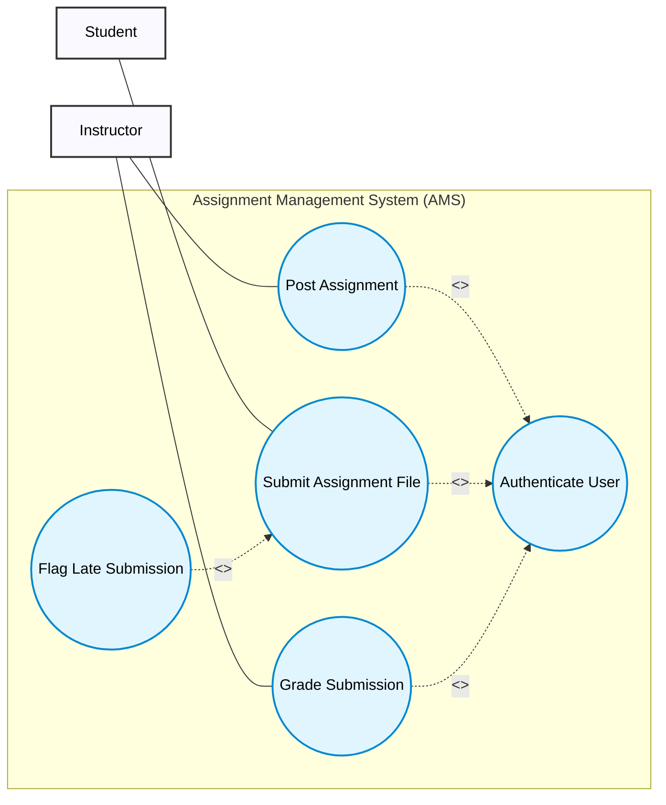
```mermaid
graph LR
    classDef actor fill:#f9f9ff,stroke:#333333,stroke-width:2px,color:#000000;
    classDef usecase fill:#e1f5fe,stroke:#0288d1,stroke-width:2px,color:#000000;

    subgraph AMS["Assignment Management System (AMS)"]
        UC1(("Post Assignment")):::usecase
        UC2(("Submit Assignment File")):::usecase
        UC3(("Grade Submission")):::usecase
        UC4(("Authenticate User")):::usecase
        UC5(("Flag Late Submission")):::usecase
    end

    I["Instructor"]:::actor
    S["Student"]:::actor

    I --- UC1
    I --- UC3
    S --- UC2

    UC1 -.->|"<<include>>"| UC4
    UC2 -.->|"<<include>>"| UC4
    UC3 -.->|"<<include>>"| UC4
    UC5 -.->|"<<extend>>"| UC2
```

##### Worked Activity Diagrams — One Per Use Case

*The question asks for an activity diagram for **each use case**. The three primary diagrams are followed by two supporting diagrams for `Authenticate User` and `Flag Late Submission`, so all five use cases shown above have worked activity flows. These Mermaid flowcharts approximate UML activity notation.*

###### Activity Diagram 1: Post Assignment (Instructor)

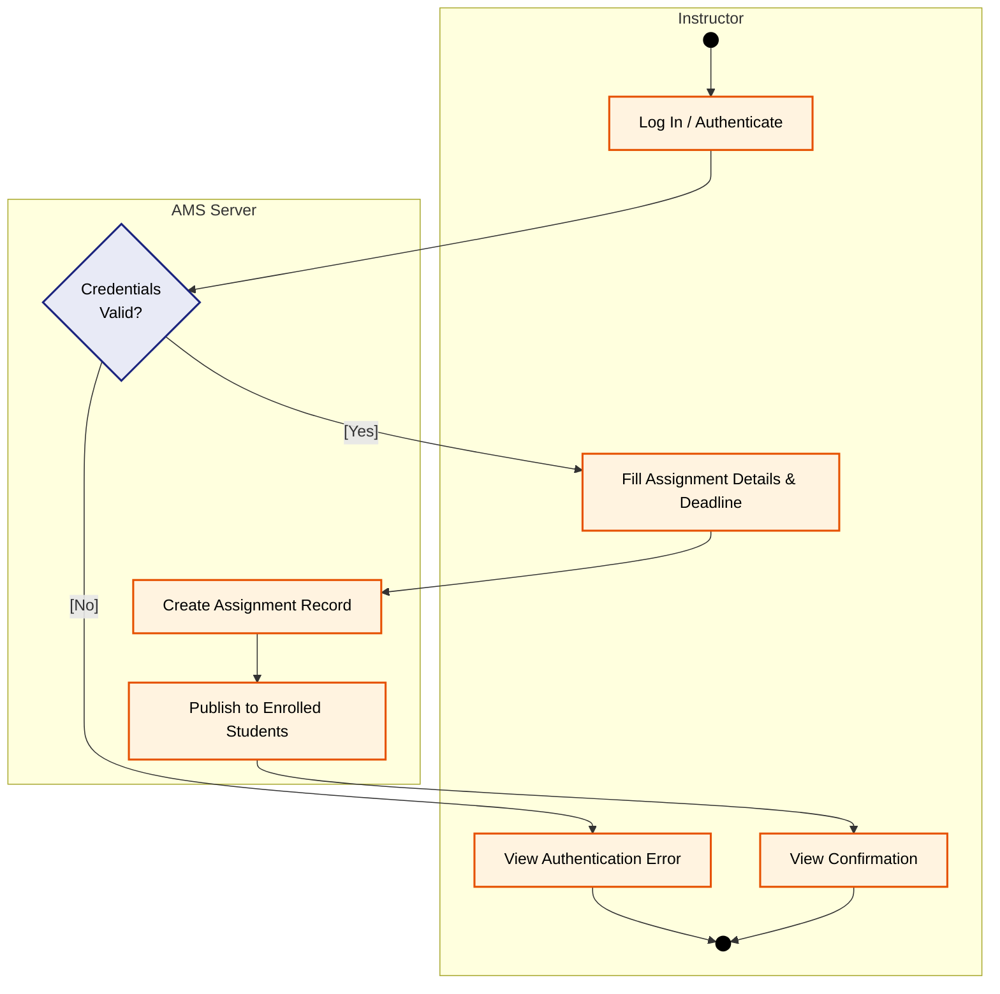
```mermaid
graph TD
    classDef startEnd fill:#000000,stroke:#000000,color:#ffffff;
    classDef action fill:#fff3e0,stroke:#e65100,stroke-width:2px,color:#000000;
    classDef decision fill:#e8eaf6,stroke:#1a237e,stroke-width:2px,color:#000000;

    subgraph InstructorLane["Instructor"]
        S1(( )):::startEnd
        A1["Log In / Authenticate"]:::action
        A2["Fill Assignment Details & Deadline"]:::action
        A3["View Confirmation"]:::action
        A4["View Authentication Error"]:::action
        E1(( )):::startEnd
    end

    subgraph SystemLane["AMS Server"]
        D1{"Credentials<br/>Valid?"}:::decision
        A5["Create Assignment Record"]:::action
        A6["Publish to Enrolled Students"]:::action
    end

    S1 --> A1
    A1 --> D1
    D1 -- "[No]" --> A4
    D1 -- "[Yes]" --> A2
    A2 --> A5
    A5 --> A6
    A6 --> A3
    A3 --> E1
    A4 --> E1
```

###### Activity Diagram 2: Submit Assignment File (Student)

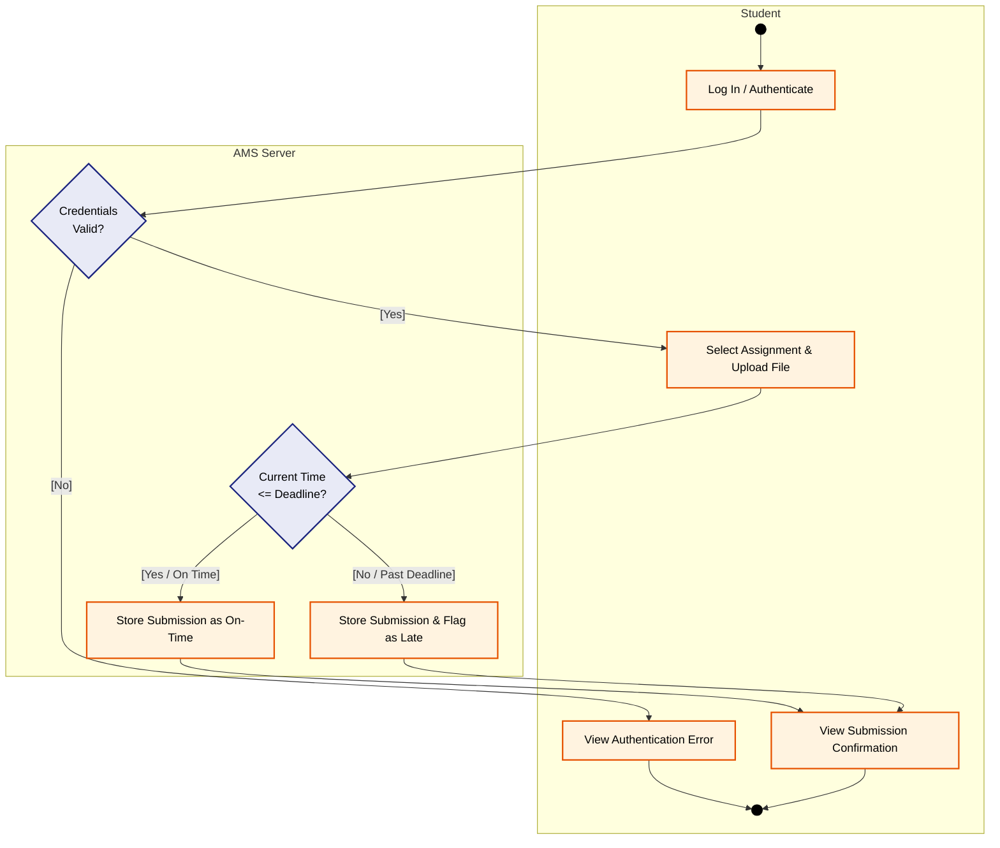
```mermaid
graph TD
    classDef startEnd fill:#000000,stroke:#000000,color:#ffffff;
    classDef action fill:#fff3e0,stroke:#e65100,stroke-width:2px,color:#000000;
    classDef decision fill:#e8eaf6,stroke:#1a237e,stroke-width:2px,color:#000000;

    subgraph StudentLane["Student"]
        S2(( )):::startEnd
        B1["Log In / Authenticate"]:::action
        B2["Select Assignment & Upload File"]:::action
        B3["View Submission Confirmation"]:::action
        B4["View Authentication Error"]:::action
        E2(( )):::startEnd
    end

    subgraph SystemLane2["AMS Server"]
        D2{"Credentials<br/>Valid?"}:::decision
        D3{"Current Time<br/>&lt;= Deadline?"}:::decision
        B5["Store Submission as On-Time"]:::action
        B6["Store Submission & Flag as Late"]:::action
    end

    S2 --> B1
    B1 --> D2
    D2 -- "[No]" --> B4
    D2 -- "[Yes]" --> B2
    B2 --> D3
    D3 -- "[Yes / On Time]" --> B5
    D3 -- "[No / Past Deadline]" --> B6
    B5 --> B3
    B6 --> B3
    B3 --> E2
    B4 --> E2
```

###### Activity Diagram 3: Grade Submission (Instructor)

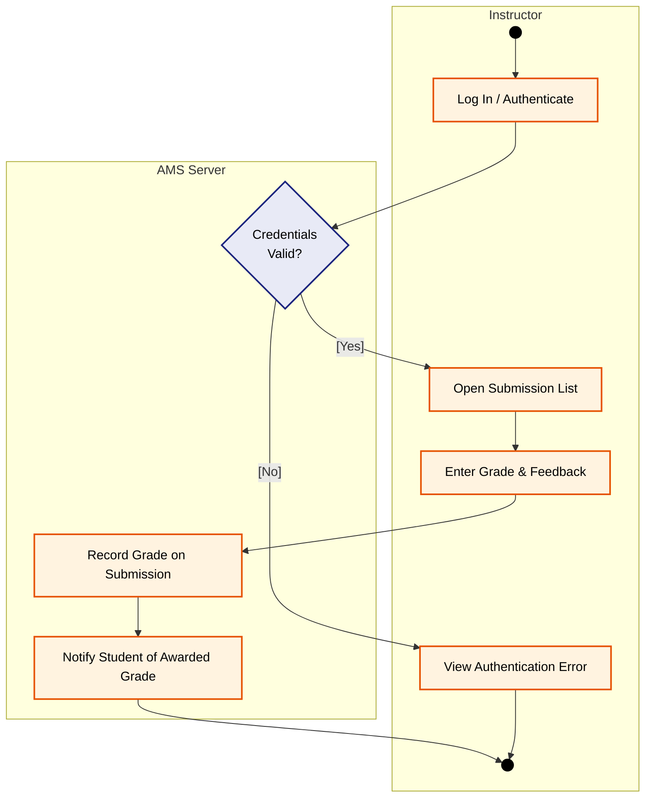
```mermaid
graph TD
    classDef startEnd fill:#000000,stroke:#000000,color:#ffffff;
    classDef action fill:#fff3e0,stroke:#e65100,stroke-width:2px,color:#000000;
    classDef decision fill:#e8eaf6,stroke:#1a237e,stroke-width:2px,color:#000000;

    subgraph InstructorLane2["Instructor"]
        S3(( )):::startEnd
        C1["Log In / Authenticate"]:::action
        C2["Open Submission List"]:::action
        C3["Enter Grade & Feedback"]:::action
        C4["View Authentication Error"]:::action
        E3(( )):::startEnd
    end

    subgraph SystemLane3["AMS Server"]
        D4{"Credentials<br/>Valid?"}:::decision
        C5["Record Grade on Submission"]:::action
        C6["Notify Student of Awarded Grade"]:::action
    end

    S3 --> C1
    C1 --> D4
    D4 -- "[No]" --> C4
    D4 -- "[Yes]" --> C2
    C2 --> C3
    C3 --> C5
    C5 --> C6
    C6 --> E3
    C4 --> E3
```

---


###### Activity Diagram 4: Authenticate User (Supporting Included Use Case)

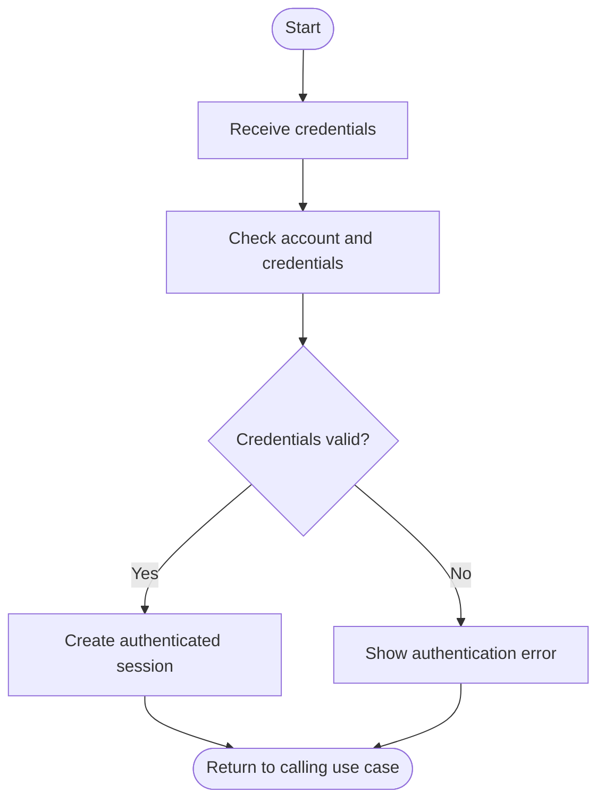
```mermaid
flowchart TD
    A([Start]) --> B[Receive credentials]
    B --> C[Check account and credentials]
    C --> D{Credentials valid?}
    D -->|Yes| E[Create authenticated session]
    D -->|No| F[Show authentication error]
    E --> G([Return to calling use case])
    F --> G
```

The success path returns control to the initiating use case; failure prevents its protected action. Draw UML start and end nodes and guarded decision edges in an exam.

###### Activity Diagram 5: Flag Late Submission (Supporting Conditional Use Case)

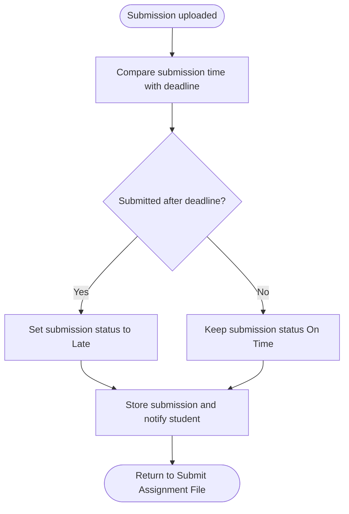
```mermaid
flowchart TD
    A([Submission uploaded]) --> B[Compare submission time with deadline]
    B --> C{Submitted after deadline?}
    C -->|Yes| D[Set submission status to Late]
    C -->|No| E[Keep submission status On Time]
    D --> F[Store submission and notify student]
    E --> F
    F --> G([Return to Submit Assignment File])
```

Only the late branch performs the conditional extension. The on-time branch is shown to make the decision and merge clear; this is not a separate actor-initiated goal.

## 4. Group 3: Class Relationships & Object Identification

### Sourced Exam Questions in Group 3

#### Question 3.1a
> **"What are the different types of relationships used in class diagrams? Explain with suitable examples."**  
> — **Source:** SVKM's NMIMS Final Examination (AY 2025–26 / Dec 2025) | **Course Code:** 702IT0C016 | **Question:** Q1(c) | **Marks:** 5 Marks | **Bloom's Level:** BL-2 (Understand) | **Verification:** Reported; original paper not independently checked

#### Question 3.1b
> **"Represent the following relations among classes using UML diagram: (a) Students credit 5 courses each semester. Each course is taught by one or more teachers. (b) Bill contains number of items. Each item describes some commodity, the price of unit, and total on this price."**  
> — **Source:** Saksham Software Engineering Exam Guide (guide exercise, not verified exam PYQ) | **Question:** Q.9 (p. 46) | **Marks:** 5 Marks | **Bloom's Level:** BL-3 (Apply) | **Verification:** Reported; original paper not independently checked

#### Question 3.2
> **"Design UML class diagram for the given software system: The pothole reporting system is a software to track and record potholes that the vehicle travels over. When the system spots a problem with the road using sensors, it provides the exact location of the problem to the user's smartphone. The smartphone then records the location data to a remote database so that those responsible for reviewing them can improve the roads. Additionally, the software displays a map of any previously noted potholes so that roads with potholes can be avoided. Assumptions made, if any, to be clearly stated."**  
> — **Source:** SVKM's NMIMS Final Examination (AY 2022–23 / Nov 2022) | **Course Code:** 702IT0C016 | **Question:** Q2(a) | **Marks:** 10 Marks | **Bloom's Level:** BL-6 (Create / Design) | **Verification:** Reported; original paper not independently checked

#### Question 3.3a
> **"Design a Class Diagram to Automate Library Management System."**  
> — **Source:** SVKM's NMIMS Re-Examination (AY 2023–24 / Feb 2024) | **Course Code:** 702IT0C016 | **Question:** Q6(b) | **Marks:** 10 Marks | **Bloom's Level:** BL-6 (Create / Design) | **Verification:** Reported; original paper not independently checked

#### Question 3.3b
> **"Draw the use case diagram and class diagram for library management system."**  
> — **Source:** GTU B.Tech Examination (Summer 2016) | **Subject:** Software Engineering | **Marks:** 7 Marks | **Bloom's Level:** BL-6 (Create / Design) | **Verification:** Reported; original paper not independently checked

#### Question 3.4
> **"Consider Online Quiz management system for college placement. It is a software application for conducting online examination as a first round in the placement process. Candidate details are fed into the system. Exam consists of various levels and for a particular subject or skill. Time bound questionnaires are displayed on user screen. Answer evaluation is done automatically and result is displayed to the candidate on basis of score computation. Design UML class diagram for the above software system. Assumptions made, if any, to be clearly stated."**  
> — **Source:** SVKM's NMIMS Re-Examination (AY 2022–23 / Jan 2023) | **Course Code:** 702IT0C016 | **Question:** Q2(a) | **Marks:** 10 Marks | **Bloom's Level:** BL-6 (Create / Design) | **Verification:** Reported; original paper not independently checked

---

### Solutions for Group 3 Questions

#### Answer 3.1: Types of Class Relationships in UML (5 Marks)

A Class Diagram features **five fundamental relationship types**:

```text
Generalization (Inheritance):   [SubClass] ------------------|> [SuperClass]  (Hollow Triangle)
Association:                    [ClassA] ---------------------- [ClassB]     (Solid Line + Multiplicity)
Aggregation (Weak Whole-Part):   [Whole] <>-------------------- [Part]       (Hollow Diamond at Whole)
Composition (Strong Whole-Part): [Whole] <==============>------- [Part]       (Filled Diamond at Whole)
Dependency:                     [Client] - - - - - - - - - - -> [Supplier]   (Dashed Arrow)
```

1.  **Association:** A structural link connecting two independent classes. Annotated with role names and multiplicities (`1`, `*`, `0..1`).
    *   *Example:* `Student` `1..*` $\longleftrightarrow$ `5` `Course`.
2.  **Aggregation ($\diamond$ - Weak Whole-Part):** A "has-a" container relationship where child parts can exist independently if the container is destroyed. Drawn with a **hollow diamond** attached to the container class.
    *   *Example:* `Department` `1` $\diamond\longleftrightarrow$ `*` `Professor`. (If Department closes, Professor object still exists).
3.  **Composition ($\\blackdiamond$ - Strong Whole-Part):** A strong "owns-a" relationship where child parts are physically owned by the container; destroying the container destroys all parts. Drawn with a **filled black diamond** attached to the container class.
    *   *Example:* `Bill` `1` $\blackdiamond\longleftrightarrow$ `1..*` `BillItem` or `Book` `1` $\blackdiamond\longleftrightarrow$ `1..*` `BookItem`.
4.  **Generalization / Inheritance ($\\longrightarrow\triangleright$):** An "is-a" relationship where a subclass inherits attributes and methods from a superclass. Drawn with a solid line and a **hollow triangular arrowhead** pointing to the superclass.
    *   *Example:* `StudentMember` $\longrightarrow\triangleright$ `LibraryMember`.
5.  **Dependency ($--\rightarrow$):** A weak "uses-a" relationship where one class uses another as a temporary method parameter or local variable. Drawn as a **dashed arrow**.

##### Solution for Q3.1b Specific Mappings
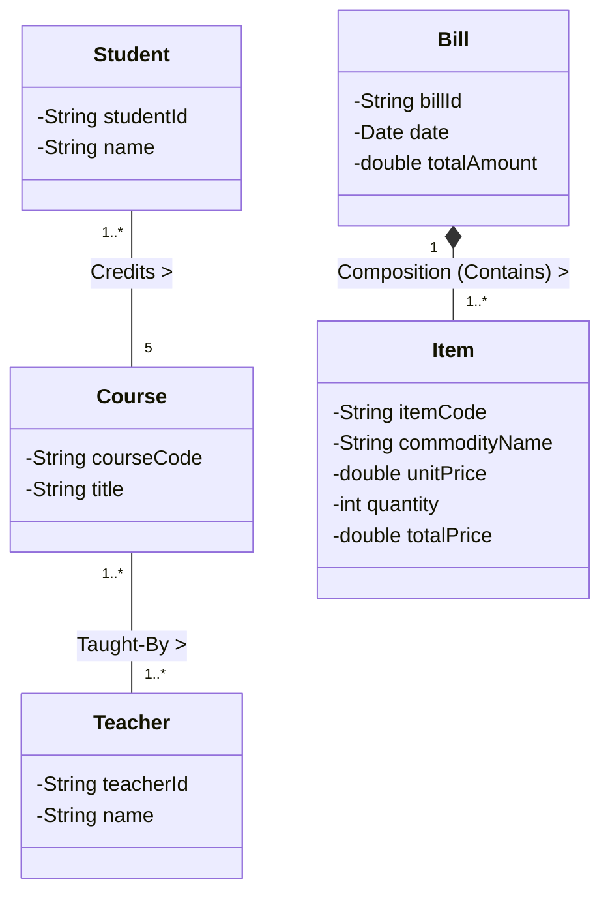
```mermaid
classDiagram
    class Student {
        -String studentId
        -String name
    }
    class Course {
        -String courseCode
        -String title
    }
    class Teacher {
        -String teacherId
        -String name
    }
    class Bill {
        -String billId
        -Date date
        -double totalAmount
    }
    class Item {
        -String itemCode
        -String commodityName
        -double unitPrice
        -int quantity
        -double totalPrice
    }

    Student "1..*" -- "5" Course : Credits >
    Course "1..*" -- "1..*" Teacher : Taught-By >
    Bill "1" *-- "1..*" Item : Composition (Contains) >
```

---

#### Answer 3.2: Pothole Reporting System Class Diagram (10 Marks)

##### Scenario Assumptions
1.  **Vehicle Sensor:** Detects physical road impacts and captures GPS coordinates (`latitude`, `longitude`).
2.  **Smartphone Application:** Serves as the user boundary interface, capturing sensor signals, displaying pothole maps, and transmitting data via cellular network.
3.  **Remote Database:** Central repository storing all reported pothole records for maintenance reviews.
4.  **Road Maintenance Team:** External user group querying the database to review and patch reported potholes.

##### Worked Class Diagram
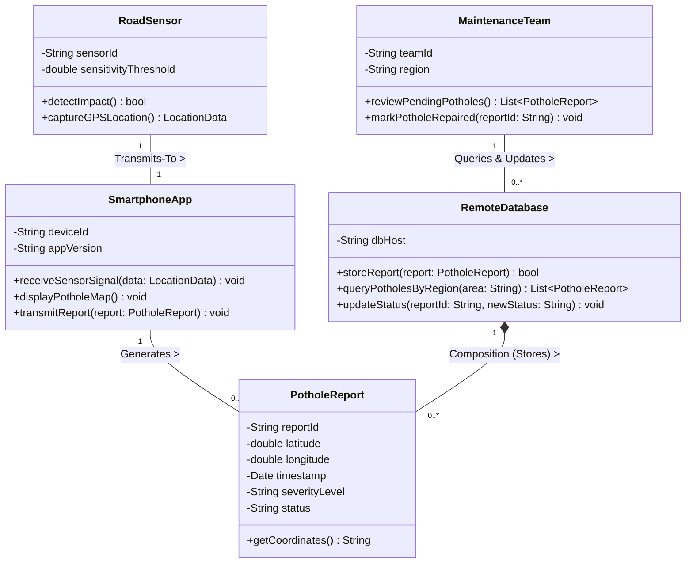
```mermaid
classDiagram
    class RoadSensor {
        -String sensorId
        -double sensitivityThreshold
        +detectImpact() bool
        +captureGPSLocation() LocationData
    }

    class SmartphoneApp {
        -String deviceId
        -String appVersion
        +receiveSensorSignal(data: LocationData) void
        +displayPotholeMap() void
        +transmitReport(report: PotholeReport) void
    }

    class PotholeReport {
        -String reportId
        -double latitude
        -double longitude
        -Date timestamp
        -String severityLevel
        -String status
        +getCoordinates() String
    }

    class RemoteDatabase {
        -String dbHost
        +storeReport(report: PotholeReport) bool
        +queryPotholesByRegion(area: String) List~PotholeReport~
        +updateStatus(reportId: String, newStatus: String) void
    }

    class MaintenanceTeam {
        -String teamId
        -String region
        +reviewPendingPotholes() List~PotholeReport~
        +markPotholeRepaired(reportId: String) void
    }

    RoadSensor "1" -- "1" SmartphoneApp : Transmits-To >
    SmartphoneApp "1" -- "0..*" PotholeReport : Generates >
    RemoteDatabase "1" *-- "0..*" PotholeReport : Composition (Stores) >
    MaintenanceTeam "1" -- "0..*" RemoteDatabase : Queries & Updates >
```

---

#### Answer 3.3: Library Management System — Use Case & Class Diagrams (10M for Q3.3a / 7M for Q3.3b)

*Q3.3a asks for a class diagram only. Q3.3b additionally asks for a use case diagram. Both are provided below so either question is fully answered from this single worked example.*

##### Part 1: Use Case Diagram (for Q3.3b)

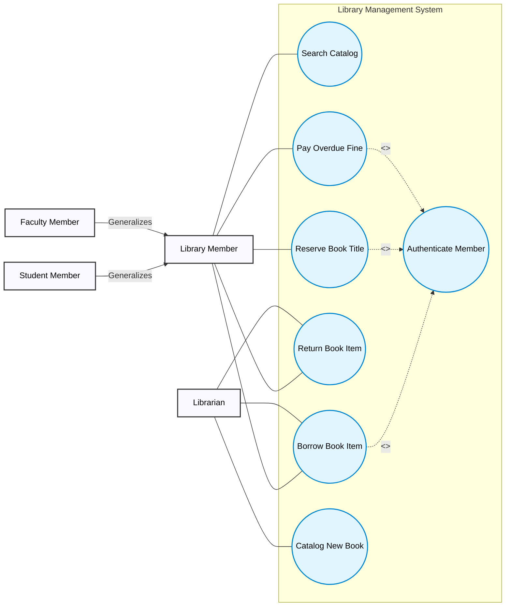
```mermaid
graph LR
    classDef actor fill:#f9f9ff,stroke:#333333,stroke-width:2px,color:#000000;
    classDef usecase fill:#e1f5fe,stroke:#0288d1,stroke-width:2px,color:#000000;

    subgraph LMS["Library Management System"]
        UC1(("Search Catalog")):::usecase
        UC2(("Borrow Book Item")):::usecase
        UC3(("Reserve Book Title")):::usecase
        UC4(("Return Book Item")):::usecase
        UC5(("Pay Overdue Fine")):::usecase
        UC6(("Authenticate Member")):::usecase
        UC7(("Catalog New Book")):::usecase
    end

    Mem["Library Member"]:::actor
    Stud["Student Member"]:::actor
    Fac["Faculty Member"]:::actor
    Lib["Librarian"]:::actor

    Stud -->|"Generalizes"| Mem
    Fac -->|"Generalizes"| Mem

    Mem --- UC1
    Mem --- UC2
    Mem --- UC3
    Mem --- UC4
    Mem --- UC5

    Lib --- UC7
    Lib --- UC2
    Lib --- UC4

    UC2 -.->|"<<include>>"| UC6
    UC3 -.->|"<<include>>"| UC6
    UC5 -.->|"<<include>>"| UC6
```

##### Part 2: Scenario Assumptions & Strict Domain Rules (for Q3.3a Class Diagram)
1.  **Title vs. Copy Separation:** `Book` represents the literary title (ISBN), while `BookItem` represents a physical copy (barcode).
2.  **Composition Diamond:** `Book` has a **strong composition diamond (◆)** pointing to `BookItem`.
3.  **Role-Specific Active Borrowing Limits, Modeled as Constraints, Not Multiplicity:** `StudentMember` has `maxLoanLimit = 3` active loans; `FacultyMember` has `maxLoanLimit = 10` active loans. Because `LoanRecord` is a historical record (it persists after a book is returned), the `Holds` association multiplicity is `0..*` for both subclasses — the role-specific caps are written as UML constraint notes on the *count of currently-ACTIVE* `LoanRecord` objects, not as the association's upper bound.
4.  **Reservation Limit:** `maxReservationLimit = 3` for all member subclasses.

##### Worked Class Diagram
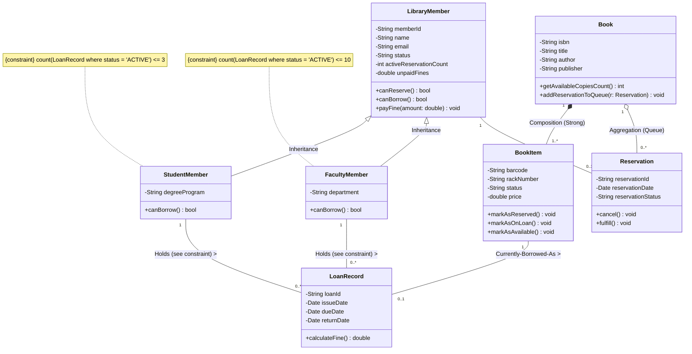
```mermaid
classDiagram
    class LibraryMember {
        -String memberId
        -String name
        -String email
        -String status
        -int activeReservationCount
        -double unpaidFines
        +canReserve() bool
        +canBorrow() bool
        +payFine(amount: double) void
    }

    class StudentMember {
        -String degreeProgram
        +canBorrow() bool
    }

    class FacultyMember {
        -String department
        +canBorrow() bool
    }

    class Book {
        -String isbn
        -String title
        -String author
        -String publisher
        +getAvailableCopiesCount() int
        +addReservationToQueue(r: Reservation) void
    }

    class BookItem {
        -String barcode
        -String rackNumber
        -String status
        -double price
        +markAsReserved() void
        +markAsOnLoan() void
        +markAsAvailable() void
    }

    class Reservation {
        -String reservationId
        -Date reservationDate
        -String reservationStatus
        +cancel() void
        +fulfill() void
    }

    class LoanRecord {
        -String loanId
        -Date issueDate
        -Date dueDate
        -Date returnDate
        +calculateFine() double
    }

    LibraryMember <|-- StudentMember : Inheritance
    LibraryMember <|-- FacultyMember : Inheritance

    Book "1" *-- "1..*" BookItem : Composition (Strong)
    Book "1" o-- "0..*" Reservation : Aggregation (Queue)

    LibraryMember "1" -- "0..3" Reservation : Places >
    StudentMember "1" -- "0..*" LoanRecord : Holds (see constraint) >
    FacultyMember "1" -- "0..*" LoanRecord : Holds (see constraint) >
    BookItem "1" -- "0..1" LoanRecord : Currently-Borrowed-As >

    note for StudentMember "{constraint} count(LoanRecord where status = 'ACTIVE') <= 3"
    note for FacultyMember "{constraint} count(LoanRecord where status = 'ACTIVE') <= 10"
```

---

#### Answer 3.4: Online Placement Quiz Management System Class Diagram (10 Marks)

##### Worked Class Diagram
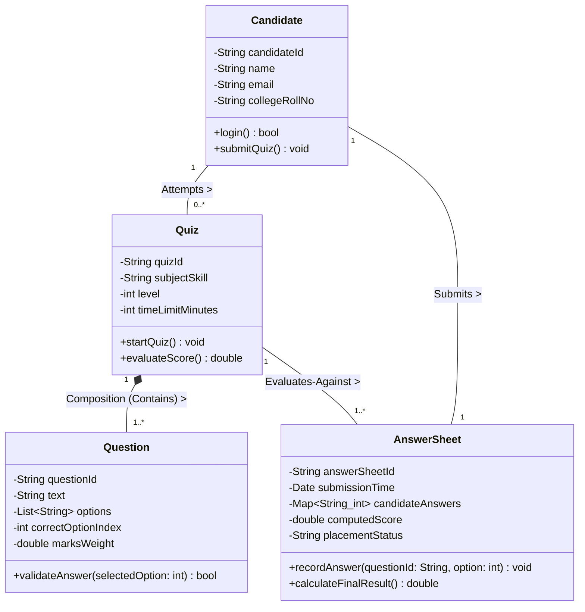
```mermaid
classDiagram
    class Candidate {
        -String candidateId
        -String name
        -String email
        -String collegeRollNo
        +login() bool
        +submitQuiz() void
    }

    class Quiz {
        -String quizId
        -String subjectSkill
        -int level
        -int timeLimitMinutes
        +startQuiz() void
        +evaluateScore() double
    }

    class Question {
        -String questionId
        -String text
        -List~String~ options
        -int correctOptionIndex
        -double marksWeight
        +validateAnswer(selectedOption: int) bool
    }

    class AnswerSheet {
        -String answerSheetId
        -Date submissionTime
        -Map~String_int~ candidateAnswers
        -double computedScore
        -String placementStatus
        +recordAnswer(questionId: String, option: int) void
        +calculateFinalResult() double
    }

    Candidate "1" -- "0..*" Quiz : Attempts >
    Quiz "1" *-- "1..*" Question : Composition (Contains) >
    Candidate "1" -- "1" AnswerSheet : Submits >
    Quiz "1" -- "1..*" AnswerSheet : Evaluates-Against >
```

---

## 5. Group 4: State Diagrams

### Sourced Exam Questions in Group 4

#### Question 4.1
> **"Define the term – 'Event' and how it is modelled in UML."**  
> — **Source:** SVKM's NMIMS Re-Examination (AY 2023–24 / Feb 2024) | **Course Code:** 702IT0C016 | **Question:** Q1(c) | **Marks:** 5 Marks | **Bloom's Level:** BL-2 (Understand) | **Verification:** Reported; original paper not independently checked

#### Question 4.2a
> **"Design a labeled state transition diagram for following problem statement: A university library wants to automate the process of book lending through a Library Management System. The system should manage the complete life cycle of a BookCopy object (an individual copy of a book), tracking how its state changes as it is issued, returned, or reserved by users. Initially, every BookCopy in the library flagged as Available, meaning it can be borrowed by any registered member. When a Member places a hold request for a BookCopy, its marked as Reserved. While in this state, the book cannot be borrowed by anyone else. If the member fails to collect the book within the allowed reservation period(15 days), the system automatically changes its state back to Available. When a reserved book is collected or directly borrowed (without reservation), its flagged as Issued. During this state, the system tracks the issue date and due date. If the member returns the book on or before the due date, the state moves back to Available. However, if the member fails to return the book by the due date, the system marks it as Overdue. Once an overdue book is returned, the system calculates a fine, records payment, and changes its flag back to Available."**  
> — **Source:** SVKM's NMIMS Final Examination (AY 2025–26 / Dec 2025) | **Course Code:** 702IT0C016 | **Question:** Q7(a) | **Marks:** 10 Marks | **Bloom's Level:** BL-6 (Create / Design) | **Verification:** Reported; original paper not independently checked

#### Question 4.2b
> **"State Diagram for Library Management System."**  
> — **Source:** SVKM's NMIMS Final Examination (AY 2016–17 / Dec 2016) | **Course Code:** 702IT0C016 | **Question:** Q1(c) | **Marks:** 5 Marks | **Bloom's Level:** BL-6 (Create / Design) | **Verification:** Reported; original paper not independently checked

#### Question 4.3
> **"Develop state machine diagram for Bank ATM system based on following scenario (assume and add few state if required): Initially, the ATM is turned off. After the power supply is turned on, the ATM starts performing the startup action and enters into the Self Test state. If the test fails, the ATM will enter into the Out Of Service state, or it will undergo a triggerless transition to the Idle state. This is the state where the customer waits for the interaction. Whenever the customer inserts the bank or credit card in the ATM's card reader, the ATM state changes from Idle to Serving Customer, the entry action readCard is performed after entering into Serving Customer state. Since the customer can cancel the transaction at any instant, so the transition from Serving Customer state back to the Idle state could be triggered by cancel event. Here the Serving Customer is a composite state with sequential substates that are Customer Authentication, Selecting Transaction, and Transaction."**  
> — **Source:** SVKM's NMIMS Final Examination (AY 2024–25 / Dec 2024) | **Course Code:** 702IT0C016 | **Question:** Q5(b) | **Marks:** 10 Marks | **Bloom's Level:** BL-6 (Create / Design) | **Verification:** Reported; original paper not independently checked

#### Question 4.4
> **"Develop State Diagram for Online Inventory Management System."**  
> — **Source:** SVKM's NMIMS Re-Examination (AY 2022–23 / Jan 2023) | **Course Code:** 702IT0C016 | **Question:** Q7(a) | **Marks:** 10 Marks | **Bloom's Level:** BL-6 (Create / Design) | **Verification:** Reported; original paper not independently checked

---

### Solutions for Group 4 Questions

#### Answer 4.1: Events in UML State Diagrams (5 Marks)

##### 1. Definition of an Event
An **Event** in UML is a specification of a noteworthy occurrence that has a location in time and space. In reactive systems, an event acts as an external or internal stimulus that triggers a **state transition** in a reactive object.

##### 2. Standard Transition Label Syntax
In a UML Statechart diagram, a transition arrow is labeled using the syntax:
$$\text{Event } [\text{Guard Condition}] \text{ / Action Expression}$$
*   **Event (Trigger):** The stimulus causing the transition (written in past or active tense, e.g., `cardInserted`, `returnBook`).
*   **Guard Condition (`[guard]`):** A Boolean predicate enclosed in square brackets. The transition fires **only if** the guard evaluates to `true`.
*   **Action (`/ action`):** An atomic, non-interruptible operation executed during the transition (e.g., `/ calculateFine()`).

##### 3. Four Types of UML Events
1.  **Call Event:** Triggered when an object receives an explicit operation call from another object (e.g., `checkout()`).
2.  **Signal Event:** Triggered by the arrival of an asynchronous signal or message (e.g., `sensorImpactDetected`).
3.  **Change Event:** Triggered when a Boolean condition becomes true (e.g., `when(temperature > 100C)`).
4.  **Time Event:** Triggered by the passage of a specified time interval (e.g., `after(15 days)`).

---

#### Answer 4.2: University Exam `BookCopy` Lifecycle State Diagram (10 Marks)

##### Analysis of Problem Statement States
*   `Available`: Default state when added or returned on time.
*   `Reserved`: Holds copy for reserving member (15-day hold limit).
*   `Issued`: Currently borrowed by a member.
*   `Overdue`: Borrowed item past due date; triggers fine calculation on return.

##### Worked State Diagram
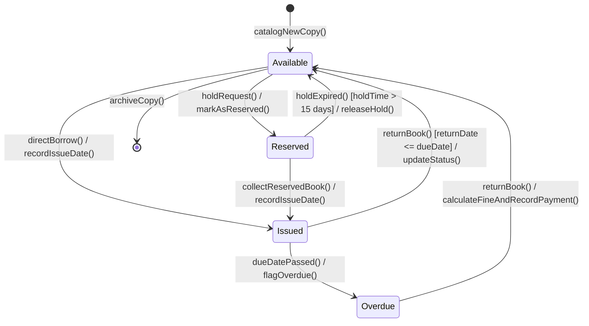
```mermaid
stateDiagram-v2
    [*] --> Available : catalogNewCopy()

    Available --> Reserved : holdRequest() / markAsReserved()
    Available --> Issued : directBorrow() / recordIssueDate()

    Reserved --> Available : holdExpired() [holdTime > 15 days] / releaseHold()
    Reserved --> Issued : collectReservedBook() / recordIssueDate()

    Issued --> Available : returnBook() [returnDate <= dueDate] / updateStatus()
    Issued --> Overdue : dueDatePassed() / flagOverdue()

    Overdue --> Available : returnBook() / calculateFineAndRecordPayment()

    Available --> [*] : archiveCopy()
```

---

#### Answer 4.3: Bank ATM System Composite State Machine Diagram (10 Marks)

##### Worked State Diagram
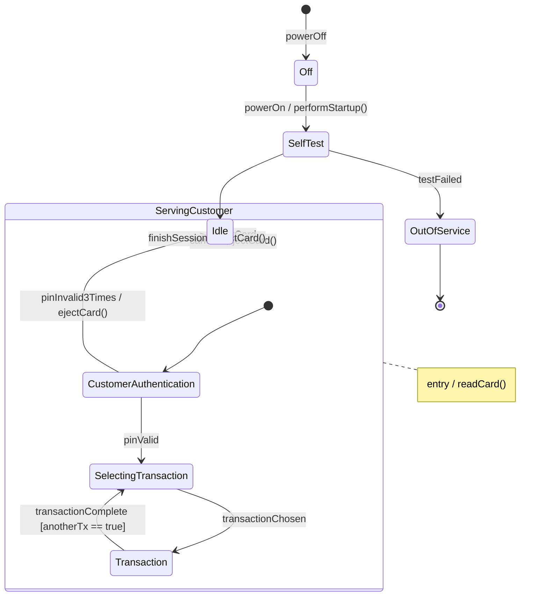
```mermaid
stateDiagram-v2
    [*] --> Off : powerOff

    Off --> SelfTest : powerOn / performStartup()

    SelfTest --> OutOfService : testFailed
    SelfTest --> Idle

    state ServingCustomer {
        [*] --> CustomerAuthentication
        CustomerAuthentication --> SelectingTransaction : pinValid
        CustomerAuthentication --> Idle : pinInvalid3Times / ejectCard()
        SelectingTransaction --> Transaction : transactionChosen
        Transaction --> SelectingTransaction : transactionComplete [anotherTx == true]
    }

    Idle --> ServingCustomer : insertCard
    note right of ServingCustomer
        entry / readCard()
    end note
    ServingCustomer --> Idle : cancel / ejectCard()
    ServingCustomer --> Idle : finishSession / ejectCard()

    OutOfService --> [*]
```

> ⚠️ **Two corrections from an earlier draft of this answer:**
> 1. **The successful self-test transition is triggerless.** `SelfTest --> Idle` has no event label and represents a completion transition after successful self-test; the failure branch retains `testFailed`. If a success condition must be explicit, use a guard `[testSucceeded]` on a completion transition rather than an event trigger. This follows the question wording.
> 2. **`readCard` is the entry action of `ServingCustomer` itself, not of its inner substate.** The question states *"the entry action readCard is performed after entering into Serving Customer state"* — i.e. `entry / readCard()` belongs on the composite state `ServingCustomer` as a whole (shown above via the UML `entry/` internal-activity note), firing once whenever `ServingCustomer` is entered from any external transition, before its initial substate (`CustomerAuthentication`) begins. It is not a trigger on the internal `[*] --> CustomerAuthentication` transition, and the incoming `Idle --> ServingCustomer` transition itself should show only its own trigger (`insertCard`), not `/ readCard()`, since that action is already covered by the composite state's entry action.
> On an exam sheet, draw `ServingCustomer` as a rounded rectangle divided by a horizontal line, with `entry / readCard()` written in the lower compartment and the sequential substates (`Customer Authentication → Selecting Transaction → Transaction`) nested inside.

---

#### Answer 4.4: Online Inventory Management System State Diagram (10 Marks)

##### Scenario Assumptions
1.  **Focus Class:** `InventoryItem` — a single stock-keeping unit (SKU) tracked in the online inventory.
2.  **States:** `InStock`, `LowStock` (below reorder threshold), `OutOfStock`, `OnOrder` (replenishment requested from supplier), `Discontinued`.
3.  **Triggers:** Sales deduct quantity; a scheduled reorder check compares quantity against a threshold; supplier deliveries replenish stock; an admin can discontinue a SKU from any state except `OnOrder`.

##### Worked State Diagram
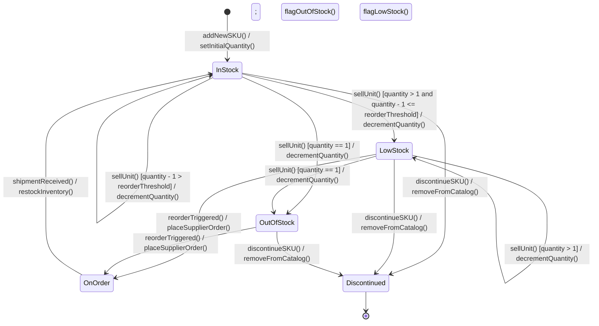
```mermaid
stateDiagram-v2
    [*] --> InStock : addNewSKU() / setInitialQuantity()

    InStock --> OutOfStock : sellUnit() [quantity == 1] / decrementQuantity(); flagOutOfStock()
    InStock --> LowStock : sellUnit() [quantity > 1 and quantity - 1 <= reorderThreshold] / decrementQuantity(); flagLowStock()
    InStock --> InStock : sellUnit() [quantity - 1 > reorderThreshold] / decrementQuantity()

    LowStock --> OutOfStock : sellUnit() [quantity == 1] / decrementQuantity(); flagOutOfStock()
    LowStock --> LowStock : sellUnit() [quantity > 1] / decrementQuantity()
    LowStock --> OnOrder : reorderTriggered() / placeSupplierOrder()

    OutOfStock --> OnOrder : reorderTriggered() / placeSupplierOrder()

    OnOrder --> InStock : shipmentReceived() / restockInventory()

    InStock --> Discontinued : discontinueSKU() / removeFromCatalog()
    LowStock --> Discontinued : discontinueSKU() / removeFromCatalog()
    OutOfStock --> Discontinued : discontinueSKU() / removeFromCatalog()

    Discontinued --> [*]
```

> ⚠️ **Quantity convention:** Guards use the **pre-sale** count. Sales require at least one unit; the transition action decrements once. `quantity - 1` tests the post-sale level, and the last unit sold from either `InStock` or `LowStock` enters `OutOfStock`. A sale from zero stock is rejected.
>
> ⚠️ **Exam Drawing Guide:** Note that `OnOrder` cannot transition directly to `Discontinued` in this model — a pending supplier order is assumed to complete (or be separately cancelled, which is an acceptable extension state to add) before a SKU can be removed from the catalog. State the assumptions listed above explicitly on the exam sheet, since the question permits assuming additional states.

---

## 6. Group 5: Activity Diagrams

### Sourced Exam Questions in Group 5

#### Question 5.1
> **"Design Activity diagram for Library Management System."**  
> — **Source:** SVKM's NMIMS Final Examination (AY 2024–25 / Dec 2024) | **Course Code:** 702IT0C016 | **Question:** Q2(a) | **Marks:** 10 Marks | **Bloom's Level:** BL-6 (Create / Design) | **Verification:** Reported; original paper not independently checked

#### Question 5.2
> **"Develop Activity diagram for Order Management system. Assume any 5 activities related to given task."**  
> — **Source:** SVKM's NMIMS Final Examination (AY 2023–24 / Nov 2023) | **Course Code:** 702IT0C016 | **Question:** Q4(a) | **Marks:** 10 Marks | **Bloom's Level:** BL-6 (Create / Design) | **Verification:** Reported; original paper not independently checked

#### Question 5.3
> **"Design UML Activity diagram for Online Movie Ticket Booking system."**  
> — **Source:** SVKM's NMIMS Re-Examination (AY 2022–23 / Jan 2023) | **Course Code:** 702IT0C016 | **Question:** Q5(b) | **Marks:** 10 Marks | **Bloom's Level:** BL-6 (Create / Design) | **Verification:** Reported; original paper not independently checked

---

### Solutions for Group 5 Questions

#### Answer 5.1: Library Management System Activity Diagram with Swimlanes (10 Marks)

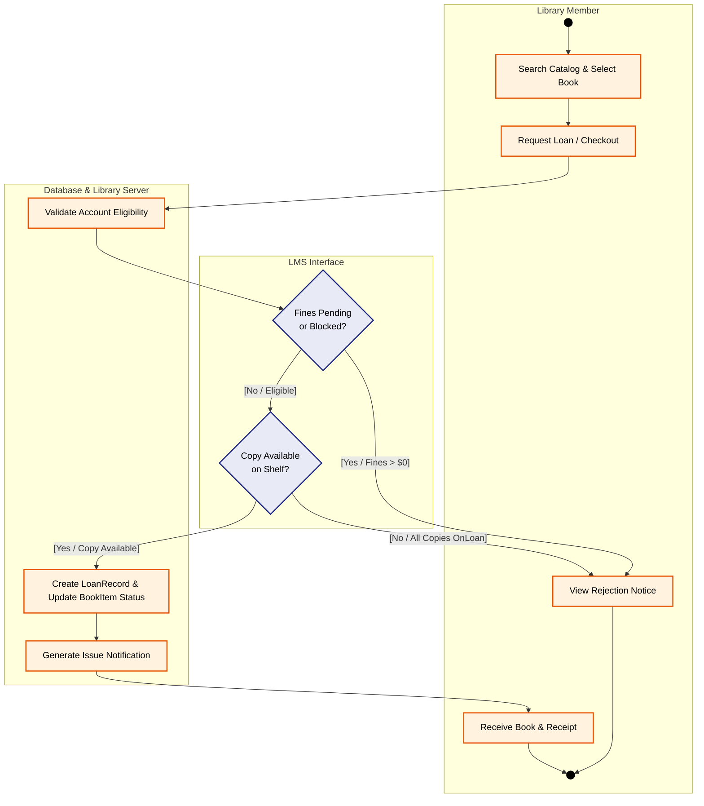
```mermaid
graph TD
    classDef startEnd fill:#000000,stroke:#000000,color:#ffffff;
    classDef action fill:#fff3e0,stroke:#e65100,stroke-width:2px,color:#000000;
    classDef decision fill:#e8eaf6,stroke:#1a237e,stroke-width:2px,color:#000000;

    subgraph MemberLane["Library Member"]
        Start(( )):::startEnd
        Act1["Search Catalog & Select Book"]:::action
        Act2["Request Loan / Checkout"]:::action
        Act3["Receive Book & Receipt"]:::action
        Act4["View Rejection Notice"]:::action
        EndNode(( )):::startEnd
    end

    subgraph InterfaceLane["LMS Interface"]
        D1{"Fines Pending<br/>or Blocked?"}:::decision
        D2{"Copy Available<br/>on Shelf?"}:::decision
    end

    subgraph SystemLane["Database & Library Server"]
        Act5["Validate Account Eligibility"]:::action
        Act6["Create LoanRecord & Update BookItem Status"]:::action
        Act7["Generate Issue Notification"]:::action
    end

    Start --> Act1
    Act1 --> Act2
    Act2 --> Act5
    Act5 --> D1
    D1 -- "[Yes / Fines > $0]" --> Act4
    D1 -- "[No / Eligible]" --> D2
    D2 -- "[No / All Copies OnLoan]" --> Act4
    D2 -- "[Yes / Copy Available]" --> Act6
    Act6 --> Act7
    Act7 --> Act3
    Act3 --> EndNode
    Act4 --> EndNode
```

---

#### Answer 5.2: Order Management System Activity Diagram (10 Marks)

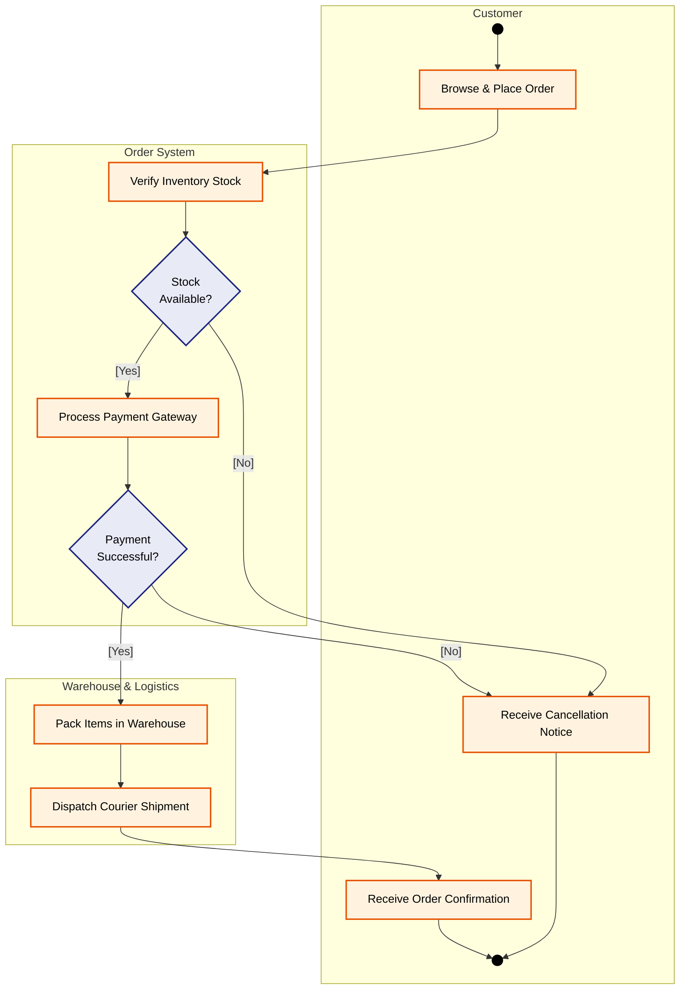
```mermaid
graph TD
    classDef startEnd fill:#000000,stroke:#000000,color:#ffffff;
    classDef action fill:#fff3e0,stroke:#e65100,stroke-width:2px,color:#000000;
    classDef decision fill:#e8eaf6,stroke:#1a237e,stroke-width:2px,color:#000000;

    subgraph CustomerLane["Customer"]
        S(( )):::startEnd
        Act1["Browse & Place Order"]:::action
        Act2["Receive Order Confirmation"]:::action
        Act3["Receive Cancellation Notice"]:::action
        E(( )):::startEnd
    end

    subgraph SystemLane["Order System"]
        Act4["Verify Inventory Stock"]:::action
        D1{"Stock<br/>Available?"}:::decision
        Act5["Process Payment Gateway"]:::action
        D2{"Payment<br/>Successful?"}:::decision
    end

    subgraph FulfillmentLane["Warehouse & Logistics"]
        Act6["Pack Items in Warehouse"]:::action
        Act7["Dispatch Courier Shipment"]:::action
    end

    S --> Act1
    Act1 --> Act4
    Act4 --> D1
    D1 -- "[No]" --> Act3
    D1 -- "[Yes]" --> Act5
    Act5 --> D2
    D2 -- "[No]" --> Act3
    D2 -- "[Yes]" --> Act6
    Act6 --> Act7
    Act7 --> Act2
    Act2 --> E
    Act3 --> E
```

---

#### Answer 5.3: Online Movie Ticket Booking System Activity Diagram (10 Marks)

##### Scenario Assumptions
1.  **Swimlanes:** `Moviegoer`, `Booking Interface`, `Cinema Server & Payment Gateway`.
2.  **Core Flow:** Browse showtimes → select seats → hold seats temporarily → pay → confirm booking → issue e-ticket. A seat hold that is not paid for within a timeout window is released back to availability.

##### Worked Activity Diagram with Swimlanes
```mermaid
graph TD
    classDef startEnd fill:#000000,stroke:#000000,color:#ffffff;
    classDef action fill:#fff3e0,stroke:#e65100,stroke-width:2px,color:#000000;
    classDef decision fill:#e8eaf6,stroke:#1a237e,stroke-width:2px,color:#000000;

    subgraph GoerLane["Moviegoer"]
        S(( )):::startEnd
        Act1["Browse Movies & Showtimes"]:::action
        Act2["Select Seats"]:::action
        Act3["Enter Payment Details"]:::action
        Act4["Receive E-Ticket"]:::action
        Act5["View Seat-Unavailable Notice"]:::action
        E(( )):::startEnd
    end

    subgraph InterfaceLane["Booking Interface"]
        D1{"Seats Still<br/>Available?"}:::decision
        Act6["Hold Seats Temporarily"]:::action
        D2{"Payment<br/>Successful?"}:::decision
    end

    subgraph ServerLane["Cinema Server & Payment Gateway"]
        Act7["Process Payment"]:::action
        Act8["Confirm Booking & Release Hold Timer"]:::action
        Act9["Generate & Email E-Ticket"]:::action
        Act10["Release Held Seats Back to Pool"]:::action
    end

    S --> Act1
    Act1 --> Act2
    Act2 --> D1
    D1 -- "[No / Seats Taken]" --> Act5
    D1 -- "[Yes]" --> Act6
    Act6 --> Act3
    Act3 --> Act7
    Act7 --> D2
    D2 -- "[No]" --> Act10
    D2 -- "[Yes]" --> Act8
    Act8 --> Act9
    Act9 --> Act4
    Act10 --> Act5
    Act4 --> E
    Act5 --> E
```

---

## 7. Group 6: Sequence Diagrams

### Sourced Exam Questions in Group 6

#### Question 6.1
> **"Design a labelled sequence diagram for following problem statement: A university is developing an Online Examination System to conduct digital tests for students. When a student logs in through the Exam Portal UI, the request is sent to the Exam Controller, which authenticates the student using the student entity. Once authenticated, the Exam Controller retrieves the exam details from the Exam entity and displays them to the student. When the student starts the exam, the Exam Controller delivers one question at a time by fetching it from the Question Bank entity. The student submits answers through the Exam Portal UI, which are then passed to the Exam Controller for storage in the Answer Sheet entity. After the student completes the test and clicks “Submit,” the Exam Controller finalizes the Answer Sheet and initiates the evaluation process."**  
> — **Source:** SVKM's NMIMS Final Examination (AY 2025–26 / Dec 2025) | **Course Code:** 702IT0C016 | **Question:** Q2(b) | **Marks:** 10 Marks | **Bloom's Level:** BL-4 (Apply / Design) | **Verification:** Reported; original paper not independently checked

#### Question 6.2
> **"Design a sequence diagram for an advanced ATM system where the user can perform multiple actions in one session, including checking their balance, transferring funds between accounts, and printing a transaction summary."**  
> — **Source:** SVKM's NMIMS Final Examination (AY 2024–25 / Dec 2024) | **Course Code:** 702IT0C016 | **Question:** Q3(a) | **Marks:** 10 Marks | **Bloom's Level:** BL-6 (Create / Design) | **Verification:** Reported; original paper not independently checked

#### Question 6.3
> **"Develop sequence diagram for any 2 scenario of Food Ordering system described in Q4b."**  
> — **Source:** SVKM's NMIMS Final Examination (AY 2022–23 / Nov 2022) | **Course Code:** 702IT0C016 | **Question:** Q6(b) | **Marks:** 10 Marks | **Bloom's Level:** BL-6 (Create / Design) | **Verification:** Reported; original paper not independently checked

#### Question 6.4a
> **"Develop a Sequence Diagram for an E-commerce Firm with below 2 main functionalities: 1. Login Functionality 2. Product Order Functionality"**  
> — **Source:** SVKM's NMIMS Final Examination (AY 2023–24 / Nov 2023) | **Course Code:** 702IT0C016 | **Question:** Q3(a) | **Marks:** 10 Marks | **Bloom's Level:** BL-6 (Create / Design) | **Verification:** Reported; original paper not independently checked

#### Question 6.4b
> **"Develop sequence diagram for online bookshop."**  
> — **Source:** SVKM's NMIMS Re-Examination (AY 2023–24 / Feb 2024) | **Course Code:** 702IT0C016 | **Question:** Q7(b) | **Marks:** 10 Marks | **Bloom's Level:** BL-6 (Create / Design) | **Verification:** Reported; original paper not independently checked

---

### Solutions for Group 6 Questions

#### Answer 6.1: Online Examination System Sequence Diagram (10 Marks)

```mermaid
sequenceDiagram
    autonumber
    actor S as Student
    participant UI as Exam Portal UI
    participant Ctrl as Exam Controller
    participant SE as Student Entity
    participant E as Exam Entity
    participant QB as Question Bank Entity
    participant AS as Answer Sheet Entity

    S->>UI: login(username, password)
    activate UI
    UI->>Ctrl: authenticate(username, password)
    activate Ctrl
    Ctrl->>SE: verifyCredentials(username, password)
    activate SE
    SE-->>Ctrl: studentValid
    deactivate SE

    Ctrl->>E: getExamDetails(studentId)
    activate E
    E-->>Ctrl: examDetails
    deactivate E
    Ctrl-->>UI: displayExamDetails(examDetails)
    UI-->>S: showExamScreen()

    S->>UI: startExam()
    UI->>Ctrl: initiateExamSession()

    loop For Each Question
        Ctrl->>QB: fetchNextQuestion(examId, qNum)
        activate QB
        QB-->>Ctrl: questionObj
        deactivate QB
        Ctrl-->>UI: deliverQuestion(questionObj)
        UI-->>S: displayQuestion()
        S->>UI: submitAnswer(qNum, selectedOption)
        UI->>Ctrl: passAnswer(qNum, selectedOption)
        Ctrl->>AS: storeAnswer(qNum, selectedOption)
        activate AS
        AS-->>Ctrl: answerRecorded
        deactivate AS
    end

    S->>UI: clickSubmitExam()
    UI->>Ctrl: finalizeExam()
    Ctrl->>AS: finalizeAnswerSheet()
    activate AS
    AS-->>Ctrl: sheetFinalized
    deactivate AS
    Ctrl->>Ctrl: initiateEvaluationProcess()
    Ctrl-->>UI: displaySubmissionConfirmation()
    UI-->>S: showSuccessScreen()

    deactivate Ctrl
    deactivate UI
```

---

#### Answer 6.2: Advanced ATM System Multi-Action Session Sequence Diagram (10 Marks)

##### Scenario Assumptions & Cash/Balance Verification Rules
1.  **Multiple Actions in One Session:** Enclosed in a `loop [sessionActive == true]` combined fragment.
2.  **Strict Cash & Balance Verification:** For withdrawal, the ATM checks:
    *   *Check 1:* `ATM_Terminal.cashInventory >= amount`
    *   *Check 2:* `Account.balance >= amount`
3.  **Receipt Handling:** Optional receipt printing via `opt [printReceipt == true]`.

##### Worked Sequence Diagram

`src:Account` and `dst:Account` are distinct account lifelines. This conceptual transfer assumes debit and credit commit atomically; a failed destination credit otherwise requires rollback or compensation.
```mermaid
sequenceDiagram
    autonumber
    actor C as Customer
    participant ATM as ATM_Terminal
    participant Bank as Bank_Server
    participant Src as src:Account
    participant Dst as dst:Account
    participant P as ReceiptPrinter

    C->>ATM: insertCardAndPIN(cardNumber, pin)
    activate ATM
    ATM->>Bank: verifyPIN(cardNumber, pin)
    activate Bank
    Bank-->>ATM: pinAuthenticated
    deactivate Bank

    loop Session Active
        C->>ATM: selectOperation(choice)

        alt choice == "Check Balance"
            ATM->>Bank: getBalance(cardNumber)
            activate Bank
            Bank->>Src: queryBalance()
            activate Src
            Src-->>Bank: currentBalance
            deactivate Src
            Bank-->>ATM: currentBalance
            deactivate Bank
            ATM-->>C: displayBalance(currentBalance)

        else choice == "Transfer Funds"
            C->>ATM: enterTransferDetails(targetAcc, amount)
            ATM->>Bank: transferFunds(srcCard, targetAcc, amount)
            activate Bank
            Bank->>Src: getBalance()
            activate Src
            Src-->>Bank: srcBalance
            deactivate Src
            alt srcBalance >= amount
                Bank->>Src: debit(amount)
                activate Src
                Src-->>Bank: debitSuccess
                deactivate Src
                Bank->>Dst: credit(amount)
                activate Dst
                Dst-->>Bank: creditSuccess
                deactivate Dst
                Bank-->>ATM: transferSuccess
                deactivate Bank
                ATM-->>C: displayTransferConfirmation()
            else srcBalance < amount
                Bank-->>ATM: transferRejected(insufficientFunds)
                deactivate Bank
                ATM-->>C: displayError("Insufficient Balance for Transfer")
            end

        else choice == "Withdraw Cash"
            C->>ATM: enterWithdrawalAmount(amount)
            alt ATM.cashInventory < amount
                ATM-->>C: displayError("ATM Out of Cash")
            else ATM.cashInventory >= amount
                ATM->>Bank: checkBalance(cardNumber, amount)
                activate Bank
                Bank->>Src: getBalance()
                activate Src
                Src-->>Bank: balance
                deactivate Src
                alt balance < amount
                    Bank-->>ATM: balanceInsufficient
                    deactivate Bank
                    ATM-->>C: displayError("Insufficient Account Balance")
                else balance >= amount
                    Bank-->>ATM: balanceSufficient
                    deactivate Bank
                    ATM->>Bank: processDebit(cardNumber, amount)
                    activate Bank
                    Bank->>Src: debit(amount)
                    activate Src
                    Src-->>Bank: debitSuccess
                    deactivate Src
                    Bank-->>ATM: debitApproved
                    deactivate Bank
                    ATM->>ATM: dispenseCash(amount)
                    ATM-->>C: releaseCash()
                end
            end
        end

        opt printReceipt == true
            ATM->>P: printTransactionSummary()
            activate P
            P-->>ATM: receiptPrinted
            deactivate P
            ATM-->>C: deliverReceipt()
        end
    end

    C->>ATM: exitSession()
    ATM-->>C: ejectCard()
    deactivate ATM
```

> ⚠️ **Two logic corrections from an earlier draft of this answer:**
> 1. **Transfer now credits a distinct destination account.** A fund transfer must move money, not just remove it — the earlier version only called `debit(amount)` on the source `Account` object and never credited `targetAcc`, silently destroying the transferred funds. The corrected flow queries the source balance, and on the `srcBalance >= amount` branch performs both `debit(amount)` on `src:Account` and `credit(amount)` on `dst:Account` before confirming success; on `srcBalance < amount` it rejects the transfer instead of debiting.
> 2. **Withdrawal now explicitly rejects on insufficient balance before dispensing.** The earlier version called `Bank->>Src: debit(amount) [balance >= amount]` as an inline guard comment on the debit call itself, but never modeled what happens if that guard is false — so a failed debit had no diagrammed path and the flow could be misread as always reaching `dispenseCash()`. The corrected flow checks `ATM.cashInventory`, then explicitly checks `balance >= amount` via the Bank Server as its own `alt`/`else` branch with a distinct `displayError("Insufficient Account Balance")` message, and only proceeds to `processDebit()` → `dispenseCash()` on the branch where balance is confirmed sufficient beforehand.

---

#### Answer 6.3: Food Ordering System Sequence Diagrams — Two Scenarios (10 Marks)

> **Assumption note:** Q6.3 asks for "any 2 scenarios of Food Ordering system described in Q4b" — that Q4b problem statement (the original question's own referenced sub-part) is not reproduced anywhere in the source papers compiled into this bank, so it cannot be answered from a verified original wording. To leave this question fully answered rather than blank, a **self-contained, clearly-labeled assumed** Food Ordering scenario is worked below with two common scenarios (`Place Order` and `Cancel Order`). On the actual exam, substitute the specific actors/entities from the real Q4b problem statement into this same message structure.

##### Assumed Scenario
Actors/objects: `Customer`, `ui:OrderApp_UI`, `ctrl:OrderController`, `r:Restaurant`, `pay:PaymentGateway`.

##### Scenario 1: Place Order

```mermaid
sequenceDiagram
    autonumber
    actor C as Customer
    participant UI as ui:OrderApp_UI
    participant Ctrl as ctrl:OrderController
    participant R as r:Restaurant
    participant Pay as pay:PaymentGateway

    C->>UI: browseMenuAndSelectItems(restaurantId)
    UI->>Ctrl: placeOrder(customerId, itemList)
    activate Ctrl
    Ctrl->>R: checkItemAvailability(itemList)
    activate R
    R-->>Ctrl: allItemsAvailable = true
    deactivate R
    Ctrl->>Pay: processPayment(amount)
    activate Pay
    Pay-->>Ctrl: paymentSuccess
    deactivate Pay
    Ctrl->>R: forwardOrderToKitchen(orderId)
    Ctrl-->>UI: orderConfirmed(orderId, eta)
    UI-->>C: displayOrderConfirmation(orderId, eta)
    deactivate Ctrl
```

##### Scenario 2: Cancel Order

```mermaid
sequenceDiagram
    autonumber
    actor C as Customer
    participant UI as ui:OrderApp_UI
    participant Ctrl as ctrl:OrderController
    participant R as r:Restaurant
    participant Pay as pay:PaymentGateway

    C->>UI: requestCancelOrder(orderId)
    UI->>Ctrl: cancelOrder(orderId)
    activate Ctrl
    Ctrl->>R: getOrderStatus(orderId)
    activate R
    R-->>Ctrl: status = "PREPARING"
    deactivate R
    alt status == "PLACED" OR status == "PREPARING"
        Ctrl->>R: haltOrderPreparation(orderId)
        Ctrl->>Pay: refundPayment(orderId, amount)
        activate Pay
        Pay-->>Ctrl: refundIssued
        deactivate Pay
        Ctrl-->>UI: cancellationConfirmed(orderId)
        UI-->>C: displayCancellationConfirmation()
    else status == "OUT_FOR_DELIVERY" OR status == "DELIVERED"
        Ctrl-->>UI: cancellationRejected(reason)
        UI-->>C: displayError("Order can no longer be cancelled")
    end
    deactivate Ctrl
```

---

#### Answer 6.4: E-Commerce Firm & Online Bookshop Sequence Diagrams (10 Marks each, for Q6.4a and Q6.4b)

*Q6.4a asks for a general e-commerce firm's Login + Product Order functionality; Q6.4b asks for an online bookshop specifically. Both are worked separately below since they name different domains, though the online bookshop reuses the same two-functionality structure as a book-specific specialization.*

##### Answer 6.4a: E-Commerce Firm — Login & Product Order Functionality

###### Scenario Assumptions
Actors/objects: `Customer`, `ui:StoreApp_UI`, `auth:AuthService`, `ctrl:OrderController`, `cat:ProductCatalog`, `pay:PaymentGateway`.

###### Functionality 1: Login

```mermaid
sequenceDiagram
    autonumber
    actor C as Customer
    participant UI as ui:StoreApp_UI
    participant Auth as auth:AuthService

    C->>UI: enterCredentials(username, password)
    UI->>Auth: login(username, password)
    activate Auth
    alt credentialsValid
        Auth-->>UI: loginSuccess(sessionToken)
        UI-->>C: navigateToHomepage()
    else credentialsInvalid
        Auth-->>UI: loginFailed(reason)
        UI-->>C: displayError("Invalid username or password")
    end
    deactivate Auth
```

###### Functionality 2: Product Order

```mermaid
sequenceDiagram
    autonumber
    actor C as Customer
    participant UI as ui:StoreApp_UI
    participant Ctrl as ctrl:OrderController
    participant Cat as cat:ProductCatalog
    participant Pay as pay:PaymentGateway

    C->>UI: addToCartAndCheckout(productId, qty)
    UI->>Ctrl: placeOrder(customerId, productId, qty)
    activate Ctrl
    Ctrl->>Cat: checkStock(productId, qty)
    activate Cat
    Cat-->>Ctrl: stockAvailable = true
    deactivate Cat
    Ctrl->>Pay: processPayment(amount)
    activate Pay
    Pay-->>Ctrl: paymentSuccess
    deactivate Pay
    Ctrl->>Cat: decrementStock(productId, qty)
    Ctrl-->>UI: orderConfirmed(orderId)
    UI-->>C: displayOrderConfirmation(orderId)
    deactivate Ctrl
```

##### Answer 6.4b: Online Bookshop — Login & Book Order Functionality

*The online bookshop follows the identical two-functionality structure as Answer 6.4a, specialized to a book domain. `ProductCatalog` becomes `BookCatalog`, and stock is tracked per ISBN rather than per generic product ID.*

```mermaid
sequenceDiagram
    autonumber
    actor R as Reader
    participant UI as ui:BookshopApp_UI
    participant Auth as auth:AuthService
    participant Ctrl as ctrl:OrderController
    participant Cat as cat:BookCatalog
    participant Pay as pay:PaymentGateway

    R->>UI: enterCredentials(username, password)
    UI->>Auth: login(username, password)
    activate Auth
    Auth-->>UI: loginSuccess(sessionToken)
    deactivate Auth
    UI-->>R: navigateToHomepage()

    R->>UI: addToCartAndCheckout(isbn, qty)
    UI->>Ctrl: placeOrder(readerId, isbn, qty)
    activate Ctrl
    Ctrl->>Cat: checkStock(isbn, qty)
    activate Cat
    alt stockAvailable
        Cat-->>Ctrl: stockAvailable = true
        deactivate Cat
        Ctrl->>Pay: processPayment(amount)
        activate Pay
        Pay-->>Ctrl: paymentSuccess
        deactivate Pay
        Ctrl->>Cat: decrementStock(isbn, qty)
        Ctrl-->>UI: orderConfirmed(orderId)
        UI-->>R: displayOrderConfirmation(orderId)
    else stockUnavailable
        Cat-->>Ctrl: stockAvailable = false
        deactivate Cat
        Ctrl-->>UI: orderRejected(outOfStock)
        UI-->>R: displayError("Book currently out of stock")
    end
    deactivate Ctrl
```

---

## 8. Group 7: Collaboration / Communication Diagrams

### Sourced Exam Questions in Group 7

#### Question 7.1a
> **"Compare sequence diagram with collaboration diagram in UML on 5 parameters."**  
> — **Source:** SVKM's NMIMS Re-Examination (AY 2023–24 / Feb 2024) | **Course Code:** 702IT0C016 | **Question:** Q2(a) | **Marks:** 10 Marks | **Bloom's Level:** BL-4 (Analyze) | **Verification:** Reported; original paper not independently checked

#### Question 7.1b
> **"Compare sequence diagram and collaboration diagram in UML."**  
> — **Source:** SVKM's NMIMS Final Examination (AY 2023–24 / Nov 2023) | **Course Code:** 702IT0C016 | **Question:** Q2(a) | **Marks:** 10 Marks | **Bloom's Level:** BL-4 (Analyze) | **Verification:** Reported; original paper not independently checked

#### Question 7.1c
> **"Differentiate between the Interaction Models: sequence diagram and collaboration diagram."**  
> — **Source:** SVKM's NMIMS Re-Examination (AY 2022–23 / Jan 2023) | **Course Code:** 702IT0C016 | **Question:** Q1(b) | **Marks:** 5 Marks | **Bloom's Level:** BL-2 (Understand) | **Verification:** Reported; original paper not independently checked

#### Question 7.2
> **"Design collaboration diagram for online booking of travel tickets in railway reservation system. (Assume functionality and its associated objects)."**  
> — **Source:** SVKM's NMIMS Re-Examination (AY 2023–24 / 2024–25) | **Course Code:** 702IT0C016 | **Question:** Q4(b) | **Marks:** 10 Marks | **Bloom's Level:** BL-6 (Create / Design) | **Verification:** Reported; original paper not independently checked

#### Question 7.3
> **"Evaluate the effectiveness of collaboration diagrams versus activity diagrams in modeling real-time systems. Which diagram provides better insights for system optimization and why?"**  
> — **Source:** SVKM's NMIMS Re-Examination (AY 2023–24 / 2024–25) | **Course Code:** 702IT0C016 | **Question:** Q6(a) | **Marks:** 10 Marks | **Bloom's Level:** BL-5 (Evaluate) | **Verification:** Reported; original paper not independently checked

---

### Solutions for Group 7 Questions

#### Answer 7.1: Sequence vs. Collaboration / Communication Diagram Comparison (5M / 10M)

| Comparison Parameter | Sequence Diagram | Collaboration / Communication Diagram |
| :--- | :--- | :--- |
| **1. Primary Emphasis** | Focuses on **chronological time sequence** and temporal call ordering. | Focuses on **structural organization and topological links** between objects. |
| **2. Representation of Time** | Time progresses vertically from top to bottom along dashed lifelines. | Time sequence is expressed explicitly via **nested decimal sequence numbers** (`1:`, `1.1:`). |
| **3. Lifelines & Activations** | Displays explicit dashed lifelines and vertical activation bars. | Does **NOT** display lifelines or activation bars. |
| **4. Combined Control Fragments** | Uses explicit frame boxes (`alt`, `opt`, `loop`) to show logic branches. | Uses conditional prefix numbers on links (e.g., `1.1a [guard]:`). |
| **5. Layout Flexibility** | Objects are arranged horizontally in a row across the top of the diagram. | Objects can be placed anywhere in a freeform 2D network layout. |
| **6. System Refactoring Utility** | Best for understanding method execution flows and call timing. | Best for assessing coupling, object connectivity, and architectural links. |

---

#### Answer 7.2: Railway Ticket Booking Collaboration Diagram (10 Marks)

##### Aligned Text Network Diagram (Exam Drawing Format)
```text
                       +-------------------------------+
                       |    passenger : Passenger      |
                       +-------------------------------+
                                       |
                                       | 1: searchTrains(src, dest, date) >
                                       | 4: displayTicket(ticketId) <
                                       v
                       +-------------------------------+
                       |   ui : RailwayPortal_UI       |
                       +-------------------------------+
                                       |
                                       | 2: bookTicket(passengerId, trainNo) >
                                       | 3.2: confirmBooking(ticketId) <
                                       v
                       +-------------------------------+
                       | ctrl : ReservationController  |
                       +-------------------------------+
                          /                         \
 2.1: checkSeatAvailability() >                      \ 3: processPayment(amount) >
    ^ 2.1-return: seatAvailable                       \ ^ 3-return: paymentSuccess
                        /                              v
  +--------------------------+               +--------------------------+
  |    t : TrainInventory    |               |   pg : PaymentGateway    |
  +--------------------------+               +--------------------------+
    ^
    | 3.1: deductSeatAndIssueTicket() >
    +----------------------------------+
```

##### GitHub Flowchart Approximation (With Sequenced Messages)
```mermaid
graph TD
    classDef obj fill:#e3f2fd,stroke:#1565c0,stroke-width:2px,color:#000000;

    P["passenger : Passenger"]:::obj
    UI["ui : RailwayPortal_UI"]:::obj
    Ctrl["ctrl : ReservationController"]:::obj
    T["t : TrainInventory"]:::obj
    PG["pg : PaymentGateway"]:::obj

    P -->|"1: searchTrains(src, dest, date) >"| UI
    UI -->|"2: bookTicket(passengerId, trainNo) >"| Ctrl
    Ctrl -->|"2.1: checkSeatAvailability() >"| T
    Ctrl -->|"3: processPayment(amount) >"| PG
    Ctrl -->|"3.1: deductSeatAndIssueTicket() >"| T
    Ctrl -.->|"3.2: confirmBooking(ticketId) <"| UI
    UI -.->|"4: displayTicket(ticketId) <"| P
```

---

#### Answer 7.3: Evaluation of Collaboration vs. Activity Diagrams for Real-Time Systems (10 Marks)

##### 1. Comparative Analysis for Real-Time Modeling
*   **Collaboration (Communication) Diagrams** highlight **structural topology and message routing** between objects. They show which objects communicate over specific links and the sequence of method invocations.
*   **Activity Diagrams** highlight **procedural control flow, concurrency (forks/joins), and state handoffs**.

##### 2. Which Diagram Provides Better Insights for System Optimization?
**Activity Diagrams provide superior insights for real-time system optimization**, for the following three architectural reasons:
1.  **Explicit Concurrency & Bottleneck Identification:** Activity diagrams use **Fork and Join bars** to model parallel thread execution. System architects can analyze parallel paths to identify synchronization bottlenecks and race conditions.
2.  **Swimlane Resource Allocation:** Swimlanes map activities directly to hardware threads, CPU cores, or network tasks, allowing engineers to optimize processor load balancing.
3.  **Timing & Exception Path Analysis:** Activity decision diamonds clearly highlight error fallback branches and interrupt handling paths, which are critical for latency-critical real-time applications.

---

## 9. Supplementary Topic: Object Diagrams (No Sourced PYQ Listed)

*Note: Object Diagrams capture a concrete runtime snapshot of class instances and their attribute values at a specific moment in time. They are supplementary to the core syllabus.*

```mermaid
classDiagram
    class johnMember {
        johnMember : LibraryMember
        memberId = "M-1024"
        name = "John Doe"
        status = "ACTIVE"
        activeReservationCount = 1
        unpaidFines = 0.00
    }

    class designPatternsBook {
        designPatternsBook : Book
        isbn = "978-0201633610"
        title = "Design Patterns"
        author = "Gang of Four"
    }

    class dpCopy101 {
        dpCopy101 : BookItem
        barcode = "BC-9001"
        status = "OnLoan"
        rackNumber = "R-04"
    }

    class res501 {
        res501 : Reservation
        reservationId = "RES-501"
        reservationDate = "2026-09-26"
        reservationStatus = "PENDING"
    }

    johnMember -- res501 : Placed
    designPatternsBook -- dpCopy101 : Consists-Of
    designPatternsBook -- res501 : Has-Queue-Entry
```

---

## 10. Unsourced Practice Questions (Additional Scenarios)

The following practice questions provide additional scenario-based exercises. They are explicitly separated from the reported exam-question wordings; paper attributions remain unverified.

### Practice Question 1: Vending Machine System
*   **Task:** Draw a Use Case Diagram and State Machine Diagram for an automated Vending Machine that accepts coins, dispenses beverages, and returns change.
*   **State Machine Summary:** `Idle` $\rightarrow$ `CoinsInserted` $\rightarrow$ `DispensingItem` $\rightarrow$ `ReturningChange` $\rightarrow$ `Idle`.

### Practice Question 2: Gym Registration System
*   **Task:** Draw a Sequence Diagram and Collaboration Diagram for member registration and monthly package payment in a Gym Registration System.

---

## 11. Source Index & Question-to-Answer-Group Index

### Reported Examination Paper Attribution Index (Unverified)

The institution, date, question number, marks, and Bloom details below are retained as reported in v2; none has been independently checked against original papers. The Saksham guide exercise is not an official-paper PYQ.

**Auditable count:** Groups 1–7 list 2 + 5 + 6 + 5 + 3 + 5 + 5 = **31 listed wordings** (30 reported examination attributions and 1 exam-guide exercise). Group 8 has **0 sourced wordings** and one supplementary example. This count does not establish verification.

1.  **SVKM's NMIMS Final Exam 2025–26 (Dec 2025):** Questions 1(c), 2(b), 3(b), 7(a).
2.  **SVKM's NMIMS Final Exam 2024–25 (Dec 2024):** Questions 2(a), 3(a), 3(b), 5(b).
3.  **SVKM's NMIMS Final Exam 2023–24 (Nov 2023):** Questions 1(a), 2(a), 3(a), 4(a).
4.  **SVKM's NMIMS Final Exam 2022–23 (Nov 2022):** Questions 1(b), 2(a), 6(b).
5.  **SVKM's NMIMS Re-Exam 2023–24 (Feb 2024):** Questions 1(c), 2(a), 4(b), 6(a), 6(b), 7(b).
6.  **SVKM's NMIMS Re-Exam 2022–23 (Jan 2023):** Questions 1(b), 2(a), 5(b), 7(a).
7.  **Mumbai University TE-IT Sem VI (May 2015, Dec 2015, Dec 2016, Dec 2017):** Various use case & interaction questions.

---

## 12. Syllabus Coverage Checklist & Topics With No Sourced PYQ

### Official Syllabus Coverage Checklist

*   [x] **Visual modeling with UML & purpose** — Covered in Section 2 (Group 1)
*   [x] **Transition from OOA to OOD** — Covered in Section 2 (Group 1)
*   [x] **Use case models, actors, include, extend, generalization** — Covered in Section 3 (Group 2)
*   [x] **Use case specifications** — Covered in Section 3 (Table in Answer 2.2)
*   [x] **Identifying classes/objects, attributes, operations, events** — Covered in Section 4 (Group 3) & Section 5 (Group 4)
*   [x] **Class diagrams with association, aggregation, composition, generalization** — Covered in Section 4 (Group 3)
*   [x] **Derived attributes and static members** — Covered in Section 4 (Group 3)
*   [x] **State diagrams using control specifications** — Covered in Section 5 (Group 4)
*   [x] **Activity diagrams with swimlanes, decisions, merges, forks, joins** — Covered in Section 6 (Group 5)
*   [x] **Interaction modeling & Sequence diagrams** — Covered in Section 7 (Group 6)
*   [x] **Collaboration / Communication diagrams with sequenced numbering** — Covered in Section 8 (Group 7)
*   [x] **Object diagrams (Supplementary)** — Supplementary example in Section 9 (no sourced PYQ listed)

### Syllabus Topics With No Direct Question Listed Here (Paper Audit Pending)

1.  **Explicit Standalone Use Case Specification Table Writing Questions:** While Use Case Diagrams are heavily tested, writing a standalone tabular Use Case Specification was not asked as an isolated 10M question in the provided papers (provided in Answer 2.2 for complete coverage).
2.  **Package Diagrams & Subsystem Grouping:** No corresponding question is listed here; original-paper coverage remains unverified.
3.  **Component & Deployment Diagrams:** Not included in the Unit 3 syllabus scope (covered under Architectural Design in Unit 5).

---
