# Software Engineering Unit 3 Study Notes: UML Modeling

**Course:** Software Engineering | **Unit:** Unit 3: UML Modeling (08 Hours)  
**Course Outcome:** CO-3 — Apply UML concepts for modeling software functionality for a given scenario  
**Primary Reference:** *Chapter 3: UML Modeling* & Official Course Syllabus

---

## 1. Unit Overview & Syllabus Mapping

This document provides comprehensive, exam-oriented study notes for **Unit 3: UML Modeling**. It covers visual modeling principles, object-oriented concepts, and all six primary UML diagram types mandated by the syllabus, along with supplementary coverage of object diagrams.

### Syllabus Coverage Matrix

| Syllabus Topic | Coverage Status | Key Concepts & Diagrams |
| :--- | :---: | :--- |
| **Visual Modeling & OOA to OOD** | Fully Covered | Purpose of UML, 13 standard diagrams, structural vs. behavioral views, OOA domain concepts vs. OOD implementation design |
| **Use Case Models & Specifications** | Fully Covered | Actors, Use Cases, System Boundary, `<<include>>`, `<<extend>>`, Generalization, Use Case Specification Table (UC-03) |
| **Class Diagrams & Relationships** | Fully Covered | 3-compartment Class Box, Visibility (`+`, `-`, `#`), Attributes, Operations, Association, Multiplicity, Aggregation (◇), Composition (◆), Generalization, Derived/Static members |
| **State Diagrams** | Fully Covered | Statechart notation, Initial (●) / Final (◉) states, Transitions (`Event [Guard] / Action`), Internal Activities (`entry/`, `do/`, `exit/`), Self-transitions, `BookItem` lifecycle |
| **Activity Diagrams & Swimlanes** | Fully Covered | Workflows, Swimlane partitions, Action Nodes, Control Flow, Decision Diamonds, Merge Nodes, Parallel Forks & Joins, "Borrowing a Book" workflow |
| **Sequence Diagrams** | Fully Covered | Interaction modeling, Lifelines, Activation bars, Synchronous/Asynchronous/Return messages, Combined Fragments (`alt`, `opt`, `loop`), "Reserve Book" sequence |
| **Collaboration / Communication Diagrams** | Fully Covered | Object lifelines, Structural links, Sequenced message numbering (`1:`, `1.1:`), Message direction, Equivalence with Sequence Diagrams |
| **Object Diagrams (Supplementary)** | Fully Covered | Classifiers vs. Instances, Concrete attribute values, Object Link notation (`instanceName : ClassName`) |

---

## 2. Fundamental Concepts: Visual Modeling & OOA to OOD

### 2.1 Visual Modeling with UML

#### Definition
**Visual Modeling** is the practice of using standardized graphical notations to document, analyze, design, and architect software systems. 

The **Unified Modeling Language (UML)** is the international industry-standard visual modeling language managed by the Object Management Group (OMG).

#### Why Do We Need UML?
1. **Communicates System Architecture:** Provides a common graphical language for developers, architects, domain experts, and business stakeholders.
2. **Manages System Complexity:** Allows engineers to abstract away implementation details and view software at multiple architectural levels.
3. **Provides Blueprints for Construction:** Maps directly to Object-Oriented Programming (OOP) languages (Java, C++, Python, C#).
4. **Maintains Traceability:** Bridges high-level customer requirements down to individual code methods and database schemas.

#### Classification of UML Diagrams (13 Standard Diagrams)

UML diagrams are broadly divided into two major categories:

```text
                                  +---------------------------------+
                                  |           UML DIAGRAMS          |
                                  +---------------------------------+
                                           /               \
                                          /                 \
            +----------------------------------+       +----------------------------------+
            |        STRUCTURAL DIAGRAMS       |       |        BEHAVIORAL DIAGRAMS       |
            |   (Static System Architecture)   |       |   (Dynamic System Behavior)      |
            +----------------------------------+       +----------------------------------+
            | • Class Diagram                  |       | • Use Case Diagram               |
            | • Object Diagram                 |       | • State Machine / State Diagram  |
            | • Component Diagram              |       | • Activity Diagram               |
            | • Deployment Diagram             |       | • Sequence Diagram (Interaction) |
            | • Package Diagram                |       | • Communication / Collaboration  |
            | • Composite Structure Diagram    |       | • Timing Diagram                 |
            +----------------------------------+       | • Interaction Overview Diagram   |
                                                       +----------------------------------+
```

---

### 2.2 Transition from Object-Oriented Analysis (OOA) to Object-Oriented Design (OOD)

Software development transitions systematically from problem-space analysis to solution-space design:

```text
  +-------------------------------------+             +-------------------------------------+
  |      OBJECT-ORIENTED ANALYSIS       |             |       OBJECT-ORIENTED DESIGN        |
  |             (OOA)                   |             |                (OOD)                |
  |  • Problem Domain Concepts          |  TRANSITION  |  • Solution Domain Architecture   |
  |  • Real-World Entities (Nouns)      | ----------> |  • Specific Attributes & Data Types|
  |  • "WHAT" the system must do        |             |  • Full Method Signatures           |
  |  • Conceptual Classes               |             |  • Visibility (+, -, #) & Design    |
  |  • High-Level Use Cases             |             |  • Database Schemas & UI Classes    |
  +-------------------------------------+             +-------------------------------------+
```

| Dimension | Object-Oriented Analysis (OOA) | Object-Oriented Design (OOD) |
| :--- | :--- | :--- |
| **Focus** | Understanding the problem domain ("WHAT") | Constructing the software solution ("HOW") |
| **Classes** | Conceptual domain entities (e.g., `Book`, `Member`) | Software classes with data types (e.g., `BookController`, `DBConnector`) |
| **Attributes** | High-level business attributes (`name`, `title`) | Precise data types and visibility (`- title: String`, `- fineAmount: Double`) |
| **Operations** | Business capabilities (`borrow`, `reserve`) | Method signatures with parameters (`+ reserveBook(memberId: String, isbn: String): ReservationResult`) |
| **Diagrams Used** | Use Case Diagrams, Conceptual Class Diagrams | Detailed Class Diagrams, Sequence Diagrams, Statecharts, Activity Diagrams |

---

## 3. Primary Consistent Scenario: Online Library Management & Book Reservation System (LMS)

To maintain strict conceptual consistency across all UML diagrams, the following scenario and rules are applied throughout this study guide.

### System Narrative & Requirements
The **Online Library Management System (LMS)** manages book cataloging, physical item tracking, member loans, and book title reservations.

1. **User Roles:**
   - **Library Member:** Can search the catalog, borrow available book items, reserve book titles, and pay overdue fines. Members are generalized into **Student Member** (max 3 books, 14-day loan) and **Faculty Member** (max 10 books, 30-day loan).
   - **Librarian:** Manages catalog entries, adds physical book copies, issues loans over the counter, and processes returns.

2. **System Rules & Business Logic:**
   - **Book Title vs. Physical BookItem Distinction (Crucial Rule):**
     - A **`Book`** represents an abstract literary title (identified by `ISBN`, `title`, `author`).
     - A **`BookItem`** represents a specific physical copy of a book in the library (identified by `barcode`, `rackNumber`, `status`).
     - **Reservation vs. Loan Copy Rule:** Placing a `Reservation` creates a queue entry associated with the **`Book`** title. **Creating a reservation queue entry for a `Book` title MUST NOT change an on-loan `BookItem` copy's status to "Reserved".** An on-loan `BookItem` remains in the `OnLoan` state. When an on-loan `BookItem` is eventually returned by a borrower, the system checks the `Book`'s reservation queue; if a pending reservation exists, the returned `BookItem` transitions from `OnLoan` to `Reserved` (or `HeldForReservation`), awaiting pickup by the reserving member.
   - **Separate Account Limits:**
     - **Borrowing Limit (role-specific):** Student Member `maxLoanLimit = 3`; Faculty Member `maxLoanLimit = 10`. There is no single universal loan cap — each subclass defines its own `maxLoanLimit`.
     - **Reservation Limit:** Max 3 active reservations for every member role (`maxReservationLimit = 3`).
   - **Reservation Eligibility:** A member can reserve a `Book` title if and only if:
     1. Member account is `ACTIVE`.
     2. Unpaid fines equal `$0.00`.
     3. Active reservations count < 3.
     4. Zero physical `BookItem` copies of that `Book` title are currently `Available` on the shelf (all copies are `OnLoan` or `Maintenance`).

---

## 4. Diagram 1: Use Case Diagram & Specifications

### 4.1 Purpose & When to Use
A **Use Case Diagram** models the functional requirements of a system from the perspective of external actors. It defines the system boundary and illustrates **what** services the system provides without exposing internal implementation details.

- **When to Use:** During the inception and requirements elicitation phase (OOA).

---

### 4.2 Compact Notation Guide

| Symbol / Element | Visual Shape | Description & Exam Rules |
| :--- | :--- | :--- |
| **Actor** | Stick Figure | An external entity (human user or external system) interacting with the system. Placed **outside** the system boundary. |
| **Use Case** | Horizontal Oval | A discrete unit of system functionality. Named using an active **Verb-Noun** phrase (e.g., `Reserve Book`, `Calculate Fine`). Placed **inside** the boundary. |
| **System Boundary** | Rectangle Box | Encapsulates all use cases. Defines the scope of the system. |
| **Association Link** | Solid Line | Connects an Actor to a Use Case. Indicates interaction. |
| **`<<include>>` Relationship** | Dashed Arrow | Mandatory dependency. Arrow points **from Base Use Case to Included Use Case**. Base cannot execute without the included use case running 100% of the time. |
| **`<<extend>>` Relationship** | Dashed Arrow | Optional/Conditional dependency. Arrow points **from Extending Use Case to Base Use Case**. Executes only when specific extension point conditions are met. |
| **Generalization** | Line with Hollow Triangle | Inheritance relationship between Actors or Use Cases. Pointing to the parent. |

---

### 4.3 Step-by-Step Method for Drawing a Use Case Diagram

1. **Identify Actors:** Extract external entities from requirements (`Library Member`, `Student Member`, `Faculty Member`, `Librarian`, `Payment Gateway`).
2. **Draw System Boundary Box:** Label it `Online Library Management System (LMS)`.
3. **Identify Use Cases:** Extract action verbs (`Search Catalog`, `Borrow Book`, `Reserve Book`, `Pay Overdue Fine`, `Catalog New Book`).
4. **Identify Relationships:**
   - Find mandatory shared steps → add `<<include>>` pointing to shared step (e.g., `Borrow Book` —[include]→ `Authenticate Member`).
   - Find optional/conditional steps → add `<<extend>>` pointing back to base (e.g., `Pay Overdue Fine` —[extend]→ `Return Book`).
   - Find specialized roles → add Generalization hollow arrows.

---

### 4.4 Complete Worked Diagram: Library Management System

#### Mermaid Flowchart Approximation (For GitHub Display)

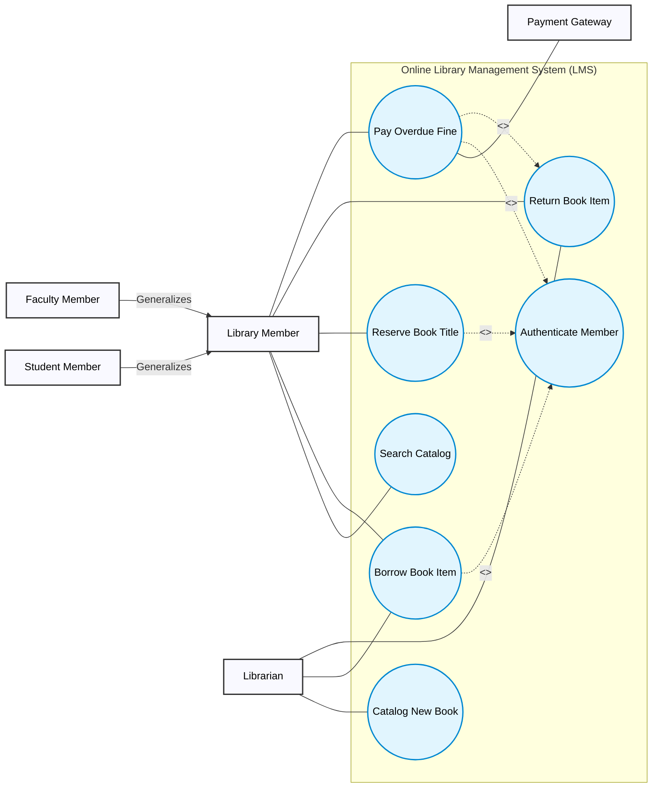

> ⚠️ **Exam Drawing Guide (Official UML Notation):**
> When drawing this diagram by hand on an exam paper:
> 1. Draw **Stick Figures** for `Library Member`, `Student Member`, `Faculty Member`, `Librarian`, and `Payment Gateway`.
> 2. Draw `Student Member` and `Faculty Member` with **solid lines and hollow triangular arrowheads** pointing UP to `Library Member` (Actor Generalization).
> 3. Draw a large **rectangular System Boundary Box** labeled "Online Library Management System".
> 4. Draw all Use Cases as **smooth horizontal ovals** inside the boundary.
> 5. Draw `<<include>>` as a **dashed arrow pointing FROM Base Use Case TO Included Use Case** (`Borrow Book Item` ⇢ `Authenticate Member`).
> 6. Draw `<<extend>>` as a **dashed arrow pointing FROM Extending Use Case TO Base Use Case** (`Pay Overdue Fine` ⇢ `Return Book Item`).

---

### 4.5 Use Case Specification Table (UC-03: Reserve Book)

| Use Case Specification Element | Details for UC-03: `Reserve Book` |
| :--- | :--- |
| **Use Case ID & Name** | **UC-03: Reserve Book Title** |
| **Primary Actor** | Library Member |
| **Secondary Actors** | Notification System |
| **Description** | Allows an active library member to place a reservation queue request for a specific book title when all physical copies are currently on loan. |
| **Trigger** | Member selects "Reserve Title" on a book details page after searching the catalog and seeing 0 available physical copies. |
| **Preconditions** | 1. Member is authenticated (`status == ACTIVE`).<br>2. Member has zero unpaid fines (`unpaidFines == 0.00`).<br>3. Member active reservations count < 3.<br>4. Member has not already reserved this book title.<br>5. Zero physical `BookItem` copies of this `Book` title are currently `Available`. |
| **Main Success Scenario (Basic Flow)** | 1. Member searches catalog and selects a book title.<br>2. System displays book details showing `Available Copies: 0` and total queue length.<br>3. Member clicks "Reserve Title".<br>4. System verifies member eligibility (Status active, Fines = $0, Reservations < 3).<br>5. System verifies that 0 physical copies are currently `Available`.<br>6. System creates a new `Reservation` record with timestamp and appends it to the `Book`'s reservation queue.<br>7. System increments member's `activeReservationCount` by 1.<br>8. System displays confirmation message with reservation queue position.<br>*(Note: Physical `BookItem` copies remain in `OnLoan` state until returned by their current borrowers).* |
| **Alternate Flows** | **A1: Physical Copy Becomes Available Before Reservation Finalized:**<br>At step 5, if a physical copy was just returned and is `Available`, system prompts: *"A copy is currently available on shelf. Would you like to issue a loan instead of reserving?"* If yes, redirect to `Borrow Book Item`. |
| **Exception Flows** | **E1: Member Ineligible due to Unpaid Fines:** At step 4, if `unpaidFines > 0.00`, system displays: *"Reservation blocked: Unpaid fines pending ($XX.XX). Please clear fines first."* Use case terminates.<br>**E2: Reservation Limit Exceeded:** At step 4, if `activeReservationCount >= 3`, system displays: *"Reservation limit reached (Max 3). Cancel an existing reservation to proceed."* Use case terminates. |
| **Postconditions** | 1. A new `Reservation` instance exists in queue state `PENDING`.<br>2. Member's `activeReservationCount` is incremented by 1.<br>3. Physical `BookItem` copies maintain their existing `OnLoan` state. |

---

### 4.6 Element Explanations & `<<include>>` vs `<<extend>>` Comparison

| Comparison Feature | `<<include>>` Relationship | `<<extend>>` Relationship |
| :--- | :--- | :--- |
| **Nature of Dependency** | Mandatory / Compulsory behavior. | Optional / Conditional behavior. |
| **Execution Frequency** | Runs **100% of the time** whenever base use case executes. | Runs **only when extension point condition** is met. |
| **Arrow Direction** | Points **FROM Base Use Case TO Included Use Case** (`Base` ⇢ `Included`). | Points **FROM Extending Use Case TO Base Use Case** (`Extending` ⇢ `Base`). |
| **Base Use Case Completeness** | Base use case is **incomplete** without the included step. | Base use case is **fully complete and functional** on its own. |
| **Example in LMS** | `Borrow Book Item` —[include]→ `Authenticate Member` | `Pay Overdue Fine` —[extend]→ `Return Book Item` (Condition: *Due Date Passed*) |

---

### 4.7 Common Exam Mistakes & Verification Checklist

#### Common Exam Mistakes
1. ❌ **Reversing `<<extend>>` Arrow Direction:** Pointing `<<extend>>` from Base to Extending (Correct: Extending points TO Base).
2. ❌ **Putting Actors Inside System Boundary:** Placing stick figures inside the rectangle (Correct: Actors sit OUTSIDE).
3. ❌ **Using Arrows for Actor-Use Case Association:** Drawing arrowheads on solid association lines between actors and use cases (Correct: Plain solid line without arrowheads).

#### Verification Checklist
- [ ] Is the System Boundary Box clearly drawn and labeled?
- [ ] Are all use case names active Verb-Noun phrases?
- [ ] Do `<<include>>` arrows point toward the shared mandatory sub-step?
- [ ] Do `<<extend>>` arrows point toward the main base use case?

---

## 5. Diagram 2: Class Diagram & Modeling with Classes

### 5.1 Purpose & When to Use
A **Class Diagram** is the central static structural diagram in UML. It models the system's classes, their internal structure (attributes and operations), visibility modifiers, and static relationships.

- **When to Use:** During Object-Oriented Design (OOD) to construct implementation blueprints.

---

### 5.2 Compact Notation Guide

#### Class Box Structure (3 Compartments)

```text
+-------------------------------------------------------+
|                      ClassName                        |  <-- Top: Class Name
+-------------------------------------------------------+
| visibility attributeName : DataType = defaultValue    |  <-- Middle: Attributes
+-------------------------------------------------------+
| visibility operationName(param: Type) : ReturnType    |  <-- Bottom: Operations / Methods
+-------------------------------------------------------+
```

#### Visibility Modifiers
- `+` **Public:** Accessible by any external class.
- `-` **Private:** Accessible only within this class.
- `#` **Protected:** Accessible within this class and its subclasses.
- `~` **Package:** Accessible by classes within the same package.
- `/` **Derived Attribute:** Calculated dynamically (e.g., `/totalFines : Double`).
- `underline` **Static Member:** Belongs to the class classifier level, shared across all instances (e.g., `+ maxReservationLimit : int = 3`).

#### Relationship Types & Symbols

| Relationship | Symbol / Arrowhead | Explanation & Exam Rules |
| :--- | :--- | :--- |
| **Generalization** | Solid Line + Hollow Triangle (`--\|>`) | Inheritance. Subclass inherits from Superclass. Arrow points to Superclass. |
| **Association** | Solid Line + Multiplicity (`--`) | Structural link between two independent classes. |
| **Aggregation (◇)** | Hollow Diamond at Whole (`o--`) | Weak Whole-Part relationship. Parts can exist independently if Whole is destroyed (e.g., `Library` and `Book`). |
| **Composition (◆)** | Solid/Filled Diamond at Whole (`*--`) | Strong Whole-Part relationship. Parts cannot exist without Whole; destroying Whole destroys Parts (e.g., `Book` and `BookItem`). |
| **Dependency** | Dashed Line + Open Arrow (`-.->`) | "Uses-a" temporary relationship. Changes in supplier affect client. |

---

### 5.3 Step-by-Step Method for Drawing a Class Diagram

1. **Identify Classes:** Extract nouns from domain requirements (`LibraryMember`, `StudentMember`, `FacultyMember`, `Book`, `BookItem`, `Reservation`, `LoanRecord`).
2. **Define Attributes & Visibility:** Assign private (`-`) attributes with explicit data types.
3. **Define Operations:** Assign public (`+`) methods with return types.
4. **Determine Relationships & Multiplicity:**
   - Inherits capabilities? → Generalization (`StudentMember` → `LibraryMember`).
   - Strong physical ownership? → Composition (`Book` 1 *-- 1..* `BookItem`).
   - Weak container? → Aggregation (`Library` 1 o-- * `Book`).
   - Functional link? → Association (`LibraryMember` 1 -- 0..3 `Reservation`).

---

### 5.4 Complete Worked Diagram: Library Management System

#### Mermaid Class Diagram (GitHub Native Rendering)

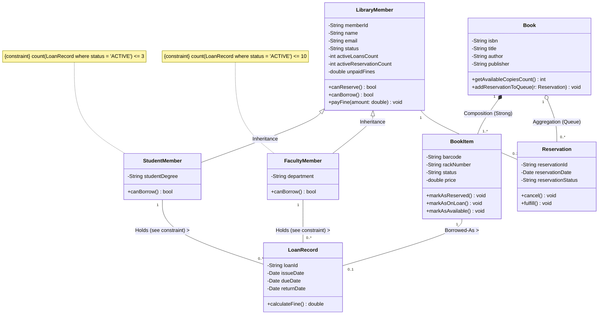

> ⚠️ **Exam Drawing Guide (Official UML Notation):**
> When drawing by hand on exam paper:
> 1. Draw 3-compartment boxes for every class.
> 2. Draw **Inheritance** as a solid line with a **hollow triangular arrowhead** pointing UP from `StudentMember` to `LibraryMember`.
> 3. Draw **Composition** as a **solid filled diamond (◆)** attached to the `Book` box, pointing to `BookItem`.
> 4. Draw **Aggregation** as a **hollow diamond (◇)** attached to the `Book` box, pointing to `Reservation`.
> 5. Label all relationship endpoints with explicit multiplicities (`1`, `1..*`, `0..3`, `0..*`).
> 6. **Multiplicity vs. business-rule constraint — do not conflate them.** `LoanRecord` is a historical record (it carries `issueDate`, `dueDate`, `returnDate`), so a member accumulates one `LoanRecord` per loan ever taken, including returned ones. The `Holds` association is therefore `0..*` on both `StudentMember` and `FacultyMember` — the multiplicity bounds how many `LoanRecord` objects can ever be linked, not how many are currently open. The role-specific caps (Student ≤ 3, Faculty ≤ 10) are **business-rule constraints on the count of currently-*ACTIVE*** `LoanRecord` objects, not on the association's multiplicity — write them as a UML constraint note in braces, e.g. `{count(LoanRecord where status = 'ACTIVE') <= 3}`, attached near the `StudentMember` and `FacultyMember` boxes, exactly as the two `note for` blocks above show. Never write `0..3` or `0..10` as the multiplicity of `Holds` — that would wrongly cap a member's entire loan *history* at 3 or 10 records.

---

### 5.5 Element Explanations & Aggregation vs Composition Deep-Dive

#### Multiplicity Rules
- `1`: Exactly one.
- `0..1`: Zero or one (optional).
- `*` or `0..*`: Zero or more (many).
- `1..*`: One or more (at least one).
- `0..3`: Between zero and three inclusive.

#### Aggregation (◇) vs Composition (◆)

| Parameter | Aggregation (◇) | Composition (◆) |
| :--- | :--- | :--- |
| **Relationship Nature** | Weak Whole-Part ("Has-a"). | Strong Whole-Part ("Owns-a / Consists-of"). |
| **Lifetime Dependency** | **Independent lifetimes.** If Whole is destroyed, Part objects continue to exist. | **Dependent lifetimes.** If Whole is destroyed, Part objects are automatically destroyed. |
| **Diamond Symbol** | **Hollow Diamond (◇)** placed at the Whole class. | **Solid/Filled Diamond (◆)** placed at the Whole class. |
| **LMS Example** | `Book` ◇--- `Reservation` (If a book title is archived, reservation records remain in member audit logs). | `Book` ◆--- `BookItem` (If a `Book` title entry is deleted, all physical barcode copies are deleted). |

---

### 5.6 Common Exam Mistakes & Verification Checklist

#### Common Exam Mistakes
1. ❌ **Putting Diamonds on the Wrong Side:** Placing composition diamond on the Part class instead of Whole (Correct: Diamond sits at WHOLE/Container).
2. ❌ **Missing Visibility Signs:** Forgetting `+` or `-` prefixes.
3. ❌ **Conflating Book Title with Physical Copy:** Making `Reservation` point to `BookItem` instead of `Book` title.

#### Verification Checklist
- [ ] Are class boxes divided into 3 compartments?
- [ ] Do attributes have `-` (private) visibility and explicit data types?
- [ ] Is Composition drawn with a solid diamond (◆) at the container?
- [ ] Are multiplicities specified at both ends of every association?

---

## 6. Diagram 3: State Diagram (Statechart / State Machine)

### 6.1 Purpose & When to Use
A **State Diagram** models the dynamic lifecycle of a single reactive object as it transitions through various states in response to internal or external events.

- **When to Use:** For domain objects that possess complex event-driven lifecycles (e.g., `BookItem`, `Order`, `ATM_Session`).

---

### 6.2 Compact Notation Guide

| Symbol | Visual Shape | Description |
| :--- | :--- | :--- |
| **Initial State** | Small Solid Black Circle (●) | Lifecycle starting point. |
| **Final State** | Bullseye Circle (◉) | Lifecycle termination point. |
| **State Box** | Rounded Rectangle | A condition/mode during which an object satisfies a condition or performs an activity. |
| **Transition Arrow** | Solid Directed Arrow | Path from source state to target state. |

#### Transition Label Syntax
`EventName [GuardCondition] / ActionExecuted`

- **Event:** Triggering occurrence.
- **GuardCondition:** Boolean expression inside `[ ]`. Transition occurs ONLY if `true`.
- **ActionExecuted:** Atomic execution appended after `/`.

#### Internal State Activities
- `entry /`: Action executed immediately upon entering the state.
- `do /`: Ongoing activity executed while remaining in the state.
- `exit /`: Action executed immediately upon exiting the state.

---

### 6.3 Step-by-Step Method for Drawing a State Diagram

1. **Select the Focus Class:** Focus on `BookItem` (physical copy lifecycle).
2. **Identify States:** `Available`, `OnLoan`, `Reserved` (or `HeldForReservation`), `Lost/Archived`.
3. **Identify Triggers & Transitions:**
   - Catalog copy → `Available`.
   - Issue loan → `Available` to `OnLoan`.
   - Return copy (no reservation) → `OnLoan` to `Available`.
   - **Return copy (reservation pending)** → `OnLoan` to `Reserved`.
   - Claim reserved item → `Reserved` to `OnLoan`.
   - Reservation expired → `Reserved` to `Available`.
4. **Add Self-Transitions:** e.g., Inspection / inventory check while remaining `Available`.

---

### 6.4 Complete Worked Diagram: `BookItem` Lifecycle

#### Mermaid State Diagram (GitHub Native Rendering)

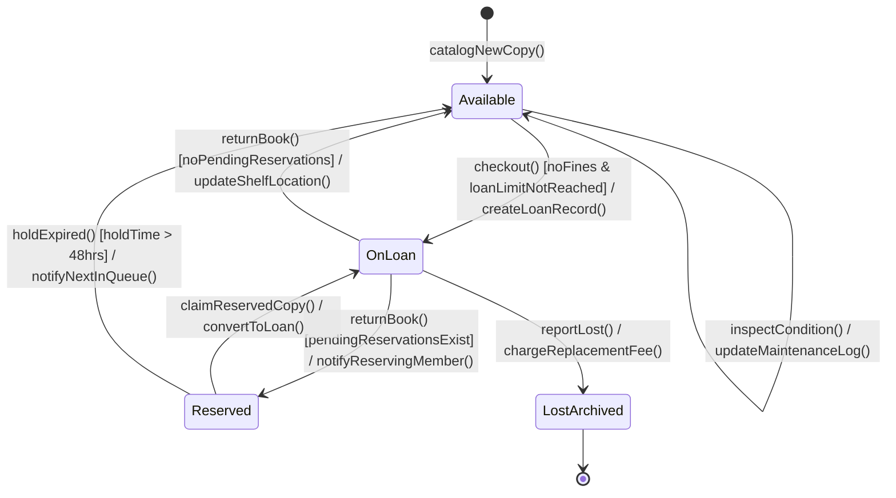

> ⚠️ **Exam Drawing Guide & Critical Domain Rule Verification:**
> Notice that when a member reserves a book title, the on-loan `BookItem` **remains in the `OnLoan` state**!
> The transition of `BookItem` to `Reserved` occurs **ONLY when `returnBook()` is executed by the current borrower** and `pendingReservationsExist == true`. This perfectly honors the business logic rule.

---

### 6.5 Element Explanations & Internal Activity Box Example

#### Internal Activity Box for State `Reserved`

```text
+-------------------------------------------------------+
|                       Reserved                        |
+-------------------------------------------------------+
| entry / start48HourHoldTimer()                        |
| do / trackHoldCountdown()                             |
| exit / stopHoldTimer()                                |
+-------------------------------------------------------+
```

- **Self-Transition:** A transition where source and target state are identical (`Available` → `Available` on `inspectCondition()`). It executes `exit` and `entry` actions if drawn as external, or internal activity if drawn inside state box.

---

### 6.6 Common Exam Mistakes & Verification Checklist

#### Common Exam Mistakes
1. ❌ **Transitioning On-Loan Copy Immediately to Reserved on Reservation Event:** Moving a borrowed `BookItem` copy directly to `Reserved` state when a reservation is placed (Correct: Copy stays `OnLoan` until returned!).
2. ❌ **Syntax Errors in Transition Labels:** Writing `Action / Event [Guard]` instead of `Event [Guard] / Action`.
3. ❌ **Missing Initial State (●):** Forgetting to draw the starting black circle.

#### Verification Checklist
- [ ] Is there an initial state (●) and at least one final state (◉)?
- [ ] Are transition labels formatted correctly as `Event [Guard] / Action`?
- [ ] Is `BookItem` state correctly separated from `Book` title reservation queueing?

---

## 7. Diagram 4: Activity Diagram & Swimlanes

### 7.1 Purpose & When to Use
An **Activity Diagram** models procedural workflows, business processes, or operational steps. It shows control flows, decision logic, parallel execution paths, and swimlane organizational responsibilities.

- **When to Use:** During requirements analysis (OOA) and business process modeling.

---

### 7.2 Compact Notation Guide

| Symbol | Visual Shape | Description & Exam Rules |
| :--- | :--- | :--- |
| **Initial Node** | Solid Black Circle (●) | Workflow starting point. |
| **Final Node** | Bullseye Circle (◉) | Workflow completion point. |
| **Action Node** | Rounded Rectangle | Executable step/activity. |
| **Control Flow** | Directed Solid Arrow | Flow of control between actions. |
| **Decision Diamond** | Diamond (1 Input, N Outputs) | Conditional branch. Output flows MUST have guard conditions `[guard]`. |
| **Merge Diamond** | Diamond (N Inputs, 1 Output) | Re-joins alternative decision branches into a single flow. |
| **Fork Bar** | Thick Black Line (1 Input, N Outputs) | Splits a single flow into multiple **parallel concurrent** execution paths. |
| **Join Bar** | Thick Black Line (N Inputs, 1 Output) | Synchronizes multiple parallel paths. Execution waits until **ALL** incoming paths complete. |
| **Swimlane Column** | Parallel Column Containers | Partitions activities by responsible Actor / System Component. |

---

### 7.3 Step-by-Step Method for Drawing an Activity Diagram with Swimlanes

1. **Identify Swimlane Partitions:** Column 1: `Library Member`, Column 2: `LMS Interface`, Column 3: `Database / System`.
2. **Set Initial Node (●):** Place in initiating actor swimlane (`Library Member`).
3. **Map Sequential Action Steps:** Place action nodes in responsible swimlanes.
4. **Add Decision / Merge Diamonds:** Add branches with `[Copy Available]` vs `[All Copies On Loan]`.
5. **Add Parallel Fork & Join Bars:** For concurrent parallel steps (e.g., Send SMS Notification AND Update Reservation Database Record concurrently).

---

### 7.4 Complete Worked Diagram: "Borrowing a Book" Workflow

> **Notation limitation:** Mermaid flowcharts have no native UML fork/join bar shape. The boxes below labelled "FORK BAR" / "JOIN BAR" are rectangle approximations for GitHub rendering only — on an exam sheet these must be drawn as a single **thick solid black bar** (a short filled rectangle), not as a labelled box.

#### Mermaid Flowchart Approximation (For GitHub Display)

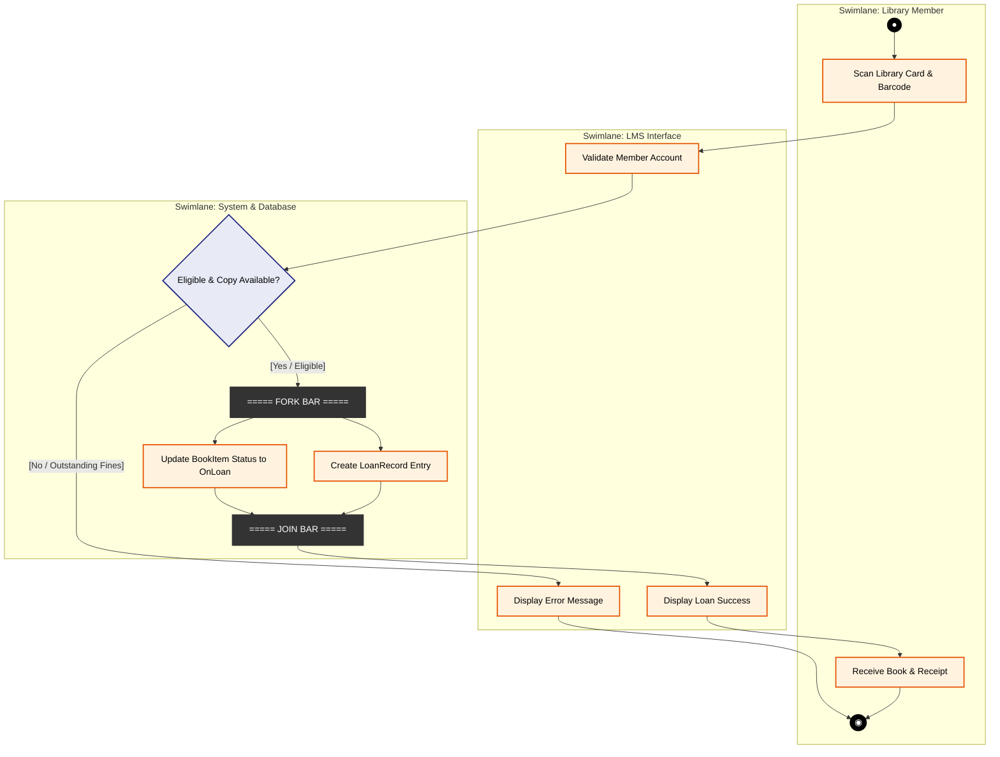

> ⚠️ **Exam Drawing Guide (Official UML Notation):**
> When drawing by hand on exam paper:
> 1. Draw 3 vertical **Swimlane Columns** labeled `Library Member`, `LMS Interface`, and `System & Database`.
> 2. Draw **Decision Node** as a clean diamond with explicit guard labels `[Yes / Eligible]` and `[No / Fines Pending]`.
> 3. Draw **Fork Bar** and **Join Bar** as **thick solid horizontal/vertical black lines**.
> 4. Ensure arrows crossing swimlanes show clear handoffs between actors and system layers.

---

### 7.5 Element Explanations: Fork vs Join vs Decision vs Merge

```text
DECISION (Branching):             FORK (Parallel Split):
       [In]                              [In]
        |                                 |
     /  \  Decision Diamond        ============== Fork Bar (Thick Line)
    /    \                         /      |     \
 [Path A] [Path B]              [Task 1] [Task 2] [Task 3]  (Concurrent)

MERGE (Re-joining):               JOIN (Synchronization):
 [Path A] [Path B]              [Task 1] [Task 2] [Task 3]
    \    /                         \      |     /
     \  /  Merge Diamond           ============== Join Bar (Thick Line)
       |                                  |
     [Out]                              [Out] (Waits for ALL tasks)
```

---

### 7.6 Common Exam Mistakes & Verification Checklist

#### Common Exam Mistakes
1. ❌ **Confusing Decision Diamonds with Fork Bars:** Using a diamond for parallel execution, or a fork bar for conditional branching.
2. ❌ **Missing Guard Conditions:** Leaving decision branch arrows unlabeled without `[guard]` conditions.
3. ❌ **Actions Crossing Swimlanes Incorrectly:** Placing system database tasks inside the human user swimlane.

#### Verification Checklist
- [ ] Are swimlanes clearly titled and bounded?
- [ ] Do decision branches have explicit `[guard]` conditions?
- [ ] Are Fork and Join bars drawn as thick solid lines?

---

## 8. Diagram 5: Interaction Diagram 1 — Sequence Diagram

### 8.1 Purpose & When to Use
A **Sequence Diagram** models dynamic interactions between objects arranged in a strict **time sequence**. It emphasizes the time ordering of message exchanges.

- **When to Use:** During OOD to map use case scenarios to method calls across system objects.

---

### 8.2 Compact Notation Guide

| Element | Visual Notation | Explanation |
| :--- | :--- | :--- |
| **Actor / Object Box** | Rectangle at top (`instance : Class`) | Participating lifeline entity. Underlined instance name. |
| **Lifeline** | Vertical Dashed Line | Represents the existence of an object over time. |
| **Activation Bar** | Thin Vertical Rectangle | Indicates period during which an object is executing an operation. |
| **Synchronous Message** | Solid Line + Filled Arrowhead (`->>`) | Caller blocks and waits for message processing to finish. |
| **Asynchronous Message** | Solid Line + Open Arrowhead (`->`) | Caller sends message and continues without waiting. |
| **Return Message** | Dashed Line + Open Arrowhead (`-->>`) | Returns control/value back to caller. |
| **Combined Fragment** | Frame Box (`alt`, `opt`, `loop`) | Controls interaction logic (conditionals, loops). |

---

### 8.3 Step-by-Step Method for Drawing a Sequence Diagram

1. **Identify Objects:** `m:LibraryMember`, `ui:LMS_Interface`, `ctrl:ReservationController`, `b:Book`, `r:Reservation`.
2. **Arrange Lifelines Horizontally:** Place initiating actor on far left, followed by UI, Controller, and Entity domain objects.
3. **Draw Time Sequence Top-to-Bottom:**
   - Message 1: `requestReservation(isbn)`
   - Message 2: `reserveBook(memberId, isbn)`
   - Message 3: `checkEligibility(memberId)`
   - Message 4: `checkCopyAvailability()` → returns `0 available`
   - Frame `alt` [Eligible]: `createReservation(memberId, isbn)` → returns `resObj`
   - Frame `else` [Ineligible]: `displayError(reason)`

---

### 8.4 Complete Worked Diagram: "Reserve Book" Scenario (UC-03)

#### Mermaid Sequence Diagram (GitHub Native Rendering)

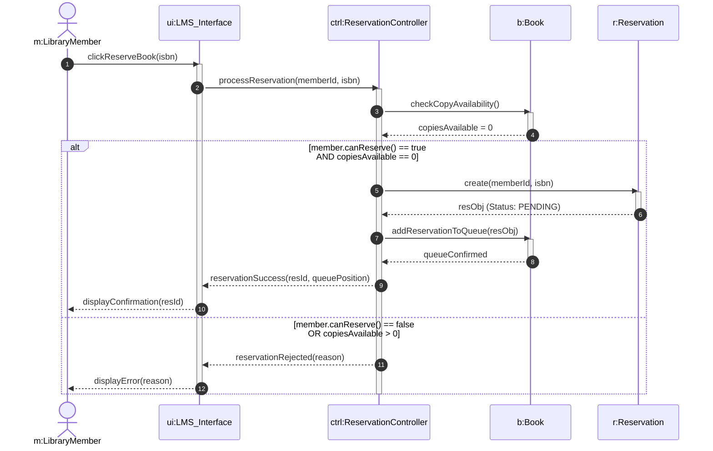

> ⚠️ **Exam Drawing Guide:**
> Note that step 7 executes `r:Reservation` creation, placing the reservation in `PENDING` queue status. The physical `BookItem` copies remain in `OnLoan` state.

---

### 8.5 Element Explanations & Interaction Frames

#### Combined Fragment Types
- **`alt` (Alternative):** Conditional branching (if-else logic). Divided by a horizontal dashed line.
- **`opt` (Optional):** Executes only if condition is true (single if statement).
- **`loop` (Iteration):** Repeats execution for a specified iteration condition.

---

### 8.6 Common Exam Mistakes & Verification Checklist

#### Common Exam Mistakes
1. ❌ **Missing Activation Bars:** Drawing messages connecting directly to dashed lifelines without execution boxes.
2. ❌ **Incorrect Arrowheads:** Using open arrowheads for synchronous calls or solid arrowheads for return messages (Correct: Return messages MUST be dashed lines with open arrowheads `-->>`).

#### Verification Checklist
- [ ] Are lifelines arranged in logical left-to-right control order?
- [ ] Are return messages drawn as dashed lines?
- [ ] Are `alt` / `opt` combined fragments clearly framed and labeled?

---

## 9. Diagram 6: Interaction Diagram 2 — Collaboration (Communication) Diagram

### 9.1 Purpose & When to Use
A **Collaboration Diagram** (termed **Communication Diagram** in UML 2.0) models dynamic interactions using **structural organization**. Instead of showing time along vertical lifelines, it shows object links and numbers messages sequentially (`1:`, `1.1:`, `2:`).

- **When to Use:** When illustrating the structural network and object relationships involved in a dynamic interaction.

---

### 9.2 Compact Notation Guide

| Element | Visual Shape | Description |
| :--- | :--- | :--- |
| **Object Node** | Rectangle (`objectName : ClassName`) | Participating object instance. |
| **Structural Link** | Solid Line | Connection enabling message passing between objects. |
| **Sequenced Message** | Text Label + Direction Arrow | Formatted as `sequenceNumber: messageName(args) >`. Arrow indicates call direction. |

#### Message Sequence Numbering Syntax
- Top-level call: `1: processReservation()`
- Nested sub-calls under step 1: `1.1: checkCopyAvailability()`, `1.2: createReservation()`
- Nested sub-calls under step 1.2: `1.2.1: validateQueue()`

---

### 9.3 Equivalence & Conversion Rules: Sequence ⟷ Communication Diagram

Sequence and Communication diagrams are semantically equivalent views of the same dynamic interaction:

```text
SEQUENCE DIAGRAM (Time Focus)            COMMUNICATION DIAGRAM (Structural Focus)

[m:Member] -> 1: reserve() -> [ui:LMS_UI]     [m:Member] ------ 1: reserve() -------> [ui:LMS_UI]
                                                                                          |
                                  === EQUIVALENT ===                                 1.1: process()
                                                                                          v
                                                                                [ctrl:Controller]
```

---

### 9.4 Complete Worked Diagram: "Reserve Book" Scenario

#### Sequence-Conforming Participants & Messages
To align with Section 8.4, the same participants are used, and each guarded path from the sequence diagram's `alt` fragment is numbered as its own decimal branch rather than sharing a label with the other branch.

- **Participants:** `m:LibraryMember`, `ui:LMS_Interface`, `ctrl:ReservationController`, `b:Book`, `r:Reservation`.

> **Scope note:** This diagram maps the sequence diagram's two guarded branches separately — `1.x` for the eligible/success path, `2.x` for the ineligible/rejection path — so no single arrow carries two different outcomes. It still does not show lifelines or activation bars, and reading it alongside Section 8.4 is recommended rather than treating either view alone as sufficient. It is a structural (link-based) view of the same interaction, not a line-for-line reproduction of the sequence diagram's exact top-to-bottom order.

#### Text-Graphical Network Representation (Exam Drawing Format)

```text
                       +-----------------------------------+
                       |        m : LibraryMember          |
                       +-----------------------------------+
                                         |
                          1: clickReserveBook(isbn) >
                                         v
                       +-----------------------------------+
                       |        ui : LMS_Interface         |
                       +-----------------------------------+
                                         |
                  1.1: processReservation(memberId, isbn) >
                                         v
                       +-----------------------------------+
                       |    ctrl : ReservationController   |
                       +-----------------------------------+
                                         |
                  1.1.1: checkCopyAvailability() >
                                         v
                       +--------------------------+
                       |        b : Book          |
                       +--------------------------+

  BRANCH A — [eligible AND copiesAvailable == 0] (success path):
    ctrl --- 1.1.2: create(memberId, isbn) > ---> r : Reservation  (Status: PENDING)
    ctrl --- 1.1.3: addReservationToQueue(resObj) > ---> b : Book
    ctrl --- 1.1.4: reservationSuccess(resId, queuePosition) > ---> ui : LMS_Interface
    ui   --- 1.2: displayConfirmation(resId) > ---> m : LibraryMember

  BRANCH B — [NOT eligible OR copiesAvailable > 0] (rejection path — skips create/addToQueue):
    ctrl --- 2.1: reservationRejected(reason) > ---> ui : LMS_Interface
    ui   --- 2.2: displayError(reason) > ---> m : LibraryMember
```

*(Only one of Branch A or Branch B executes per interaction — they are alternatives, not both reachable in the same run, exactly as the sequence diagram's `alt` / `else` fragment shows.)*

#### GitHub Flowchart Approximation

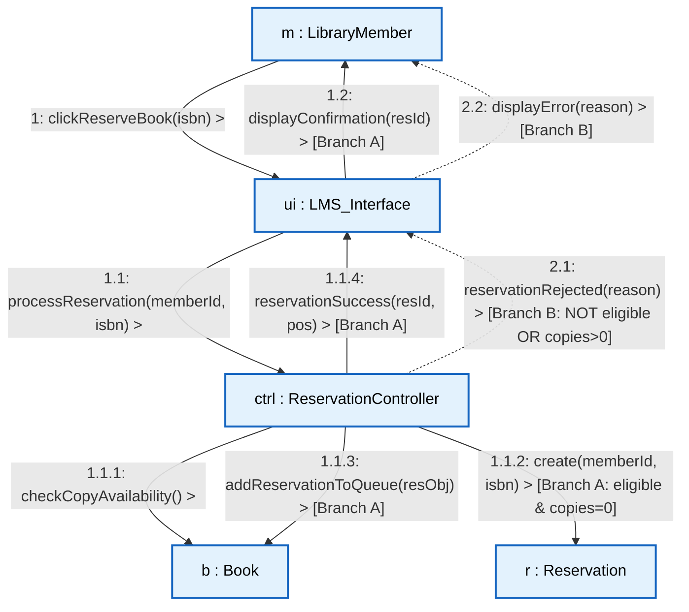

> ⚠️ **Exam Drawing Guide (Official UML Notation):**
> When drawing on an exam paper:
> 1. Draw object boxes with underlined labels (`m : LibraryMember`, `ui : LMS_Interface`).
> 2. Draw **plain solid lines** between connected objects (representing links) — the same link is reused for a call and its reply, so do not draw a separate dashed "return" line as in a sequence diagram.
> 3. Number messages with the sequence's decimal scheme (`1:`, `1.1:`, `1.1.1:`) and write a small directional arrow indicator next to each (`1: messageName() >`).
> 4. Give each guarded branch its **own** numbering root — this worked example uses `1.x` for the eligible/success branch and `2.x` for the rejection branch — rather than writing one arrow labelled with both outcomes (e.g. avoid `reservationSuccess / reservationRejected` on a single line). Only one branch executes per run; label the branch condition once near its first message (`[Branch A: eligible & copies=0]`) instead of repeating the full guard on every arrow.

---

### 9.5 Sequence vs Communication Diagram Comparison Matrix

| Feature | Sequence Diagram | Communication / Collaboration Diagram |
| :--- | :--- | :--- |
| **Primary Emphasis** | Time sequence and chronological call order. | Structural relationships and network links between objects. |
| **Representation of Time** | Top-to-bottom vertical progression along lifelines. | Explicit decimal sequence numbering (`1:`, `1.1:`, `1.2:`). |
| **Lifelines & Activations** | Shows explicit dashed lifelines and vertical activation bars. | Does NOT show lifelines or activation bars. |
| **Control Logic** | Visualized using `alt`, `opt`, `loop` combined fragment boxes. | Visualized using conditional sequence numbers (e.g., `1.1a [guard]:`). |

---

### 9.6 Common Exam Mistakes & Verification Checklist

#### Common Exam Mistakes
1. ❌ **Forgetting Sequence Numbers:** Omitting numbers on message labels (Writing `processReservation()` instead of `1.1: processReservation()`).
2. ❌ **Duplicating Object Instances:** Drawing multiple boxes for the same object instance.
3. ❌ **Drawing Lifelines:** Incorrectly drawing vertical dashed lines on a communication diagram.

#### Verification Checklist
- [ ] Are object labels underlined (`instance : Class`)?
- [ ] Are messages explicitly numbered (`1:`, `2:`, `3:`)?
- [ ] Are directional arrows included next to message text?

---

## 10. Secondary Practice Scenario: Automated Teller Machine (ATM) System

### Practice Scenario Description
An **Automated Teller Machine (ATM) System** allows bank customers to perform financial transactions.
1. **User Interaction:** Customer inserts an ATM card, enters a 4-digit PIN, and selects "Cash Withdrawal".
2. **System Processing:**
   - The `ATM_Terminal` reads card data and prompts for PIN.
   - The `BankHost` validates the PIN against the customer's `Account`.
   - If authenticated, the customer enters withdrawal amount.
   - System checks if `ATM_Terminal` cash dispenser has sufficient cash AND `Account` balance ≥ amount.
   - If valid, `Account` is debited, cash is dispensed, and receipt is printed.

---

### Complete Model Answers for Practice Scenario

#### 1. Use Case Diagram (ATM System)

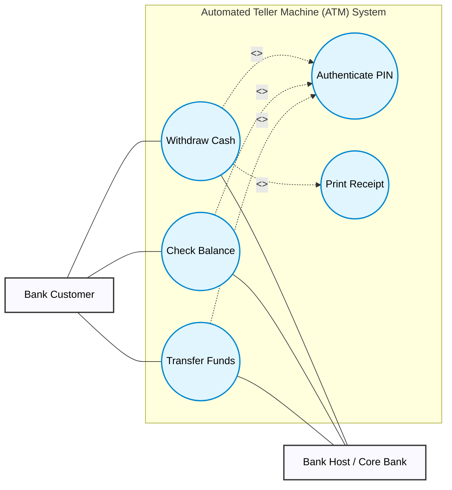

> ⚠️ **Exam Drawing Guide:**
> Draw stick figures for `Bank Customer` and `Bank Host`. Enclose Use Cases inside "ATM System" boundary box. `Withdraw Cash` includes `Authenticate PIN` (100% mandatory). **Receipt printing is mandatory on every successful withdrawal** in this scenario (the practice narrative states cash is dispensed *and* a receipt is printed with no conditional wording), so `Withdraw Cash` also `<<include>>`s `Print Receipt` — it is not modeled as `<<extend>>`. This matches the unconditional `Print Receipt` step in the activity diagram (Section 10, Diagram 4) and the `printReceipt()` call now added to the sequence diagram (Section 10, Diagram 5).

---

#### 2. Class Diagram (ATM System)

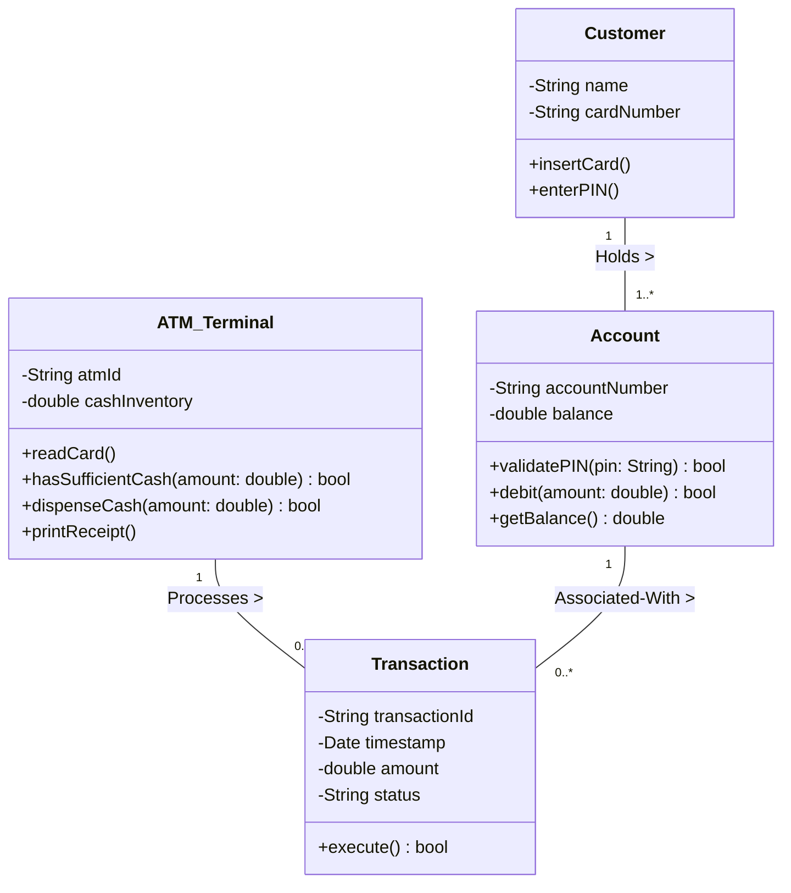

---

#### 3. State Diagram: Lifecycle of Class `ATM_Session`

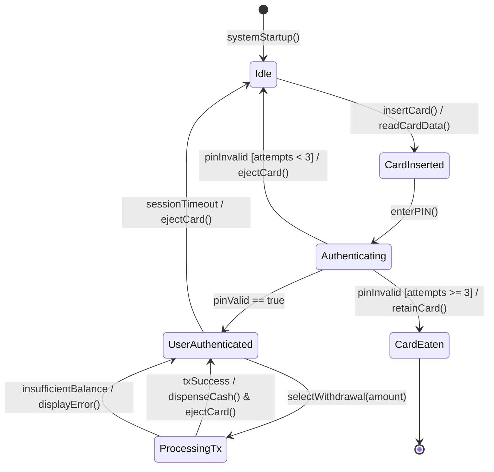

---

#### 4. Activity Diagram: "Cash Withdrawal" Workflow with Swimlanes

> **Notation limitation:** As in Section 7.4, "FORK BAR" / "JOIN BAR" below are labelled-box approximations for GitHub rendering — draw each as a single thick solid black bar on an exam sheet, not as a text-labelled rectangle.

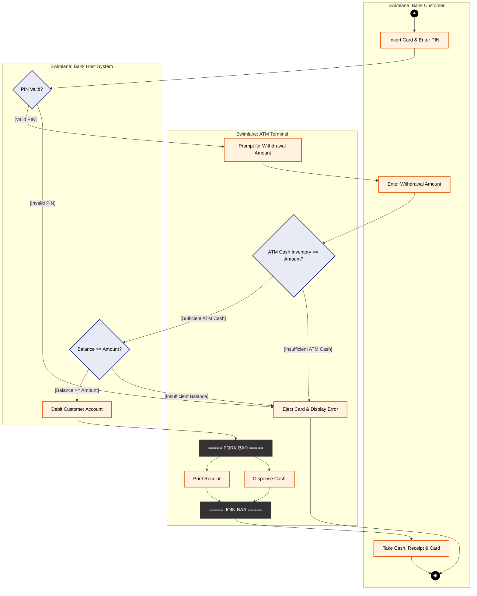

> ⚠️ **Exam Drawing Guide & Sequencing Note:**
> The balance check can only happen **after** the customer has entered a withdrawal amount — checking `Balance >= Amount` before an amount exists is a logic error. Order the flow as: validate PIN → prompt for and receive amount → check ATM's own cash inventory → validate account balance → debit → dispense & print receipt. The scenario requires checking **both** the account balance **and** the ATM's available cash before approving a withdrawal, so `ATM Cash Inventory >= Amount?` is checked first (a device-local decision, so it sits in the `ATM Terminal` swimlane) and only if that passes does the flow reach the Bank Host's `Balance >= Amount?` decision — matching the corrected ordering in the Sequence Diagram (Diagram 5) below. Also note that ejecting the card and displaying an error is a **terminal-side** action (the physical card slot and screen belong to the `ATM Terminal`), so `Eject Card & Display Error` sits in the **ATM Terminal** swimlane on both failure paths, not the `Bank Host System` swimlane — the Bank Host only reports the `PIN Valid?` / `Balance >= Amount?` decisions back to the terminal.

---

#### 5. Sequence Diagram: "Cash Withdrawal" Interaction

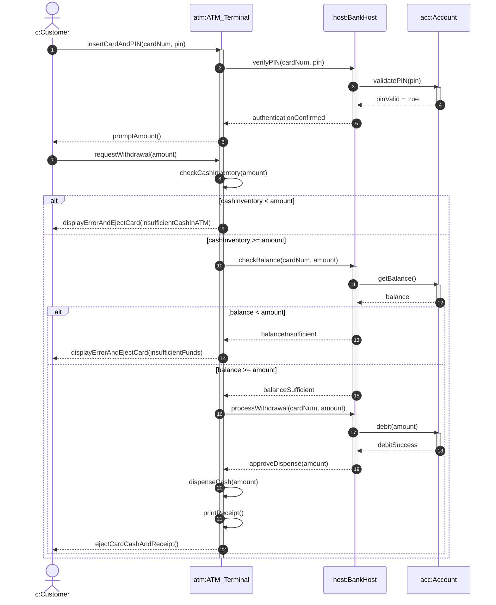

> ⚠️ **Exam Drawing Guide & Sequencing Note:**
> Validation now happens strictly **before** any debit: the ATM first checks its own `cashInventory` (a device-local check that never touches the bank), then asks the `BankHost` to check `balance >= amount`, and only calls `debit(amount)` once both checks pass. This matches the practice scenario's rule that the system must check *both* dispenser cash *and* account balance before committing funds. `printReceipt()` is called unconditionally on the success path, immediately before `ejectCardCashAndReceipt()`, matching the mandatory (not `<<extend>>`) treatment of `Print Receipt` in the Use Case Diagram above and the always-executed `Print Receipt` action node in the Activity Diagram (Diagram 4).

---

#### 6. Collaboration (Communication) Diagram: "Cash Withdrawal"

```text
                       +-------------------------------+
                       |          c : Customer         |
                       +-------------------------------+
                                       |
                                       | 1: insertCardAndPIN(cardNum, pin) >
                                       | 3: requestWithdrawal(amount) >
                                       v
                       +-------------------------------+
                       |       atm : ATM_Terminal      |
                       +-------------------------------+
                                       |
                                       | 2: verifyPIN(cardNum, pin) >
                                       | 4: processWithdrawal(cardNum, amount) >
                                       v
                       +-------------------------------+
                       |        host : BankHost        |
                       +-------------------------------+
                                       |
                                       | 5: debit(amount) >
                                       v
                       +-------------------------------+
                       |          acc : Account        |
                       +-------------------------------+
```

---

## 11. Supplementary Topic: Object Diagrams

### 11.1 Purpose & When to Use
An **Object Diagram** models a concrete static snapshot of system instances at a specific point in execution time. It shows real object instances, concrete attribute values, and active links.

- **When to Use:** To illustrate complex object configurations, verify class diagram correctness, or depict test data states.

---

### 11.2 Class Diagram vs. Object Diagram Comparison

| Feature | Class Diagram | Object Diagram |
| :--- | :--- | :--- |
| **Abstraction Level** | Abstract schema / Classifier blueprint. | Concrete runtime instance snapshot. |
| **Naming Format** | `ClassName` | `instanceName : ClassName` (Underlined!). |
| **Attribute Values** | Data Types (e.g., `email : String`). | Concrete Values (e.g., `email = "john@univ.edu"`). |
| **Relationships** | Association, Aggregation, Composition. | Instantiated Link (Solid Line without arrows or multiplicities). |

---

### 11.3 Worked Object Diagram (LMS Instance Snapshot)

> **Notation limitation — read before using this diagram:** Mermaid has no native object-diagram shape, so this snapshot is approximated with `classDiagram` syntax. It does **not** show the real UML object-diagram header format of an underlined `instanceName : ClassName` title — the `instanceName : ClassName` line below is written as an ordinary row *inside* each box, not as an underlined box heading, because Mermaid's `classDiagram` always renders its own `ClassName` as the heading and gives no way to underline it. Do not copy this rendered approximation's box layout onto an exam paper. Study the **Exam Drawing Guide** immediately below the diagram for the actual notation (underlined heading, `attributeName = value` rows, plain solid links) and reproduce that, not this Mermaid rendering.

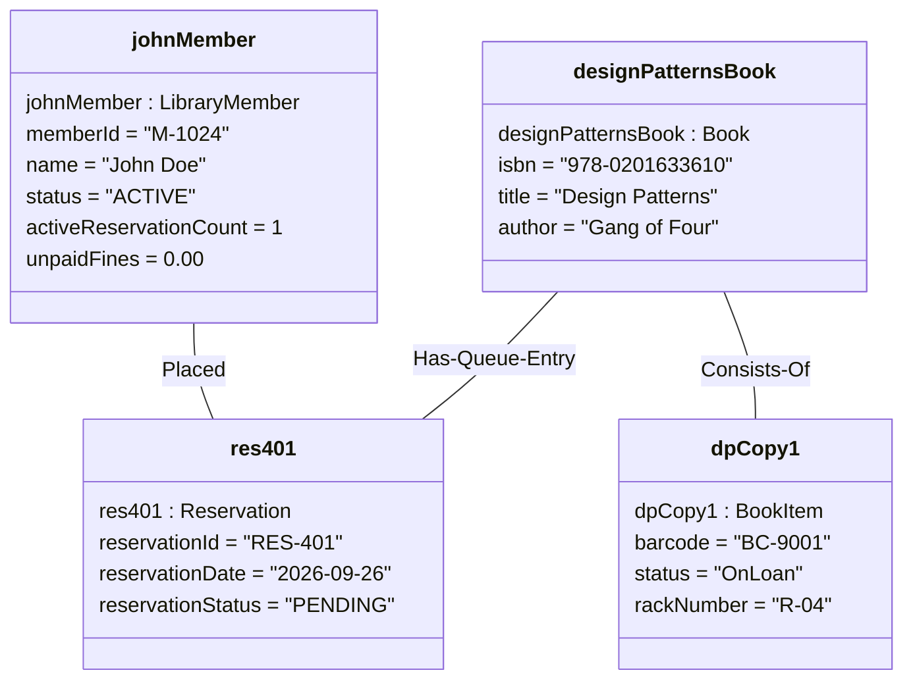

> ⚠️ **Exam Drawing Guide:**
> On an exam sheet, write object box titles as underlined `instanceName : ClassName`. List attributes with assignment statements (`attributeName = value`). Draw links as simple solid lines.

---

## 12. Diagram Selection Guide & Syllabus Coverage Audit

### 12.1 Diagram Selection Matrix

| Scenario Requirement / Problem Statement | Recommended Primary UML Diagram | Secondary Supporting Diagram |
| :--- | :--- | :--- |
| Capture customer functional requirements & system scope | **Use Case Diagram** | Activity Diagram |
| Model domain entities, data attributes, & OOP structure | **Class Diagram** | Object Diagram |
| Model physical copy state changes (`Available` → `OnLoan` → `Reserved`) | **State Diagram** | Sequence Diagram |
| Model multi-actor business workflows with swimlanes | **Activity Diagram** | Sequence Diagram |
| Map step-by-step method calls across objects over time | **Sequence Diagram** | Communication Diagram |
| Highlight structural topology of communicating objects | **Communication / Collaboration** | Class Diagram |
| Illustrate runtime test data instance snapshot | **Object Diagram** | Class Diagram |

---

### 12.2 Syllabus Coverage Audit Checklist

- [x] **Visual modeling with UML & purpose** — Covered in Section 2.1
- [x] **Transition from OOA to OOD** — Covered in Section 2.2
- [x] **Use case models, actors, include, extend, generalization** — Covered in Section 4
- [x] **Use case specifications** — Covered in Section 4.5 (UC-03 Table)
- [x] **Identifying classes/objects, attributes, operations, events** — Covered in Section 5
- [x] **Class diagrams with association, aggregation, composition, generalization** — Covered in Section 5
- [x] **Derived attributes and static members** — Covered in Section 5.2
- [x] **State diagrams using control specifications & self-transitions** — Covered in Section 6
- [x] **Activity diagrams with swimlanes, decisions, merges, forks, joins** — Covered in Section 7
- [x] **Interaction modeling & Sequence diagrams** — Covered in Section 8
- [x] **Collaboration / Communication diagrams with sequenced numbering** — Covered in Section 9
- [x] **Object diagrams (Supplementary)** — Covered in Section 11
- [x] **Consistent LMS scenario & ATM practice scenario** — Covered in Sections 3-9 & 10

---
