# Software Engineering Unit 4 PYQ Bank: Requirement Analysis & Design

This document provides a comprehensive, exam-oriented Previous Year Question (PYQ) bank for **Unit 4: Requirement Analysis & Design** (03 Hours, CO-2: *Demonstrate an understanding of various Analysis and Design models*).

Every question is categorized by topic, preserved in its original wording, accurately labeled by source status (**Reported PYQ (verification pending)**, **Reported PYQ (unverified)**, or **Practice Question**), and answered in full detail with GitHub-renderable Mermaid diagrams, text flow fallbacks, input/output DFD balancing tables, and explicit constraint-reading rules.

---

## Document Navigation & Quick Reference

* [Topic Group 1: Requirements Engineering Tasks & Project Success](#topic-group-1-requirements-engineering-tasks--project-success)
  * [Group 1.1: Role of RE in Project Success & Balancing Stakeholder Needs](#group-11-role-of-re-in-project-success--balancing-stakeholder-needs)
  * [Group 1.2: Major Tasks and Phases of Requirements Engineering](#group-12-major-tasks-and-phases-of-requirements-engineering)
  * [Group 1.3: Elicitation Difficulties & Validation Checks](#group-13-elicitation-difficulties--validation-checks)
* [Topic Group 2: Analysis Modeling Elements & Viewpoints](#topic-group-2-analysis-modeling-elements--viewpoints)
  * [Group 2.1: Multi-Viewpoint Analysis & Model Elements Mapping](#group-21-multi-viewpoint-analysis--model-elements-mapping)
* [Topic Group 3: Data Modeling Concepts & Relationship Analysis](#topic-group-3-data-modeling-concepts--relationship-analysis)
  * [Group 3.1: Data Objects, Attributes, Relationships, Cardinality & Modality](#group-31-data-objects-attributes-relationships-cardinality--modality)
* [Topic Group 4: Data Flow Diagrams (DFD) — Scenarios & Decomposition](#topic-group-4-data-flow-diagrams-dfd--scenarios--decomposition)
  * [Group 4.1: Student Enrollment System DFD (Level-0, Level-1, Level-2 & Functional Decomposition)](#group-41-student-enrollment-system-dfd-level-0-level-1-level-2--functional-decomposition)
  * [Group 4.2: Online Logistics / Inventory Management System DFD (Level 0 and Level 1)](#group-42-online-logistics--inventory-management-system-dfd-level-0-and-level-1)
  * [Group 4.3: E-Commerce / Online Shopping Website DFD (Level 0 and Level 1)](#group-43-e-commerce--online-shopping-website-dfd-level-0-and-level-1)
  * [Group 4.4: SafeHome Security System DFD (Level 0, Level 1, Level 2 & Balancing Audit)](#group-44-safehome-security-system-dfd-level-0-level-1-level-2--balancing-audit)
* [Topic Group 5: Event-Driven Control-Flow Modeling (CFD, CSPEC vs PSPEC)](#topic-group-5-event-driven-control-flow-modeling-cfd-cspec-vs-pspec)
  * [Group 5.1: Control Flow Modeling vs. Data Flow Modeling in Real-Time Systems](#group-51-control-flow-modeling-vs-data-flow-modeling-in-real-time-systems)
  * [Group 5.2: Control Specification (CSPEC) vs. Process Specification (PSPEC)](#group-52-control-specification-cspec-vs-process-specification-pspec)
  * [Group 5.3: Event-Driven Analysis Control-Flow Diagram (CFD) vs. Program Control-Flow Graph (CFG)](#group-53-event-driven-analysis-control-flow-diagram-cfd-vs-program-control-flow-graph-cfg)
* [Source-Status Verification Checklist](#source-status-verification-checklist)
* [Syllabus Coverage Audit Checklist](#syllabus-coverage-audit-checklist)

---

## Topic Group 1: Requirements Engineering Tasks & Project Success

### Group 1.1: Role of RE in Project Success & Balancing Stakeholder Needs

#### Question 1.1.1 [Reported PYQ (verification pending)]
> **Source:** SVKM's NMIMS Mukesh Patel School of Technology Management & Engineering  
> **Exam & Year:** B.Tech / MBA Tech Semester V Final Examination (Acad. Year 2025-2026 / 2024-2025; Date: 09 Dec 2025)  
> **Paper & Code:** Software Engineering (702IT0C016), Question Q4(a)  
> **Marks & Level:** 10 Marks [CO-2; BL-M]  
> **Question wording as reported in original bank:**  
> *"Requirements Engineering is not just about documenting what users want, but about balancing conflicting needs, resolving ambiguities, and ensuring feasibility."*  
> In light of this statement, critically discuss the role of Requirements Engineering in the success of a software project.

#### Question 1.1.2 [Reported PYQ (unverified)]
> **Source:** Mumbai University / TechMax / Easy Solutions  
> **Exam & Year:** B.E. / B.Tech Semester V/VI Examination (Session Unspecified)  
> **Marks:** 10 Marks  
> **Question wording as reported in original bank:**  
> Discuss the role of requirements engineering in software development. Explain how a disciplined requirements engineering process prevents project failure and balances stakeholder expectations.

---

### Shared Complete Answer for Group 1.1

#### 1. Executive Summary & Context
Requirements Engineering (RE) is the disciplined process of discovering, analyzing, documenting, negotiating, and maintaining the services and constraints of a software system. Software engineering projects rarely fail due to technical coding incompetence; rather, the primary root causes of project failure are ambiguous requirements, scope creep, unmanaged stakeholder conflicts, unrealistic expectations, and poor feasibility analysis. 

RE serves as the critical bridge connecting business objectives, stakeholder needs, and technical implementation.

```text
[Business Objectives & User Needs] ---> [REQUIREMENTS ENGINEERING] ---> [System Blueprint & Design Baseline]
                                                |
                              +-----------------+-----------------+
                              |                 |                 |
                      [Elicitation &     [Negotiation &    [Feasibility &
                       Understanding]      Conflict Res.]    Validation]
```

#### 2. Critical Analysis of Key Role Dimensions (10 Marks Structure)

##### A. Elicitation and Uncovering Implicit Needs
* **Problem Addressed:** Users frequently state what they *think* they want in vague terms, or omit domain rules that they take for granted ("the Yes-But Syndrome").
* **Role of RE:** Through structured techniques (JAD workshops, scenario analysis, use-case modeling, and interviewing), RE extracts both explicit requirements (e.g., "submit online application") and implicit non-functional constraints (e.g., "data must be encrypted in transit and page response time must be under 2 seconds").

##### B. Conflict Resolution and Stakeholder Negotiation
* **Problem Addressed:** Different stakeholder groups inevitably have conflicting goals. For example, Marketing demands an extensive, feature-rich portal; Security insists on multi-factor authentication and strict access locks; Developers prefer simple architectures; and Finance demands strict cost limits.
* **Role of RE:** RE establishes a formal **Negotiation Task** where priority matrices (e.g., MoSCoW method: *Must have, Should have, Could have, Won't have*) are applied to resolve trade-offs, align conflicting demands, and establish a win-win requirement baseline before coding begins.

##### C. Clarifying Ambiguities and Preventing Costly Rework
* **Problem Addressed:** Natural language specifications are inherently ambiguous. A statement like "the system shall process payments promptly" leads to developer misinterpretation.
* **Role of RE:** RE converts vague statements into precise, verifiable mathematical or graphical specifications (such as DFDs, ERDs, and Use Case Specifications). As demonstrated by Boehm's well-known cost-escalation principle, the cost of fixing a requirements defect rises sharply the later it is caught — commonly cited as roughly an order of magnitude (or more) more expensive during testing or post-deployment maintenance than if caught during analysis.

##### D. Feasibility Analysis and Risk Mitigation
* **Problem Addressed:** Projects frequently fail because stakeholders demand features that are technically impossible within the allocated budget, schedule, or hardware constraints.
* **Role of RE:** During the **Inception Task**, RE conducts multi-dimensional feasibility checks:
  1. *Technical Feasibility:* Does the required technology/infrastructure exist?
  2. *Economic Feasibility:* Is the Return on Investment (ROI) positive?
  3. *Operational Feasibility:* Will end-users actually adopt the workflow?
  4. *Legal/Compliance Feasibility:* Does the solution satisfy regulations (e.g., GDPR, HIPAA)?

##### E. Baseline for Design, Testing, and Project Management
* **Role of RE:** The validated Software Requirements Specification (SRS) acts as the single source of truth:
  * Guides system architects in selecting architectural styles.
  * Forms the direct baseline for Quality Assurance engineers to write **Acceptance Test Cases**.
  * Provides project managers with a baseline for tracking scope and controlling change requests via **Requirements Management**.

---

### Group 1.2: Major Tasks and Phases of Requirements Engineering

#### Question 1.2.1 [Reported PYQ (verification pending)]
> **Source:** SVKM's NMIMS / Mumbai University Examination  
> **Exam & Year:** B.Tech 3rd Year Sem V Re-Examination (Year 2022-2023; Document: `JFJNM3vEUk`)  
> **Paper Code:** Software Engineering, Question Q5(a)  
> **Marks & Level:** 10 Marks [CO-2; SO-2; BL-Discuss]  
> **Question wording as reported in original bank:**  
> Discuss the various phases of requirement engineering.

#### Question 1.2.2 [Reported PYQ (unverified)]
> **Source:** Mumbai University / TechMax / Easy Solutions (Section 2.1.1 / Q.2.1.2)  
> **Exam & Year:** B.E. (IT/Comp) Sem V/VI Examination (Session Unspecified)  
> **Marks:** 10 Marks / 5 Marks  
> **Question wording as reported in original bank:**  
> Explain requirements engineering activities. In which requirements engineering activity will you consider stakeholders? / What are the major tasks of requirement engineering?

---

### Shared Complete Answer for Group 1.2

#### 1. Overview of Requirements Engineering Tasks
Requirements Engineering consists of **seven distinct tasks** (as defined by Roger S. Pressman). These activities overlap and iterate rather than running as a strict linear sequence.

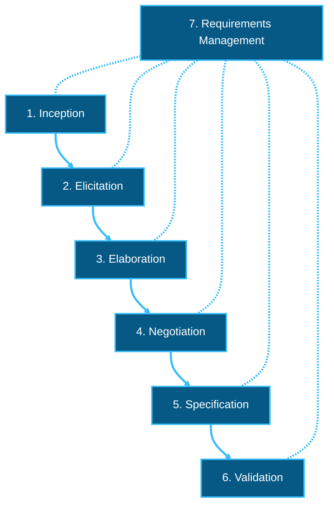

```text
[1. Inception] → [2. Elicitation] → [3. Elaboration]
       → [4. Negotiation] → [5. Specification] → [6. Validation]
[7. Requirements Management] spans and tracks all six activities above.
```

#### 2. Detailed Breakdown of the Seven Tasks (10 Marks Format)

| Task Name | Purpose & Definition | Typical Activities | Primary Output Work Product | Concise Real-World Example |
| :--- | :--- | :--- | :--- | :--- |
| **1. Inception** | Establish basic project understanding, business context, problem scope, and initial stakeholder collaboration. | Identify stakeholders, define business goals, evaluate high-level feasibility, and establish initial communication channels. | Project Charter, Vision Document, and High-Level Business Scope. | *E-Commerce Portal:* Identifying the Sponsor, Marketing Team, and Logistics Vendor to agree on building an online store. |
| **2. Elicitation** | Gather and discover explicit and implicit requirements from stakeholders. *(Stakeholders are explicitly considered here!)* | Conduct JAD (Joint Application Development) workshops, user interviews, surveys, observation, and scenario brainstorming. | Raw Feature List, Usage Scenarios, and User Stories. | *Hospital System:* Interviewing Doctors, Nurses, and Receptionists to capture patient intake workflows. |
| **3. Elaboration** | Refine, expand, and structure raw requirements into formal analysis models. | Create scenario-based models (Use Cases), flow-oriented models (DFDs), data models (ERDs), and behavioral models (STDs). | Detailed Analysis Models (Use Case Diagrams, Level-1 DFDs, ERDs). | *SafeHome System:* Expanding "monitor alarm" into DFD Process `2.0 Monitor Sensors` and Process `3.0 Process Alarm`. |
| **4. Negotiation** | Resolve conflicting stakeholder demands and prioritize features under budget/schedule constraints. | Rank requirements (e.g., MoSCoW method), evaluate cost vs. benefit trade-offs, and adjust scope. | Prioritized Requirement Matrix and Win-Win Agreement Baseline. | *Banking App:* Balancing Marketing's demand for 1-click transfers against Security's demand for OTP verification. |
| **5. Specification** | Formalize requirements into an official, unambiguous engineering document. | Document functional and non-functional requirements, data dictionaries, interface specs, and system constraints. | Software Requirements Specification (SRS) document (IEEE 830 standard). | Writing formal SRS section 3.2 detailing exact API payload structures and response time limits (< 500 ms). |
| **6. Validation** | Review and audit the specification to ensure it accurately reflects stakeholder needs and contains no defects. | Conduct formal technical reviews (FTR), requirements walkthroughs, consistency checks, and testability audits. | Signed-off Validated SRS, Review Defect Log, and Initial Acceptance Test Plan. | Audit team verifies that every requirement in SRS has a unique ID and a corresponding validation test case. |
| **7. Requirements Management** | Track, control, and manage changes to requirements across the entire software lifecycle. | Establish change control boards (CCB), maintain traceability matrices, and perform impact analysis for proposed changes. | Requirements Traceability Matrix (RTM) and Change Impact Reports. | Mapping Requirement `REQ-042` to DFD Process `2.1`, Code File `Sensor.java`, and Test Case `TC-108`. |

---

### Group 1.3: Elicitation Difficulties & Validation Checks

#### Question 1.3.1 [Practice Question]
> **Source:** Standard Textbook Analysis (Pressman Ch 5 / Sommerville Ch 4)  
> **Marks:** 10 Marks  
> **Question wording as reported in original bank:**  
> Explain the key difficulties encountered during the requirements elicitation task. Describe the formal verification checks performed during requirements validation to ensure SRS quality.

---

### Complete Answer for Group 1.3

#### 1. Key Difficulties in Requirements Elicitation

Requirements elicitation is recognized as one of the most challenging human-communication activities in software engineering due to three major problem categories:

```text
Elicitation Difficulties:
  ├── 1. Problems of Scope (System boundaries ill-defined or technical details stated prematurely)
  ├── 2. Problems of Understanding (Users unsure of needs, domain jargon, or "Yes-But" Syndrome)
  └── 3. Problems of Volatility (Requirements change continuously over time)
```

1. **Problems of Scope:**
   * Stakeholders specify unnecessary technical details rather than core business objectives.
   * The system boundaries are ill-defined, making it difficult to determine what is inside versus outside the system scope.
2. **Problems of Understanding:**
   * *Domain Jargon Gap:* Users speak in business/domain language; developers speak in technical/architectural language.
   * *Omission of "Obvious" Knowledge:* Stakeholders omit fundamental workflow rules because they take them for granted.
   * *The "Yes-But" Syndrome:* Users cannot articulate their needs until they see an operational prototype, at which point they say: *"Yes, that's what I asked for, BUT what I really need is..."*
3. **Problems of Volatility:**
   * Requirements change continuously over time due to market competition, regulatory updates, or changing organizational leadership.

#### 2. Formal Verification Checks During Requirements Validation

During requirements validation, a formal technical review (FTR) team audits the SRS against **six quality criteria**:

1. **Completeness Check:** Ensures no required function, performance constraint, or external interface description has been omitted.
2. **Consistency Check:** Ensures requirements do not contradict one another (e.g., Section 3.1 stating "system shall support 10,000 concurrent users" while Section 3.4 states "maximum server memory support is 2 GB").
3. **Technical Feasibility Check:** Verifies that requirements can be implemented within the allocated hardware, operating environment, technology stack, and budget.
4. **Unambiguity Check:** Ensures every requirement has exactly one clear interpretation (removing vague words like *fast, user-friendly, prompt*).
5. **Verifiability (Testability) Check:** Verifies that every requirement is stated in measurable terms so an automated or manual test case can definitively pass or fail it.
6. **Traceability Check:** Confirms that every requirement can be traced back to a business origin (forward/backward traceability).

---

## Topic Group 2: Analysis Modeling Elements & Viewpoints

### Group 2.1: Multi-Viewpoint Analysis & Model Elements Mapping

#### Question 2.1.1 [Reported PYQ (unverified)]
> **Source:** Mumbai University / TechMax (Section 3.2 / Q3.2.1) / Software Engineering (SE).pdf  
> **Exam & Year:** B.E. Sem VI (IT/Comp) Final Exam  
> **Marks:** 10 Marks / 5 Marks  
> **Question wording as reported in original bank:**  
> Explain the various elements of analysis modeling in detail. How does each element represent software requirements from a specific viewpoint?

#### Question 2.1.2 [Reported PYQ (unverified)]
> **Source:** SVKM's NMIMS Semester V Examination  
> **Marks:** 10 Marks  
> **Question wording as reported in original bank:**  
> Why does the analysis model represent software requirements from multiple viewpoints? Map each element of the analysis model to its corresponding UML/DFD diagram artifact.

---

### Shared Complete Answer for Group 2.1

#### 1. Why Requirements Require Multiple Viewpoints
A complex software system cannot be understood or communicated through a single diagram or text document. Different stakeholders require different perspectives:
* **End Users** care about interaction workflows (*User Viewpoint*).
* **Data Architects** care about stored entities and schema relationships (*Data Viewpoint*).
* **System Designers** care about functional data transformations (*Flow Viewpoint*).
* **Systems Engineers** care about event-driven state changes (*Behavioral Viewpoint*).

The Analysis Model satisfies these diverse needs by categorizing requirements into **four core modeling element domains**.

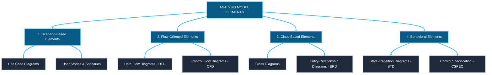

```text
                         +-----------------------------------+
                         |      ANALYSIS MODEL ELEMENTS      |
                         +-----------------------------------+
                                           |
        +------------------+---------------+------------------+------------------+
        |                  |                                  |                  |
        v                  v                                  v                  v
[1. Scenario-Based] [2. Flow-Oriented]                  [3. Class-Based]   [4. Behavioral]
  • Use Cases         • Data Flow Diagrams (DFD)          • Class Diagrams   • State Diagrams (STD)
  • User Stories      • Control Flow Diagrams (CFD)       • ER Diagrams      • CSPEC & State Tables
```

#### 2. Detailed Classification of Analysis Model Elements (10 Marks Format)

##### A. Scenario-Based Elements (User Viewpoint)
* **Description:** Depicts the system from the external user's perspective, capturing how actors interact with the system to achieve specific operational goals.
* **Artifacts:** Use Case Diagrams, Use Case Specifications, User Stories, and Activity Diagrams.
* **Example:** A `Homeowner` interacting with `Configure System` in a security application.

##### B. Flow-Oriented Elements (Transform Viewpoint)
* **Description:** Represents the system as an information transform, illustrating how data objects enter the system, flow through functional processes, undergo transformation, and exit or persist in data stores.
* **Artifacts:** Data Flow Diagrams (Context Level-0, Level-1, Level-2 DFDs), Control Flow Diagrams (CFD), Process Specifications (PSPEC), and Data Dictionary (DD).
* **Example:** `Raw Sensor Signal` flowing into Process `2.1 Read Sensors` and producing `Validated Alarm Event`.

##### C. Class-Based Elements (Static Structural Viewpoint)
* **Description:** Defines the static object-oriented domain structure, modeling the data objects (classes), their internal attributes, operational behaviors, and static structural relationships.
* **Artifacts:** Class Diagrams, Object Diagrams, Entity-Relationship Diagrams (ERD), and Collaboration Diagrams.
* **Example:** Class `Sensor` containing attributes `sensorId, location, status` related to Class `ControlPanel`.

##### D. Behavioral Elements (Dynamic State Viewpoint)
* **Description:** Depicts how external events or temporal triggers change the internal operational state of the system or its residing objects.
* **Artifacts:** State-Transition Diagrams (STD), State Tables, Sequence Diagrams, and Control Specifications (CSPEC).
* **Example:** System transitioning from `System Disarmed` state to `System Armed` state upon event `armSystem(pin)`.

---

## Topic Group 3: Data Modeling Concepts & Relationship Analysis

### Group 3.1: Data Objects, Attributes, Relationships, Cardinality & Modality

#### Question 3.1.1 [Reported PYQ (unverified)]
> **Source:** Mumbai University / TechMax / Pressman Ch 6 / SE_UNIT_4_C_DIV.pdf  
> **Exam & Year:** B.E. Sem V/VI Final Examination (Session Unspecified)  
> **Marks:** 10 Marks / 5 Marks  
> **Question wording as reported in original bank:**  
> Explain the three interrelated pieces of information in a data model: Data Objects, Attributes, and Relationships. Define Cardinality and Modality with a neat ERD example.

#### Question 3.1.2 [Practice Question]
> **Source:** Standard Analysis Problem  
> **Marks:** 5 Marks  
> **Question wording as reported in original bank:**  
> Analyze the ERD relationship between `Customer` and `Order`. Evaluate cardinality and modality in both directions: (1,1) to (0,N).

---

### Shared Complete Answer for Group 3.1

#### 1. The Three Interrelated Pieces of Data Modeling
Data modeling examines data objects independently of processing functions. It consists of three fundamental building blocks:

1. **Data Object:** A representation of virtually any composite information that must be understood, stored, or manipulated by software. A data object can be a physical entity (e.g., `Car`), a role (e.g., `Customer`), an event (e.g., `Landing`), a organizational unit (e.g., `Department`), or a place (e.g., `Warehouse`).
2. **Attributes:** The specific properties, characteristics, or descriptors that define a data object instance. One attribute acts as a primary key/identifier.
   * *Example for object `Customer`:* `customerId` (Key), `name`, `address`, `creditLimit`.
3. **Relationships:** The logical connections that indicate how data objects are connected to one another.
   * *Example:* `Customer` *places* `Order`.

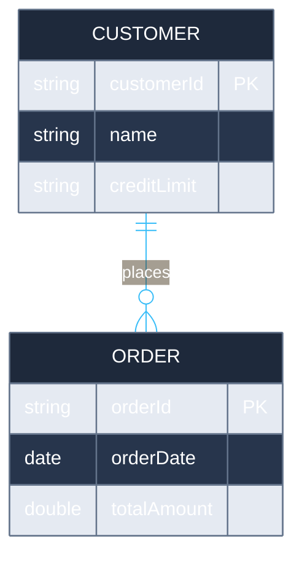

```text
[CUSTOMER] (1,1) ---------- < places > ---------- (0,N) [ORDER]
```

#### 2. Structural Constraints: Cardinality and Modality

Data models define two critical structural constraints on relationships:

##### A. Cardinality (Maximum Occurrences)
* **Definition:** Specifies the maximum number of object occurrences in Entity A that can be related to the number of occurrences in Entity B.
* **Values:**
  * **One-to-One (1:1):** One occurrence of A relates to at most one occurrence of B.
  * **One-to-Many (1:N):** One occurrence of A relates to many occurrences of B.
  * **Many-to-Many (M:N):** Many occurrences of A relate to many occurrences of B.

##### B. Modality (Minimum Occurrences / Obligation)
* **Definition:** Specifies the minimum number of occurrences required in the relationship (whether the relationship is mandatory or optional).
* **Values:**
  * **Modality = 1 (Mandatory):** An occurrence of Entity A *must* be associated with at least one occurrence of Entity B.
  * **Modality = 0 (Optional):** An occurrence of Entity A *can exist* without being associated with any occurrence of Entity B.

#### 3. Dual-Direction Constraint Analysis Example (`Customer` and `Order`)

Let us evaluate the relationship: **`Customer` places `Order`**

| Direction | Constraint Notation | Cardinality | Modality | Plain English Explanation |
| :--- | :---: | :---: | :---: | :--- |
| **Customer → Order** | **(0, N)** | **Many (N)** | **Optional (0)** | A registered `Customer` can place **zero** orders (e.g., newly registered account) or **many (N)** orders over time. |
| **Order → Customer** | **(1, 1)** | **One (1)** | **Mandatory (1)** | An `Order` **must** be placed by **exactly one (1)** mandatory `Customer`. An order cannot exist without a customer. |

---

## Topic Group 4: Data Flow Diagrams (DFD) — Scenarios & Decomposition

### Group 4.1: Student Enrollment System DFD (Level-0, Level-1, Level-2 & Functional Decomposition)

#### Question 4.1.1 [Reported PYQ (verification pending)]
> **Source:** SVKM's NMIMS Mukesh Patel School of Technology Management & Engineering  
> **Exam & Year:** B.Tech / MBA Tech Semester V Final Examination (Acad. Year 2025-2026 / 2024-2025; Date: 09 Dec 2025)  
> **Paper Code:** Software Engineering (702IT0C016 / `ANS_Final-Exam_Software Engineering` / `QP_Final-Exam`), Question Q4(b)  
> **Marks & Level:** 10 Marks [CO-3; BL-L]  
> **Question wording as reported in original bank:**  
> Explain how a Level-0, Level-1, and Level-2 Data Flow Diagram (DFD) can be applied in the design of a Student Enrollment System. How do successive levels increase the detail and functional decomposition of the process?

---

### Complete Answer for Group 4.1

#### 1. System Assumptions & Element Identification
To model the **Student Enrollment System**, we extract the core entities, processes, stores, and flows:
* **External Entities:** `Student`, `Admin`, `Finance Department`.
* **Data Stores:** `D1: Student Database`, `D2: Course Catalog`, `D3: Finance Database`.
* **Main External Boundary Flows:** `Application Submission`, `Confirmation Message`, `System Rules & Approval`, `Enrollment Reports`, `Invoices`, `Payment Details`.

#### 2. Level-0 DFD (Context Diagram)

The Context Diagram represents the entire Student Enrollment System as a single process bubble (`0.0`), establishing the global system boundary and external interfaces.

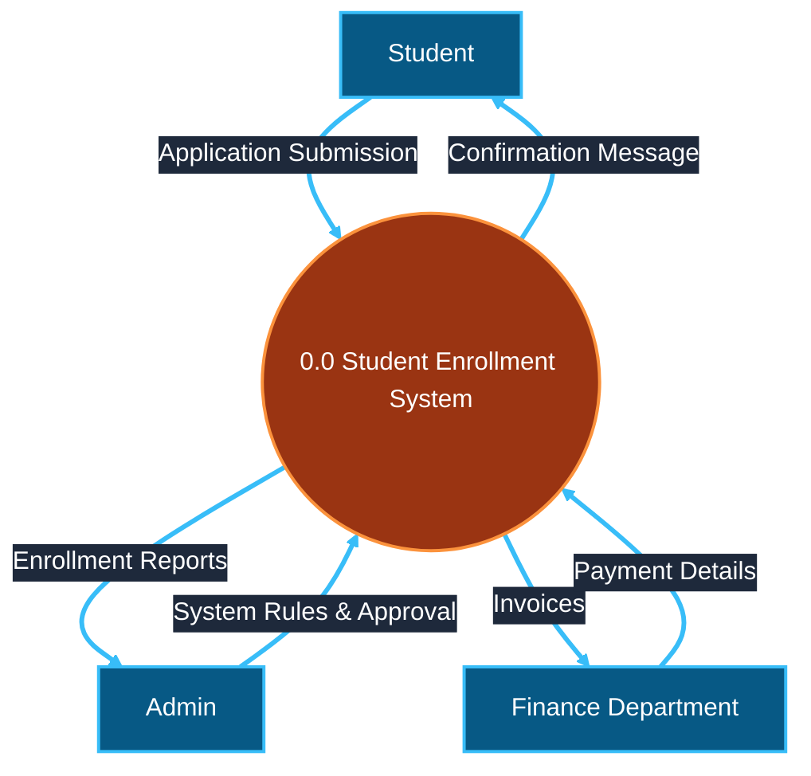

```text
FLOW FALLBACK (Level-0 Context DFD):
  [Student] → ((0.0 Student Enrollment System)) [flow: Application Submission]
  ((0.0 Student Enrollment System)) → [Student] [flow: Confirmation Message]
  [Admin] → ((0.0 Student Enrollment System)) [flow: System Rules & Approval]
  ((0.0 Student Enrollment System)) → [Admin] [flow: Enrollment Reports]
  ((0.0 Student Enrollment System)) → [Finance Department] [flow: Invoices]
  [Finance Department] → ((0.0 Student Enrollment System)) [flow: Payment Details]
```

#### 3. Level-1 DFD (System Overview)

Level-1 decomposes Process `0.0` into four major sub-processes and introduces data stores.

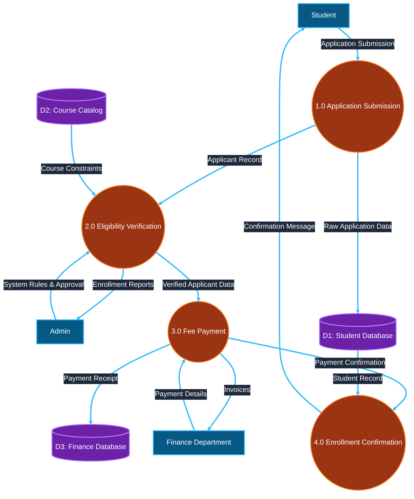

```text
FLOW FALLBACK (Level-1 DFD):
  [Student] → ((1.0 Application Submission)) [flow: Application Submission]
  ((1.0 Application Submission)) → [(D1: Student Database)] [flow: Raw Application Data]
  ((1.0 Application Submission)) → ((2.0 Eligibility Verification)) [flow: Applicant Record]
  [(D2: Course Catalog)] → ((2.0 Eligibility Verification)) [flow: Course Constraints]
  [Admin] → ((2.0 Eligibility Verification)) [flow: System Rules & Approval]
  ((2.0 Eligibility Verification)) → [Admin] [flow: Enrollment Reports]
  ((2.0 Eligibility Verification)) → ((3.0 Fee Payment)) [flow: Verified Applicant Data]
  ((3.0 Fee Payment)) → [Finance Department] [flow: Invoices]
  [Finance Department] → ((3.0 Fee Payment)) [flow: Payment Details]
  ((3.0 Fee Payment)) → [(D3: Finance Database)] [flow: Payment Receipt]
  ((3.0 Fee Payment)) → ((4.0 Enrollment Confirmation)) [flow: Payment Confirmation]
  [(D1: Student Database)] → ((4.0 Enrollment Confirmation)) [flow: Student Record]
  ((4.0 Enrollment Confirmation)) → [Student] [flow: Confirmation Message]
```

#### 4. Level-2 DFD (Decomposition of Process `2.0 Eligibility Verification`)

Refines Process `2.0` into sub-processes `2.1, 2.2, 2.3`. The three incoming flows and two outgoing flows have **exactly the same boundary labels** as the Level-1 parent. Boundary boxes below are interface placeholders, not additional external entities or data stores.

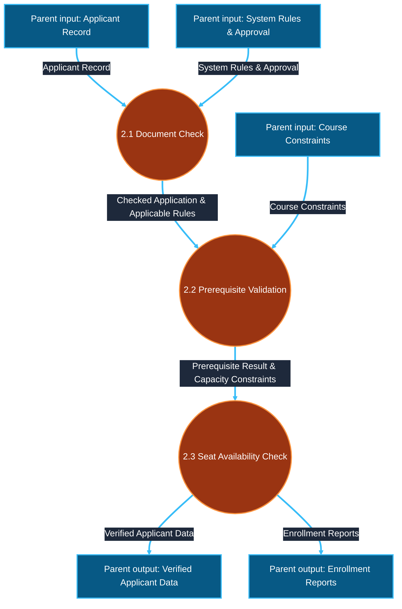

```text
FLOW FALLBACK (Level-2 DFD - Process 2.0 Refinement):
  (Parent input: Applicant Record) → ((2.1 Document Check)) [flow: Applicant Record]
  (Parent input: System Rules & Approval) → ((2.1 Document Check)) [flow: System Rules & Approval]
  ((2.1 Document Check)) → ((2.2 Prerequisite Validation)) [flow: Checked Application & Applicable Rules]
  (Parent input: Course Constraints) → ((2.2 Prerequisite Validation)) [flow: Course Constraints]
  ((2.2 Prerequisite Validation)) → ((2.3 Seat Availability Check)) [flow: Prerequisite Result & Capacity Constraints]
  ((2.3 Seat Availability Check)) → (Parent output to process 3.0) [flow: Verified Applicant Data]
  ((2.3 Seat Availability Check)) → (Parent output to Admin) [flow: Enrollment Reports]
```

The course constraints from the parent include prerequisite and capacity information. The earlier unbalanced `Academic History` input from D1 is not introduced as an extra child-boundary flow; any additional academic history needed would require an explicit corresponding input at the parent level. This keeps the worked example's scope consistent.

#### 5. Input/Output DFD Balancing Audit Table

The **context-to-Level-1** audit checks only the system's external boundary; the **process-2.0-to-Level-2** audit checks only process 2.0's interface. An input to another Level-1 process is not required to reappear in the Level-2 refinement of process 2.0.

| Flow | Level-0 context boundary | Level-1 boundary | Level-2 process 2.0 boundary | Status |
| :--- | :--- | :--- | :--- | :--- |
| `Application Submission` | Student to system | Student to process 1.0 | Not in process 2.0 | Balanced at context boundary |
| `Confirmation Message` | System to Student | Process 4.0 to Student | Not in process 2.0 | Balanced at context boundary |
| `System Rules & Approval` | Admin to system | Admin to process 2.0 | Parent input to process 2.1, same label | Balanced at both applicable boundaries |
| `Enrollment Reports` | System to Admin | Process 2.0 to Admin | Process 2.3 to parent output, same label | Balanced at both applicable boundaries |
| `Invoices` | System to Finance Department | Process 3.0 to Finance Department | Not in process 2.0 | Balanced at context boundary |
| `Payment Details` | Finance Department to system | Finance Department to process 3.0 | Not in process 2.0 | Balanced at context boundary |
| `Applicant Record` | Internal to Level 1 | Process 1.0 to process 2.0 | Parent input to process 2.1, same label | Balanced at process 2.0 boundary |
| `Course Constraints` | Internal to Level 1 | D2 Course Catalog to process 2.0 | Parent input to process 2.2, same label | Balanced at process 2.0 boundary |
| `Verified Applicant Data` | Internal to Level 1 | Process 2.0 to process 3.0 | Process 2.3 to parent output, same label | Balanced at process 2.0 boundary |

**Result:** All six external context flows are preserved at Level 1. All three inputs and two outputs of process 2.0 are preserved in its Level-2 refinement. The three Level-2 input connectors represent the parent boundary, not new external actors.

---

### Group 4.2: Online Logistics / Inventory Management System DFD (Level 0 and Level 1)

#### Question 4.2.1 [Reported PYQ (verification pending)]
> **Source:** SVKM's NMIMS / Mumbai University Examination  
> **Exam & Year:** B.Tech 3rd Year Sem V Re-Examination (Year 2022-2023; Document: `JFJNM3vEUk`)  
> **Paper Code:** Software Engineering, Question Q4(b)  
> **Marks & Level:** 10 Marks [CO-3,2; SO-6; BL-Develop]  
> **Question wording as reported in original bank:**  
> Online logistics (inventory) management system is an online software application which fulfills the requirement of a typical logistics management in various company locations. It provides the interface to the employees to manage the inventory transactions on a regular basis including daily stock analysis, status report generation, sourcing and stocking items. Develop a Level 0 and Level 1 Data Flow Diagram (DFD) for the above software system. Assumptions made, if any, to be clearly stated.

---

### Complete Answer for Group 4.2

#### 1. System Assumptions & Element Extraction
* **Assumptions:**
  1. `Warehouse Employee` enters daily stock transactions and sourcing requests.
  2. `Logistics Manager` reviews stock analysis and approves sourcing/stocking orders.
  3. `Supplier` receives purchase orders and dispatches stock shipments.
* **Entities:** `Warehouse Employee`, `Logistics Manager`, `Supplier`.
* **Data Stores:** `D1: Inventory Database`, `D2: Sourcing & Order Log`.

#### 2. Level-0 DFD (Context Diagram)

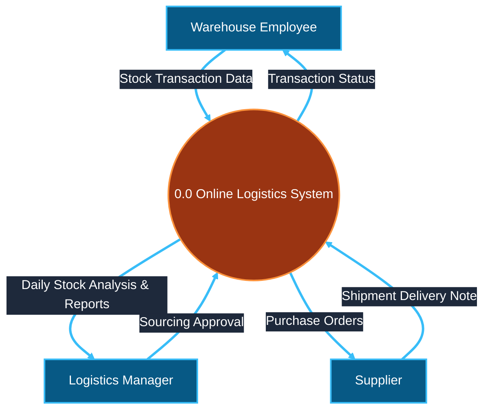

```text
FLOW FALLBACK (Logistics Level-0 Context DFD):
  [Warehouse Employee] → ((0.0 Online Logistics System)) [flow: Stock Transaction Data]
  ((0.0 Online Logistics System)) → [Warehouse Employee] [flow: Transaction Status]
  ((0.0 Online Logistics System)) → [Logistics Manager] [flow: Daily Stock Analysis & Reports]
  [Logistics Manager] → ((0.0 Online Logistics System)) [flow: Sourcing Approval]
  ((0.0 Online Logistics System)) → [Supplier] [flow: Purchase Orders]
  [Supplier] → ((0.0 Online Logistics System)) [flow: Shipment Delivery Note]
```

#### 3. Level-1 DFD (Logistics Subsystem Overview)

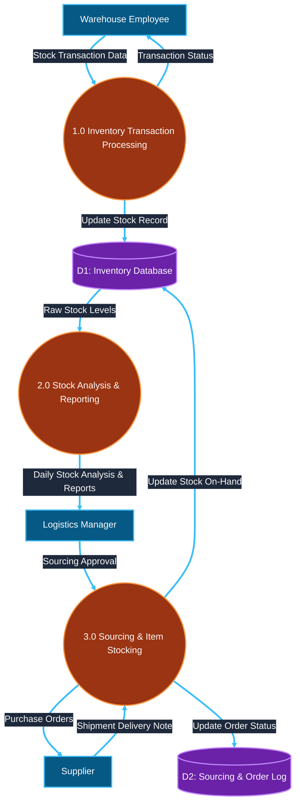

```text
FLOW FALLBACK (Logistics Level-1 DFD):
  [Warehouse Employee] → ((1.0 Inventory Transaction Processing)) [flow: Stock Transaction Data]
  ((1.0 Inventory Transaction Processing)) → [(D1: Inventory Database)] [flow: Update Stock Record]
  ((1.0 Inventory Transaction Processing)) → [Warehouse Employee] [flow: Transaction Status]
  [(D1: Inventory Database)] → ((2.0 Stock Analysis & Reporting)) [flow: Raw Stock Levels]
  ((2.0 Stock Analysis & Reporting)) → [Logistics Manager] [flow: Daily Stock Analysis & Reports]
  [Logistics Manager] → ((3.0 Sourcing & Item Stocking)) [flow: Sourcing Approval]
  ((3.0 Sourcing & Item Stocking)) → [Supplier] [flow: Purchase Orders]
  [Supplier] → ((3.0 Sourcing & Item Stocking)) [flow: Shipment Delivery Note]
  ((3.0 Sourcing & Item Stocking)) → [(D2: Sourcing & Order Log)] [flow: Update Order Status]
  ((3.0 Sourcing & Item Stocking)) → [(D1: Inventory Database)] [flow: Update Stock On-Hand]
```

---

### Group 4.3: E-Commerce / Online Shopping Website DFD (Level 0 and Level 1)

#### Question 4.3.1 [Reported PYQ (verification pending)]
> **Source:** SVKM's NMIMS / Mumbai University Examination  
> **Exam & Year:** B.Tech 3rd Year Sem V Re-Exam (Batch 2023-24 & 2024-25; Document: `yyq6EyhsfX`)  
> **Paper Code:** Software Engineering, Question Q5(b)  
> **Marks & Level:** 10 Marks [CO-2; SO-1; BL-L]  
> **Question wording as reported in original bank:**  
> Design DFD level 0 and DFD level 1 diagram for online shopping on ecommerce website.

---

### Complete Answer for Group 4.3

#### 1. System Assumptions & Element Extraction
* **Assumptions:**
  1. `Customer` browses products, places orders, and makes online payments.
  2. `Payment Gateway` verifies credit card/UPI payment transactions.
  3. `Merchant / Admin` updates product catalog and processes order fulfillment.
* **Entities:** `Customer`, `Payment Gateway`, `Admin`.
* **Data Stores:** `D1: Product Catalog`, `D2: Order Database`, `D3: Customer Profile`.

#### 2. Level-0 DFD (Context Diagram)

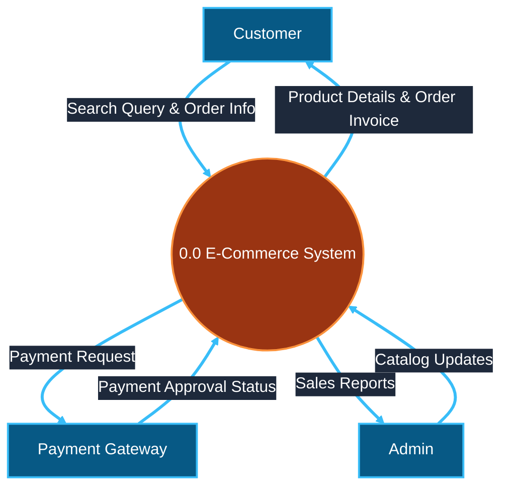

```text
FLOW FALLBACK (E-Commerce Level-0 Context DFD):
  [Customer] → ((0.0 E-Commerce System)) [flow: Search Query & Order Info]
  ((0.0 E-Commerce System)) → [Customer] [flow: Product Details & Order Invoice]
  ((0.0 E-Commerce System)) → [Payment Gateway] [flow: Payment Request]
  [Payment Gateway] → ((0.0 E-Commerce System)) [flow: Payment Approval Status]
  [Admin] → ((0.0 E-Commerce System)) [flow: Catalog Updates]
  ((0.0 E-Commerce System)) → [Admin] [flow: Sales Reports]
```

#### 3. Level-1 DFD (E-Commerce System Overview)

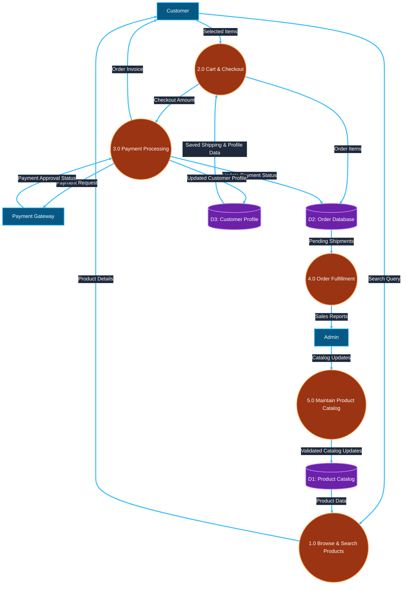

```text
FLOW FALLBACK (E-Commerce Level-1 DFD):
  [Customer] → ((1.0 Browse & Search Products)) [flow: Search Query]
  [(D1: Product Catalog)] → ((1.0 Browse & Search Products)) [flow: Product Data]
  ((1.0 Browse & Search Products)) → [Customer] [flow: Product Details]
  [Admin] → ((5.0 Maintain Product Catalog)) [flow: Catalog Updates]
  ((5.0 Maintain Product Catalog)) → [(D1: Product Catalog)] [flow: Validated Catalog Updates]
  [Customer] → ((2.0 Cart & Checkout)) [flow: Selected Items]
  [(D3: Customer Profile)] → ((2.0 Cart & Checkout)) [flow: Saved Shipping & Profile Data]
  ((2.0 Cart & Checkout)) → [(D2: Order Database)] [flow: Order Items]
  ((2.0 Cart & Checkout)) → ((3.0 Payment Processing)) [flow: Checkout Amount]
  ((3.0 Payment Processing)) → [Payment Gateway] [flow: Payment Request]
  [Payment Gateway] → ((3.0 Payment Processing)) [flow: Payment Approval Status]
  ((3.0 Payment Processing)) → [(D2: Order Database)] [flow: Update Payment Status]
  ((3.0 Payment Processing)) → [(D3: Customer Profile)] [flow: Updated Customer Profile]
  ((3.0 Payment Processing)) → [Customer] [flow: Order Invoice]
  [(D2: Order Database)] → ((4.0 Order Fulfillment)) [flow: Pending Shipments]
  ((4.0 Order Fulfillment)) → [Admin] [flow: Sales Reports]
```

---

### Group 4.4: SafeHome Security System DFD (Level 0, Level 1, Level 2 & Balancing Audit)

#### Question 4.4.1 [Adapted Practice Question; exam attribution unverified]
> **Reported attribution in original bank (unverified):** Pressman Ch 8 / TechMax / Mumbai University  
> **Reported exam/session (unverified):** B.E. Sem V/VI Final Examination (Session Unspecified)  
> **Marks:** 10 Marks  
> **Question wording as reported in original bank:**  
> Design Context Level-0, Level-1, and Level-2 Data Flow Diagrams for the SafeHome Security System. Demonstrate input/output balancing between Level-1 process 2.0 and its Level-2 decomposition.

---

> **Source-fidelity note:** The question and simplified diagrams below are a teaching adaptation inspired by the SafeHome material in `Unit 4.pdf`, not a transcription of the PDF figures or a verified past-paper question. The PDF also discusses the control panel, audible alarm, and telephone connection. Preserve the simplified model as a practice answer rather than claiming source-exact diagrams.

### Complete Answer for Group 4.4

#### 1. Context Level-0 DFD (SafeHome)

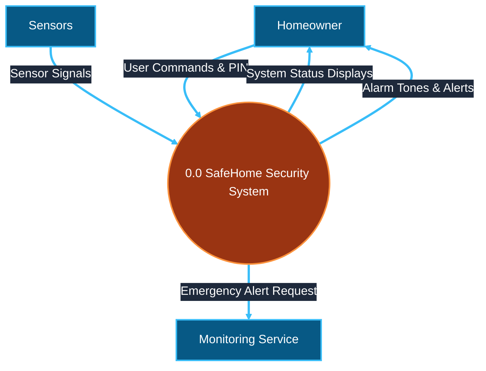

#### 2. Level-1 DFD (SafeHome Overview)

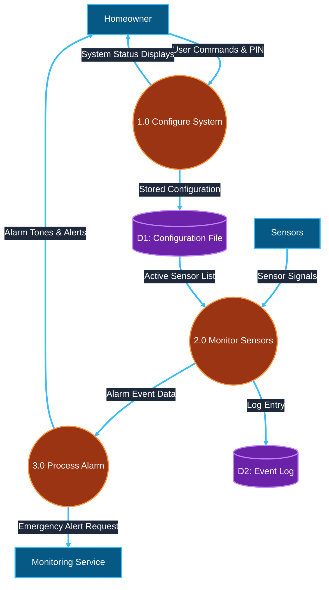

#### 3. Level-2 DFD (Decomposition of Process `2.0 Monitor Sensors`)

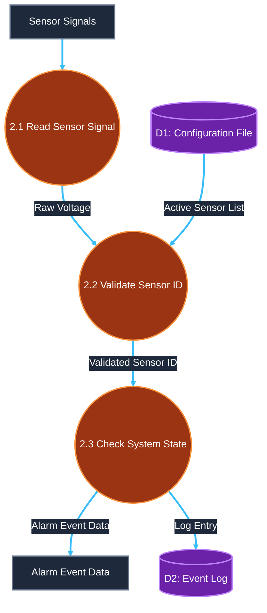

#### 4. Balancing Verification Table for SafeHome Process `2.0`

| Boundary Flow | Level-1 Process `2.0` Boundary | Level-2 Sub-processes (`2.1, 2.2, 2.3`) | Status |
| :--- | :--- | :--- | :---: |
| **Sensor Signals** | Input from `Sensors` entity | Input to Process `2.1` | **BALANCED** |
| **Active Sensor List** | Input from Store `D1` | Input to Process `2.2` | **BALANCED** |
| **Alarm Event Data** | Output to Process `3.0` | Output from Process `2.3` | **BALANCED** |
| **Log Entry** | Output to Store `D2` | Output from Process `2.3` | **BALANCED** |

---

## Topic Group 5: Event-Driven Control-Flow Modeling (CFD, CSPEC vs PSPEC)

### Group 5.1: Control Flow Modeling vs. Data Flow Modeling in Real-Time Systems

#### Question 5.1.1 [Reported PYQ (verification pending)]
> **Source:** SVKM's NMIMS / Mumbai University Examination  
> **Exam & Year:** B.Tech 3rd Year Sem V Re-Exam (Batch 2023-24 & 2024-25; Document: `yyq6EyhsfX`)  
> **Paper Code:** Software Engineering, Question Q2(b)  
> **Marks & Level:** 10 Marks [CO-2; SO-1; BL-H]  
> **Question wording as reported in original bank:**  
> Evaluate the effectiveness of using a Control Flow Model for real-time systems compared to a Data Flow Model. In which scenarios would one model be more suitable than the other, and why?

---

### Complete Answer for Group 5.1

#### 1. Conceptual Distinction Between Data-Driven & Event-Driven Systems
* **Data Flow Model (DFD):** Treats the system as an **information transform**. Processes are activated whenever input data arrives. DFDs answer the question: *"What functional transformations happen to data objects as they move through the system?"*
* **Control Flow Model (CFD):** Treats the system as a **reactive state machine**. Control flows (events, interrupts, signals) are superimposed over the DFD using dashed arrows entering a vertical bar that represents a **Control Specification (CSPEC)**. CFDs answer the question: *"When and under what exact event conditions are processes activated or deactivated?"*

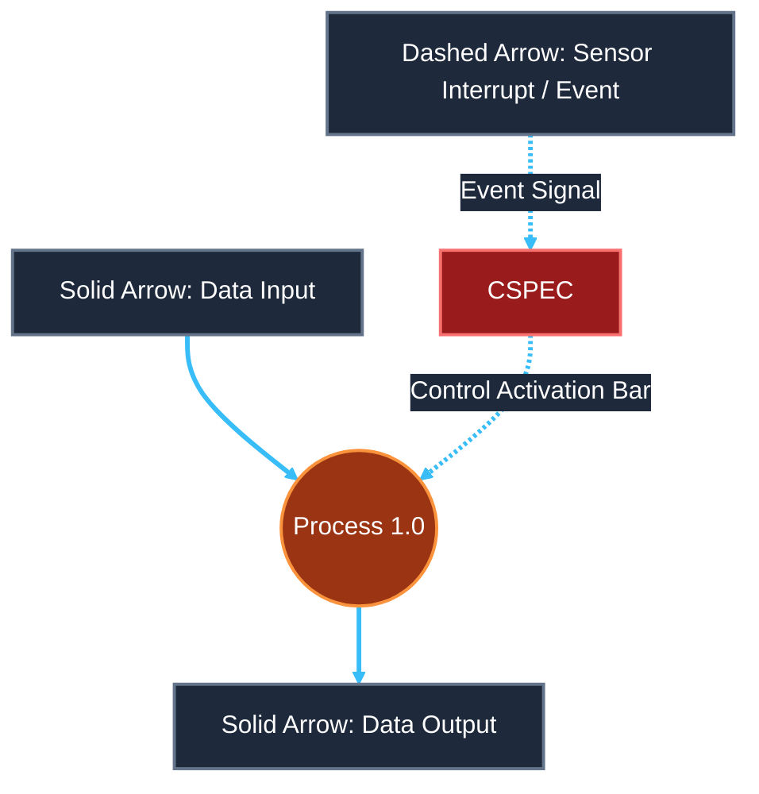

```text
FLOW FALLBACK (CFD Superimposition):
  [Data Input] → ((Process 1.0)) [flow: data input; solid data-flow arrow]
  ((Process 1.0)) → [Data Output] [flow: data output; solid data-flow arrow]
  [Sensor Event] → [CSPEC] [flow: event signal; dashed control-flow arrow]
  [CSPEC] → ((Process 1.0)) [flow: activate/deactivate; dashed control-flow arrow]
```

#### 2. Comparative Evaluation Matrix (10 Marks Structure)

| Evaluation Parameter | Data Flow Model (DFD) | Control Flow Model (CFD / CSPEC) |
| :--- | :--- | :--- |
| **Primary Focus** | Data transformations, information flow, and storage. | Event detection, interrupt handling, state transitions, and process activation. |
| **Notation Style** | Solid arrows for data flows; circles/ovals for processes. | **Dashed arrows** for control flows/events; **vertical bars** for CSPEC interfaces. |
| **Process Trigger** | Data arrival (passive execution). | Discrete Boolean event signals, switches, or timer interrupts (active control). |
| **Execution Nature** | Sequential / Transformational. | Concurrent, reactive, and non-deterministic state-driven. |
| **Suitable Scenarios** | Business applications, batch processing, billing systems, E-commerce cart checkouts. | Real-time embedded systems, patient monitoring, avionics, motor control, home security alarms. |

#### 3. Scenario Suitability Justification
* **Scenario A: E-Commerce Shopping Cart (DFD is Superior):**
  * *Why:* The system handles business data transformations (calculating tax, updating database inventory). The execution order follows data availability without complex timing interrupts or hardware state switches.
* **Scenario B: Hospital Intensive Care Patient Monitor (CFD is Superior):**
  * *Why:* The system is event-driven and safety-critical. Heartbeat sensor signals trigger immediate hardware interrupts (`Arrhythmia Alert`). The system must instantly transition states and activate alarm sub-processes based on Boolean control signals regardless of background data batch processing.

---

### Group 5.2: Control Specification (CSPEC) vs. Process Specification (PSPEC)

#### Question 5.2.1 [Reported PYQ (unverified)]
> **Source:** Mumbai University / TechMax (Section 3.11 / Fig 3.11.7) / Pressman Ch 8  
> **Exam & Year:** B.E. Sem V/VI Final Examination (Session Unspecified)  
> **Marks:** 10 Marks / 5 Marks  
> **Question wording as reported in original bank:**  
> Explain how Control Flow Diagrams (CFD) superimpose event control onto Data Flow Diagrams. Distinguish Control Specification (CSPEC) from Process Specification (PSPEC).

---

### Complete Answer for Group 5.2

#### 1. Superimposing Control Flow onto Data Flow
In real-time analysis, control flows are represented as **dashed arrows** that enter or leave a vertical bar representing the **CSPEC**:
1. **Dashed arrow entering a CSPEC vertical bar:** Indicates an input control signal (e.g., `Sensor Tripped`, `Power Switch On`).
2. **Dashed arrow entering a process bubble:** Represents a control input read directly by the process (e.g., `Mode Selection`).
3. **Dashed arrow leaving a process bubble:** Represents a data condition produced by the process (e.g., `Buffer Full`, `Temperature > Threshold`).
4. **Control flows do not physically transform data;** they tell the CSPEC which processes to physically enable or disable.

#### 2. Detailed Distinction Between CSPEC and PSPEC

```text
                   +-------------------------------------------------+
                   |           SPECIFICATION ARTIFACTS                |
                   +-------------------------------------------------+
                                       |
                       +---------------+---------------+
                       |                               |
        +-----------------------------------+       +-----------------------------------+
        |  Process Specification (PSPEC)    |       |   Control Specification (CSPEC)   |
        +-----------------------------------+       +-----------------------------------+
        | • Describes WHAT a process does   |       | • Describes WHEN processes run    |
        | • Written for primitive processes |       | • State Transition Diagrams (STD) |
        | • Pseudocode, PDL, or Math Eqns   |       | • Process Activation Tables (PAT) |
        +-----------------------------------+       +-----------------------------------+
```

| Parameter | Process Specification (PSPEC) | Control Specification (CSPEC) |
| :--- | :--- | :--- |
| **Core Objective** | Defines the functional algorithmic logic performed *inside* a single primitive DFD process bubble. | Defines the event-driven behavior and process activation control for the *entire system level*. |
| **Scope** | Local (attached to one bottom-level process bubble). | Global / Regional (controls activation across multiple processes). |
| **Representation Format** | Structured English, Pseudocode, Program Design Language (PDL), decision tables, mathematical equations. | State-Transition Diagrams (STD), State Transition Tables, **Process Activation Tables (PAT)**, Combinatorial Logic. |
| **Key Question Answered** | *"How is input data mathematically or logically transformed into output data?"* | *"Which processes should be enabled or disabled right now based on incoming events?"* |

---

### Group 5.3: Event-Driven Analysis Control-Flow Diagram (CFD) vs. Program Control-Flow Graph (CFG)

#### Question 5.3.1 [Practice Question]
> **Source:** Structural Testing vs Requirements Analysis Background Clarification  
> **Marks:** 5 Marks  
> **Question wording as reported in original bank:**  
> Distinguish an Event-Driven Analysis Control-Flow Diagram (CFD/CSPEC) used in requirements modeling from a Program Control-Flow Graph (CFG) used in structural white-box testing.

---

### Complete Answer for Group 5.3

It is vital to distinguish between two completely different concepts that both contain the words "Control Flow":

```text
               "CONTROL FLOW" DIAGRAMUAL CONFUSION
                                |
        +-----------------------+-----------------------+
        |                                               |
[1. Analysis Control Flow Diagram (CFD)]   [2. Program Control Flow Graph (CFG)]
  • Domain: Requirements Engineering          • Domain: Structural Software Testing
  • Used in: Event-driven analysis            • Used in: McCabe's Cyclomatic Complexity
  • Components: Sensors, Events, CSPEC        • Components: Nodes (Statements), Edges (Branches)
```

1. **Analysis Control-Flow Diagram (CFD / CSPEC):**
   * **SDLC Phase:** Requirements Analysis / Specification (High-Level).
   * **Purpose:** Models external events, hardware sensor signals, operator switches, and state transitions in reactive real-time systems.
   * **Structure:** Superimposes dashed control arrows over DFD process bubbles and interfaces with a CSPEC (State Transition Diagram / Process Activation Table).
2. **Program Control-Flow Graph (CFG):**
   * **SDLC Phase:** Software Testing / Implementation Verification (Low-Level Code).
   * **Purpose:** Models procedural code execution logic (if-else branches, loops, case statements) inside a single source code module.
   * **Structure:** Consists of nodes (basic blocks of code statements) and directed edges (control branch transfers). Used to calculate **McCabe's Cyclomatic Complexity (V(G) = E − N + 2P)** to determine the number of independent test paths.

---

## Source-Status Verification Checklist

**Verification rule:** Original exam papers were not included in the supplied attachments. All formerly verified exam-paper claims are marked **reported, verification pending**; the original source strings and question wordings are retained as reported. Guide/textbook-derived prompts and adapted SafeHome diagrams do not establish exam provenance.


| Question ID | Topic Covered | Document Source / Exam Session | Claimed Status | Verification Status |
| :--- | :--- | :--- | :---: | :---: |
| **Q1.1.1** | Role of RE in Project Success | SVKM's NMIMS Final Exam 2025-2026 (702IT0C016), Q4(a) | **Reported PYQ (verification pending)** | Verification pending: original exam paper not supplied for this review|
| **Q1.1.2** | Role of RE & Preventing Project Failure | TechMax / Easy Solutions / MU Exam | **Reported PYQ (unverified)** | ⚠️ Unverified Source |
| **Q1.2.1** | Seven Phases / Tasks of RE | SE 3rd Year Sem V Re-Exam 2022-2023 (`JFJNM3vEUk`), Q5(a) | **Reported PYQ (verification pending)** | Verification pending: original exam paper not supplied for this review|
| **Q1.2.2** | Major RE Activities & Stakeholders | TechMax Section 2.1.1 / Easy Solutions Q.2.1.2 | **Reported PYQ (unverified)** | ⚠️ Unverified Source |
| **Q1.3.1** | Elicitation Difficulties & Validation Checks | Textbook Analysis (Pressman Ch 5 / Sommerville Ch 4) | **Practice Question** | 🔵 Newly Written Practice Question |
| **Q2.1.1** | Four Elements of Analysis Modeling | TechMax Section 3.2 (Q3.2.1) / `Software Engineering (SE).pdf` | **Reported PYQ (unverified)** | ⚠️ Unverified Source |
| **Q2.1.2** | Multi-Viewpoint Analysis Modeling | SVKM's NMIMS Sem V Exam | **Reported PYQ (unverified)** | ⚠️ Unverified Source |
| **Q3.1.1** | Data Objects, Attributes, Relationships | Pressman Ch 6 / TechMax / `SE_UNIT_4_C_DIV.pdf` | **Reported PYQ (unverified)** | ⚠️ Unverified Source |
| **Q3.1.2** | Customer-Order ERD Dual Constraints | Standard Analysis Problem | **Practice Question** | 🔵 Newly Written Practice Question |
| **Q4.1.1** | Student Enrollment System DFD (L0, L1, L2) | SVKM's NMIMS Final Exam 2025-2026 (702IT0C016), Q4(b) | **Reported PYQ (verification pending)** | Verification pending: original exam paper not supplied for this review|
| **Q4.2.1** | Online Logistics System DFD (Level 0 & 1) | SE 3rd Year Sem V Re-Exam 2022-2023 (`JFJNM3vEUk`), Q4(b) | **Reported PYQ (verification pending)** | Verification pending: original exam paper not supplied for this review|
| **Q4.3.1** | E-Commerce Shopping Website DFD (Level 0 & 1) | SE Sem V Re-Exam 2023-2024 & 2024-2025 (`yyq6EyhsfX`), Q5(b) | **Reported PYQ (verification pending)** | Verification pending: original exam paper not supplied for this review|
| **Q4.4.1** | SafeHome Security System DFD (L0, L1, L2) | Reported: Pressman Ch 8 / TechMax / Mumbai University | **Adapted Practice Question** | PDF contains a SafeHome example; no matching original exam question supplied | |
| **Q5.1.1** | Control Flow Model vs Data Flow Model | SE Sem V Re-Exam 2023-2024 & 2024-2025 (`yyq6EyhsfX`), Q2(b) | **Reported PYQ (verification pending)** | Verification pending: original exam paper not supplied for this review|
| **Q5.2.1** | CSPEC vs PSPEC & CFD Event Controls | TechMax Section 3.11 / Pressman Ch 8 | **Reported PYQ (unverified)** | ⚠️ Unverified Source |
| **Q5.3.1** | CFD/CSPEC Analysis vs Program CFG Testing | Testing vs Analysis Distinction | **Practice Question** | 🔵 Newly Written Practice Question |

---

## Syllabus Coverage Audit Checklist

| Official Unit 4 Syllabus Topic | Syllabus Requirement | Covered in Question Groups | Coverage Status |
| :--- | :--- | :---: | :---: |
| **1. Requirements Engineering Tasks** | Inception, Elicitation, Elaboration, Negotiation, Specification, Validation, Management | **Group 1.1, Group 1.2, Group 1.3** | **100% FULL COVERAGE** |
| **2. Elements of Analysis Model** | Scenario-based, Flow-oriented, Class-based, Behavioral elements | **Group 2.1** | **100% FULL COVERAGE** |
| **3. Data Modeling Concepts** | Data Objects, Attributes, Relationships, Cardinality, Modality | **Group 3.1** | **100% FULL COVERAGE** |
| **4. Data Flow Diagrams (DFD)** | Context/Level-0, Level-1, Level-2 DFDs, Functional Decomposition, Balancing | **Group 4.1, Group 4.2, Group 4.3, Group 4.4** | **100% FULL COVERAGE** |
| **5. Control-Flow Modeling** | Event-driven systems, Sensors/Interrupts, CSPEC vs PSPEC, CFD vs CFG | **Group 5.1, Group 5.2, Group 5.3** | **100% FULL COVERAGE** |

---
