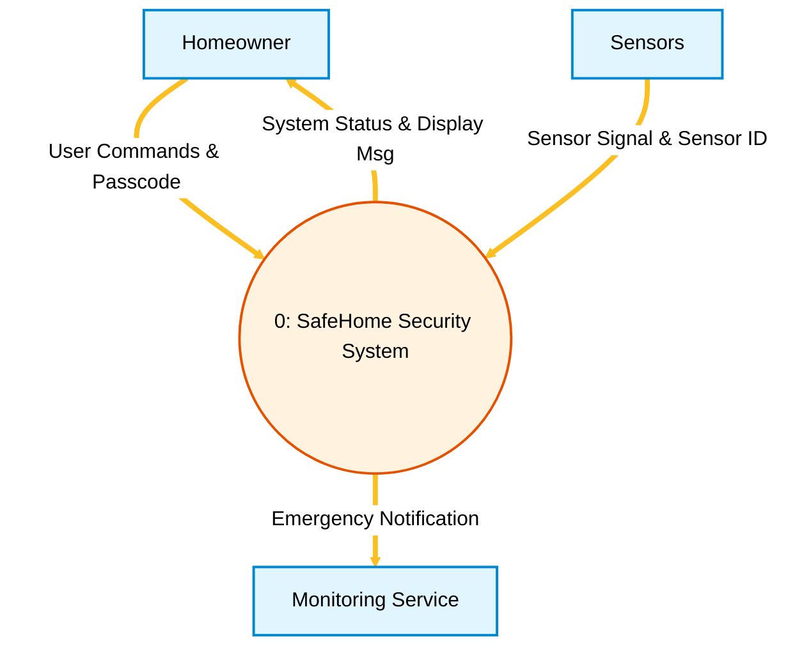
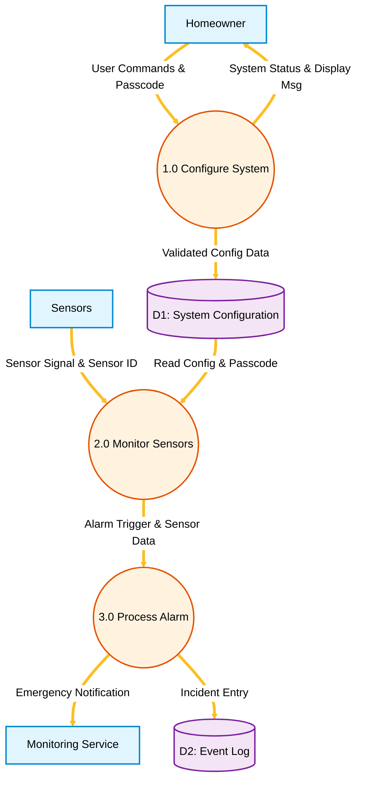
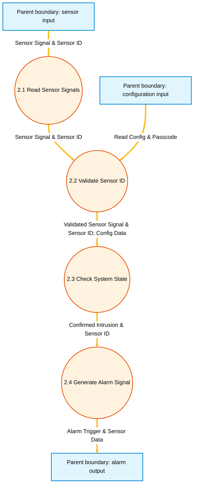

# Software Engineering Unit 4 Study Notes: Requirement Analysis & Design

---

## Document & Course Mapping

* **Course:** Software Engineering (SE)
* **Unit:** Unit 4 — Requirement Analysis & Design
* **Official Duration:** 03 Hours
* **Course Outcome Mapped:** CO-2 (*Demonstrate an understanding of various Analysis and Design models*)
* **Available primary sources:** Unit 4 syllabus and attached `Unit 4.pdf`. Other books and a chapter PDF named in the earlier draft have not been independently checked for this revision; treat those attributions as unverified.

---

## 1. Requirements Engineering Tasks

### 1.1 Overview & Definition
**Requirements Engineering (RE)** is the disciplined process of discovering, analyzing, documenting, and managing the services a system must provide and the constraints under which it must operate. 

Requirements engineering serves as the critical **connector** bridging project initiation, business objectives, analysis modeling, architectural design, and downstream software construction.

```text
+-----------------------------------------------------------------------------------+
|                            REQUIREMENTS ENGINEERING                               |
|   Connects Business Goals, Customer Expectations, and Software Implementation     |
+-----------------------------------------------------------------------------------+
       |              |               |               |              |
       v              v               v               v              v
  [Inception] -> [Elicitation] -> [Elaboration] -> [Negotiation] -> [Specification]
                                                                     |
                                                                     v
                                                            [Validation]
                                                                     |
                                                                     v
                                                       [Requirements Mgmt]
```

Requirements engineering consists of **seven distinct tasks**:

---

### 1.2 The Seven Requirements Engineering Tasks

#### Task 1: Inception
* **Purpose:** Establishes a basic understanding of the problem, the people who want a solution, the nature of the solution that is desired, and the preliminary communication and collaboration between customer and developer.
* **Typical Activities:**
  * Identifying business need and project scope.
  * Identifying key stakeholders and their roles.
  * Formulating initial high-level context questions ("Who is behind the request?", "Who will use the solution?", "What is the economic benefit?").
  * Establishing an initial collaborative communication channel.
* **Primary Output:** Project Charter, Feasibility Outline, and Stakeholder Register.
* **Concise Example:** A retail company initiates the *SafeHome Security* project by defining the business goal: "Deliver an automated home security system that alerts homeowners and emergency services after an intrusion. (Illustrative goal; no response-time target is established by the attached PDF.)"

#### Task 2: Elicitation
* **Purpose:** Helps stakeholders define what is required by gathering requirements directly from users, business managers, and domain experts.
* **Typical Activities:**
  * Conducting stakeholder interviews, surveys, and workshops.
  * Facilitating Joint Application Development (JAD) sessions.
  * Analyzing existing business workflows, documents, and legacy systems.
  * Writing initial User Stories and Use Case outlines.
* **Elicitation Difficulties ("Yes, But..." Syndrome & Scope Creep):**
  * *Problems of Scope:* The boundary of the system is ill-defined or stakeholders specify unnecessary technical details rather than business goals.
  * *Problems of Understanding:* Stakeholders are unsure of what is needed, lack full understanding of their computing environment, omit "obvious" domain knowledge, or specify conflicting requirements.
  * *Problems of Volatility:* Requirements change over time as business priorities shift or new market constraints emerge.
* **Primary Output:** Raw requirements lists, interview transcripts, initial feature backlogs, and use-case scenarios.
* **Concise Example:** Conducting a workshop with homeowners to discover that they want both touchscreen keypad control and smartphone remote arming/disarming.

#### Task 3: Elaboration
* **Purpose:** Takes the raw information gathered during inception and elicitation and expands/refines it into a structured **Analysis Model** representing user scenarios, functional flows, data entities, and system behavior.
* **Typical Activities:**
  * Structuring requirements into scenario-based elements (Use Cases, User Stories).
  * Building flow-oriented elements (Data Flow Diagrams - DFDs).
  * Defining class-based elements (Data Objects, CRC Cards, Class Diagrams).
  * Defining behavioral elements (State Transition Diagrams - STDs, Sequence Diagrams).
* **Primary Output:** Complete Analysis Model (Scenario, Flow, Class, and Behavioral diagrams).
* **Concise Example:** Expanding the user story "Arm System" into a detailed Use Case specifying keypad inputs, password verification steps, sensor diagnostic checks, and alarm arming states.

#### Task 4: Negotiation
* **Purpose:** Reconciles conflicting requirements between different stakeholders and balances customer desires against technical, financial, and schedule constraints.
* **Typical Activities:**
  * Identifying requirement conflicts, overlaps, and resource limits.
  * Prioritizing features using ranking techniques (e.g., MoSCoW: Must have, Should have, Could have, Won't have).
  * Assessing technical risks and development costs associated with each feature.
  * Negotiating compromises where developer costs match customer budget.
* **Primary Output:** Negotiated, prioritized requirements list agreed upon by both client and engineering team.
* **Concise Example:** The homeowner requests 4K video streaming to smartphones over cellular networks; the development team demonstrates cost/bandwidth limitations, negotiating a compromise of 1080p HD clips sent only when motion sensors trigger an alarm.

#### Task 5: Specification
* **Purpose:** Translates the negotiated requirements and analysis models into a formal, unambiguous document that serves as the official contract between client and developers.
* **Typical Activities:**
  * Authoring the formal **Software Requirements Specification (SRS)** document following standards such as IEEE 830 / ISO/IEC/IEEE 29148.
  * Drafting precise Process Specifications (PSPEC) and Control Specifications (CSPEC).
  * Supplementing written text with executable prototypes and user interface mockups.
* **Primary Output:** Software Requirements Specification (SRS) document and User Interface Prototypes.
* **Concise Example:** Writing IEEE 830-compliant functional specification clauses: `SRS-SEC-01: The system shall trigger an audible alarm within 500 ms of a confirmed active sensor trip. (The 500 ms target is illustrative, not from the supplied PDF.)`

#### Task 6: Validation
* **Purpose:** Examines the specification document and analysis models to ensure that all requirements are clear, consistent, complete, accurate, and verifiable before design begins.
* **Formal Validation Checks:**
  1. *Completeness Check:* Are all functional and non-functional requirements explicitly stated?
  2. *Consistency Check:* Are there contradicting requirements across different modules or stakeholder requests?
  3. *Technical Feasibility Check:* Can the requirement be implemented given existing hardware, software, and technology constraints?
  4. *Unambiguity Check:* Is every requirement statement open to only a single, clear interpretation?
  5. *Traceability Check:* Can every requirement be traced back to a specific business goal or stakeholder request?
  6. *Verifiability Check:* Is there a clear, quantifiable test case that can prove whether the requirement has been satisfied?
* **Primary Output:** Requirements Review Report, Defect Logs, and Approved SRS Baseline.
* **Concise Example:** Conducting a formal requirement review audit that catches an ambiguity: "The system should respond quickly" is flagged and rewritten to "The system shall process keypad input in under 200 milliseconds."

#### Task 7: Requirements Management
* **Purpose:** Establishes a set of activities to identify, control, track, and manage requirement changes as the project evolves across its entire development lifecycle.
* **Typical Activities:**
  * Maintaining a **Requirements Traceability Matrix (RTM)** linking business needs to SRS items, design classes, code modules, and test cases.
  * Establishing a Change Control Board (CCB) and formal change request workflows.
  * Performing impact analysis for proposed requirement modifications.
* **Primary Output:** Requirements Traceability Matrix (RTM) and Change Request Logs.
* **Concise Example:** Tracking a change request to add face-recognition unlocking, evaluating its impact on hardware CPU requirements, updating SRS clause `SRS-SEC-04`, and updating corresponding test cases.

---

### 1.3 Summary Comparison Matrix of Requirements Engineering Tasks

| Task | Purpose | Key Activity | Primary Output | Concise Example |
| :--- | :--- | :--- | :--- | :--- |
| **1. Inception** | Establish project context and scope | Identify business need & stakeholders | Project Charter & Scope Statement | Defining SafeHome's goal to alert within 5 sec of intrusion |
| **2. Elicitation** | Gather requirements from stakeholders | Interviews, workshops, JAD, questionnaires | Raw Feature List & User Stories | Discovering user desire for smartphone remote arming |
| **3. Elaboration** | Build structured analysis models | Modeling scenarios, flows, classes & behavior | Complete Analysis Model (DFD, ERD, STD) | Expanding "Arm System" into DFDs and Use Case models |
| **4. Negotiation** | Reconcile conflicts & prioritize scope | Trade-off analysis & feature ranking | Prioritized Requirements & Compromises | Reducing video stream to 1080p clips to fit cellular limits |
| **5. Specification** | Author formal requirements document | Writing SRS, PSPEC, CSPEC | Software Requirements Specification (SRS) | Drafting an illustrative alarm-activation SRS clause with a validated target |
| **6. Validation** | Audit SRS for quality & correctness | Formal technical reviews & checks | Approved SRS Baseline & Defect Log | Rewriting "respond quickly" to "< 200 ms response time" |
| **7. Requirements Mgmt** | Control & track requirement changes | Traceability matrix (RTM) & Change Control | Requirements Traceability Matrix (RTM) | Mapping feature request SRS-SEC-04 to test cases |

---

## 2. Elements of the Analysis Model & Viewpoints

### 2.1 Why Analysis Models Need Multiple Viewpoints
No single modeling perspective can capture the full complexity of a modern software system. Software has multiple dimensions:
* **User interaction perspective:** What does the user want to accomplish?
* **Information transform perspective:** How does data move through and get transformed by system processes?
* **Static structural perspective:** What data entities exist, how are they structured, and how do they relate?
* **Dynamic behavioral perspective:** How does the system respond to external events, time delays, and state changes?

To address these distinct dimensions, the **Analysis Model** organizes requirements into **four major viewpoint elements**:

```text
                               +-----------------------------+
                               |       ANALYSIS MODEL        |
                               +-----------------------------+
                                              |
        +----------------------+--------------+--------------+----------------------+
        |                      |                             |                      |
        v                      v                             v                      v
[Scenario-Based]       [Flow-Oriented]                [Class-Based]            [Behavioral]
  • Use Cases            • DFDs (Level 0-2)             • Data Objects           • STDs / Statecharts
  • User Stories         • Control Flow (CFD)           • ERDs                   • CSPECs
  • Activity Specs       • PSPECs                       • Class Diagrams         • Sequence Diagrams
```

---

### 2.2 The Four Analysis Model Viewpoint Categories

#### 1. Scenario-Based Elements
* **Viewpoint Focus:** User point of view (actor-centric functional scenarios).
* **Core Artifacts:** Use Case Diagrams, Textual Use Case Specifications, User Stories, Activity Diagrams.
* **Purpose:** Depicts how human users or external systems interact with the software to accomplish specific operational goals.

#### 2. Flow-Oriented Elements
* **Viewpoint Focus:** Information transformation point of view (data in motion).
* **Core Artifacts:** Data Flow Diagrams (DFDs), Control Flow Diagrams (CFDs), Process Specifications (PSPECs).
* **Purpose:** Shows how data objects flow into the system, undergo functional transformations by processes, get stored in data repositories, and exit as output data.

#### 3. Class-Based Elements
* **Viewpoint Focus:** Structural and data entity point of view (data at rest & structural domain objects).
* **Core Artifacts:** Entity-Relationship Diagrams (ERDs), Data Objects, Class Diagrams, Collaboration Diagrams, CRC (Class-Responsibility-Collaborator) Cards.
* **Purpose:** Models the static structure of the problem domain by defining data entities, their attributes, and structural relationships.

#### 4. Behavioral Elements
* **Viewpoint Focus:** System state and event-driven response point of view (reactive behavior).
* **Core Artifacts:** State-Transition Diagrams (STDs), Statechart Diagrams, Control Specifications (CSPECs), Sequence Diagrams.
* **Purpose:** Illustrates how external stimuli or internal conditions cause the system or its objects to transition between discrete operational states.

---

### 2.3 Detailed Mapping of Core Analysis Artifacts

The analysis model integrates six foundational artifacts. It is vital for exam preparation to understand their specific role and relationship:

```text
+------------------+     +------------------+     +------------------+
| Data Dictionary  | <-> |       ERD        | <-> |   Data Objects   |
| (Central Repo)   |     | (Data Structure) |     |  & Attributes    |
+------------------+     +------------------+     +------------------+
         ^                        ^                        ^
         |                        |                        |
         v                        v                        v
+------------------+     +------------------+     +------------------+
|       DFD        | --> |      PSPEC       |     |      CSPEC       |
|  (Data Flow)     |     |  (Process Spec)  |     |  (Control Spec)  |
+------------------+     +------------------+     +------------------+
                                  ^                        ^
                                  |                        |
                                  v                        v
                         +------------------+     +------------------+
                         |   Leaf Process   |     |       STD        |
                         |   Mini-Spec      |     | (State Diagram)  |
                         +------------------+     +------------------+
```

1. **Data Dictionary (DD):** Centralized repository containing descriptions of every data object, data flow, and data store used across all DFDs and ERDs. Ensures consistent naming and definitions across the team.
2. **Entity-Relationship Diagram (ERD):** Graphically depicts data objects, their attributes, and the relationships (including cardinality and modality) connecting them. Forms the basis for database design.
3. **Data Flow Diagram (DFD):** Hierarchical diagram showing how data objects flow through system processes, transform, and move in/out of data stores.
4. **State-Transition Diagram (STD):** Models system states and the events/conditions that trigger state changes. Forms the behavioral core of event-driven systems.
5. **Process Specification (PSPEC):** Contains the "mini-spec" describing the internal algorithmic processing logic for leaf-level (primitive) DFD bubbles. Written using Structured English, Program Design Language (PDL), decision tables, or mathematical formulas.
6. **Control Specification (CSPEC):** Describes the control aspects of a system. Represents either sequential behavior (via STDs/Statecharts) or combinatorial behavior (via Program Activation Tables - PATs) to activate/deactivate DFD processes based on control events.

---

### 2.4 Viewpoint Mapping Summary Table

| Artifact | Model Element Category | Primary Viewpoint / Focus | Key Notation / Content |
| :--- | :--- | :--- | :--- |
| **Data Dictionary (DD)** | Cross-Cutting Repository | Data definitions & compositing | Data element definitions, data types, structures |
| **Entity-Relationship Diagram (ERD)** | Class-Based / Data Model | Structural data entities & links | Rectangles (Entities), Diamonds (Relationships), Lines |
| **Data Flow Diagram (DFD)** | Flow-Oriented Element | Information flow & processing | Ovals/Circles (Processes), Arrows (Flows), Open Boxes (Stores) |
| **State-Transition Diagram (STD)** | Behavioral Element | Event-driven state changes | Rounded Boxes (States), Directed Arrows (Transitions) |
| **Process Specification (PSPEC)** | Flow-Oriented (Sub-spec) | Primitive process algorithms | Pseudocode, PDL, Decision Tables, Equations |
| **Control Specification (CSPEC)** | Behavioral / Control | Process activation/deactivation | State Diagrams, Program Activation Tables (PAT) |

---

## 3. Data Modeling Concepts & Constraints

### 3.1 The Three Interrelated Pieces of Data Modeling
Data modeling examines data objects independently of processing logic. It consists of **three core components**:

```text
  +-------------------+              +-------------------+
  |   Data Object A   |--- Relationship ---|   Data Object B   |
  | (e.g., Customer)  |  (e.g., Places)   |   (e.g., Order)   |
  +-------------------+              +-------------------+
  | • Name            |              | • OrderID         |
  | • Address         |              | • OrderDate       |
  | • CreditCard      |              | • TotalAmount     |
  +-------------------+              +-------------------+
```

1. **Data Object:**
   * Definition: A representation of almost any composite information that must be understood, collected, stored, and manipulated by the software.
   * Characteristics: Must possess multiple attributes (a single scalar value like `age` is an attribute, not a data object).
   * Examples: External entity (`Customer`), Thing (`Car`), Occurrence/Event (`Transaction`), Role (`Employee`), Organizational Unit (`Department`), Structure (`Report`).
2. **Attributes:**
   * Definition: Properties or characteristics that define, describe, or qualify a data object.
   * Role: One or more attributes act as a unique **key/identifier** (e.g., `CustomerID`), while others provide descriptive detail.
3. **Relationships:**
   * Definition: Logical connections indicating how data objects interact with or relate to one another.
   * Example: A `Customer` *places* an `Order`.

---

### 3.2 Structural Constraints: Cardinality & Modality

To define a data model precisely, every relationship pair must specify two structural constraints: **Cardinality** and **Modality**.

#### Cardinality
* **Definition:** Specifies the maximum number of occurrences of one data object that can be related to occurrences of another data object.
* **Values:**
  * **1:1 (One-to-One):** An occurrence of Object A relates to at most one occurrence of Object B.
  * **1:N (One-to-Many):** An occurrence of Object A can relate to many occurrences of Object B.
  * **M:N (Many-to-Many):** Many occurrences of Object A can relate to many occurrences of Object B.

#### Modality
* **Definition:** Specifies the minimum necessity of the relationship—whether an occurrence of a relationship is mandatory or optional.
* **Values:**
  * **0 (Optional):** There is no explicit requirement for the relationship to exist.
  * **1 (Mandatory):** At least one occurrence of the relationship must exist.

---

### 3.3 Worked Relationship Example: Customer and Order

Consider the relationship between `Customer` and `Order` objects in an e-commerce platform:

```text
+-------------------+                                  +-------------------+
|     Customer      |--- 1 -- Places -- 0..N --------|       Order       |
+-------------------+                                  +-------------------+
| • CustomerID (PK) |                                  | • OrderID (PK)    |
| • Name            |                                  | • CustomerID (FK) |
| • Email           |                                  | • OrderDate       |
+-------------------+                                  +-------------------+
```

**Read the multiplicity at the opposite end:** `0..N` at `Order` means orders per customer; `1` at `Customer` means customers per order.

#### Reading Constraints from Both Directions:

```text
[Customer] --- (1,1) ---------- Places ---------- (0,N) --- [Order]
```

1. **Reading Left-to-Right (`Customer` to `Order`):**
   * *Modality = 0 (Optional):* A newly registered `Customer` may exist without placing an order.
   * *Cardinality = N (Many):* A single `Customer` can place **many ($N$)** `Order` instances over time.
   * *Combined Notation:* $(0, N)$ or "Zero to Many Orders per Customer".

2. **Reading Right-to-Left (`Order` to `Customer`):**
   * *Modality = 1 (Mandatory):* Every recorded `Order` must belong to a `Customer`.
   * *Cardinality = 1 (One):* An individual `Order` can be placed by at most **one ($1$)** `Customer`.
   * *Combined Notation:* $(1, 1)$ or "Exactly One Customer per Order".

#### Cardinality & Modality Notation Reference Guide:

| Notation Pair (Min, Max) | Modality | Cardinality | Exact Interpretation |
| :---: | :--- | :--- | :--- |
| **$(1, 1)$** | Mandatory (1) | One (1) | Exactly one occurrence (mandatory single instance) |
| **$(0, 1)$** | Optional (0) | One (1) | Zero or one occurrence (optional single instance) |
| **$(1, N)$** | Mandatory (1) | Many ($N$) | One or more occurrences (mandatory multiple instances) |
| **$(0, N)$** | Optional (0) | Many ($N$) | Zero, one, or many occurrences (optional multiple instances) |

---

## 4. Data Flow Diagrams (DFDs) — Notation, Rules, and Decomposition

### 4.1 What is a Data Flow Diagram?
A **Data Flow Diagram (DFD)** is a graphical modeling tool that depicts the flow of information through a software system, the functional transformations performed on that information, and the inputs/outputs stored in data repositories.

DFDs provide a **flow-oriented view** of requirements that is easy for non-technical stakeholders to understand.

---

### 4.2 Standard DFD Symbols & Notation

There are two primary notation sets used in DFDs: **Yourdon & Coad** and **Gane & Sarson**.

```text
===================================================================================
COMPONENT            YOURDON & COAD NOTATION          GANE & SARSON NOTATION
===================================================================================

1. External Entity   +-----------------------+        +-----------------------+
   (Source / Sink)   |   External Entity     |        |   External Entity     |
                     +-----------------------+        +-----------------------+
                     (Solid Rectangle)                (Shaded Rectangle)

2. Process           /-----------------------\        +-----------------------+
   (Function /       |   1.0                 |        | 1.0   Process Name    |
    Bubble)          |   Process Name        |        |-----------------------|
                     \-----------------------/        | Subsystem / Ref       |
                     (Circle / Oval)                  +-----------------------+
                                                      (Square with Rounded Corners)

3. Data Flow         ========================>        ========================>
                     Label: Data Object Name          Label: Data Object Name
                     (Directed Arrow)                 (Directed Arrow)

4. Data Store        =========================        +----+------------------+
                     D1   Data Store Name             | D1 | Data Store Name  |
                     =========================        +----+------------------+
                     (Open Parallel Lines)            (Open-ended Rectangle)
===================================================================================
```

---

### 4.3 Essential DFD Rules & Guidelines

To pass DFD questions in examinations, you must adhere strictly to these structural rules:

```text
CORRECT DFD CONNECTIVITY RULES:

  [Entity]  ====== Data Flow ======>  (Process)  ====== Data Flow ======>  [Entity]
  (Process) ====== Data Flow ======>  [Data Store]
  (Process) ====== Data Flow ======>  (Process)

INCORRECT DFD CONNECTIVITY VIOLATIONS:

  [Entity]  x----- ILLEGAL FLOW ----x  [Entity]     (No direct Entity-to-Entity)
  [Entity]  x----- ILLEGAL FLOW ----x  [Data Store] (No direct Entity-to-Store)
  [Store]   x----- ILLEGAL FLOW ----x  [Data Store] (No direct Store-to-Store)
```

1. **Entity Rules:** External entities can **only** connect to Processes via data flows. Entities cannot connect directly to other entities or data stores.
2. **Data Store Rules:** Data stores can **only** connect to Processes. Data stores cannot connect directly to other data stores or external entities.
3. **Process Rules:** Every process must have at least one input flow and at least one output flow.
   * *Violation 1: Black Hole* — A process with inputs but no outputs.
   * *Violation 2: Miracle* — A process with outputs but no inputs.
   * *Violation 3: Grey Hole* — A process where output data cannot be derived from input data.
4. **Naming Rules:**
   * Processes must be named using **Verb-Noun phrases** (e.g., `1.0 Validate Password`, `2.0 Calculate Invoice`).
   * External Entities, Data Flows, and Data Stores must be named using **Noun phrases** (e.g., `Homeowner`, `Alarm Signal`, `D1: System Config`).

---

### 4.4 Step-by-Step DFD Decomposition & Balancing Method

DFDs are constructed hierarchically to manage complexity through **stepwise refinement**:

```text
LEVEL 0 (Context Diagram):
                      [Entity A] === Input ===> ( Process 0 ) === Output ===> [Entity B]

LEVEL 1 (Subsystem Refinement):
                      [Entity A] === Input ===> ( Process 1.0 ) === Intermediate ===> ( Process 2.0 ) === Output ===> [Entity B]
                                                      ||                                    ||
                                                   [Store D1]                            [Store D2]

LEVEL 2 (Process Decomposition):
                      Process 2.0 is refined into 2.1, 2.2, 2.3 maintaining Flow Continuity!
```

#### Step 1: Draw Context Diagram (Level-0 DFD)
* Represent the entire system as a single process bubble labeled **Process 0** (e.g., `SafeHome Security System`).
* Identify all external entities (sources and sinks) around Process 0.
* Draw primary input flows entering Process 0 and output flows exiting Process 0. Do NOT include data stores at Level 0.

#### Step 2: Develop Level-1 DFD (Subsystem View)
* Deconstruct Process 0 into 3 to 7 major functional subsystem processes (numbered `1.0`, `2.0`, `3.0`, etc.).
* Introduce data stores ($D1, D2, \dots$) required for persistence between subsystems.
* Trace all Level 0 input/output flows to ensure they land on or exit from the correct Level 1 processes.

#### Step 3: Develop Level-2 DFD (Process Refinement)
* Select a complex Level 1 process (e.g., `2.0 Monitor Sensors`) and decompose it into sub-processes (numbered `2.1`, `2.2`, `2.3`, etc.).
* Show internal processing steps, local data stores, and child flows.

#### The Information Flow Continuity (Balancing) Rule
* **Rule Definition:** All input flows and output flows entering or exiting a parent process bubble in a higher-level DFD **must** appear in the child DFD that decomposes that process.
* **Exam Check:** If Process `2.0` has 2 inputs (`Sensor Signal`, `Config Data`) and 1 output (`Alarm Event`), the child Level-2 DFD for `2.0` **must** collectively accept `Sensor Signal` and `Config Data` and produce `Alarm Event`.

---

### 4.5 Complete Worked Case Study Scenario: SafeHome Home Security System

To demonstrate DFD decomposition and balancing, we examine the **SafeHome Security System** (referenced in Pressman Chapter 7 and Unit 4 PPT).

#### Scenario Narrative:
> The SafeHome system allows a Homeowner to configure security settings, arm/disarm the system via a control panel/keypad, and monitor sensors. When the system is armed, Sensors continuously transmit status signals. If an intrusion is detected, the system validates the sensor ID, checks system configuration data, triggers an audible Alarm, logs the incident in an Event Log, and sends an Emergency Notification to an external Monitoring Service.

---

#### Diagram 1: Level-0 Context DFD (SafeHome System)


##### Text Alternative (Level-0 Context DFD)

```text
Homeowner -- User Commands & Passcode --> (0 SafeHome Security System)
(0 SafeHome Security System) -- System Status & Display Msg --> Homeowner
Sensors -- Sensor Signal & Sensor ID --> (0 SafeHome Security System)
(0 SafeHome Security System) -- Emergency Notification --> Monitoring Service
```

The context diagram has two external inputs and two external outputs.

---

#### Diagram 2: Level-1 DFD (Subsystem Refinement)

> The Mermaid flowchart is a DFD approximation; use the exact DFD symbols in a handwritten exam.



##### Text Alternative (Level-1 DFD)

```text
Homeowner -- User Commands & Passcode --> (1.0 Configure System)
(1.0 Configure System) -- System Status & Display Msg --> Homeowner
(1.0 Configure System) -- Validated Config Data --> [D1 System Configuration]
Sensors -- Sensor Signal & Sensor ID --> (2.0 Monitor Sensors)
[D1 System Configuration] -- Read Config & Passcode --> (2.0 Monitor Sensors)
(2.0 Monitor Sensors) -- Alarm Trigger & Sensor Data --> (3.0 Process Alarm)
(3.0 Process Alarm) -- Emergency Notification --> Monitoring Service
(3.0 Process Alarm) -- Incident Entry --> [D2 Event Log]
```

All Level-0 boundary flows retain their names and directions; D1 and D2 are internal stores.

#### Diagram 3: Level-2 DFD (Decomposition of Process `2.0 Monitor Sensors`)

> The boundary boxes below are diagram connectors, **not new external entities**. This Mermaid flowchart approximates DFD symbols.


The Level-1 store D1 supplies the parent input `Read Config & Passcode`; the sensor ID is carried through validation to the output sensor data. The two input labels and the output label match the parent process exactly.

##### Text Alternative (Level-2 DFD for Process `2.0`)

```text
Parent input: Sensor Signal & Sensor ID --> (2.1 Read Sensor Signals)
(2.1 Read Sensor Signals) -- Sensor Signal & Sensor ID --> (2.2 Validate Sensor ID)
Parent input: Read Config & Passcode --> (2.2 Validate Sensor ID)
(2.2 Validate Sensor ID) -- Validated Sensor Signal & Sensor ID; Config Data --> (2.3 Check System State)
(2.3 Check System State) -- Confirmed Intrusion & Sensor ID --> (2.4 Generate Alarm Signal)
(2.4 Generate Alarm Signal) -- Alarm Trigger & Sensor Data --> Parent output
```

The child preserves both parent inputs and the complete parent output. These connectors are not new external entities.

---

#### 4.6 Input/Output Balancing Audit Table (SafeHome Case Study)

**Audit:** Level 0 has inputs `User Commands & Passcode` and `Sensor Signal & Sensor ID`, and outputs `System Status & Display Msg` and `Emergency Notification`; Level 1 preserves each. Process 2.0 has inputs `Sensor Signal & Sensor ID` and `Read Config & Passcode` and output `Alarm Trigger & Sensor Data`; Level 2 preserves all three labels and carries sensor ID to the output. This checks boundary balance, not complete equivalence to every detail of the source diagram. This example also distinguishes external data flows from internal refinement: D1 appears below the context level, and the Level-2 boundary represents the interface of process 2.0 rather than a new external actor. When drawing this example in an exam, keep the parent and child boundary labels identical, then check each internal transformation separately.


| Parent process | Parent inputs | Parent outputs | Verified child boundary |
| :--- | :--- | :--- | :--- |
| Process 0 (context) | `User Commands & Passcode`; `Sensor Signal & Sensor ID` | `System Status & Display Msg`; `Emergency Notification` | Level 1 preserves two inputs and two outputs across three external entities. |
| Process 2.0 (Level 1) | `Sensor Signal & Sensor ID`; `Read Config & Passcode` | `Alarm Trigger & Sensor Data` | Level 2 preserves both inputs and the complete output, including sensor data. |

---

## 5. Control-Flow Modeling for Event-Driven Systems

### 5.1 Why Event-Driven Systems Need Control Modeling
In conventional business processing systems, data moves sequentially through functional transformations. However, **real-time, reactive, and embedded systems** (e.g., home security alarms, medical monitoring equipment, photocopiers, automated braking systems) are fundamentally **event-driven**.

In event-driven systems:
1. Data flows exist, but processes are executed **only when specific control events occur**.
2. Processing is governed by discrete status changes, timers, sensor triggers, interrupts, and user switches.
3. Data flow alone cannot show *when* a process is turned on or off.

To model this, software engineers superimpose a **Control Flow Diagram (CFD)** over the DFD and author a **Control Specification (CSPEC)**.

```text
                               +----------------------------------+
                               |     EVENT-DRIVEN SYSTEM MODEL    |
                               +----------------------------------+
                                  /                                                             /                                                              v                                v
                   +--------------------------+    +--------------------------+
                   |    DATA FLOW MODEL       |    |   CONTROL FLOW MODEL     |
                   |  • Data Objects          |    |  • Sensors & Switches    |
                   |  • Processing Bubbles    |    |  • Interrupt Signals     |
                   |  • Solid Arrows (Flows)  |    |  • Dashed Arrows (Events)|
                   +--------------------------+    +--------------------------+
                                  \                            /
                                   \                          /
                                    v                        v
                               +----------------------------------+
                               |    CONTROL SPECIFICATION (CSPEC) |
                               |  • State Transition Diagram      |
                               |  • Program Activation Table      |
                               +----------------------------------+
```

---

### 5.2 Key Components of Control Modeling

#### 1. Sensors
Physical or software transducers that continuously monitor environmental conditions and read values into software (e.g., motion detector, temperature sensor, smoke sensor).

#### 2. Interrupts
High-priority hardware or software control signals that instantly pause normal execution to handle time-critical events (e.g., panic button, power failure interrupt).

#### 3. Switches
Hardware controls or software toggles actuated by human operators to change system modes (e.g., Arm/Disarm switch, Silent/Audible toggle).

#### 4. Conditions & Events
Boolean status indicators (True/False or Active/Inactive) produced by evaluating system data or sensor readings (e.g., `valid_password = TRUE`, `temperature > threshold`).

#### 5. States & Transitions
* **State:** A recognizable, observable operational mode of the system that persists over a time interval (e.g., `Idle`, `Armed`, `Alarming`).
* **Transition:** The movement from one state to another caused by an event.

---

### 5.3 Control Specifications (CSPEC) vs Process Specifications (PSPEC)

#### Control Specification (CSPEC)
* **Purpose:** Represents the behavior of the system by specifying how processes in the DFD are activated and deactivated in response to control events.
* **Notation:**
  * Dashed arrows represent **Control Flows / Events**.
  * A vertical bar ($|$) or dashed arrow entering a vertical bar represents input to or output from a **CSPEC**.
* **Internal Representation:**
  1. *Sequential Behavior:* Modeled using a **State-Transition Diagram (STD)** or Statechart.
  2. *Combinatorial Behavior:* Modeled using a **Program Activation Table (PAT)** or Combinational Logic Matrix.

#### Program Activation Table (PAT) Example (Combinatorial CSPEC):

```text
===================================================================================
CONTROL INPUT EVENTS                      PROCESS ACTIVATION CONTROL MATRIX
---------------------------------------  ------------------------------------------
Arm Switch   Sensor Trip   Valid Code    1.0 Config   2.0 Monitor   3.0 Alarm
===================================================================================
OFF          Don't Care    Don't Care    ACTIVE       INACTIVE      INACTIVE
ON           FALSE         Don't Care    INACTIVE     ACTIVE        INACTIVE
ON           TRUE          FALSE         INACTIVE     ACTIVE        ACTIVE
ON           TRUE          TRUE          INACTIVE     ACTIVE        INACTIVE (Reset)
===================================================================================
```

---

#### Detailed Comparison Matrix: CSPEC vs PSPEC

| Feature | Process Specification (PSPEC) | Control Specification (CSPEC) |
| :--- | :--- | :--- |
| **Primary Purpose** | Describes internal algorithm for a single leaf DFD process bubble | Manages system-wide behavior and activates/deactivates DFD processes |
| **Target Viewpoint** | Flow-Oriented / Functional Viewpoint | Behavioral / Event-Driven Viewpoint |
| **Primary Contents** | Pseudocode, PDL, Structured English, Equations, Math formulas | State-Transition Diagrams (STDs), Program Activation Tables (PAT) |
| **Input / Output** | Accepts data flows, outputs transformed data flows | Accepts control events/signals, outputs process activation signals |
| **Scope** | Local to one primitive process bubble | Global across multiple DFD processes |

---

### 5.4 Background Clarification: Control-Flow Graphs (CFG) vs Control-Flow Diagrams (CFD)

```text
+-----------------------------------------------------------------------------------+
|                            CRITICAL EXAM DISTINCTION                              |
+-----------------------------------------------------------------------------------+
|  1. CONTROL FLOW DIAGRAM (CFD) in Analysis Modeling:                              |
|     • Used in Requirement Analysis (Unit 4) to model event-driven systems.       |
|     • Uses superimposed dashed arrows, sensors, switches, CSPEC, and STDs.        |
|                                                                                   |
|  2. CONTROL FLOW GRAPH (CFG) in Software Testing (McCabe's Cyclomatic Complexity):  |
|     • Used in Structural White-Box Testing (Unit 7) to measure code logic.        |
|     • Consists of procedural Nodes (statements) and Edges (branches).             |
|     • Formula: V(G) = E - N + 2P or Closed Regions + 1.                          |
+-----------------------------------------------------------------------------------+
```

---

## 6. Exam Preparation, Common Mistakes, and Sample Questions

### 6.1 Common Exam Mistakes & How to Avoid Them

1. **Mistake 1: Direct Entity-to-Store or Entity-to-Entity Flows in DFDs**
   * *Correction:* Never draw a flow line between two external entities or between an entity and a data store. All data must pass through a Process bubble.
2. **Mistake 2: DFD Level Unbalancing**
   * *Correction:* Ensure every input/output arrow on Process $N.0$ in Level 1 appears on the Level 2 diagram for Process $N.0$.
3. **Mistake 3: Confusing PSPEC and CSPEC**
   * *Correction:* PSPEC describes *how* a single process bubble calculates its output (using pseudocode). CSPEC describes *when* processes are activated using STDs or Program Activation Tables.
4. **Mistake 4: Confusing Cardinality and Modality**
   * *Correction:* Modality is minimum necessity ($0$ optional, $1$ mandatory). Cardinality is maximum limit ($1$ one, $N$ many).
5. **Mistake 5: Using Noun Phrases for Processes or Verbs for Data Stores**
   * *Correction:* Processes **must** be Verb-Noun phrases (`1.0 Validate Input`). Data stores and data flows **must** be Noun phrases (`D1: User Accounts`, `Credentials`).

---

### 6.2 Sample Exam Questions with Model Answers

#### Question 1 (10 Marks):
> **Explain the seven tasks of Requirements Engineering in detail. Discuss why requirements validation is necessary and list four validation checks.**

##### Answer Plan (Marks Allocation):
1. *Introduction (1 Mark):* Define Requirements Engineering as the connector bridging business goals, modeling, and construction.
2. *Seven RE Tasks (5 Marks):* Define and explain Inception, Elicitation, Elaboration, Negotiation, Specification, Validation, and Requirements Management with purpose, outputs, and examples.
3. *Why Validation is Necessary (2 Marks):* Explain that late discovery of requirements defects may cause costly rework; the supplied PDF does not establish a universal multiplier.
4. *Four Validation Checks (2 Marks):* Detail Completeness, Consistency, Technical Feasibility, and Verifiability checks.

##### Complete Answer
Requirements engineering includes **inception** (identify the problem and stakeholders), **elicitation** (collect needs), **elaboration** (refine requirements into models), **negotiation** (resolve conflicts and priorities), **specification** (record the agreed SRS and models), **validation** (review correctness with stakeholders), and **management** (track changes and traceability). Validation matters because missing or conflicting requirements cause rework. Check completeness, consistency, feasibility, and verifiability: every requirement should be present, noncontradictory, implementable, and testable.

---

#### Question 2 (10 Marks):
> **Draw the Context Diagram (Level 0), Level 1 DFD, and Level 2 DFD for a SafeHome Security System. Demonstrate input/output balancing between levels.**

##### Answer Plan (Marks Allocation):
1. *Level 0 DFD (2.5 Marks):* Draw Process `0: SafeHome System`, entities `Homeowner`, `Sensors`, `Monitoring Service`, and main input/output data flows.
2. *Level 1 DFD (3.5 Marks):* Decompose Process 0 into `1.0 Configure System`, `2.0 Monitor Sensors`, `3.0 Process Alarm`. Add data stores `D1: System Config` and `D2: Event Log`.
3. *Level 2 DFD (2.5 Marks):* Decompose Process `2.0` into `2.1 Read Sensors`, `2.2 Validate Sensor ID`, `2.3 Check System State`, `2.4 Generate Alarm Signal`.
4. *Balancing Verification Table (1.5 Marks):* Include the balancing audit table demonstrating that all parent flows land on or exit from child processes.

##### Complete Answer
Draw the three diagrams in Section 4.5. Context process 0 receives `User Commands & Passcode` and `Sensor Signal & Sensor ID` and sends `System Status & Display Msg` and `Emergency Notification`. Level 1 retains those boundary flows while refining processes 1.0 Configure System, 2.0 Monitor Sensors, and 3.0 Process Alarm, with D1 Configuration and D2 Event Log. Level 2 refines only 2.0 into processes 2.1 through 2.4; it preserves the two inputs `Sensor Signal & Sensor ID` and `Read Config & Passcode`, and the output `Alarm Trigger & Sensor Data`. Internal flows may be added without changing parent boundary flows.

---

#### Question 3 (5 Marks):
> **Differentiate between Process Specification (PSPEC) and Control Specification (CSPEC). Explain why event-driven systems require control modeling.**

##### Answer Plan (Marks Allocation):
1. *Why Event-Driven Systems Need Control Modeling (2 Marks):* Explain that data flows alone do not show when processes are activated/deactivated in response to sensors, switches, and interrupts.
2. *PSPEC vs CSPEC Comparison (3 Marks):* Provide the structured 5-parameter comparison table (Scope, Viewpoint, Contents, Inputs/Outputs, Role).

##### Complete Answer
A DFD shows data transformations, not when event-driven processes run. A **PSPEC** describes *how* one primitive DFD process transforms its inputs into outputs, using structured English, pseudocode, equations, or tables. A **CSPEC** describes *when* processes are activated or deactivated by events, using a state-transition diagram or program activation table. Thus PSPEC is local and functional, while CSPEC coordinates control behavior across the system. The detailed five-parameter comparison appears in Section 5.3.

---

## 7. Final Syllabus & Topic Coverage Audit Checklist

| Syllabus Topic Area | Prescribed Sub-Topics | Coverage Status in Notes | Section Reference |
| :--- | :--- | :---: | :---: |
| **1. Requirements Engineering Tasks** | Inception, Elicitation, Elaboration, Negotiation, Specification, Validation, Requirements Management | **Topics present; examples reviewed** | Section 1.1 – 1.3 |
| **2. Analysis Model Elements & Viewpoints** | Scenario-based, Flow-oriented, Class-based, Behavioral elements; DD, ERD, DFD, STD, PSPEC, CSPEC mapping | **Topics present; examples reviewed** | Section 2.1 – 2.4 |
| **3. Data Modeling Concepts** | Data objects, Attributes, Relationships, Cardinality ($1:1, 1:N, M:N$), Modality ($0, 1$), Worked constraint reading | **Topics present; examples reviewed** | Section 3.1 – 3.3 |
| **4. Data Flow Diagrams (DFDs)** | Symbols (Entities, Processes, Flows, Stores), Connectivity Rules, Level 0 / 1 / 2 Decomposition, Balancing Rule, SafeHome Case Study | **Topics present; examples reviewed** | Section 4.1 – 4.6 |
| **5. Control-Flow Modeling** | Event-driven systems, Sensors, Interrupts, Switches, Conditions, States, Transitions, CSPEC vs PSPEC, CFG distinction | **Topics present; examples reviewed** | Section 5.1 – 5.4 |

---
