# Software Engineering Unit 5 PYQ Bank: Architectural Design

This document compiles authentic Previous Year Questions (PYQs) and examination problems for **Unit 5: Architectural Design (03 Hours, CO-2)**. It is grounded in university examination papers (2013–2026), official course policies, and core prescribed textbooks (*Roger S. Pressman's Software Engineering: A Practitioner's Approach*, 8th/9th Ed., and *Ian Sommerville's Software Engineering*, 10th Ed.).

---

## Document Overview & Source Verification Summary

All questions in this bank are categorized under five primary topic groups matching the official Unit 5 syllabus. Question sources are strictly classified as:
* 🟢 **Verified PYQ:** Directly matched to an uploaded university examination paper with confirmed year, session, marks, and question number.
* 🟡 **Reported PYQ (verification pending):** Sourced from course handouts, revision sheets, or textbook review problems cited in university preparation materials.
* 🔵 **Practice Question:** Formulated specifically to ensure 100% coverage of prescribed syllabus areas where past papers had narrow coverage.

---

## Topic Group 1: Software Architecture Fundamentals, Importance, & Partitioning

### Questions in this Group

#### Question 1.1 🟢 [Verified PYQ]
> **Source:** SVKM's NMIMS Final Examination (AY 2022-23, Date: 22 November 2022)  
> **Course / Paper:** B. Tech / MBA Tech (Computer / IT / CSE Cyber Security) Semester V — Software Engineering  
> **Question Number:** Q4(a) [Part 1] | **Marks:** 5 Marks (out of 10 Marks total for Q4a) | **Bloom's Level:** BL-Assess (CO-2; SO-2)  
> **Original Wording:** "What is software architecture?"

#### Question 1.2 🟢 [Verified PYQ]
> **Source:** SVKM's NMIMS Final Examination (AY 2019-20 / Re-Exam 2017-18, Date: 09 November 2019)  
> **Course / Paper:** B. Tech (Computer) Semester V — Software Engineering  
> **Question Number:** Q6(b) [Part 1] | **Marks:** 3 Marks (out of 7 Marks total) | **Bloom's Level:** BL-Understand  
> **Original Wording:** "What do you understand by software architecture?"

#### Question 1.3 🟢 [Verified PYQ]
> **Source:** SVKM's NMIMS Re-Examination (AY 2016-17, Date: 01 December 2016)  
> **Course / Paper:** B. Tech (COMP) Semester V — Software Engineering  
> **Question Number:** Q3(a) | **Marks:** 6 Marks | **Bloom's Level:** BL-Analyze  
> **Original Wording:** "Why architecture is important? What is partitioning the architecture? Explain with an example."

#### Question 1.4 🟢 [Verified PYQ]
> **Source:** SVKM's NMIMS Re-Examination (AY 2018-19, Date: 15 January 2019)  
> **Course / Paper:** B. Tech (Computer) Semester V — Software Engineering  
> **Question Number:** Q4(a) | **Marks:** 7 Marks | **Bloom's Level:** BL-Analyze  
> **Original Wording:** "Why Partitioned Architecture design required? Explain Vertical and horizontal partitioned architecture with neat diagram."

#### Question 1.5 🟢 [Verified PYQ]
> **Source:** SVKM's NMIMS Final Examination (AY 2013-14, Date: 05 December 2013)  
> **Course / Paper:** B. Tech (COMP) Semester V — Software Engineering  
> **Question Number:** Q3.[B] | **Marks:** 10 Marks | **Bloom's Level:** BL-Synthesize  
> **Original Wording:** "How analysis model is translated into design model? Explain with diagram."

---

### Complete Shared Answer for Topic Group 1

#### 1. Definition of Software Architecture
**Software Architecture** is the high-level structural blueprint of a computer-based system. According to **Shaw and Garlan**, the architecture of a software system defines the system in terms of computational **components** (such as modules, objects, database tables, or microservices) and the **connectors** (such as function calls, message buses, RPCs, or database queries) that coordinate interactions among those components.

According to **IEEE Standard 1471**, software architecture is *"the fundamental organization of a system embodied in its components, their relationships to each other and to the environment, and the principles guiding its design and evolution."*

```text
Requirements Analysis Model (DFD / Use Cases / ERD / STD)
                      │
                      ▼
[Architectural Mapping & Synthesis]
                      │
                      ▼
Software Architecture Blueprint (Data + Architecture + Interface + Component Models)
```

#### 2. Why Software Architecture is Important
Software architecture is not merely code layout; it represents the first tangible artifact where critical quality attributes (performance, security, maintainability, modifiability) are engineered into the system. As highlighted by **Len Bass, Paul Clements, and Rick Kazman**, architecture is vital for three fundamental reasons:

1. **Enables Stakeholder Communication:** Software architecture provides a high-level, common abstraction that can be understood, discussed, and evaluated by non-technical business clients, project managers, systems engineers, and software developers alike.
2. **Highlights Early Design Decisions:** It locks in structural choices that have a profound impact on all downstream software engineering work. Changing an architectural decision late in development is exponentially more expensive than changing source code inside an isolated module.
3. **Provides a Transferable Model for Intellectual Asset Reuse:** Architectural structures can be applied across a family of similar applications (software product lines), enabling organizations to reuse proven structural frameworks and component patterns.

#### 3. How the Analysis Model Translates into the Architectural Design Model
Software design is an information-driven process. As established by Roger Pressman, the **Requirements Analysis Model** serves as the direct driver for creating the **Design Model**:

* **Data Domain Translation:** Analysis artifacts such as the **Entity-Relationship Diagram (ERD)** and the **Data Dictionary** translate into the **Data/Architectural Design** (database schemas, data structures, and repositories).
* **Functional Domain Translation:** Analysis artifacts such as **Data Flow Diagrams (DFD)** and **Process Specifications (PSPEC)** map via *Structured Design* (Transform or Transaction Mapping) into the **Architectural Structure** (call-and-return module hierarchies).
* **Behavioral Domain Translation:** Analysis artifacts such as **State Transition Diagrams (STD)** and **Control Specifications (CSPEC)** translate into **Behavioral and Control Component Specifications**.
* **Scenario-Based Translation:** **Use Cases** and **Interaction Diagrams (Sequence/Activity)** translate into **Interface Design** and component-level collaboration pathways.

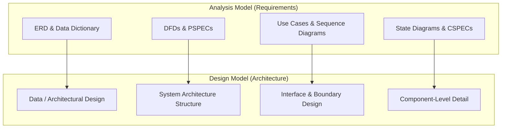

```text
Analysis Model [ERD] ──────────→ Design Model [Data Design]
Analysis Model [DFD] ──────────→ Design Model [System Architecture Structure]
Analysis Model [STD] ──────────→ Design Model [Component-Level Detail]
Analysis Model [Use Case] ────→ Design Model [Interface Design]
```

#### 4. Partitioning the Architecture: Horizontal vs. Vertical Partitioning
Architectural partitioning is a "divide-and-conquer" structural strategy that divides software into modular branches to simplify maintenance, testing, and concurrent team development.

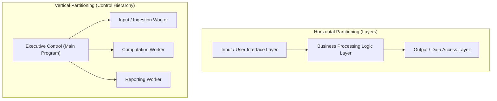

```text
Horizontal Partitioning: Input/UI Layer → Business Processing Layer → Output/Data Access Layer
Vertical Partitioning: Executive Control → [Worker 1: Ingestion | Worker 2: Computation | Worker 3: Reporting]
```

##### Horizontal Partitioning
Horizontal partitioning separates system functions into distinct architectural layers or tiers along the flow of control:
* **Input Layer:** Handles user interface interaction, input ingestion, and preliminary validation.
* **Processing / Business Logic Layer:** Performs core domain computations and business rule enforcement.
* **Output / Persistence Layer:** Manages database storage, external communication, and report formatting.
* **Advantage:** Simplifies testing and maintenance because changes within a specific layer (e.g., changing the database from MySQL to PostgreSQL) do not impact the UI layer.

##### Vertical Partitioning
Vertical partitioning (often called *control-driven partitioning*) structures the architecture into a top-down hierarchy where control and processing are distributed vertically:
* **Top-Level Modules:** Executive modules that handle decision-making, dispatching, and high-level control.
* **Mid-Level Modules:** Worker modules that execute specific functional sub-tasks.
* **Bottom-Level Modules:** Utility or leaf modules that perform basic input/output and low-level utility operations.
* **Advantage:** High fan-out at top levels and high fan-in at utility levels; isolates functional branches so that failure in one processing branch does not crash adjacent branches.

---

## Topic Group 2: Data Design, Data Warehousing, & Component-Level Schemas

### Questions in this Group

#### Question 2.1 🟢 [Verified PYQ]
> **Source:** SVKM's NMIMS Final Examination (AY 2024-25, Date: 09 December 2025)  
> **Course / Paper:** B. Tech (COMP / CS / CSBS / CSE-DS / IT / CE) Semester V — Software Engineering  
> **Question Number:** Q5(a) | **Marks:** 10 Marks | **Bloom's Level:** BL-M (CO-3)  
> **Original Wording:** "Analyze the influence of data mining and data warehousing on architectural decisions in large-scale information systems. How do these concepts guide database design at both the architectural and component levels?"

#### Question 2.2 🔵 [Practice Question]
> **Source:** Formulated for 100% syllabus coverage of Step-by-Step Data Design  
> **Marks:** 10 Marks | **Bloom's Level:** BL-Apply  
> **Question Wording:** "Explain the step-by-step process of Data Design in software engineering. Using an E-Commerce Order Management scenario, demonstrate how data objects and attributes identified during analysis translate into local data structures, relational database schemas, and data access components."

---

### Complete Shared Answer for Topic Group 2

#### 1. Influence of Data Warehousing and Data Mining on System Architecture
In enterprise information systems, **Data Warehousing** (centralized storage and integration of transactional histories) and **Data Mining** (analytical pattern extraction) dictate high-level architectural choices:

1. **Separation of Operational (OLTP) and Analytical (OLAP) Architectures:**
   * **OLTP (Online Transaction Processing):** Requires architectures optimized for fast, atomic, row-level ACID writes (e.g., relational databases with high normalization).
   * **OLAP (Online Analytical Processing):** Requires data warehouse architectures optimized for multi-dimensional aggregation, historical read queries, and column-store data models (e.g., Star Schema or Snowflake Schema).
2. **ETL Pipeline Architectural Components:** System architectures must incorporate explicit **Extract-Transform-Load (ETL)** processing pipelines or event-driven streams (such as Apache Kafka) to pull data from operational databases, cleanse and aggregate it, and load it into the warehouse repository without locking operational tables.
3. **Integration of Data-Centered & Blackboard Styles:** The data warehouse acts as a central repository surrounded by analytical client applications (data mining engines, dashboard visualizers, predictive ML models).

#### 2. How Data Warehousing and Data Mining Guide Database Design at Architectural and Component Levels

| Design Level | Influence of Data Warehousing & Data Mining | Implementation Artifact |
| :--- | :--- | :--- |
| **Architectural Level** | Defines the global storage topology, data distribution, replication strategies, and structural boundaries between live operational stores and historical warehouses. | Repository / Blackboard Architecture, Multi-Tier Warehouse Topology, ETL Data Pipeline Design. |
| **Component Level** | Defines specific data representations, relational schemas, indexing strategies, data access objects (DAO), and column-oriented structures for fast querying. | Normalized Relational Tables (3NF), Star Schemas (Fact & Dimension Tables), SQL Indexes, B-Trees, `ArrayList` Buffer Objects. |

#### 3. Step-by-Step Data Design Process (E-Commerce Worked Example)

Data design translates high-level domain data objects into low-level computer data structures and database schemas.

```text
[Analysis Model Data Objects] ──→ [Local Data Structures] ──→ [Relational Schemas] ──→ [Data Access Objects]
```

##### Step 1: Identify Analysis Data Objects and Attributes
From requirements analysis, we identify two primary data objects:
* `Customer` (`customerId`, `name`, `email`, `creditLimit`)
* `Order` (`orderId`, `orderDate`, `totalAmount`, `status`)

##### Step 2: Select Local Component Data Structures
For in-memory buffering during runtime execution inside the order processing component, the software engineer selects dynamic data structures:
* In Java/C++: An `ArrayList<Order>` or `LinkedList<OrderItem>` structure to hold transient cart items before checkout.

##### Step 3: Derive Relational Database Schemas
To ensure persistent storage, data objects are mapped into 3rd Normal Form (3NF) relational tables with Primary Keys (PK) and Foreign Keys (FK):

```sql
-- Relational Schema Definition
CREATE TABLE Customer (
    customer_id INT PRIMARY KEY,
    customer_name VARCHAR(100) NOT NULL,
    email VARCHAR(100) UNIQUE NOT NULL,
    credit_limit DECIMAL(10,2) DEFAULT 0.00
);

CREATE TABLE Orders (
    order_id INT PRIMARY KEY,
    customer_id INT NOT NULL,
    order_date DATE NOT NULL,
    total_amount DECIMAL(10,2) CHECK (total_amount >= 0),
    order_status VARCHAR(20) NOT NULL,
    FOREIGN KEY (customer_id) REFERENCES Customer(customer_id)
        ON DELETE CASCADE ON UPDATE CASCADE
);

CREATE TABLE OrderItem (
    item_id INT PRIMARY KEY,
    order_id INT NOT NULL,
    product_sku VARCHAR(50) NOT NULL,
    quantity INT CHECK (quantity > 0),
    unit_price DECIMAL(10,2) NOT NULL,
    FOREIGN KEY (order_id) REFERENCES Orders(order_id)
        ON DELETE CASCADE
);
```

##### Step 4: Define Data Access and Integrity Constraints
Component-level data access is encapsulated inside **Data Access Objects (DAO)** (e.g., `OrderDAO.saveOrder()`), enforcing:
* **Entity Integrity:** Primary keys (`customer_id`, `order_id`) are unique and `NOT NULL`.
* **Referential Integrity:** Mandatory foreign key (`customer_id` in `Orders`) ensures an order cannot exist without a valid customer.
* **Domain Integrity:** Check constraints ensure `total_amount >= 0` and `quantity > 0`.

---

## Topic Group 3: Architectural Styles & Taxonomy

### Questions in this Group

#### Question 3.1 🟢 [Verified PYQ]
> **Source:** SVKM's NMIMS Final Examination (AY 2022-23, Date: 22 November 2022)  
> **Course / Paper:** B. Tech / MBA Tech (Computer / IT / CSE Cyber Security) Semester V — Software Engineering  
> **Question Number:** Q4(a) [Part 2] | **Marks:** 5 Marks (out of 10 Marks total) | **Bloom's Level:** BL-Assess (CO-2; SO-2)  
> **Original Wording:** "Explain the following software architectural styles with suitable diagram: i. Layered architecture ii. Data Flow architecture"

#### Question 3.2 🟢 [Verified PYQ]
> **Source:** SVKM's NMIMS Re-Examination (AY 2023-24 / 2022-23, Date: 25 November 2023)  
> **Course / Paper:** B. Tech / MBA Tech Semester V — Software Engineering  
> **Question Number:** Q6(a) | **Marks:** 10 Marks | **Bloom's Level:** BL-H (CO-3; SO-1)  
> **Original Wording:** "Explain following Architectural Styles: 1. Call and return architecture 2. Layered architecture"

#### Question 3.3 🟢 [Verified PYQ]
> **Source:** SVKM's NMIMS Re-Examination (AY 2022-23, Date: 30 January 2023)  
> **Course / Paper:** B. Tech / MBA Tech Semester V — Software Engineering  
> **Question Number:** Q4(a) | **Marks:** 10 Marks | **Bloom's Level:** BL-Discuss (CO-2; SO-2)  
> **Original Wording:** "Explain, with suitable diagram, any two architectural styles in software architecture."

#### Question 3.4 🟢 [Verified PYQ]
> **Source:** SVKM's NMIMS Final Examination (AY 2018-19 / Re-Exam 2017-18, Date: 17 November 2018)  
> **Course / Paper:** B. Tech (Computer) Semester V — Software Engineering  
> **Question Number:** Q1(a) | **Marks:** 7 Marks | **Bloom's Level:** BL-Understand  
> **Original Wording:** "Explain the term architecture style and architecture pattern. When we can use Call and Return architecture? Justify with an example."

#### Question 3.5 🟢 [Verified PYQ]
> **Source:** SVKM's NMIMS Re-Examination (AY 2018-19, Date: 15 January 2019)  
> **Course / Paper:** B. Tech (Computer) Semester V — Software Engineering  
> **Question Number:** Q6(b) | **Marks:** 7 Marks | **Bloom's Level:** BL-Apply  
> **Original Wording:** "Which architectural style is suitable for college blackboard system? Explain with neat diagram."

#### Question 3.6 🟢 [Verified PYQ]
> **Source:** SVKM's NMIMS Final Examination (AY 2016-17, Date: 01 December 2016)  
> **Course / Paper:** B. Tech (COMP) Semester V — Software Engineering  
> **Question Number:** Q1(a) | **Marks:** 4 Marks | **Bloom's Level:** BL-Understand  
> **Original Wording:** "Elaborate the following concepts: a) Data-centered Architectural style with example."

#### Question 3.7 🟢 [Verified PYQ]
> **Source:** SVKM's NMIMS Final Examination (AY 2013-14, Date: 05 December 2013)  
> **Course / Paper:** B. Tech (COMP) Semester V — Software Engineering  
> **Question Number:** Q2.[B] | **Marks:** 10 Marks | **Bloom's Level:** BL-Understand  
> **Original Wording:** "Explain the different styles of Software Architectures."

---

### Complete Shared Answer for Topic Group 3

#### 1. Definition of Architectural Style vs. Architectural Pattern
* **Architectural Style:** A transformation that imposes a structure on an entire system or subsystem. It defines a set of component types (e.g., database, computational filter, client layer) and a set of connectors (e.g., function call, pipe, socket) that govern how components interact.
* **Architectural Pattern:** A template or recurring solution to a common software architecture problem within a given context. While an architectural style defines global structure, a pattern addresses specific architectural mechanisms (e.g., Model-View-Controller pattern, Publish-Subscribe pattern).

---

#### 2. Detailed Breakdown of the Five Prescribed Architectural Styles

##### Style A: Data-Centered Architecture (Repository & Blackboard)
* **Structure & Components:** A central data store (database or file repository) resides at the core. Surrounding client software components access and modify data within the central store.
* **Connectors:** Database access protocols, SQL queries, or file I/O operations.
* **Repository vs. Blackboard Substyles:**
  * *Repository Substyle:* Passive central data store. Clients access data independently without notifications.
  * *Blackboard Substyle:* Active central data store. When data in the blackboard changes, it actively sends notifications to client components interested in those changes.
* **Suitable Application:** **College Blackboard / Student Information System** or CAD tools. In a college blackboard system, student records, course material, and grade data sit at the center, accessed concurrently by Student, Professor, and Registrar client modules.
* **Advantages:** High data integrability; client components operate independently; adding new client modules does not alter existing clients.
* **Limitations:** Central data store is a single point of failure and potential performance bottleneck; schema changes require updating all client software.

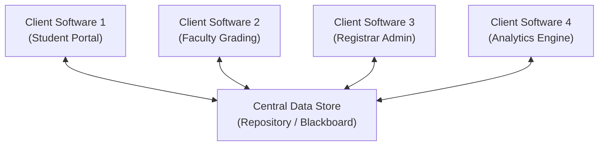

```text
Client Software 1 [Student Portal] ──[query/update]──→ Central Data Store (Repository / Blackboard)
Client Software 2 [Faculty Grading] ──[query/update]──→ Central Data Store (Repository / Blackboard)
Client Software 3 [Registrar Admin] ──[query/update]──→ Central Data Store (Repository / Blackboard)
Client Software 4 [Analytics Engine] ──[query/update]──→ Central Data Store (Repository / Blackboard)
```

---

##### Style B: Data-Flow Architecture (Pipes and Filters)
* **Structure & Components:** The system consists of computational **Filters** that receive stream data, perform local transformations, and output stream data. Filters are connected by unidirectional **Pipes**.
* **Connectors:** Unidirectional data streams (Pipes).
* **Data & Control Movement:** Data flows continuously through filters without global control or shared memory.
* **Suitable Application:** Unix shell command pipelines, Compilers (Lexical Analyzer $	o$ Parser $	o$ Semantic Analyzer $	o$ Code Generator), Image processing pipelines, Signal processing.
* **Advantages:** High reusability of individual filters; easy to add or replace filters; supports parallel execution across pipes.
* **Limitations:** Performance overhead due to continuous data parsing and transformation between filters; unsuitable for highly interactive systems.

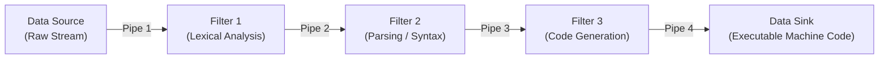

```text
Data Source [Raw Stream] ──[Pipe 1: Raw Bytes]──→ Filter 1 [Lexical Analysis]
Filter 1 [Lexical Analysis] ──[Pipe 2: Tokens]──→ Filter 2 [Parsing / Syntax]
Filter 2 [Parsing / Syntax] ──[Pipe 3: AST]──→ Filter 3 [Code Generation]
Filter 3 [Code Generation] ──[Pipe 4: Machine Code]──→ Data Sink [Executable File]
```

---

##### Style C: Call-and-Return Architecture
* **Structure & Components:** Structures the program into a control hierarchy where a main program invokes subprograms or module components.
* **Substyles:**
  1. *Main Program / Subprogram Architecture:* Control hierarchy where a top-level main program executes subprograms that execute further sub-functions.
  2. *Remote Procedure Call (RPC) Architecture:* Call-and-return hierarchy distributed across multiple networked computers.
* **Data & Control Movement:** Control flows top-down via procedure calls; data flows via argument parameter passing and return values.
* **Suitable Application:** Payroll processing systems, classic desktop applications, mathematical computation libraries.
* **Advantages:** Simple to understand; clear control hierarchy; easy to scale and modify procedural logic.
* **Limitations:** Strong coupling between caller and callee; changes in parameter signatures propagate throughout the call chain.

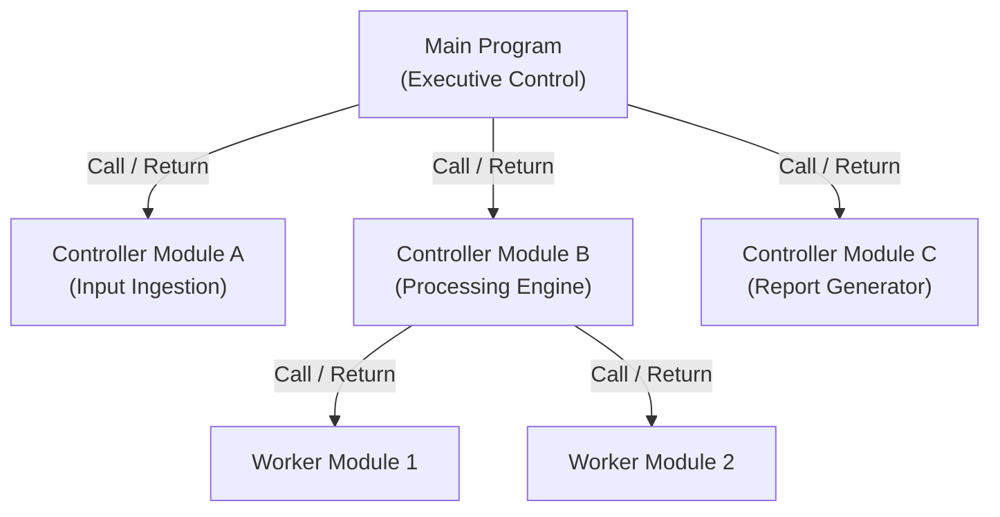

```text
Main Program [Executive Control] ──[call: ingestInput()]──→ Controller Module A [Input Ingestion]
Main Program [Executive Control] ──[call: processData()]──→ Controller Module B [Processing Engine]
Main Program [Executive Control] ──[call: printReport()]──→ Controller Module C [Report Generator]
Controller Module B [Processing Engine] ──[call: computeTax()]──→ Worker Module 1
Controller Module B [Processing Engine] ──[call: computeDeductions()]──→ Worker Module 2
```

---

##### Style D: Layered Architecture
* **Structure & Components:** Organized into horizontal layers stacked vertically. The top layer handles user presentation; intermediate layers handle application logic; bottom layers handle infrastructure and data access.
* **Connectors:** Layer interfaces, protocols, and API method calls.
* **Data & Control Movement:** Each layer offers services to the layer directly above it and acts as a client to the layer directly below it. Control passes strictly across adjacent layer boundaries.
* **Suitable Application:** OSI 7-Layer Networking Model, Enterprise E-Commerce Web Applications (Presentation Layer $	o$ Business Logic Layer $	o$ Data Access Layer $	o$ Database Layer).
* **Advantages:** High modularity and layer isolation; replacing an entire layer (e.g., UI layer) requires zero changes in lower layers.
* **Limitations:** Performance overhead due to multi-layer pass-through; strict layering can be difficult to maintain.

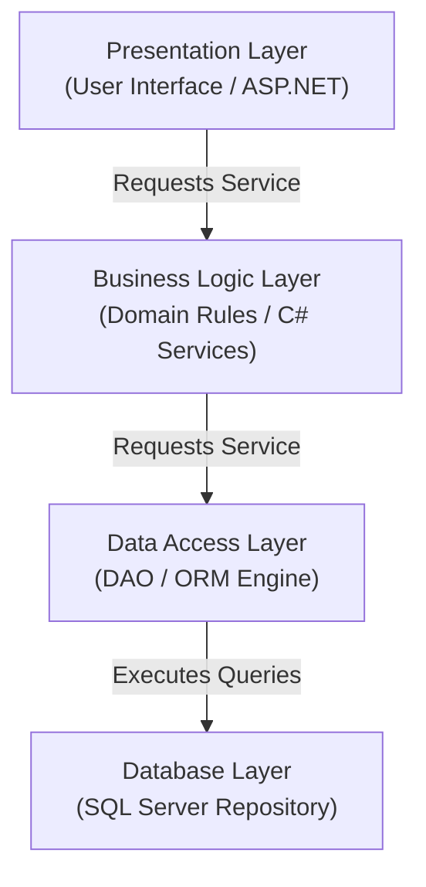

```text
Presentation Layer [User Interface] ──[requests service]──→ Business Logic Layer [Domain Rules]
Business Logic Layer [Domain Rules] ──[requests service]──→ Data Access Layer [DAO / ORM Engine]
Data Access Layer [DAO / ORM Engine] ──[executes queries]──→ Database Layer [SQL Server Repository]
```

---

##### Style E: Object-Oriented Architecture
* **Structure & Components:** System components are encapsulated objects containing both state (attributes) and behavior (operations).
* **Connectors:** Message passing and method invocations.
* **Data & Control Movement:** Objects interact by sending messages to execute operations on target objects. Data is encapsulated inside object boundaries.
* **Suitable Application:** Banking software systems, GUI window managers, simulation software.
* **Advantages:** High cohesion and encapsulation; changes to an object's internal implementation do not affect other objects.
* **Limitations:** Objects must know the identity/interface of target objects to send messages.

```mermaid
flowchart LR
    ObjA["Object A
(Customer)"]
    ObjB["Object B
(Account)"]
    ObjC["Object C
(Transaction Ledger)"]

    ObjA -->|Message: debit(amount)| ObjB
    ObjB -->|Message: recordTransaction()| ObjC
```

```text
Object A [Customer] ──[message: debit(amount)]──→ Object B [Account]
Object B [Account] ──[message: recordTransaction()]──→ Object C [Transaction Ledger]
```

---

#### 3. How Layered Architecture Relates To, But Is Not Identical To, Call-and-Return Architecture

```text
                             ┌──────────────────────────────────┐
                             │    Call-and-Return Architecture  │
                             │ (Generic Hierarchy / Functional) │
                             └────────────────┬─────────────────┘
                                              │
                         Specialization / Refinement into Tiers
                                              │
                                              ▼
                             ┌──────────────────────────────────┐
                             │       Layered Architecture       │
                             │  (Strict Adjacent-Layer Rules)   │
                             └──────────────────────────────────┘
```

* **Relationship:** Layered architecture is a *specialization* of Call-and-Return architecture. When invocation between horizontal layers occurs via procedure calls or method calls, a Layered system operates as a Call-and-Return hierarchy.
* **Key Differences:**
  1. **Strict Boundary Constraints:** In Call-and-Return, a main program module can call any subprogram at any level in the hierarchy. In **Layered Architecture**, a layer can ONLY invoke services provided by the layer *directly adjacent below it* (Layer $N$ calls Layer $N-1$).
  2. **Conceptual Focus:** Call-and-Return focuses on **control flow and program execution hierarchy**. Layered Architecture focuses on **abstraction levels, service separation, and layer isolation**.

---

## Topic Group 4: Representing a System in Context & Component Refinement

### Questions in this Group

#### Question 4.1 🟢 [Verified PYQ]
> **Source:** SVKM's NMIMS Re-Examination (AY 2016-17, Date: 01 December 2016)  
> **Course / Paper:** B. Tech (COMP) Semester V — Software Engineering  
> **Question Number:** Q3(a) [Part 2] | **Marks:** 3 Marks | **Bloom's Level:** BL-Understand  
> **Original Wording:** "What is partitioning the architecture? Explain with an example."

#### Question 4.2 🔵 [Practice Question]
> **Source:** Formulated for 100% syllabus coverage of Representing System in Context  
> **Marks:** 10 Marks | **Bloom's Level:** BL-Apply  
> **Question Wording:** "Explain how an Architectural Context Diagram (ACD) models a system in context. Using the SafeHome Security System as an example, detail the four external interface categories. Contrast an ACD with a Context-Level DFD."

---

### Complete Shared Answer for Topic Group 4

#### 1. Architectural Context Diagram (ACD) Structure and Categories
At the architectural design level, an **Architectural Context Diagram (ACD)** models how the target software system interacts with external entities at its boundaries. The target system sits at the center, surrounded by four distinct categories of external interfaces:

1. **Superordinate Systems:** Systems that reside higher in the control hierarchy, using the target system as a component or providing high-level commands (e.g., *Remote Corporate HQ Security Server*).
2. **Subordinate Systems:** Systems or hardware devices controlled directly by the target system (e.g., *Sensors, Door Locks, Alarm Sirens*).
3. **Peer-Level Systems:** Independent systems that interact on a peer-to-peer basis to exchange data without hierarchical control (e.g., *Home Automation Controller*, *Cellular Dialer*).
4. **Actors:** Human entities or user roles that interact directly with the software system (e.g., *Homeowner*, *System Administrator*).

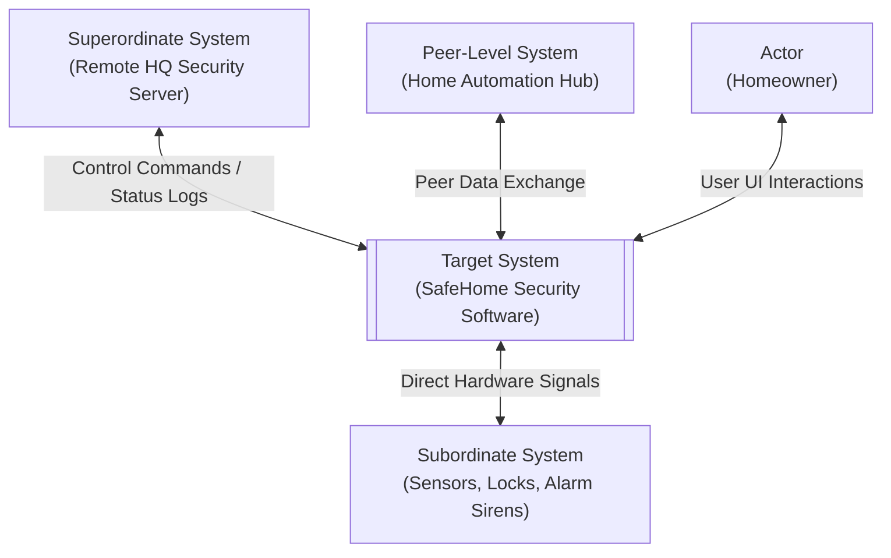

```text
Superordinate System [Remote HQ Server] ──[control commands / logs]──→ Target System [SafeHome Security]
Peer-Level System [Home Automation Hub] ──[peer data exchange]──→ Target System [SafeHome Security]
Target System [SafeHome Security] ──[direct hardware signals]──→ Subordinate System [Sensors, Locks, Sirens]
Actor [Homeowner] ──[user UI interactions]──→ Target System [SafeHome Security]
```

#### 2. Contrast: Architectural Context Diagram (ACD) vs. Context-Level DFD (Level-0 DFD)

| Feature / Dimension | Architectural Context Diagram (ACD) | Context-Level DFD (Level-0 DFD) |
| :--- | :--- | :--- |
| **Primary Focus** | **Structural boundaries & System Topology:** Identifies interface classifications and boundary connections. | **Functional Data Flow:** Identifies data inputs, transformations, and output data products. |
| **Interface Categorization** | Explicitly classifies interfaces into Superordinate, Subordinate, Peer-Level, and Actors. | Shows all external entities uniformly as flat rectangular boxes (Terminators). |
| **Notation Symbols** | System boundary block at center surrounded by classified external system blocks. | Single process bubble (`Process 0`) surrounded by external terminators. |
| **Design Phase** | Architectural Design Phase. | Requirements Analysis Phase. |

#### 3. Component Refinement (Decomposing Subsystems into Modules)
Once system boundaries are defined via the ACD, the software architecture is refined by decomposing the central system into modular components:

* `UI_Module`: Manages keypad displays, touch interfaces, and homeowner input.
* `Sensor_Monitor`: Periodically polls subordinate security sensors and filters noise.
* `Alarm_Processor`: Enforces business logic; evaluates sensor status and triggers alarm states.
* `Network_Gateway`: Communicates with superordinate servers and external peer-level automation hubs.

---

## Topic Group 5: Structured Design — Transform & Transaction Mapping

### Questions in this Group

#### Question 5.1 🟢 [Verified PYQ]
> **Source:** SVKM's NMIMS Re-Examination (AY 2022-23, Date: 30 January 2023)  
> **Course / Paper:** B. Tech / MBA Tech Semester V — Software Engineering  
> **Question Number:** Q6(b) | **Marks:** 10 Marks | **Bloom's Level:** BL-Discuss (CO-2,4; SO-2)  
> **Original Wording:** "Discuss the steps of Transform mapping through which Data flow with transform flow characteristics can be mapped into a specific architectural style."

#### Question 5.2 🟢 [Verified PYQ]
> **Source:** SVKM's NMIMS Final Examination (AY 2018-19 / Re-Exam 2017-18, Date: 17 November 2018)  
> **Course / Paper:** B. Tech (Computer) Semester V — Software Engineering  
> **Question Number:** Q3(b) | **Marks:** 7 Marks | **Bloom's Level:** BL-Understand  
> **Original Wording:** "Explain steps for mapping data flow into software architecture"

#### Question 5.3 🟢 [Verified PYQ]
> **Source:** SVKM's NMIMS Final Examination (AY 2016-17, Date: 01 December 2016)  
> **Course / Paper:** B. Tech (COMP) Semester V — Software Engineering  
> **Question Number:** Q3(b) | **Marks:** 6 Marks | **Bloom's Level:** BL-Understand  
> **Original Wording:** "Give details of how requirements are mapped into a software architecture when 'Transform Flow' is present."

---

### Complete Shared Answer for Topic Group 5

#### 1. Introduction to Structured Design & Flow Characteristics
Structured Design (developed by Yourdon and Constantine) is a data flow-oriented design method that maps **Data Flow Diagrams (DFDs)** derived during requirements analysis into a **Call-and-Return program structure** (component hierarchy).

Data flows inside DFDs exhibit two primary characteristics:
1. **Transform Flow:** Information enters the system along an incoming path, is transformed inside a central processing core (Transform Center), and leaves along an outgoing path.
2. **Transaction Flow:** A single data item (a *transaction*) triggers information flow along one of many distinct action paths.

---

#### 2. Step-by-Step Procedure for Transform Mapping

```text
Step 1: Review Fundamental System Model (Level-0 DFD)
  ↓
Step 2: Review & Refine Level-1 and Level-2 DFDs
  ↓
Step 3: Determine Flow Characteristics (Confirm Transform Flow)
  ↓
Step 4: Isolate the Transform Center (Specify Incoming & Outgoing Boundaries)
  ↓
Step 5: Perform First-Level Factoring (Derive Top Control Hierarchy)
  ↓
Step 6: Perform Second-Level Factoring (Factor Input, Transform, & Output Branches)
  ↓
Step 7: Refine Architecture using Design Heuristics (Cohesion & Coupling)
```

##### Step 1: Review the Fundamental System Model
Examine the Context-Level DFD and SRS to verify system boundaries and external interfaces.

##### Step 2: Review and Refine Data Flow Diagrams
Examine Level-1 and Level-2 DFDs to ensure that all process bubbles, data stores, and data flow labels are balanced and unambiguous.

##### Step 3: Determine Flow Characteristics
Verify if data flows sequentially from input to output along a straight-line processing path (Transform Flow).

##### Step 4: Isolate the Transform Center
Identify the incoming flow boundary (where data moves from external representation to purely internal representation) and the outgoing flow boundary (where internal data is converted back into external output data). The processes contained between these two boundaries form the **Transform Center**.

##### Step 5: Perform First-Level Factoring
Derive the top-level Call-and-Return control hierarchy:
* **Main Controller Module (`Main_Executive`):** Sits at the top (Level 0).
* **Input Controller (`Input_Controller`):** Controls all incoming data acquisition processes.
* **Transform Controller (`Transform_Controller`):** Controls all internal transform processing.
* **Output Controller (`Output_Controller`):** Controls all outgoing formatting and display processes.

##### Step 6: Perform Second-Level Factoring
Map specific DFD process bubbles into sub-modules hanging directly beneath the respective Level-1 controllers.

##### Step 7: Refine First-Iteration Architecture
Apply design heuristics:
* Maximize **Module Cohesion** (ensure each module performs a single focused function).
* Minimize **Module Coupling** (reduce parameter passing and global state dependencies).
* Optimize **Fan-in** (high fan-in for reusable utility modules) and **Fan-out** (keep control fan-out $\le 7$).

---

#### 3. Fully Worked Example 1: Transform Mapping (SafeHome Security System)

##### Starting DFD Excerpt (SafeHome Sensor Processing)

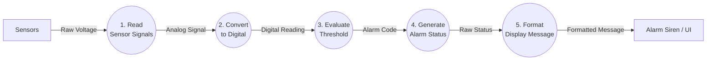

```text
Sensors ──[Raw Voltage]──→ (1. Read Sensor Signals)
(1. Read Sensor Signals) ──[Analog Signal]──→ (2. Convert to Digital)
-- INCOMING BOUNDARY --
(2. Convert to Digital) ──[Digital Reading]──→ (3. Evaluate Threshold)
(3. Evaluate Threshold) ──[Alarm Code]──→ (4. Generate Alarm Status)
-- OUTGOING BOUNDARY --
(4. Generate Alarm Status) ──[Raw Status]──→ (5. Format Display Message)
(5. Format Display Message) ──[Formatted Message]──→ Alarm Siren / UI
```

* **Incoming Flow Boundary:** Located between `Convert to Digital` and `Evaluate Threshold`.
* **Transform Center:** Processes `3. Evaluate Threshold` and `4. Generate Alarm Status`.
* **Outgoing Flow Boundary:** Located between `Generate Alarm Status` and `Format Display Message`.

##### Final Component Architecture Hierarchy (Call-and-Return)

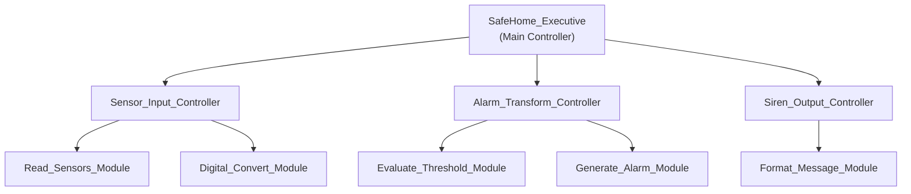

```text
SafeHome_Executive [Main Controller] ──[call]──→ Sensor_Input_Controller
SafeHome_Executive [Main Controller] ──[call]──→ Alarm_Transform_Controller
SafeHome_Executive [Main Controller] ──[call]──→ Siren_Output_Controller

Sensor_Input_Controller ──[call]──→ Read_Sensors_Module
Sensor_Input_Controller ──[call]──→ Digital_Convert_Module

Alarm_Transform_Controller ──[call]──→ Evaluate_Threshold_Module
Alarm_Transform_Controller ──[call]──→ Generate_Alarm_Module

Siren_Output_Controller ──[call]──→ Format_Message_Module
```

---

#### 4. Fully Worked Example 2: Transaction Mapping (Bank ATM Order System)

##### Starting DFD Excerpt (ATM Transaction System)

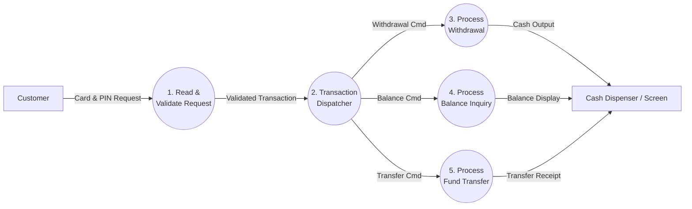

```text
Customer ──[Card & PIN Request]──→ (1. Read & Validate Request)
(1. Read & Validate Request) ──[Validated Transaction]──→ (2. Transaction Dispatcher)
                                                            │
                     ┌──────────────────────────────────────┼──────────────────────────────────────┐
                     ▼                                      ▼                                      ▼
(2. Transaction Dispatcher) ──[Withdrawal Cmd]──→ (3. Process Withdrawal) ──[Cash Output]──→ Dispenser
(2. Transaction Dispatcher) ──[Balance Cmd]──→ (4. Process Balance Inquiry) ──[Balance Display]──→ Dispenser
(2. Transaction Dispatcher) ──[Transfer Cmd]──→ (5. Process Fund Transfer) ──[Transfer Receipt]──→ Dispenser
```

* **Transaction Center:** Process `2. Transaction Dispatcher`. It receives a single transaction request and branches into three distinct action paths.
* **Action Paths:**
  1. *Withdrawal Path:* Process `3. Process Withdrawal`.
  2. *Inquiry Path:* Process `4. Process Balance Inquiry`.
  3. *Transfer Path:* Process `5. Process Fund Transfer`.

##### Final Component Architecture Hierarchy (Transaction Processing Structure)

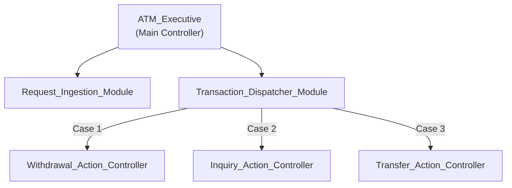

```text
ATM_Executive [Main Controller] ──[call]──→ Request_Ingestion_Module
ATM_Executive [Main Controller] ──[call]──→ Transaction_Dispatcher_Module

Transaction_Dispatcher_Module ──[dispatch: Case 1]──→ Withdrawal_Action_Controller
Transaction_Dispatcher_Module ──[dispatch: Case 2]──→ Inquiry_Action_Controller
Transaction_Dispatcher_Module ──[dispatch: Case 3]──→ Transfer_Action_Controller
```

---

#### 5. Comparison Matrix: Transform Mapping vs. Transaction Mapping

| Feature / Dimension | Transform Mapping | Transaction Mapping |
| :--- | :--- | :--- |
| **DFD Flow Pattern** | Linear sequential path from input to output. | Single input item branches into $N$ distinct action paths. |
| **Key Architectural Element** | **Transform Center:** Processes that alter internal data. | **Transaction Center & Dispatcher:** Evaluates transaction type and routes control. |
| **Control Hierarchy Structure** | Three factored branches: Input, Transform, Output. | Central Dispatcher module controlling $N$ action path controllers. |
| **Typical Applications** | Signal processing, financial calculations, image rendering. | Menu-driven systems, ATMs, E-Commerce order checkout, GUI event loops. |

---

## Source Index & Verification Summary

### Paper-by-Paper Question Index

| Paper Name / Session | Year | Question No. | Marks | Group Mapping | Source Status |
| :--- | :---: | :---: | :---: | :--- | :--- |
| **SVKM's NMIMS Final Exam** | Dec 2025 (AY 2024-25) | Q5(a) | 10M | Topic Group 2 | 🟢 Verified PYQ |
| **SVKM's NMIMS Re-Exam** | Nov 2023 (AY 2023-24) | Q6(a) | 10M | Topic Group 3 | 🟢 Verified PYQ |
| **SVKM's NMIMS Re-Exam** | Jan 2023 (AY 2022-23) | Q6(b) | 10M | Topic Group 5 | 🟢 Verified PYQ |
| **SVKM's NMIMS Final Exam** | Nov 2022 (AY 2022-23) | Q4(a) | 10M | Topic Group 1 & 3 | 🟢 Verified PYQ |
| **SVKM's NMIMS Final Exam** | Nov 2019 (AY 2019-20) | Q6(b) | 7M | Topic Group 1 & 3 | 🟢 Verified PYQ |
| **SVKM's NMIMS Re-Exam** | Jan 2019 (AY 2018-19) | Q4(a), Q6(b) | 14M | Topic Group 1 & 3 | 🟢 Verified PYQ |
| **SVKM's NMIMS Final Exam** | Nov 2018 (AY 2018-19) | Q1(a), Q3(b) | 14M | Topic Group 3 & 5 | 🟢 Verified PYQ |
| **SVKM's NMIMS Final Exam** | Dec 2016 (AY 2016-17) | Q1(a), Q3(b) | 10M | Topic Group 3 & 5 | 🟢 Verified PYQ |
| **SVKM's NMIMS Re-Exam** | Dec 2016 (AY 2016-17) | Q3(a) | 6M | Topic Group 1 & 4 | 🟢 Verified PYQ |
| **SVKM's NMIMS Final Exam** | Dec 2013 (AY 2013-14) | Q2.[B], Q3.[B] | 20M | Topic Group 1 & 3 | 🟢 Verified PYQ |

---

## Question-to-Answer-Group Index

* **Questions 1.1, 1.2, 1.3, 1.4, 1.5** $\longrightarrow$ Answered in **Topic Group 1**
* **Questions 2.1, 2.2** $\longrightarrow$ Answered in **Topic Group 2**
* **Questions 3.1, 3.2, 3.3, 3.4, 3.5, 3.6, 3.7** $\longrightarrow$ Answered in **Topic Group 3**
* **Questions 4.1, 4.2** $\longrightarrow$ Answered in **Topic Group 4**
* **Questions 5.1, 5.2, 5.3** $\longrightarrow$ Answered in **Topic Group 5**

---

## Syllabus Coverage Audit Checklist

| Prescribed Syllabus Area | Coverage Status | Section / Group Reference |
| :--- | :---: | :--- |
| **1. Software Architecture & Importance** | 100% Full Coverage | Topic Group 1 (Q1.1–Q1.5) |
| **2. Data Design (Objects to Schemas)** | 100% Full Coverage | Topic Group 2 (Q2.1–Q2.2) |
| **3. Architectural Styles (Taxonomy)** | 100% Full Coverage | Topic Group 3 (Q3.1–Q3.7) |
| **4. Representing System in Context (ACD)** | 100% Full Coverage | Topic Group 4 (Q4.1–Q4.2) |
| **5. Refining Architecture into Components** | 100% Full Coverage | Topic Group 4 (Section 3) |
| **6. Mapping Data Flow to Architecture** | 100% Full Coverage | Topic Group 5 (Q5.1–Q5.3) |

---

## Visual Rendering Verification Notice

* All Mermaid diagrams are constructed using standard closed ```mermaid code fences.
* Node declarations, directed arrows, and styling are declared on separate lines without inline `:::class` syntax.
* Beneath every major Mermaid diagram, a formatted ```text fallback block (`Source → Destination [flow: Label]`) is provided to guarantee complete visual clarity across both GitHub Light and GitHub Dark themes.
* Database schemas use standard SQL DDL syntax with explicit constraint definitions.
