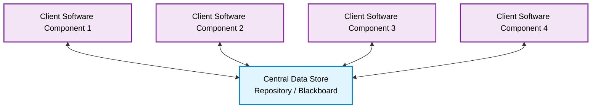
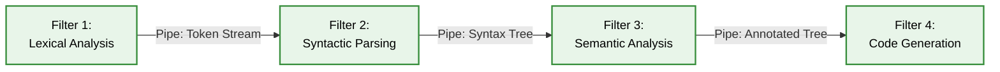
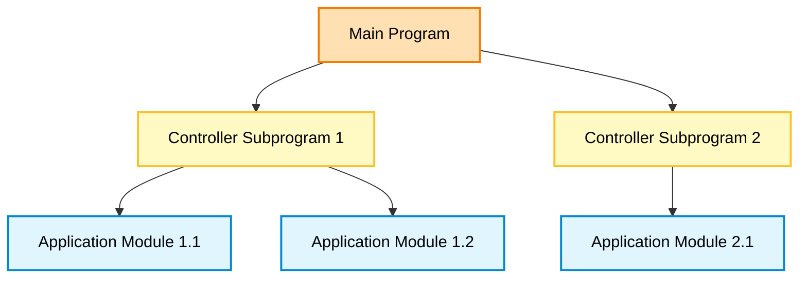
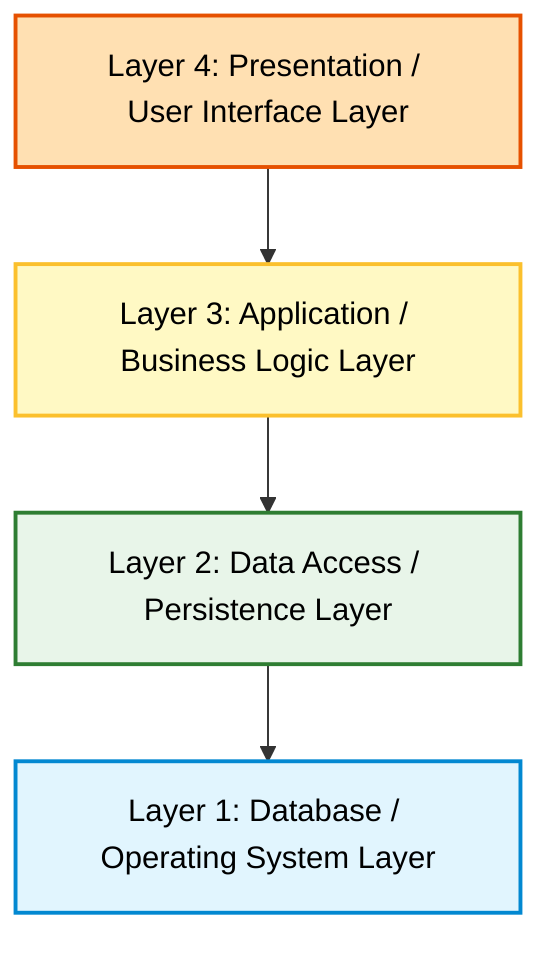
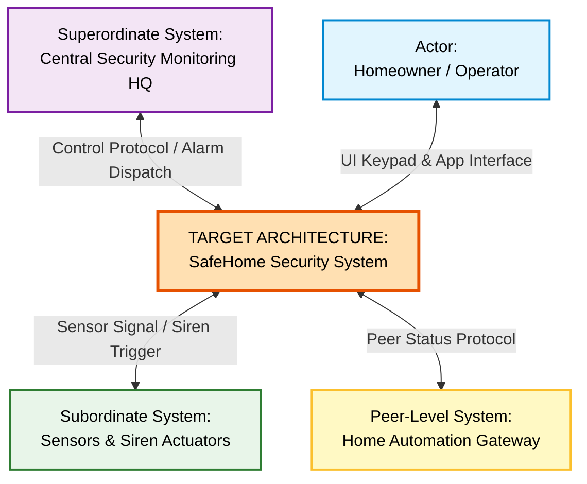
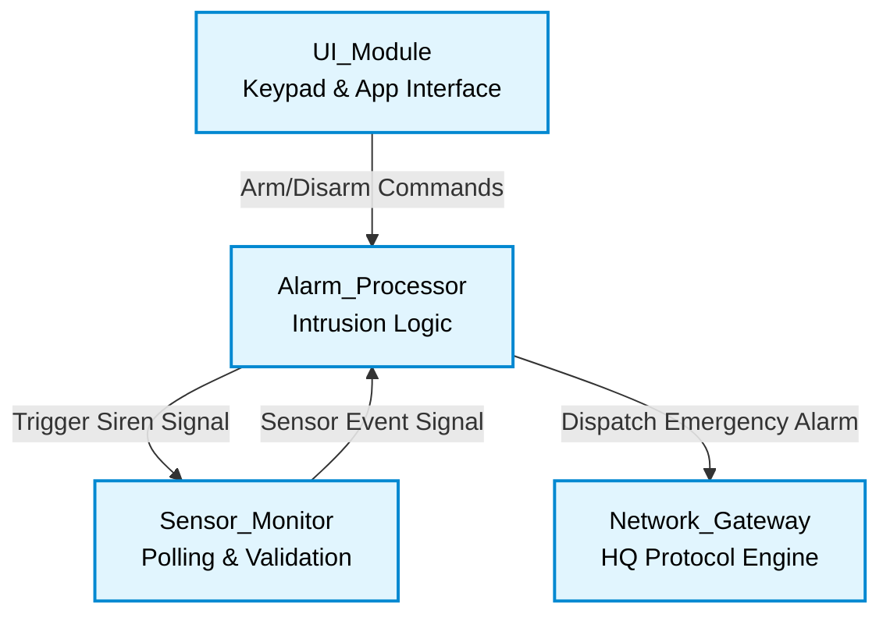
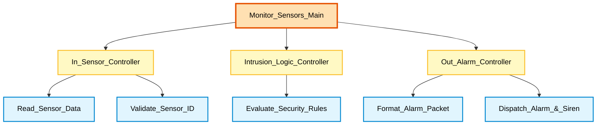
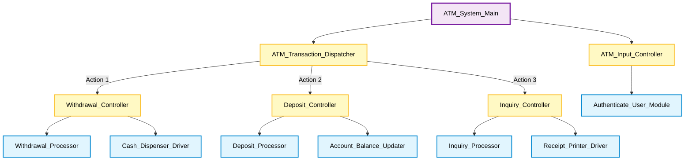

# Software Engineering Unit 5 Study Notes: Architectural Design

---

## 1. Official Syllabus Mapping & Overview

This document provides comprehensive, exam-oriented study notes for **Unit 5: Architectural Design** (03 Hours, Course Outcome **CO-2**: *Demonstrate an understanding of various Analysis and Design models*). It follows the Unit 5 syllabus supplied by the user. The following are references listed in the original draft, not independently checked source documents for this revision: Roger S. Pressman's *Software Engineering: A Practitioner's Approach* (8th/9th Editions), Ian Sommerville's *Software Engineering* (10th Edition), and university lecture materials (`Architectural Design-CHAPTER 5.pdf`, `U5Architectural Design.pdf`, `SE_Module_5.pptx`, `SE_UNIT5_BDIV.pptx`, `SE_UNIT_5_C_DIV.pdf`).

### Syllabus Coverage Matrix

| Area | Syllabus Topic | References listed in draft (not independently checked) | Topic status |
| :--- | :--- | :--- | :--- |
| **Area 1** | **Software Architecture & Its Importance** | Pressman Ch. 10 / Ch. 13; Sommerville Ch. 6 | **Covered in these notes** |
| **Area 2** | **Data Design** | Pressman Ch. 8 / Ch. 10; Lecture Slides | **Covered in these notes** |
| **Area 3** | **Architectural Styles Taxonomy** | Pressman Ch. 10; TechMax; Lecture Slides | **Covered in these notes** |
| **Area 4** | **Representing System in Context** | Pressman Ch. 10; Lecture Notes | **Covered in these notes** |
| **Area 5** | **Refining Architecture into Components** | Pressman Ch. 10 & 11; TechMax | **Covered in these notes** |
| **Area 6** | **Mapping Data Flow into Software Architecture** | Pressman Ch. 10; Lecture Slides | **Covered in these notes** |

---

## 2. Area 1: Software Architecture and Its Importance

### 2.1 Definition of Software Architecture
**Software Architecture** is the high-level representation of a system's structure. It defines:
1. The **software components** (modules, classes, databases, middleware, subsystems).
2. The **externally visible properties** of those components.
3. The **relationships and interactions (connectors)** among them.
4. The **design decisions** and constraints that govern the system's evolution.

> **Definition attributed in original draft to Shaw and Garlan (attribution not independently checked):**  
> *"Software architecture is the structure or organization of program components (modules), the manner in which these components interact, and the structure of data that are used by the components."*

> **Definition attributed in original draft to IEEE (attribution not independently checked):**  
> *"Architectural design is the process of defining a collection of hardware and software components and their interfaces to establish the framework for the development of a computer system."*

---

### 2.2 Why Architecture Matters: Three Key Reasons
The original draft attributes these three reasons to Bass, Clements, and Kazman in *Software Architecture in Practice*; that attribution was not independently checked for this revision:

1. **Stakeholder Communication:**  
   The architectural model serves as an intellectually graspable, high-level abstraction that enables effective communication among all project stakeholders—managers, clients, systems engineers, developers, and maintenance teams.
2. **Early Design Decisions:**  
   Architecture highlights the earliest architectural and structural choices. These decisions exert a profound impact on all downstream engineering work, resource allocation, task division, and non-functional system attributes (performance, security, reliability, maintainability).
3. **Transferable Abstraction & Reuse:**  
   An architectural representation constitutes a small, manageable model of how the system is structured. Architectural styles and patterns can be reused across similar domain families, enabling domain-specific software engineering.

---

### 2.3 How Analysis Models Inform Architectural Blueprints

Architectural design bridges the gap between **Requirements/Analysis Models** (WHAT the system must do) and **Component-Level Design / Source Code** (HOW it is implemented).

```text
+-------------------------------------------------------+
|                    ANALYSIS MODEL                     |
|  • Scenario-based elements (Use Cases, Activity)      |
|  • Flow-oriented elements (DFDs, Control Flows)       |
|  • Class-based elements (Class diagrams, CRC)         |
|  • Behavioral elements (State Diagrams)               |
+-------------------------------------------------------+
                           |
                           v
+-------------------------------------------------------+
|                 ARCHITECTURAL BLUEPRINT               |
|  • Data/Class Design (Translates ERD/Classes)         |
|  • Architectural Style (Data-Centered, Pipe, etc.)   |
|  • Architectural Context (System Boundaries & Interfaces)|
|  • Subsystem & Component Refinement                   |
+-------------------------------------------------------+
```

#### Distinguishing Analysis Artifacts from Architecture
* **A DFD is NOT the Architecture:** A Data Flow Diagram depicts functional processes and data transformations without imposing runtime control structures, deployment topology, or module invocation hierarchies.
* **Architectural Blueprint:** Takes the functional flows (DFD) and maps them into software control hierarchies (e.g., Main Program / Subprogram), object classes, or distributed network components.

---

## 3. Area 2: Data Design

### 3.1 Step-by-Step Data Design Process
Data design creates a high-level data model that is progressively refined into computer-implementable data structures and database schemas.

```text
Step 1: Identify Data Objects & Attributes (from ERD / Class Diagram)
   │
   v
Step 2: Select Suitable Data Structures (at Component Level)
   │
   v
Step 3: Derive Database Tables or Schemas (at Application Level)
   │
   v
Step 4: Establish Keys, Relationships, Normalization & Data Access
```

1. **Identify Data Objects & Attributes:** Extract data entities from analysis models (ERD, Data Dictionary, and CRC cards).
2. **Select Data Structures (Component Level):** Determine local data representations (e.g., arrays, linked lists, hash tables, stacks) for algorithm execution.
3. **Derive Database Schemas (Application Level):** Map domain objects into relational database tables, document stores, or object-oriented repositories.
4. **Establish Keys, Relationships, & Access:** Define Primary Keys (PK), Foreign Keys (FK), indexes, normalization constraints (1NF to 3NF), and data access objects (DAO).

---

### 3.2 Consistent Worked Example: E-Commerce Order Management Data Design

#### Step 1: Identified Entities & Attributes
* **Customer:** `Customer_ID` (PK), `Name`, `Email`, `Address`
* **Order:** `Order_ID` (PK), `Customer_ID` (FK), `Order_Date`, `Total_Amount`, `Status`
* **OrderItem:** `Item_ID` (PK), `Order_ID` (FK), `Product_ID` (FK), `Quantity`, `Unit_Price`
* **Product:** `Product_ID` (PK), `Name`, `Stock_Qty`, `Price`

#### Step 2: Relational Schema & Keys
```sql
CREATE TABLE Customer (
    Customer_ID INT PRIMARY KEY,
    Name VARCHAR(100) NOT NULL,
    Email VARCHAR(100) UNIQUE NOT NULL,
    Address TEXT
);

CREATE TABLE Orders (
    Order_ID INT PRIMARY KEY,
    Customer_ID INT NOT NULL REFERENCES Customer(Customer_ID),
    Order_Date DATE NOT NULL,
    Total_Amount DECIMAL(10,2) NOT NULL,
    Status VARCHAR(20) DEFAULT 'Pending'
);

CREATE TABLE Product (
    Product_ID INT PRIMARY KEY,
    Name VARCHAR(100) NOT NULL,
    Stock_Qty INT NOT NULL CHECK (Stock_Qty >= 0),
    Price DECIMAL(10,2) NOT NULL CHECK (Price >= 0)
);

CREATE TABLE OrderItem (
    Item_ID INT PRIMARY KEY,
    Order_ID INT NOT NULL REFERENCES Orders(Order_ID),
    Product_ID INT NOT NULL REFERENCES Product(Product_ID),
    Quantity INT CHECK (Quantity > 0),
    Unit_Price DECIMAL(10,2) NOT NULL
);
```

#### Step 3: Component-Level Data Structure Representation
For in-memory shopping cart processing before database persistence:
* **CartItem Structure:** C++ / Java Object containing `productID`, `quantity`, `unitPrice`.
* **Cart Collection:** Doubly Linked List or Dynamic Array (`ArrayList<CartItem>`) allowing fast $O(1)$ append and $O(N)$ traversal for total cost calculation.

---

## 4. Area 3: Architectural Styles Taxonomy

An **Architectural Style** is a transformation imposed on an entire system that describes a system category encompassing:
1. A **set of components** (e.g., database, computational modules, filters).
2. A **set of connectors** (e.g., procedure calls, pipes, network protocols) enabling coordination and communication.
3. **Constraints** defining how components can be integrated.
4. **Semantic models** helping designers understand overall system properties.

---

### 4.1 Style 1: Data-Centered Architecture (Repository / Blackboard)

#### Description & Structure
A **Data-Centered Architecture** features a central data store (repository or database) at its core, surrounded by independent client software components. 
* **Repository Substyle:** Clients access the central data store passively via explicit database queries (SQL, HTTP).
* **Blackboard Substyle:** The central store actively notifies registered client components when data of interest changes.

#### Mermaid Diagram: Data-Centered Style


#### Text Fallback: Data-Centered Style
```text
Client 1 ↔ Central Data Store [query/update]
Client 2 ↔ Central Data Store [query/update]
Client 3 ↔ Central Data Store [query/update]
Client 4 ↔ Central Data Store [query/update]
```

#### Detailed Breakdown
* **Data & Control Movement:** Clients send requests to read, insert, update, or delete data in the central repository. Control is decentralized across clients.
* **Advantages:**
  * **Integrability:** New client components can be added without modifying existing clients.
  * **Data Independence:** Centralized data management promotes consistency and reduces redundancy.
* **Limitations:**
  * The central repository represents a single point of failure and potential performance bottleneck.
  * Schema changes in the central database require updates across all dependent clients.
* **Suitable Applications:** Enterprise Resource Planning (ERP), Banking systems, IDEs (Eclipse, Visual Studio), AI diagnostic systems (Blackboard pattern).

---

### 4.2 Style 2: Data-Flow Architecture (Pipes and Filters)

#### Description & Structure
A **Data-Flow Architecture** views a system as a series of computational components (**filters**) connected by data transmission channels (**pipes**). Each filter transforms incoming stream data and passes the output to the next filter along the pipe.

#### Mermaid Diagram: Pipes and Filters Style


#### Text Fallback: Pipes and Filters Style
```text
Filter 1 [Lexical Analysis] → Filter 2 [Syntactic Parsing] [flow: Token Stream]
Filter 2 [Syntactic Parsing] → Filter 3 [Semantic Analysis] [flow: Syntax Tree]
Filter 3 [Semantic Analysis] → Filter 4 [Code Generation] [flow: Annotated Tree]
```

#### Detailed Breakdown
* **Data & Control Movement:** Data flows sequentially through unidirectional pipes. Each filter operates independently, consuming input streams and producing output streams without needing knowledge of neighboring filters.
* **Batch Sequential Variant:** A variation where processing occurs on whole batches of data rather than continuous streams (e.g., classical mainframe processing).
* **Advantages:**
  * High reusability and modularity; filters can be reordered or combined.
  * Easy to extend and parallelize across multi-core processors.
* **Limitations:**
  * High overhead from data parsing and format conversion between filters.
  * Not suitable for highly interactive, user-driven applications.
* **Suitable Applications:** Compilers, Unix CLI pipelines (`cat file.txt | grep error | sort`), image/video processing pipelines, ETL data transformation engines.

---

### 4.3 Style 3: Call-and-Return Architecture

#### Description & Structure
**Call-and-Return Architecture** enables designers to construct a program structure that is hierarchical, scalable, and easy to modify. It uses explicit subprogram invocations (method calls, subroutines, or RPCs).

#### Substyles Within Call-and-Return
1. **Main Program / Subprogram Architecture:** A classic top-down hierarchy where a "Main" control program invokes controller subprograms, which in turn invoke application subprograms.
2. **Remote Procedure Call (RPC) Architecture:** The components of a main/subprogram architecture are distributed across multiple network nodes.
3. **Layered Architecture:** A structured variant where components are organized into hierarchical layers (discussed below).

#### Mermaid Diagram: Main Program / Subprogram Architecture


#### Text Fallback: Call-and-Return Style
```text
Main Program → Controller Subprogram 1 [call: Invoke Task 1]
Main Program → Controller Subprogram 2 [call: Invoke Task 2]
Controller Subprogram 1 → Application Module 1.1 [call: Process Data A]
Controller Subprogram 1 → Application Module 1.2 [call: Process Data B]
Controller Subprogram 2 → Application Module 2.1 [call: Process Data C]
```

#### Detailed Breakdown
* **Data & Control Movement:** Control originates at the top root module and flows downward via subprogram calls. Parameters are passed down; returned results flow upward.
* **Advantages:** Simple control flow; easy to reason about program execution and trace call stacks.
* **Limitations:** High coupling between callers and callees; changes in subprogram signatures require updates to callers.
* **Suitable Applications:** Traditional procedural desktop programs, mathematical computation packages, classical C/Fortran software systems.

---

### 4.4 Style 4: Layered Architecture

#### Description & Relationship to Call-and-Return
**Layered Architecture** organizes system components into vertical, hierarchical layers. Each layer performs a specific set of services. 
* **Relationship to Call-and-Return:** Layered architecture is an *abstraction* of call-and-return. However, while general call-and-return allows any module to invoke any subordinate module, Layered Architecture strictly enforces **boundary constraints**: Layer $N$ can ONLY invoke services provided by Layer $N-1$ directly below it.

#### Mermaid Diagram: Layered Architecture


#### Text Fallback: Layered Architecture
```text
Layer 4 [Presentation/UI Layer] → Layer 3 [Business Logic Layer] [flow: User Request]
Layer 3 [Business Logic Layer] → Layer 2 [Data Access Layer] [flow: Query Request]
Layer 2 [Data Access Layer] → Layer 1 [Database/OS Layer] [flow: SQL Execution]
```

#### Detailed Breakdown
* **Data & Control Movement:** Requests travel downward from top layers to bottom layers; responses travel upward. Lower layers abstract low-level hardware or database details from higher layers.
* **Advantages:**
  * **Abstractions & Loose Coupling:** Inner layers can be replaced completely (e.g., swapping MySQL for PostgreSQL) without affecting outer UI layers.
  * **Standardization:** Facilitates protocol definition (e.g., OSI 7-layer model).
* **Limitations:**
  * Reduced performance due to multi-layer request passthrough overhead.
  * Strict layering can sometimes be difficult to enforce cleanly.
* **Suitable Applications:** Web enterprise applications (Spring Boot, ASP.NET Core 3-tier architecture), OS networking stacks (OSI/TCP-IP), mobile apps.

---

### 4.5 Style 5: Object-Oriented Architecture

#### Description & Structure
In an **Object-Oriented Architecture**, components encapsulate both data (attributes) and the operations (methods) required to manipulate that data. Components interact exclusively through explicit **message passing** (method calls) across defined interfaces.

#### Mermaid Diagram: Object-Oriented Architecture
```mermaid
graph TD
    classDef default fill:#ffffff,stroke:#4b5563,stroke-width:2px,color:#000000;
    classDef obj fill:#f3e5f5,stroke:#8e24aa,stroke-width:2px,color:#000000;

    O1["Object: CustomerComponent<br/>- customerData<br/>+ updateAddress()"];
    O2["Object: OrderComponent<br/>- orderData<br/>+ placeOrder()"];
    O3["Object: InventoryComponent<br/>- stockData<br/>+ checkStock()"];
    O4["Object: PaymentComponent<br/>- paymentData<br/>+ processPayment()"];

    O1 -->|Message: requestOrder(items)| O2
    O2 -->|Message: verifyStock(itemIDs)| O3
    O2 -->|Message: executePayment(amount)| O4

    class O1 obj;
    class O2 obj;
    class O3 obj;
    class O4 obj;
```

#### Text Fallback: Object-Oriented Style
```text
CustomerComponent → OrderComponent [flow: requestOrder(items)]
OrderComponent → InventoryComponent [flow: verifyStock(itemIDs)]
OrderComponent → PaymentComponent [flow: executePayment(amount)]
```

#### Detailed Breakdown
* **Data & Control Movement:** Data is encapsulated inside objects and never accessed directly. Objects communicate via asynchronous or synchronous method messages.
* **Advantages:**
  * High maintainability; objects protect their own state integrity.
  * Implementation details are hidden, allowing modifications without altering caller components.
* **Limitations:**
  * Objects must know the identity/interface of other objects to send messages.
  * Cascading method calls can introduce performance overhead and complex runtime dependencies.
* **Suitable Applications:** Banking applications, desktop GUI software, simulation engines, C++/Java/C# enterprise domains.

---

## 5. Area 4: Representing a System in Context

### 5.1 Architectural Context Diagrams (ACD)
An **Architectural Context Diagram (ACD)** models how the software system interacts with entities outside its boundary. It defines the system's boundary and categorizes external interfaces into four distinct types:

1. **Superordinate Systems:** External systems that use the target system or provide top-level control/governance over it.
2. **Subordinate Systems:** External systems, hardware devices, or databases that are controlled or invoked by the target system.
3. **Peer-Level Systems:** External systems that interact on an equal, peer-to-peer basis (sharing data or services).
4. **Actors:** Human operators or users who interact with the system via user interfaces.

---

### 5.2 Distinguishing Architectural Context Diagrams from Context-Level DFDs

| Feature | Architectural Context Diagram (ACD) | Context-Level DFD (Level-0 DFD) |
| :--- | :--- | :--- |
| **Primary Focus** | **Structural Boundaries & System Interfaces** | **Information Flow & Functional Transformation** |
| **Central Node** | Represents the Target Software Architecture System Box | Represents a single process bubble (Process 0) |
| **Interface Types** | Explicitly categorizes Superordinate, Subordinate, Peer, & Actor interfaces | Shows raw external entities (Terminators) |
| **Connectors** | Represent architectural channels & communication protocols | Represent named data flows |

---

### 5.3 Worked Example: SafeHome Security System Architectural Context Diagram

#### System Boundary & External Categories
* **Target System:** SafeHome Security Software
* **Superordinate System:** Central Security Monitoring Network (Remote Headquarters)
* **Subordinate Systems:** Security Sensors & Actuators (PIR sensors, door contacts, sirens)
* **Peer-Level Systems:** Home Automation System (Smart Lighting & HVAC)
* **Actors:** Homeowner / System Operator

#### Mermaid Diagram: SafeHome Architectural Context Diagram


#### Text Fallback: SafeHome Context Diagram
```text
Central Security Monitoring HQ [Superordinate] ↔ SafeHome Security System [flow: Control Protocol / Alarm Dispatch]
Homeowner / Operator [Actor] ↔ SafeHome Security System [flow: UI Keypad & App Interface]
SafeHome Security System ↔ Home Automation Gateway [Peer-Level] [flow: Peer Status Protocol]
SafeHome Security System ↔ Sensors & Siren Actuators [Subordinate] [flow: Sensor Signal / Siren Trigger]
```

---

## 6. Area 5: Refining Architecture into Components

### 6.1 Architectural Subsystem & Component Refinement
Once the system context is established, the target architecture is refined into **subsystems** and individual **functional components**.

#### Refined Component Structure for SafeHome Security System
1. **User Interface Component (`UI_Module`):** Handles keypad input, display rendering, and mobile app authentication.
2. **Sensor Manager Component (`Sensor_Monitor`):** Continuously polls PIR and door sensors, validates sensor IDs, and detects intrusion events.
3. **Alarm Processing Component (`Alarm_Processor`):** Evaluates intrusion conditions, triggers local sirens, and formats alarm emergency packets.
4. **Communications Component (`Network_Gateway`):** Transmits emergency alarm packets to Central Security HQ via cellular/internet channels.

#### Mermaid Diagram: SafeHome Subsystem Refinement


#### Text Fallback: Subsystem Refinement
```text
UI_Module → Alarm_Processor [flow: Arm/Disarm Commands]
Sensor_Monitor → Alarm_Processor [flow: Sensor Event Signal]
Alarm_Processor → Sensor_Monitor [flow: Trigger Siren Signal]
Alarm_Processor → Network_Gateway [flow: Dispatch Emergency Alarm]
```

---

### 6.2 Component Design Principles: Coupling and Cohesion
When refining an architecture into components, designers apply two fundamental design heuristics:

1. **Cohesion (Maximize Cohesion):**  
   Cohesion measures how strongly focused the internal responsibilities of a single component are. A component should perform **one well-defined function**.
   * *High Cohesion (Desirable):* Functional cohesion (e.g., `Sensor_Monitor` only handles sensor polling and validation).
   * *Low Cohesion (Undesirable):* Coincidental cohesion (e.g., a `UtilityModule` that mixes sensor polling, PDF printing, and database backup).

2. **Coupling (Minimize Coupling):**  
   Coupling measures the degree of interdependence between different components.
   * *Low Coupling (Desirable):* Components interact strictly via well-defined interfaces without accessing each other's internal data.
   * *High Coupling (Undesirable):* Content coupling (components directly altering another component's internal data).

---

## 7. Area 6: Mapping Data Flow into Software Architecture

Mapping techniques (Structured Design) allow software architects to convert Data Flow Diagrams (DFDs) from the analysis model into a **Call-and-Return (Main Program/Subprogram)** software architecture.

There are two primary mapping strategies based on the flow characteristics of the DFD:
1. **Transform Mapping** (for sequential, linear data flows).
2. **Transaction Mapping** (for branching flows triggered by a transaction center).

---

### 7.1 MAPPING 1: TRANSFORM MAPPING (Fully Worked Example)

#### Flow Characteristics
**Transform Flow** occurs when data enters the system along an incoming path, is transformed by a central processing hub (**Transform Center**), and flows out along an outgoing path.

```text
Incoming Flow Path ---> [ TRANSFORM CENTER ] ---> Outgoing Flow Path
```

---

#### Step-by-Step Transform Mapping Procedure
1. **Review Fundamental System Model & DFD:** Examine Level-0 and Level-1 DFDs.
2. **Evaluate Flow Characteristics:** Confirm data moves sequentially from input to output.
3. **Isolate Transform Center:** Draw boundaries separating incoming flow paths, central processing bubbles, and outgoing flow paths.
4. **Perform First-Level Factoring:** Create top-level architectural control structure:
   * **Main Controller Module (`Control_Main`)** at the root.
   * **Incoming Flow Controller (`In_Controller`)** as a subordinate.
   * **Transform Center Controller (`Transform_Controller`)** as a subordinate.
   * **Outgoing Flow Controller (`Out_Controller`)** as a subordinate.
5. **Perform Second-Level Factoring:** Map individual DFD bubbles outward from boundaries into specific subprogram modules.
6. **Refine Architectural Quality:** Apply coupling/cohesion heuristics, fan-in/fan-out rules.

---

#### Starting DFD: SafeHome Sensor Monitoring Subsystem
* **Incoming Path:** `Raw_Sensor_Signal` $	o$ `Read_Sensor_Data` $	o$ `Validate_Sensor_ID` $	o$ `Formatted_Sensor_Data`.
* **Transform Center:** `Assess_Intrusion_Logic` (determines if sensor trigger violates security rules).
* **Outgoing Path:** `Alarm_Event` $	o$ `Format_Alarm_Packet` $	o$ `Trigger_Siren_&_Dispatch_HQ`.

The starting diagram below is a **DFD excerpt expanded with external boundary nodes**. It illustrates transform flow and its incoming and outgoing boundaries, not a complete system-wide DFD.

#### Mermaid Diagram: Starting DFD with Isolated Boundaries

```mermaid
graph LR
    classDef default fill:#ffffff,stroke:#4b5563,stroke-width:2px,color:#000000;
    classDef inc fill:#e1f5fe,stroke:#0288d1,stroke-width:2px,color:#000000;
    classDef center fill:#ffe0b2,stroke:#e65100,stroke-width:2px,color:#000000;
    classDef out fill:#e8f5e9,stroke:#2e7d32,stroke-width:2px,color:#000000;

    SensorSource["External: Security Sensor"]
    AlarmDestination["External: Alarm and Monitoring Interface"]
    P1["1. Read Sensor Data"];
    P2["2. Validate Sensor ID"];
    P3["3. Assess Intrusion Logic<br/>TRANSFORM CENTER"];
    P4["4. Format Alarm Packet"];
    P5["5. Dispatch Alarm & Siren"];

    SensorSource -->|Raw Sensor Signal| P1
    P1 -->|Raw Signal| P2
    P2 -->|Formatted Data| P3
    P3 -->|Alarm Event| P4
    P4 -->|Formatted Packet| P5
    P5 -->|Alarm Dispatch Command| AlarmDestination

    class P1 inc;
    class P2 inc;
    class P3 center;
    class P4 out;
    class P5 out;
```


#### Text Fallback: Starting Transform DFD
```text
External Security Sensor → Process 1 [Read Sensor Data] [flow: Raw Sensor Signal]
Process 1 [Read Sensor Data] → Process 2 [Validate Sensor ID] [flow: Raw Signal]
Process 2 [Validate Sensor ID] → Process 3 [Assess Intrusion Logic (Transform Center)] [flow: Formatted Data]
Process 3 [Assess Intrusion Logic] → Process 4 [Format Alarm Packet] [flow: Alarm Event]
Process 4 [Format Alarm Packet] → Process 5 [Dispatch Alarm & Siren] [flow: Formatted Packet]
Process 5 [Dispatch Alarm & Siren] → External Alarm and Monitoring Interface [flow: Alarm Dispatch Command]
```

---

#### Intermediate First-Level & Second-Level Factoring

```text
                                [ Monitor_Sensors_Main ]
                                           │
         ┌─────────────────────────────────┼─────────────────────────────────┐
         ▼                                 ▼                                 ▼
[ In_Sensor_Controller ]      [ Intrusion_Logic_Controller ]     [ Out_Alarm_Controller ]
         │                                 │                                 │
   ┌─────┴─────┐                           │                           ┌─────┴─────┐
   ▼           ▼                           ▼                           ▼           ▼
[ Read_   [ Validate_            [ Evaluate_Security_          [ Format_   [ Dispatch_
 Sensor ]   Sensor_ID ]                 Rules ]                  Packet ]    Alarm ]
```

---

#### Final Software Architecture (Call-and-Return Program Structure)

#### Mermaid Diagram: Final Transform Architecture


#### Text Fallback: Final Transform Architecture
```text
Monitor_Sensors_Main → In_Sensor_Controller [call: Invoke Input Pipeline]
Monitor_Sensors_Main → Intrusion_Logic_Controller [call: Invoke Transform Processing]
Monitor_Sensors_Main → Out_Alarm_Controller [call: Invoke Output Pipeline]
In_Sensor_Controller → Read_Sensor_Data [call: Execute Read]
In_Sensor_Controller → Validate_Sensor_ID [call: Execute Validation]
Intrusion_Logic_Controller → Evaluate_Security_Rules [call: Execute Intrusion Rule Engine]
Out_Alarm_Controller → Format_Alarm_Packet [call: Execute Packet Formatting]
Out_Alarm_Controller → Dispatch_Alarm_&_Siren [call: Execute Alarm Dispatch]
```

---

### 7.2 MAPPING 2: TRANSACTION MAPPING (Fully Worked Example)

#### Flow Characteristics
**Transaction Flow** occurs when a single data item (a **Transaction**) triggers data flow along one of many distinct **action paths**. The point where data splits into multiple paths is called the **Transaction Center**.

```text
                       ┌---> Action Path 1 (Pay Bill)
Incoming Flow ---> [TRANSACTION CENTER] ┼---> Action Path 2 (Transfer Funds)
                       └---> Action Path 3 (Check Balance)
```

---

#### Step-by-Step Transaction Mapping Procedure
1. **Review System DFD:** Identify incoming input paths and branching output paths.
2. **Identify Transaction Center & Action Paths:** Locate the central dispatch bubble and isolate individual action branches.
3. **Map Transaction Structure (First-Level Factoring):**
   * Root Module: **Transaction Main Controller**.
   * Subordinate 1: **Input Controller** (handles incoming transaction input).
   * Subordinate 2: **Transaction Dispatcher / Controller**.
   * Subordinates 3, 4, 5...: **Action Path Controllers** (one for each path).
4. **Factor Action Paths (Second-Level Factoring):** Map individual bubbles along each action path to subordinate modules.
5. **Refine Architecture:** Optimize fan-in/fan-out and check modular heuristics.

---

#### Starting DFD: Banking ATM Transaction Processing System
* **Incoming Path:** `Card_PIN_Data` $	o$ `Read_&_Authenticate_User` $	o$ `Transaction_Request`.
* **Transaction Center:** `Dispatch_ATM_Transaction` (Process 2.0).
* **Action Path 1 (Withdrawal):** `Process_Withdrawal` $	o$ `Dispense_Cash`.
* **Action Path 2 (Deposit):** `Process_Deposit` $	o$ `Update_Account_Balance`.
* **Action Path 3 (Balance Inquiry):** `Process_Balance_Inquiry` $	o$ `Print_Receipt`.

The starting diagram below is a **DFD excerpt expanded with external boundary nodes**. It illustrates the transaction center and three action paths, not a complete system-wide DFD.

#### Mermaid Diagram: Starting Transaction DFD

```mermaid
graph LR
    classDef default fill:#ffffff,stroke:#4b5563,stroke-width:2px,color:#000000;
    classDef inc fill:#e1f5fe,stroke:#0288d1,stroke-width:2px,color:#000000;
    classDef center fill:#f3e5f5,stroke:#7b1fa2,stroke-width:3px,color:#000000;
    classDef path1 fill:#ffe0b2,stroke:#e65100,stroke-width:2px,color:#000000;
    classDef path2 fill:#e8f5e9,stroke:#2e7d32,stroke-width:2px,color:#000000;
    classDef path3 fill:#fff9c4,stroke:#fbc02d,stroke-width:2px,color:#000000;

    ATMUser["External: ATM User"]
    CashInterface["External: Cash Dispenser"]
    AccountService["External: Account Service"]
    ReceiptInterface["External: Receipt Printer"]
    P_In["1.0 Read & Authenticate User"];
    P_TC["2.0 Dispatch ATM Transaction<br/>TRANSACTION CENTER"];

    P_W1["3.1 Process Withdrawal"];
    P_W2["3.2 Dispense Cash"];

    P_D1["4.1 Process Deposit"];
    P_D2["4.2 Update Account Balance"];

    P_B1["5.1 Process Balance Inquiry"];
    P_B2["5.2 Print Receipt"];

    ATMUser -->|Card PIN Data and Transaction Choice| P_In
    P_In -->|Transaction Request| P_TC
    P_TC -->|Path 1: Withdrawal Req| P_W1
    P_W1 -->|Cash Command| P_W2
    P_W2 -->|Dispense Command| CashInterface

    P_TC -->|Path 2: Deposit Req| P_D1
    P_D1 -->|Balance Update| P_D2
    P_D2 -->|Account Update| AccountService

    P_TC -->|Path 3: Inquiry Req| P_B1
    P_B1 -->|Receipt Data| P_B2
    P_B2 -->|Print Command| ReceiptInterface

    class P_In inc;
    class P_TC center;
    class P_W1 path1;
    class P_W2 path1;
    class P_D1 path2;
    class P_D2 path2;
    class P_B1 path3;
    class P_B2 path3;
```


#### Text Fallback: Starting Transaction DFD
```text
External ATM User → Process 1.0 [Read & Authenticate User] [flow: Card PIN Data and Transaction Choice]
Process 1.0 [Read & Authenticate User] → Process 2.0 [Dispatch ATM Transaction (Transaction Center)] [flow: Transaction Request]
Process 2.0 [Dispatch ATM Transaction] → Process 3.1 [Process Withdrawal] [flow: Path 1: Withdrawal Req]
Process 3.1 [Process Withdrawal] → Process 3.2 [Dispense Cash] [flow: Cash Command]
Process 3.2 [Dispense Cash] → External Cash Dispenser [flow: Dispense Command]
Process 2.0 [Dispatch ATM Transaction] → Process 4.1 [Process Deposit] [flow: Path 2: Deposit Req]
Process 4.1 [Process Deposit] → Process 4.2 [Update Account Balance] [flow: Balance Update]
Process 4.2 [Update Account Balance] → External Account Service [flow: Account Update]
Process 2.0 [Dispatch ATM Transaction] → Process 5.1 [Process Balance Inquiry] [flow: Path 3: Inquiry Req]
Process 5.1 [Process Balance Inquiry] → Process 5.2 [Print Receipt] [flow: Receipt Data]
Process 5.2 [Print Receipt] → External Receipt Printer [flow: Print Command]
```

---

#### Final Software Architecture (Transaction Call-and-Return Structure)

#### Mermaid Diagram: Final Transaction Architecture


#### Text Fallback: Final Transaction Architecture
```text
ATM_System_Main → ATM_Input_Controller [call: Invoke Input Handler]
ATM_System_Main → ATM_Transaction_Dispatcher [call: Invoke Dispatcher]
ATM_Input_Controller → Authenticate_User_Module [call: Execute Authentication]
ATM_Transaction_Dispatcher → Withdrawal_Controller [call: Action Path 1]
ATM_Transaction_Dispatcher → Deposit_Controller [call: Action Path 2]
ATM_Transaction_Dispatcher → Inquiry_Controller [call: Action Path 3]
Withdrawal_Controller → Withdrawal_Processor [call: Execute Withdrawal Logic]
Withdrawal_Controller → Cash_Dispenser_Driver [call: Trigger Hardware Dispenser]
Deposit_Controller → Deposit_Processor [call: Execute Deposit Logic]
Deposit_Controller → Account_Balance_Updater [call: Execute DB Update]
Inquiry_Controller → Inquiry_Processor [call: Fetch Balance]
Inquiry_Controller → Receipt_Printer_Driver [call: Trigger Receipt Print]
```

---

### 7.3 Comparative Analysis: Transform vs. Transaction Mapping

| Feature / Parameter | Transform Mapping | Transaction Mapping |
| :--- | :--- | :--- |
| **DFD Flow Type** | Linear, sequential data movement along a main path | Branching flow triggered by a central transaction item |
| **Central Element** | **Transform Center** (processing hub converting inputs to outputs) | **Transaction Center** (dispatcher routing data to action paths) |
| **First-Level Modules** | Main Controller $	o$ Input Controller, Transform Controller, Output Controller | Main Controller $	o$ Input Controller, Dispatcher $	o$ Action Path Controllers |
| **Control Structure** | Sequential pipeline control | Dispatcher / Switch-case control structure |
| **Typical Applications** | Signal processing, financial calculations, compiler pipeline | Banking ATMs, E-Commerce order checkout, HTTP Web Routing |

---

## 8. Common Exam Mistakes & Verification Checklist

### Common Exam Mistakes
1. **Confusing Context-Level DFD with Architectural Context Diagram (ACD):**
   * *Mistake:* Drawing DFD process bubbles on an ACD.
   * *Correction:* ACD shows structural software system boxes, external superordinate/subordinate/peer systems, and actor interfaces.
2. **Confusing Transform Flow with Transaction Flow:**
   * *Mistake:* Applying transform mapping steps to a DFD containing a prominent switch-case dispatcher bubble.
   * *Correction:* If a bubble splits input into multiple mutually exclusive action paths, apply **Transaction Mapping**.
3. **Mishandling Call-and-Return Hierarchy in Mapping:**
   * *Mistake:* Drawing horizontal arrows between subprogram modules in call-and-return diagrams.
   * *Correction:* Call-and-return architectures are top-down trees; control lines move vertically down (invocations) and parameter data returns up.
4. **Layer Violation in Layered Architecture:**
   * *Mistake:* Showing the User Interface Layer directly calling Database Drivers.
   * *Correction:* Enforce strict layering: UI $	o$ Business Logic $	o$ Data Access $	o$ Database.

---

## 9. Exam-Ready Solved Questions (Short & Long Answers)

### Question 1 (Short Answer - 5 Marks)
**Explain the three key reasons why software architecture is important (attributed in this draft to Bass et al.)**

#### Answer
The draft presents three key reasons why software architecture is crucial:
1. **Stakeholder Communication:** Software architecture provides a high-level, intellectually graspable abstraction that facilitates communication among all non-technical and technical stakeholders.
2. **Early Design Decisions:** It models the earliest structural choices that dictate downstream engineering work, task allocation, and critical non-functional properties (performance, security, scalability).
3. **Transferable Model for Reuse:** Architectural patterns and styles create a reusable structural template across domain families, enabling product-line software engineering.

---

### Question 2 (Long Answer - 10 Marks)
**What is an Architectural Style? Compare Data-Centered, Data-Flow, Call-and-Return, Layered, and Object-Oriented architectural styles with neat diagrams.**

#### Answer
An **Architectural Style** is a transformation imposed on an entire system that describes a category encompassing a set of components, connectors, integration constraints, and semantic models.

```text
+------------------+----------------------------------+------------------------------------+-------------------------------------+
| Style            | Primary Components               | Connectors / Communication         | Major Advantage / Application       |
+------------------+----------------------------------+------------------------------------+-------------------------------------+
| Data-Centered    | Central Data Store + Clients     | Database Queries / Blackboard      | Integrability; ERP & IDEs           |
| Data-Flow        | Filters (computational nodes)   | Pipes (data streams)               | Reusability; Compilers & ETL        |
| Call-and-Return  | Main Program + Subprograms       | Subprogram Invocations (RPC)       | Modular hierarchy; C/Fortran apps   |
| Layered          | Vertical Layer Modules           | Inter-layer Protocol Calls         | Loose coupling; Web apps (3-tier)   |
| Object-Oriented  | Encapsulated Objects             | Method Message Passing             | Maintainability & abstraction; Java |
+------------------+----------------------------------+------------------------------------+-------------------------------------+
```
*(Reproduce the 5 respective Mermaid/Text diagrams from Section 4).*

---

### Question 3 (Long Answer - 10 Marks)
**Explain the detailed steps of Transform Mapping to convert a DFD into a Call-and-Return Software Architecture using a worked example.**

#### Answer
Transform Mapping is a structured design technique that converts a Data Flow Diagram with sequential flow characteristics into a software architecture.

**Steps:**
1. *Review DFD:* Confirm sequential data flow.
2. *Isolate Transform Center:* Mark incoming flow boundary, central transform, and outgoing flow boundary.
3. *First-Level Factoring:* Create Main Controller, Input Controller, Transform Controller, and Output Controller.
4. *Second-Level Factoring:* Map individual DFD bubbles into specific subprogram modules subordinate to the controllers.
5. *Refine Architecture:* Apply modular heuristics (high cohesion, low coupling).

*(Reproduce the SafeHome Sensor Monitoring worked example DFD, boundary isolation, and final architecture from Section 7.1).*

---

## 10. Six-Topic Syllabus Checklist & Verification

- [x] **1. Software Architecture & Its Importance:** Definitions, Shaw/Garlan & IEEE definitions, 3 reasons by Bass et al., how analysis models inform architecture.
- [x] **2. Data Design:** 4-step data design process, component vs. application data design, full SQL & cart worked example.
- [x] **3. Architectural Styles Taxonomy:** Data-centered, Data-flow, Call-and-return, Layered, Object-oriented (structures, advantages, limitations, diagrams).
- [x] **4. Representing a System in Context:** Architectural Context Diagrams (ACD), 4 interface categories, ACD vs Context DFD, SafeHome ACD example.
- [x] **5. Refining Architecture into Components:** Subsystem refinement, component responsibilities, cohesion vs. coupling principles.
- [x] **6. Mapping Data Flow into Software Architecture:** Transform mapping (worked example), Transaction mapping (worked example), Transform vs Transaction comparison table.

---

### Container Environment Rendering Notice
*Note on Diagram Rendering:* Mermaid diagrams use separate node declarations and class statements with black node text. Existing arrow colors were not explicitly changed. Diagram syntax was checked structurally, but GitHub rendering has not been visually tested. Text fallbacks (`Source → Destination [flow: Label]`) are provided below every diagram to provide a readable alternative when Mermaid rendering is unavailable; actual GitHub rendering has not been visually tested.
